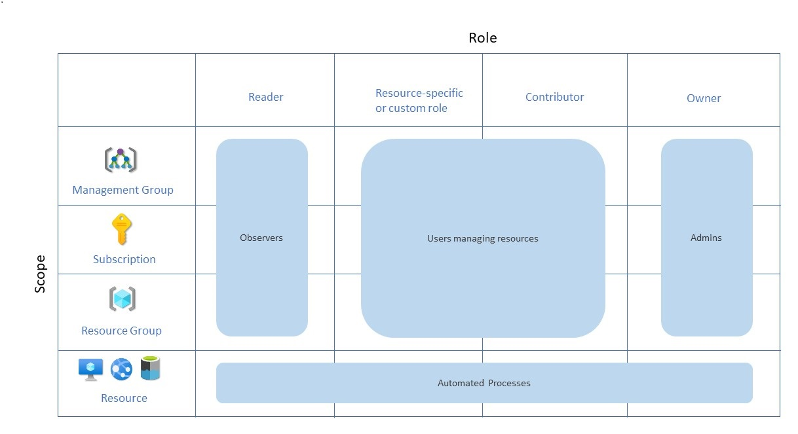

# Manage access to your Azure environment with Azure role-based access control

Managing who can access your Azure resources and subscriptions is an important part of your Azure governance strategy. Assigning group-based access rights and privileges is also a good practice. Dealing with groups instead of individual users simplifies maintenance of access policies, provides consistent access management across teams, and reduces configuration errors. Azure role-based access control (Azure RBAC) is the primary method of managing access in Azure.

Azure RBAC lets you manage access of your resources in Azure. It helps you manage who has access to Azure resources, what they can do with those resources, and what scopes they can access.

When you plan your access control strategy, grant users the least privilege required to get their work done. The following image shows a suggested pattern for assigning Azure RBAC.

When you plan your access control methodology, try to work with people in your organization. We recommend that you work with people in security and compliance, IT administration, and enterprise architecture.

::: zone target="chromeless"

## Actions

**Grant resource group access:**

To grant a user access to a resource group:

1. Go to **Resource groups**.
1. Select a resource group.
1. Select **Access control (IAM)**.
1. Select **+ Add** > **Add role assignment**.
1. Select a role, and then assign access to a user, group, or service principal.

**Grant subscription access:**

To grant a user access to a subscription:

1. Go to **Subscriptions**.
1. Select a subscription.
1. Select **Access control (IAM)**.
1. Select **+ Add** > **Add role assignment**.
1. Select a role, and then assign access to a user, group, or service principal.

::: zone-end

::: zone target="docs"

## Grant resource group access

To grant a user access to a resource group:

1. Go to [Resource groups](https://portal.azure.com/#blade/HubsExtension/BrowseResourceGroups).
1. Select a resource group.
1. Select **Access control (IAM)**.
1. Select **+ Add** > **Add role assignment**.
1. Select a role, and then assign access to a user, group, or service principal.

## Grant subscription access

To grant a user access to a subscription:

1. Go to [Subscriptions](https://portal.azure.com/#blade/Microsoft_Azure_Billing/SubscriptionsBlade).
1. Select a subscription.
1. Select **Access control (IAM)**.
1. Select **+ Add** > **Add role assignment**.
1. Select a role, and then assign access to a user, group, or service principal.

## Learn more

To learn more, see [What is Azure role-based access control (Azure RBAC)?](/azure/role-based-access-control/overview)

::: zone-end
