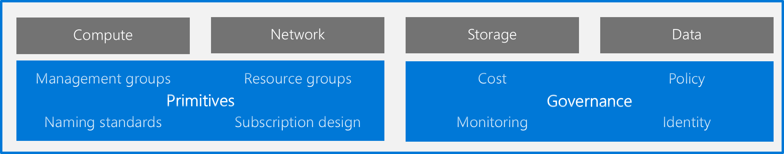

# Landing zone considerations

A landing zone is the basic building block of any cloud adoption environment. The term *landing zone* refers to an environment that's been provisioned and prepared to host workloads in a cloud environment like Azure. A fully functioning landing zone is the final deliverable of any iteration of the Cloud Adoption Framework's Ready methodology.

*Figure 1: Landing zone considerations.*

This image shows the major considerations for implementing any landing zone deployment. The considerations can be broken into three categories or types of considerations: hosting, Azure fundamentals, and governance.

## Hosting considerations

All landing zones provide structure for hosting options. The structure is created explicitly through governance controls or organically through the adoption of services within the landing zone. The following articles can help you make decisions that will be reflected in the blueprint or other automation scripts that create your landing zone:

- [Compute decisions](./compute-options.md): To minimize operational complexity, align compute options with the purpose of the landing zone. This decision can be enforced by using automation toolchains like Azure Policy initiatives and landing zones.
- [Storage decisions](./storage-options.md): Choose the right Azure Storage solution to support your workload requirements.
- [Networking decisions](./networking-options.md): Choose networking services, tools, and architectures to support your organization's workload, governance, and connectivity requirements.
- [Database decisions](./data-options.md): Determine which database technology is best suited for your workload requirements.

## Azure fundamentals

Each landing zone is part of a broader solution for organizing resources across a cloud environment. Azure fundamentals are the foundational building blocks for an organization.

- [Azure fundamental concepts](./fundamental-concepts.md): Learn fundamental concepts and terms that are used to organize resources in Azure and how the concepts relate to one another.
- [Resource consistency decision guide](../../decision-guides/resource-consistency/index.md): When you understand each of the fundamentals, the resource organization decision guide can help you make decisions that shape the landing zone.

## Governance considerations

The Cloud Adoption Framework's Govern methodologies establish a process for governing the environment as a whole. Many use cases might require you to make governance decisions on a per-landing-zone basis. In many scenarios, governance baselines are enforced on a per-landing-zone basis even though the baselines are established holistically. It's true for the first few landing zones that an organization deploys.

The following articles can help you make governance-related decisions about your landing zone. You can factor each decision into your governance baselines.

- **Cost requirements.** Based on an organization's motivation for cloud adoption and operational commitments made about its environment, various cost management configurations might need to be changed for the landing zone.
- **Monitoring decisions.** Depending on the operational requirements for a landing zone, various monitoring tools can be deployed. The monitoring decisions article can help you determine the most appropriate tools to deploy.
- **Access control.** [Azure role-based access control (RBAC)](../considerations/roles.md) offers fine-grained, group-based access management for resources that are organized around user roles.
- **Policy decisions.** [Azure Blueprints samples](/azure/governance/blueprints/samples/) provide premade compliance blueprints, each with predefined policy initiatives. Policy decisions help inform a selection of the best blueprint or policy initiative based on your requirements and constraints.
- **Create hybrid cloud consistency.** Create [consistent hybrid cloud solutions](./hybrid-consistency.md) that give your organization the benefits of cloud innovation while maintaining many of the conveniences of on-premises management.
