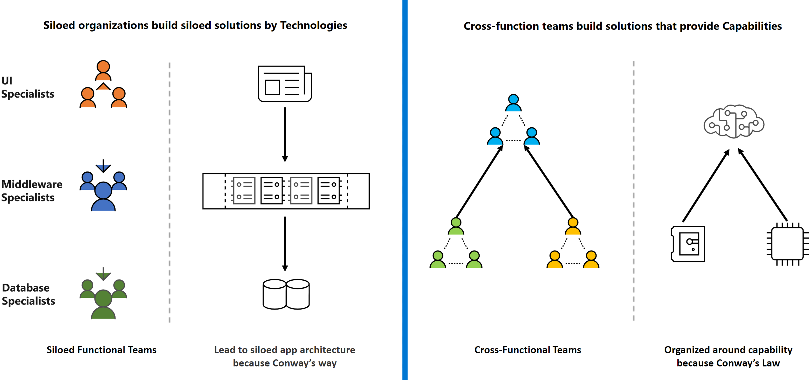
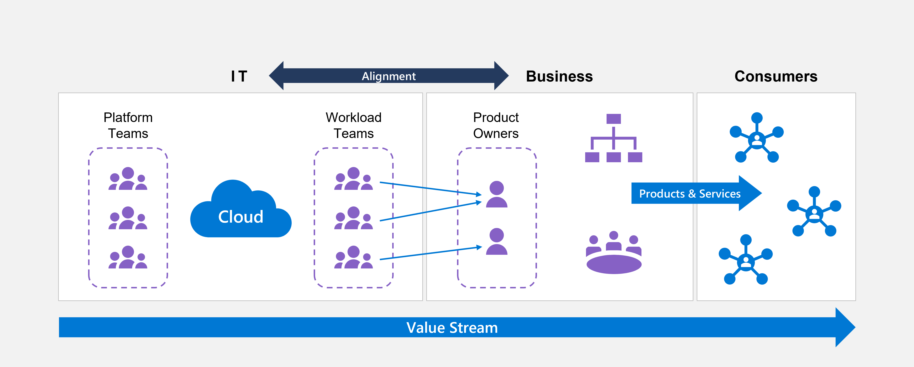

# DevOps teams topologies

The distribution of roles, responsibilities, and trust between IT teams and applications teams is paramount to the operational transformation involved in cloud adoption at scale.

IT teams strive to maintain control. Application owners seek to maximize agility. The balance you ultimately establish between these two goals greatly influences the success of your cloud operating model.

According to Conway's law, teams produce Architectures based on their communication structure. Understanding this principle is critical as you work to achieve the necessary balance between autonomy and control. Any organization that designs a system (defined broadly) will produce a design structure that's a copy of that organization's communication structure.

From a DevOps perspective, organizations must optimize for rapid response to customer needs. Teams that own, design, and implement their applications and systems find their highest level of autonomy in architectures with the following characteristics:

- Evolutionary architecture that supports constant changes
- Deployability
- Testability

Conway's solution is to outmaneuver Conway's Law. If your organization follows a particular structure to produce services and products and is looking to optimize, you need to rethink your organizational structure. Evolve your team and organizational structure to achieve your desired architecture.

This principle leads to intentionally designed [team topologies](https://teamtopologies.com/) in which teams are responsible for the end-to-end of any applications, systems, or platforms they own in order to achieve the full discipline of DevOps.

The following table provides a simplified categorization of these teams.

| Team type | Definition
| - | - |
| Application workload teams | These teams build applications that drive direct business outcomes for a segment of the business domain. In the context of Azure Landing Zones, these teams are responsible for the end-to-end lifecycle of application workloads.
| Platform teams | These teams build compelling internal platforms to accelerate delivery and reduce the cognitive load of application workload teams. In the context of Azure Landing Zones, these teams are responsible for the end-to-end lifecycle of the Azure Landing Zone.
| Enabling teams | These teams help overcome skill gaps by assisting other teams with specialized capabilities like DevOps.

## Design considerations

- Establish a cross-functional platform team to design, build, provision, manage, and maintain your Azure Landing Zone lifecycle. This team can include members from your central IT team, security, compliance, and business units to ensure that a wide spectrum of your enterprise is represented. Make sure you avoid [antipatterns](../../antipatterns/ready-antipatterns.md#antipattern-become-a-cloud-provider).

- Consider establishing an enabling team that can provide DevOps functions to support applications and platforms that don't have existing DevOps capabilities, or a business case to establish one (for example, legacy applications with minimal development capabilities).

- Don't restrict your application workload teams to central artifacts, since it can hinder their agility. You can use policy-driven governance and Azure role-based access control (Azure RBAC) to enforce consistent baseline configurations and ensure that application (business unit) teams are flexible enough to innovate yet still able to draw from a predefined set of templates.

- Don't force your application teams to use a central process or provisioning pipeline for the application resource instantiation or management. Existing teams that already rely on a DevOps pipeline for application delivery can still use their current tools. Remember, you can use [Azure Policy](/azure/governance/policy/overview) helps to enforce organizational standards and to assess compliance at-scale and address [security considerations](./security-considerations-overview.md) for your DevOps processes.

- Blanket application of a DevOps model doesn't instantly establish capable DevOps teams.

- Investment in engineering capabilities and resources is critical.

- Application teams for some legacy applications might not have the engineering resources required to align with a DevOps strategy.

## Design recommendations

The following sections contain design recommendations to guide you as you design your team topologies.

### Align team topologies with your cloud operating model

Make sure you align your team topologies with your desired cloud operating model.

Establish a core process for [operational fitness reviews](../../manage/operational-fitness-review.md) so you fully understand the problems that can result from your team structures.

### Define functions for your platform team

The following list provides a recommended set of functions for the platform team responsible for your Azure Landing Zones:

- Architecture governance
- Subscription provisioning and delegation of required network, identity and access management policies
- Platform management and monitoring (holistic)
- Cost management (holistic)
- Platform-as-code (management of templates, scripts, and other assets)
- Overall operations on Microsoft Azure within your Microsoft Entra tenant (management of service principals, Microsoft Graph API registration, and role definitions)
- Azure RBAC (holistic)
- Key management for central services (simple mail-transfer protocol and domain controllers)
- Policy management and enforcement (holistic)
- Security monitoring and audits (holistic)
- Network management (holistic)
    
### Define functions for your application workload teams

The following list provides a recommended set of functions for your application teams responsible for application workloads:

- Creation and management of application resources through a DevOps model
- Database management
- Application migration or transformation
- Application management and monitoring (application resources)
- Azure RBAC (application resources)
- Security monitoring and audits (application resources)
- Secrets and Keys management (application keys)
- Cost management (application resources)
- Network management (application resources)

### Define functions for enabling teams

The following list provides a recommended set of functions for an enabling team responsible for assisting your other teams:

- Definition of horizontal (cross-function) guidance and capabilities to help acquire the right expertise across your organization, which ensures alignment with your overall target cloud operating model (like DevOps)
- Support, training and coaching for other teams to reach the necessary level of expertise
- Establishment of a common set of reusable templates and libraries for your application or platform teams, and fostering InnerSourcing, such as [Azure verified modules](https://aka.ms/avm).

### Define interaction modes between teams

The goals of interactions between your teams are to:

- Achieve autonomy
- Unblock dependencies
- Minimize waste time
- Avoid bottlenecks

[Team Topologies](https://teamtopologies.com/) outlines three team interaction modes:

| Interaction mode | Description |
| - | - |
| **Collaboration** | Teams work closely together. |
| **X-as-a-Service** | Teams consume or provide something to other teams with minimum collaboration, similar to third-party vendor interactions. |
| **Facilitating** | Teams help or are helped by another team to remove impediments. |
