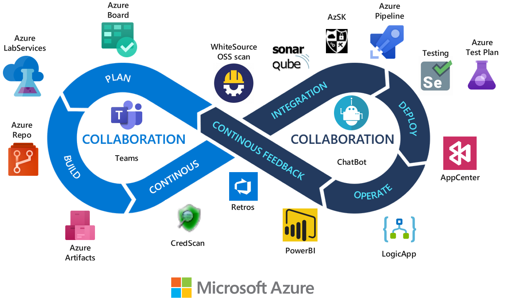
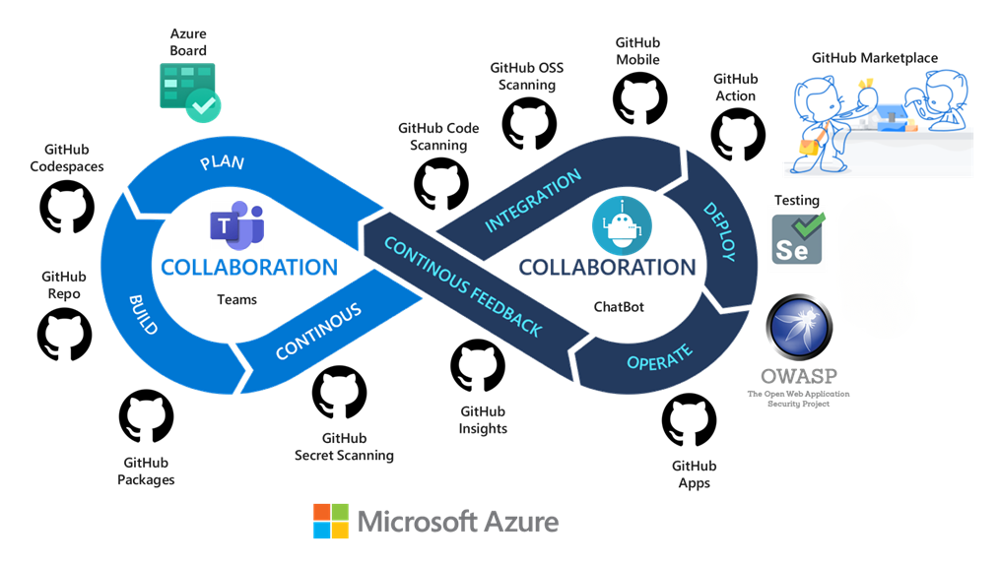

# DevOps toolchain

A DevOps toolchain is a collection of tools that enables DevOps teams to collaborate across the entire product lifecycle and to tackle key DevOps fundamentals.

The tools a DevOps toolchain includes operate as an integrated unit for planning, continuous integration, continuous delivery, operations, collaboration and feedback. You can review some examples of DevOps technologies across different DevOps stages in [Define your DevOps technology ecosystem](../considerations/devops-principles-and-practices.md#define-your-devops-technology-ecosystem).

## DevOps toolchain considerations

- DevOps' processes can already be in use across your organization when you select a toolchain. You should find the right balance between the adoption of technologies suitable for your team's needs and the goal of standardizing and avoiding heterogeneous DevOps ecosystems across your organization.

- You can adopt different kinds of DevOps toolchains:
  - **All-in-one:** Provides a complete solution that might not integrate with other third-party tools. All-in-one toolchains can be useful for organizations beginning their DevOps journey. Example: [Full stack Azure DevOps toolchain](#full-stack-azure-devops-toolchain).
  - **Customized:** Allows teams to bring and mix existing tools they know and already have in use into the wider DevOps toolchain. Integration is essential for these types of toolchains to avoid spending unnecessary time switching between screens, logging in to multiple places, and having the challenge to share information between tools. Example: [Azure DevOps and GitHub toolchain](#azure-devops-and-github-toolchain).
- Consider using toolchains that are regularly updated and that have assistance available whenever you need it through email or online portal. This is a requirement for any product or service that is on the critical path to market.

### Planning

- Consider adopting a tool that supports [Continuous Planning](/training/modules/analyze-devops-continuous-planning-intergration/2-explore-continuous-planning) practices:
  - Release planning
  - Epic and feature identification
  - Prioritization
  - Estimation
  - User story definition
  - Backlog refinement
  - Sprint planning
  - Daily Scrum
  - Sprint review
  - Retrospective

### Continuous Integration and Continuous Delivery

- When implementing [Continuous Integration (CI)](/devops/develop/what-is-continuous-integration)/[Continuous Delivery (CD)](/devops/deliver/what-is-continuous-delivery), consider adopting a tool that supports:
  - Version Control Systems. Everything in your project must be checked in to a single version control repository like Git: code, tests, database scripts, build and deployment scripts, and anything else needed to create, install, run and test your application.
  - [Branching strategy](../considerations/development-strategy-development-lifecycle.md#branch-strategy).
  - [Automated builds](../considerations/development-strategy-development-lifecycle.md#automated-builds).
- Note that your choice of repository is also influenced by data sovereignty/residency requirements. If you need your data to be hosted locally in country/region other than US, you'll need Azure DevOps repositories when GitHub Repos can't be used.
- To minimize the amount of manual configuration required to provision resources, consider adopting [Infrastructure as Code (IaC)](/azure/architecture/checklist/dev-ops#management). [IaC](/dotnet/architecture/cloud-native/infrastructure-as-code) lets you apply software engineering practices like testing and versioning, which make infrastructure and deployments automated, consistent, and repeatable. Keep scripts and templates under source control like any other code you maintain.
- Adopt [code scanning tools](/devops/devsecops/enable-devsecops-azure-github#secure-your-code-with-github) to help you detect code defects as soon as possible. Include pre-deployment checks to validate and confirm changes before any deployment (Example: ["what-if"](../considerations/development-strategy-development-lifecycle.md#deployment-strategy)) function.
- CI/CD tools speed up the time to market for your product. Tools that allow you to parallelize tasks and take advantage of elastic scalability on cloud-hosted infrastructure enhance the performance of your CI/CD process.
- Consider using CI/CD tool features that support the measure of DevOps performance. Dashboards and reporting can track aspects of your development process like lead time, cycle time, velocity of work, and so on.

### Continuous Operations

Continuous Operations is a focus that helps organizations maintain continuity of output between internal systems and customers through the uninterrupted delivery of critical services or functions. The goals of Continuous Operations are:

- To reduce or eliminate the need for planned downtimes or interruptions such as scheduled maintenance, capacity optimization and deployment.
- To increase overall reliability and resiliency of systems in three aspects, with people, process and tools.

Use cloud-native tools to:

- Monitor key metrics for service performance and availability.
- Gain digital experience and customer insights.
- [Generate intelligence-driven responses](/azure/azure-monitor/continuous-monitoring) for incidents, system recovery, or scaling.
  - [Azure Diagnostics](/azure/monitoring-and-diagnostics/azure-diagnostics) and [Application Insights](/azure/application-insights) are the standard method for tracking the health and status of Azure resources. [Azure Monitor](/azure/monitoring-and-diagnostics/monitoring-overview) also provides centralized monitoring and management for cloud or hybrid solutions.
- Automate proactive maintenance and tasks like deployment or system updates.
  - [Azure Automation](/azure/automation/overview) is a cloud-native tool you can use to create event-based automation to diagnose and resolve issues.

### Collaboration and feedback

- Rapid feedback loops are at the heart of the CI/CD process. A CI/CD tool uses feedback to resolve conditions in CI/CD workflow logic and displays information back to users, usually through a dashboard.
- Support for email notifications and integration with IDEs or communication platforms ensure you can stay informed about what's happening without having to check a dashboard. Ensure you have the flexibility to configure which alerts you receive, since getting too many alerts transforms them into background noise.

- Any tool you choose for the collaboration should support the following collaboration practices:
  - Kanban collaboration
  - Wiki content collaboration
  - ChatOps collaboration
  - Team room

## DevOps toolchain recommendations for Azure Landing Zones

DevOps toolchains for Azure Landing Zone implementation should consider all previously discussed DevOps phases:
- Planning
- CI/CD (including automation capabilities like Infrastructure as code)
- Operations
- Collaborations and feedback

Review guidance for landing zone deployment and considerations for choosing an implementation option in [Choosing landing zone adoption](../landing-zone/choose-landing-zone-option.md#deployment-considerations).

Regardless of selected methodology (start small and expand or enterprise-scale), there are a few common topologies that enterprises tend to follow as they design their DevOps workflows and toolchains.

- **Full stack Azure DevOps toolchain:** For enterprises that are already heavily invested in the Microsoft ecosystem, this topology allows them to take full advantage of the native integrations between Microsoft products and services and streamline key processes.
- **Azure DevOps and GitHub toolchain:** This topology allows you to use the strengths of both Azure and GitHub as part of a well-integrated solution.

### Full stack Azure DevOps toolchain

| DevOps stage | tools |
| - | - |
| Planning | [Azure Boards](/azure/devops/boards/get-started/what-is-azure-boards) provides powerful and flexible planning capabilities to developers and other personas, including hierarchical backlogs, customizable Kanban boards, rich process customization, team dashboards, and custom reporting.|
| CI/ CD | [Azure Repos](/azure/devops/repos/get-started/what-is-repos) allows you to create private Git repositories, and it supports different Git clients, branching strategy, and protection. Azure Repos also provides localized data residency in the cloud to enable compliance with European regulations. [Azure Pipelines](/azure/devops/pipelines/get-started/what-is-azure-pipelines) allows customers to set up automated pipelines for CI/CD, including for advanced test reporting, and provides powerful support for multistage pipelines. Fine-grained permissions, gates, custom checks, and automated test result reporting in Azure Pipelines help you enforce security, compliance, and safe deployment best practices in your organization and support parallel steps execution and scalability. [Azure Artifacts](/azure/devops/artifacts/start-using-azure-artifacts) provides a feed to store packages and to review and validate each package for security purposes, and also provides granular permission control and auditing. [Azure Test Plans](/azure/devops/test/overview) in Azure DevOps provides a browser-based test management solution for exploratory, manual, and user acceptance testing. Users of Azure Test Plans also typically use Azure Boards for planning and project management. You can link user stories and other requirements to test cases and can document bugs found through testing. Adopt [Marketplace extensions for DevOps](/azure/devops/marketplace/overview) to improve static code analysis with tools like Credential scanners, open-source scanners, Bugs and Vulnerabilities scanners, and more. |
| Operations | [Azure Dashboards and reporting](/azure/devops/report/dashboards/overview) provide custom reporting to help you monitor key service performance metrics. [Azure Diagnostics](/azure/monitoring-and-diagnostics/azure-diagnostics) and [Application Insights](/azure/application-insights) are the standard method of tracking the health and status of Azure resources. [Azure Monitor](/azure/monitoring-and-diagnostics/monitoring-overview) provides centralized monitoring and management. [Azure Automation](/azure/automation/overview) can be used to create event-based automation to diagnose and resolve issues.  |
| Collaborations and Feedbacks| [Azure DevOps Wiki](/azure/devops/project/wiki/about-readme-wiki) allows you to share information with members of other teams and supports collaborative editing of its content and structure. [Azure Boards](/azure/devops/boards/) provide Kanban collaboration and support for comments and discussions in backlog items. You can [integrate Microsoft Teams with Azure DevOps](https://www.azuredevopslabs.com/labs/vstsextend/teams/) for a complete team collaboration experience. |

### Azure DevOps and GitHub toolchain

| DevOps stage | tools |
| - | - |
| Planning | [Azure Boards](/azure/devops/boards/get-started/what-is-azure-boards) provides a stable and scalable solution for planning, repository management, data visualization, and hierarchical work item organization. It [integrates with GitHub](https://github.com/marketplace/azure-boards), so you can link work items and GitHub commits. It also allows you to choose your ideal workflow, whether that's a simple, out-of-the-box workflow or a custom workflow you build with the powerful and flexible Azure Boards customization engine. When you need to visualize your data, Azure Boards helps you easily build and configure custom dashboards and monitor progress throughout your project lifecycles. |
| CI/ CD| Use the GitHub Enterprise (GHE) version of GitHub, which includes [GitHub Repo](https://docs.github.com/github/creating-cloning-and-archiving-repositories/about-repositories) and [GitHub Advanced Security (GHAS)](https://github.com/advanced-security). GHAS includes [CodeQL](https://codeql.github.com/), [Code Scanning](https://docs.github.com/en/code-security/code-scanning/automatically-scanning-your-code-for-vulnerabilities-and-errors/about-code-scanning), [Secret Scanning](https://docs.github.com/en/code-security/secret-scanning/about-secret-scanning), and [Dependency Review](https://docs.github.com/en/code-security/supply-chain-security/understanding-your-software-supply-chain/about-dependency-review). GHE also offers Codespaces, a cloud IDE you can use to develop code and that can replace **Visual Studio Code**, which organizations usually include in full-stack Azure DevOps scenarios. You can use [GitHub Actions](https://github.com/features/actions) to automate non-build workflows if your repositories are in GitHub. If you have more complex scenarios where you need to access code from outside of GitHub or require centralized management for workflow templates and build pipelines, adopt [Azure Pipelines](/azure/devops/pipelines/get-started/what-is-azure-pipelines). For Azure Boards, you can [integrate Azure Pipelines with GitHub repositories](https://github.com/marketplace/azure-pipelines). To learn about integrating Azure DevOps and GitHub, see [Work with Azure DevOps and GitHub](/azure/developer/github/integrate-azure-devops). [GitHub Packages](https://github.com/features/packages) is a software package service that allows you to host your own packages privately or publicly. GitHub offers container registry support for hosting Docker or OCI images. You need access tokens in order to publish, install, or delete packages and keep your package lifecycle management secure. To automate packages, you can integrate GitHub Packages with GitHub Actions, GitHub APIs, and webhooks to create DevOps workflows that include code, CI, and deployments all in one interface. |
| Operations | [GitHub Insights](https://docs.github.com/en/enterprise-cloud@latest/organizations/collaborating-with-groups-in-organizations/viewing-insights-for-your-organization) provides analytic reports based on data from your GitHub Enterprise Server instance to help you understand and improve your software delivery process. For Landing Zone diagnostics and management, use the Azure services recommended in the [Full-stack Azure DevOps](#full-stack-azure-devops-toolchain) scenario.|
| Collaboration and feedback | You can use [GitHub Discussions](https://docs.github.com/discussions) to share questions, ideas, conversations, requests for comment (RFC), resource planning, and announcements. Use [Azure Boards](/azure/devops/boards/) to easily build and configure custom dashboards and monitor progress throughout your project lifecycles. Adopt Microsoft Teams for a complete team collaboration experience.|
