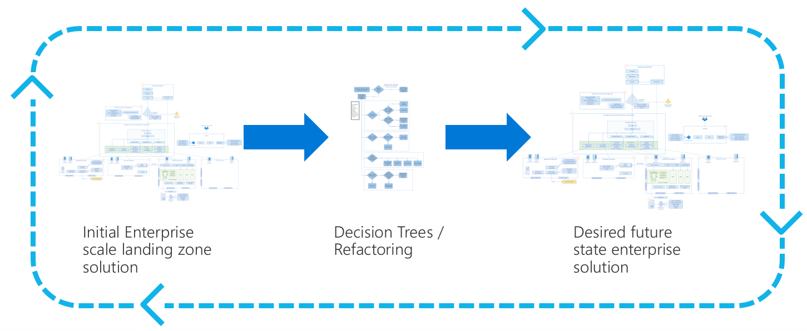

# Start with enterprise-scale landing zones

At times, it is unwise for a cloud platform team to start small and scale. Teams worked for years within the constraints of the company's existing on-premises environment to reach the current state of maturity across security, operations, and governance. It will take time to replicate the desired processes, tools, and architectures based on the new constraints of any cloud environment. To accelerate that learning process, a slightly different starting point is required. Comparing the image below to the [early refactoring guidance within this methodology](../landing-zone/refactor.md), the fundamental change is the starting point, which is now more complex, more to follow later in this article.

<!-- markdownlint-disable MD026 -->

## Qualifiers: Should I start with enterprise scale?

For most adoption patterns, a "start small and expand" approach is preferable, as it allows the team to learn from real experiences. For companies that fit into the references in this article a more robust approach is required.

### Scale and speed

When the adoption team has a midterm objective (within 24 months) to host more than 1,000 assets (apps, infrastructure, or data assets) in the cloud, there isn't enough time to learn through hands-on approaches only. Multiple criteria will need to be preset to deliver the necessary speed and scale for a large enterprise.

### Security, compliance, and culture

Multiple business motivations might require an enterprise-scale landing zone and shared-services architecture before any adoption can begin. The need for an enterprise-scale landing zone solution can be obvious for companies whose businesses are built around sensitive data and complex interdependent architectures. It may also be obvious when companies require cloud environments that meet strict third-party requirements before using the cloud. Cultures with deeply rooted Central IT control models might also need an architecture that starts with centralized control to pass change-control requirements.

### All-in on the cloud

The most common driver for an enterprise-scale landing zone comes from companies who decide to go "all-in" on the cloud. This can be a result of a datacenter termination or a mass movement to be more agile as a business. Regardless of the driver, this business decision typically demands both scale of adoption and speed of adoption. This combination of demands makes it difficult to take the time required to learn and prepare for sensitive data and mission critical hosting in the cloud.

### Skill requirements

Starting with enterprise scale assumes that the cloud platform team has enterprise-scale budgets. This qualifier assumes the team has deeper skills in the cloud than most other companies. Those skills can come from an existing history of smaller scale cloud adoption within the company. The skills can also be added by attracting experienced staff or working with highly experienced partners. For either direction, the following skills will be required to start with enterprise scale.

Suggested skills:

- Deep knowledge on architecture in the chosen cloud provider.
- Extensive hands-on experience with cloud-based, infrastructure as code approaches.
- Moderate familiarity with GitHub or other source code repositories, including branching and pull request strategies.
- Actionable experience with automated deployments from source code to the cloud provider.

If these skills aren't available within the cloud platform team (through staff, partners, or other support mechanisms), a "start small and expand" approach is likely to reach enterprise readiness faster with a higher-quality output. Such an approach would allow for less costly, skills acquisition within the existing team.

## Start with an enterprise-scale landing zone(s)

Microsoft has a long history of investing in tools and approaches to make it easier for customers to develop and manage enterprise-scale landing zones. In recent years, this invest has resulted in guidance and tools across Azure. This investment approach continues and may result in regular updates to this section of this specific article.

Each of the following templates provides customers with an enterprise-scale initial landing zone including infrastructure patterns:

- [ISO 27001 Shared Services](https://docs.microsoft.com/azure/governance/blueprints/samples/iso27001-shared)
- [ISO 27001 App Service Environment/SQL Database workload](https://docs.microsoft.com/azure/governance/blueprints/samples/iso27001-ase-sql-workload)
- [UK Official and UK NHS Governance](https://docs.microsoft.com/azure/governance/blueprints/samples/ukofficial)

The additional samples in the [Azure blueprint samples article](https://docs.microsoft.com/azure/governance/blueprints/samples) can be used as a "red/green" test for enterprise-scale landing zones. Applying these blueprints would ensure an environment meets compliance standards prior to adoption. This later approach especially useful as a way to validate third-party or partner landing zones before adopting the cloud:

## Next steps

Choose one of the enterprise-scale landing zone blueprints.
From there, the same guidance in [start small and expand](./index.md) can be used to expand your enterprise-scale landing zone(s) to fit your distinct requirements.

> [!div class="nextstepaction"]
> [Resume the "start small and expand" guidance using your enterprise-scale landing zone as the initial source](./index.md)
