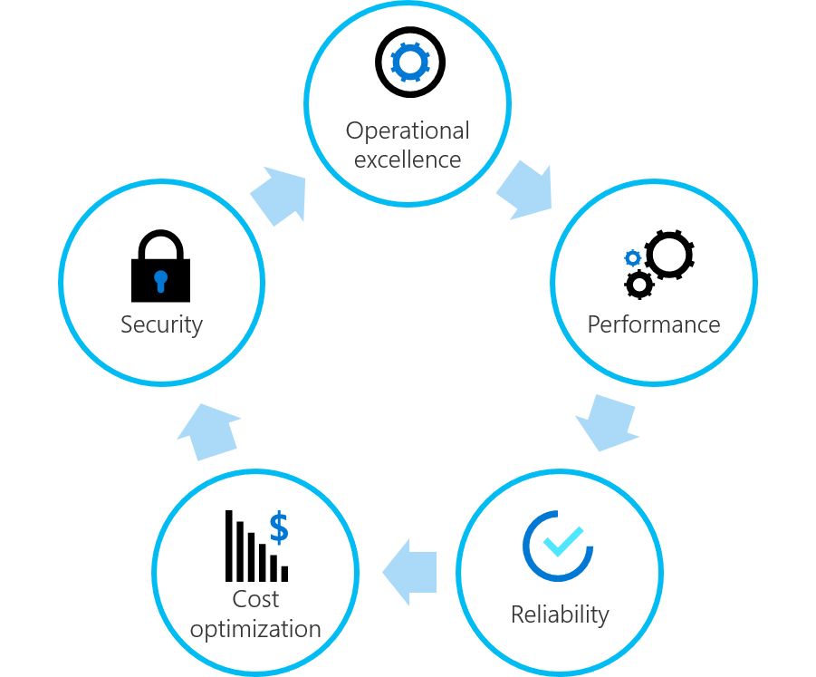

# Expand your landing zone

This section of the Ready methodology builds on the principles of [landing zone refactoring](../landing-zone/refactor.md). A refactoring approach to infrastructure as code removes blockers to business success while minimizing risk. This series of articles assumes that you've deployed your first landing zone and would now like to expand that landing zone to meet enterprise requirements.

## Shared architecture pillars

Landing zone expansion provides the opportunity to embed the following pillars into your landing zone and into your broader cloud environment.

*Figure 1: Shared architecture pillars.*

These pillars are shared by [Azure Advisor](/azure/advisor/advisor-overview), the [Microsoft Azure Well-Architected Framework](/azure/architecture/framework/), and the solutions in the [Azure Architecture Center](/azure/architecture/).

## Apply these pillars to landing zone improvements

To better align with the Cloud Adoption Framework, the pillars above are grouped into actionable landing zone improvements:

- Basic considerations: refactor a landing zone to refine hosting, fundamentals, and other foundational elements.
- Operations expansions: add operations management configurations to improve **performance, reliability, and operational excellence**.
- Governance expansions: add governance configurations to improve **cost, reliability, security**, and consistency.
- Security expansions: add **security** configurations to improve protection of sensitive data and critical systems.

> [!WARNING]
> If you have a midterm objective (within 24 months) to **host more than 1,000 applications, infrastructure assets, or data assets in the cloud**, consider these expansions early in the cloud adoption journey. For all other adoption patterns, landing zone expansions could be a parallel iteration.

## Next steps

Before refactoring your first landing zone, it's important to understand test-driven development.

> [!div class="nextstepaction"]
> [Test-driven development for landing zones](development-strategy-test-driven-development.md)
