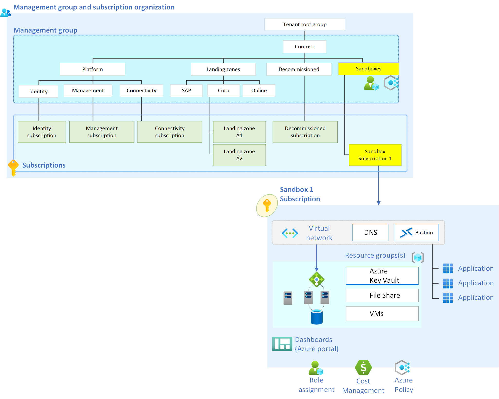

# Sandbox Environments

## Sandbox Overview

A sandbox environment is an isolated environment that enables users to do testing and experimentation without impacting any other environments (Production, Development, UAT, etc.). Azure sandboxes provide users with a controlled environment to test and experiment with Azure resources. Sandbox environments are also great places to conduct POCs (proof of concepts) with Azure resources. Each sandbox is its own Azure subscription controlled by Azure policies applied at the Sandboxes Management Group level and also what it inherits from the Management Group hierarchy above it. A sandbox can be used by one person or a team depending on its purpose.

>[!TIP]
> Review the default Azure landing zones policy assignments that are documented here in [Policies included in Azure landing zones reference implementations](https://aka.ms/alz/policies)

Sandbox environments are the best place for hands on Azure learning. Below are some common use cases:

-   Developers need a controlled Azure environment to quickly test application design patterns.
-   Cloud architect wants a sandbox environment to evaluate Azure resources or conduct a PoC for an Azure service or resource before formally approving them for their organization.
-   A cloud engineer wants a sandbox environment to better understand what happens when a specific setting is changed on an Azure resource.
-   A platform engineer wants to build and test out a new Azure Policy and how it will behave as per the [Canary guidance](https://aka.ms/alz/canary)

## Sandbox Architecture

### Management Group and Subscription Layout

All subscriptions created for the sandboxes will be placed in the Sandboxes Management Group. This allows Azure polices specifically created for sandboxes to be placed at the Sandboxes Management Group level.

An Azure policy initiative should be created with the following built-in policies and assigned to the Sandbox Management Group:

| Azure Policy                                                                                                                                                                                                                                                                                                                                                                                                                                                                                         | Description                                                                                                                                                                    |
|------------------------------------------------------------------------------------------------------------------------------------------------------------------------------------------------------------------------------------------------------------------------------------------------------------------------------------------------------------------------------------------------------------------------------------------------------------------------------------------------------|--------------------------------------------------------------------------------------------------------------------------------------------------------------------------------|
| [Azure service blocklist](https://www.azadvertizer.net/azpolicyadvertizer/6c112d4e-5bc7-47ae-a041-ea2d9dccd749.html?desc=compareJson&left=https%3A%2F%2Fwww.azadvertizer.net%2Fazpolicyadvertizerjson%2F6c112d4e-5bc7-47ae-a041-ea2d9dccd749_1.0.0.json&right=https%3A%2F%2Fwww.azadvertizer.net%2Fazpolicyadvertizerjson%2F6c112d4e-5bc7-47ae-a041-ea2d9dccd749_2.0.0.json) Or [Azure service allowlist](https://www.azadvertizer.net/azpolicyadvertizer/a08ec900-254a-4555-9bf5-e42af04b5c5c.html) | Azure service blocklist: block selected Azure services from being deployed to sandbox. Azure service allowlist: Only allow specified Azure services to be deployed to sandbox. |
| [Allowed Azure regions](https://www.azadvertizer.net/azpolicyadvertizer/e56962a6-4747-49cd-b67b-bf8b01975c4c.html)                                                                                                                                                                                                                                                                                                                                                                                   | Limit the Azure regions that can be used by the sandbox environments                                                                                                           |
| [Allowed virtual machine SKUs](https://www.azadvertizer.net/azpolicyadvertizer/cccc23c7-8427-4f53-ad12-b6a63eb452b3.html)                                                                                                                                                                                                                                                                                                                                                | Limit the VM SKUs that can be deployed to the sandbox environments                                                                                                             |

The policy below should also be used to support the sandbox environments. The below policy is already a part of the Azure landing zone default policy set.

| Azure Policy                                                                                                                                                                      | Description                                                                                                                                         |
|-----------------------------------------------------------------------------------------------------------------------------------------------------------------------------------|-----------------------------------------------------------------------------------------------------------------------------------------------------|
| [Deny VNet peering cross subscription](https://www.azadvertizer.net/azpolicyadvertizer/Deny-VNET-Peer-Cross-Sub.html) | Deny any VNet peering with VNets outside of the sandbox subscription. This helps the sandbox environments stay isolated from a network perspective. |

Each sandbox is given its own subscription. This allows costs to be more easily tracked and the sandboxes easily cancelled when budgets or the expiration date of the sandbox has been reached.

### Networking

Any networking in a sandbox is left to the sandbox user to create. The sandbox user can build a network that fits their needs. To keep the sandbox isolated it is important to ensure the networks created inside the sandbox are not peered with other networks outside of the sandbox. This ensures each sandbox is its own isolated environment. The “[Deny VNet peering cross subscription](https://www.azadvertizer.net/azpolicyadvertizer/Deny-VNET-Peer-Cross-Sub.html)” Azure policy helps to ensure sandbox users cannot peer to a VNet outside of the sandbox environment.

### Restricting Azure Resources

An organization will want to control which Azure resources are eligible to be deployed to sandboxes. One way of controlling the eligible Azure resources is to create a blocklist. The blocklist approach allows sandbox users to deploy any Azure service to their sandbox except any that are explicitly blocked via the blocklist.

Another approach to controlling the Azure resources that can be deployed to the sandbox is by using an allowlist. Sandbox users can only deploy Azure resources that are on the allowlist. This approach allows an organization to restrict the sandbox user to only deploy services explicitly allowed.

Some organizations may want to deploy both types of sandboxes to satisfy multiple use cases. For example, cloud architects may be allowed to use the blocklist sandboxes so that they can test and experiment with any Azure service. However, the organization may want developers to only use services explicitly placed on the allowlist so that they could be restricted to only using Azure services approved by the organization. The diagram below shows an example of a manage group layout that supports both the architects (blocklist) and developers (allowlist) use cases.

### Audit Logging

It is important from a security perspective to ensure audit logging from any sandbox environment is retained. A diagnostic setting that sends at least the administrative and security log categories should be created and added to each sandbox subscription. They should ultimately be stored in a destination (like a Log Analytics workspace) so the logs can be reviewed if necessary, or integrated with a SIEM like [Microsoft Sentinel](https://learn.microsoft.com/azure/sentinel/overview).

### Sandbox Permissions

The sandbox user(s) are given Contributor access to the sandbox subscription.

## Additional Considerations

### Sandbox Expiration

Sandboxes should be cancelled or deleted at some point in time. Having a strategy to remove a sandbox is a cost savings and security measure. Cost and expiration dates are two important variables for determining when a sandbox should be removed.

### Cost

Each sandbox should be given a budget based on the purpose of the sandbox. Assigning a budget to the sandbox allows alerts to be fired when the cost breaches pre-determined thresholds. These alerts help keep costs for each sandbox contained.

A key concern for any cloud-based sandbox environment is cost tracking. Azure cost management allows the creation of budgets. The [budgets feature](https://learn.microsoft.com/azure/cost-management-billing/costs/tutorial-acm-create-budgets#create-a-budget-in-the-azure-portal) allows alerts to be generated when actual spending or forecasted spending cross configured thresholds.

Whenever a sandbox is deployed an Azure cost management budget is created for it and placed on the subscription. This budget alerts the sandbox users when spending thresholds are crossed (50%, 75%, and 100%). When the 100% spend threshold is crossed the subscription is [cancelled](https://learn.microsoft.com/azure/cost-management-billing/manage/cancel-azure-subscription#what-happens-after-subscription-cancellation) or deleted. An automation must be created by the organization to cancel or delete the sandbox when the 100% threshold alert is fired. The alert alone is just a warning mechanism.

All sandboxes should have a budget assigned.

### Expiration Date

Most organizations will want to expire and delete sandboxes after a certain period. Expiring sandboxes provide cost control and security benefits. Sandbox environments are created for testing and learning purposes. Ideally once the sandbox user performs their test or gains the intended knowledge it makes sense to expire the sandbox as it is no longer needed. The subscription for the sandbox is cancelled or deleted after the expiration date. Each sandbox should be given an expiration date. When that date is reached the sandbox subscription should be [cancelled](https://learn.microsoft.com/azure/cost-management-billing/manage/cancel-azure-subscription#what-happens-after-subscription-cancellation) or deleted.

An Azure [tag](https://learn.microsoft.com/azure/azure-resource-manager/management/tag-resources?tabs=json) with an expiration date can be placed on the subscription when a sandbox is created. An automation can then be created to cancel or delete the subscription when the expiration date is reached.

All sandboxes should have an expiration date.

### Information Protection

One concern most organizations have about sandbox environments is ensuring sensitive data doesn’t find its way in. The first line of defense for information protection is always user education. Users should be given disclaimers/information before being assigned a sandbox that clearly states any sensitive data should not be added to the sandbox.

[Microsoft Purview](https://learn.microsoft.com/azure/purview/overview) is a service that can be used to provide information protection for sandbox environments. Purview can be used to alert if data labeled by the organization as sensitive were to be added to sandbox environments.
