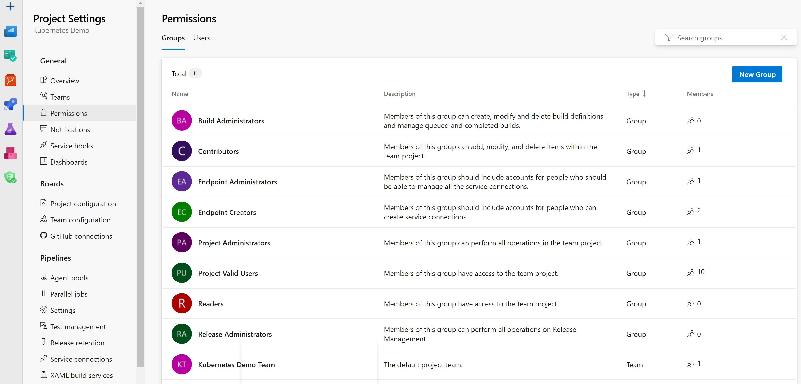

# Role-based access control for DevOps tools

When you deploy cloud-based solutions for your infrastructure deployments, security should always be your most important concern.
Microsoft keeps the underlying cloud infrastructure secure. You configure security in Azure DevOps or GitHub.

## Prerequisites

Once you decide which Azure Landing Zone templates to deploy, clone them into your own repository. Set up the CI/CD pipelines. For both GitHub and Azure DevOps, there are several authentication methods available, such as personal access tokens (PAT) and integrating with an identity provider, such as Microsoft Entra ID. For more information, see [Use personal access tokens](/azure/devops/organizations/accounts/use-personal-access-tokens-to-authenticate).

We recommend that you integrate with Microsoft Entra ID to use all its capabilities. Integration helps streamline your role assignment process and identity lifecycle management. For more information, see [Connect your organization to Microsoft Entra ID](/azure/devops/organizations/accounts/connect-organization-to-azure-ad). If you're using GitHub, consider [integrating GitHub Enterprise with Microsoft Entra ID](/entra/identity/saas-apps/github-enterprise-cloud-enterprise-account-tutorial).

## General Design Considerations

We recommended that you maintain tight control of administrators and service account groups across Microsoft Entra ID and your DevOps tool. Consider implementing the principle of least privilege across all your role assignments.

For example, your organization might have a Platform or Cloud Excellence team that maintains Azure Resource Manager templates for your Azure Landing Zones. Assign users on that team to a Security Group in Microsoft Entra ID, assuming that you're using it as your identity provider. Assign roles to that security group in your DevOps tool so those users can do their jobs.

For any administrator or highly privileged accounts in Active Directory, we recommend that the credentials aren't synchronized to Microsoft Entra ID, and vice-versa. This approach reduces the threat of lateral movement. If an administrator in Microsoft Entra ID is compromised, the attacker won't be able to easily gain access to any cloud assets, such as Azure DevOps. That account can't potentially inject malicious tasks in the CI/CD pipelines. This step is particularly important for any users assigned elevated permissions in your DevOps environment, such as Build or Project/Collection Administrators. For more information, see [Security best practices in Microsoft Entra ID](/azure/security/fundamentals/identity-management-best-practices).

## Azure DevOps role-based access considerations

Manage security in Azure DevOps with security groups, policies, and settings at the organization/collection, project, or object level. To integrate with an identity provider such as Microsoft Entra ID, consider creating [Conditional Access policies to enforce multifactor authentication for all users](/azure/devops/organizations/accounts/change-application-access-policies). The policies allow access to your Azure DevOps organization and more granular restrictions around IP address, type of device used for access, and device compliance.

For most team members in your Platform team that manage your Azure Landing Zones, the *Basic* access level and *Contributor* default security group should provide sufficient access. The Contributor security group allows them to edit the Azure Landing Zone templates in your repository and the CI/CD pipelines that validate and deploy them.

We recommend that you assign your Platform team to the Contributor security group at the project level of Azure DevOps. This approach follows the principle of least privilege. These assignments can be done through the **Project Settings** page shown below.

Another best practice for your Azure DevOps Projects and organizations is to disable inheritance where possible. Users inherit permissions allowed by their security group assignments. Due to the allow-by-default nature of inheritance, unexpected users can get access or permissions.

For example, if you assign your Platform team Contributor security group membership, verify their permissions on the Azure Landing Zones repository. You should have branch policies in place to verify that the security group isn't allowed to bypass those policies during pull requests. Verify this setting under **Project Settings** > **Repositories**.

After you've assigned permissions to users, periodically review audit events to monitor and react to unexpected usage patterns by administrators and other users. Start by [creating an audit stream to a Log Analytics workspace](/azure/devops/organizations/audit/azure-devops-auditing). If your workspace uses Microsoft Sentinel, create analytics rules to alert you on notable events, such as improper use of permissions.

For more information, see the following resources:

- [Azure DevOps security best practices](/azure/devops/organizations/security/security-best-practices)
- [Azure DevOps groups and permissions](/azure/devops/organizations/security/permissions)
- [Azure DevOps access levels](/azure/devops/organizations/security/access-levels)

## GitHub Role-based Access Considerations

If your primary DevOps tool is GitHub, you can assign users access to resources by granting them roles at the repository level, team level, or organization level. After you fork the Azure Landing Zones repository and integrate with an identity provider, such as Microsoft Entra ID, consider creating a team in GitHub. Assign that team *write* access to your new Azure Landing Zone repository.
For most of your Platform team members, who modify and deploy the Landing Zones, write access should be sufficient. For project managers or Scrum managers on the team, you might need to assign them the *maintain* role to that repository.

We recommend that you manage all of these role assignments through the integrated identity provider. For example, you can synchronize the Platform team for the Azure Landing Zone repository you've created in GitHub with the corresponding Platform team Security Group in Microsoft Entra ID. Then, as you add or remove members to the Microsoft Entra Security Group, those changes are reflected in your GitHub Enterprise Cloud role assignments.

> [!NOTE]
>
> Once you connect a specific GitHub team to an integrated identity provider, you're restricted to managing the team membership through it.

## Next steps

For more information around managing roles and teams in GitHub, see these resources:

- [GitHub Roles and Scope Levels](https://docs.github.com/en/organizations/managing-peoples-access-to-your-organization-with-roles/roles-in-an-organization)
- [How to manage GitHub permissions after integrating with Identity Provider](https://docs.github.com/en/enterprise-cloud@latest/organizations/organizing-members-into-teams/synchronizing-a-team-with-an-identity-provider-group)
- [Managing Permissions with GitHub Teams](https://docs.github.com/en/organizations/organizing-members-into-teams/about-teams)
