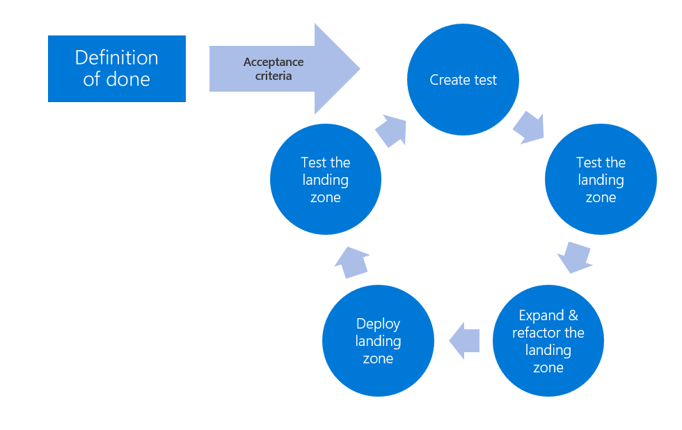

# Test-driven development (TDD) for landing zones

Test-driven development is a common software development and DevOps process that improves the quality of new features and improvements in any code-based solution. Cloud-based infrastructure, and the underlying source code can use this process to ensure landing zones meet core requirements and are of high quality. This process is especially useful when landing zones are being developed and refactored in a parallel development effort.

In the cloud, infrastructure is the output of code execution. Well-structured, tested, and verified code produces a viable landing zone. A [landing zone](../landing-zone/index.md) is an environment for hosting your workloads, preprovisioned through code. It includes foundational capabilities using a defined set of cloud services and best practices that set you up for success. This guidance describes an approach that uses test-driven development to fulfill the last part of that definition, while meeting quality, security, operations, and governance requirements.

This approach can be used to meet simple feature requests during early development. Later in the cloud adoption lifecycle, this process can be used to meet security, operations, governance, or compliance requirements.

## Definition of done

"Set up for success" is a subjective statement. This statement provides the cloud platform team with little actionable information during landing zone development or refactoring efforts. This lack of clarity can lead to missed expectations and vulnerabilities in a cloud environment. Before refactoring or expanding any landing zone, the cloud platform team should seek clarity regarding the "definition of done" for each landing zone.

Definition of done is a simple agreement between the cloud platform team and other affected teams. This agreement outlines the expected value added features, which should be included in any landing zone development effort. The definition of done is often a checklist that's aligned with the short-term cloud adoption plan. In mature processes, those expected features in the checklist will each have their own acceptance criteria to create even more clarity. When the value-added features each meet the acceptance criteria, the landing zone is sufficiently configured to enable the success of the current wave or release of adoption effort.

As teams adopt additional workloads and cloud features, the definition of done and acceptance criteria will become increasingly more complex.

## Test-driven development cycle

The cycle that makes test-driven development effective is often referred to as a red/green test. In this approach, the cloud platform team starts with a failed test (red test) based on the definition of done and defined acceptance criteria. For each feature or acceptance criteria, the cloud platform team would complete development tasks until the test passes (green test). A test-driven development cycle (or red/green test) would repeat the basic steps in the following image and list below until the full definition of done can be met.

- **Create a test:** Define a test to validate that acceptance criteria for a specific value-add feature has been met. Automate the test whenever possible.
- **Test the landing zone:** Run the new test and any existing tests. If the required feature hasn't already been met by prior development efforts and isn't inclusive to the cloud provider's offering, the test should fail. Running existing tests will help validate that your new test doesn't reduce reliability of landing zone features delivered by existing code.
- **Expand and refactor the landing zone:** Add or modify the source code to fulfill the requested value-add feature and improve the general quality of the code base. To meet the fullest spirit of test-driven development, the cloud platform team would only add code to meet the requested feature and nothing more. At the same time, code quality and maintenance is a shared effort. When fulfilling new feature requests, the cloud platform team should seek to improve the code by removing duplication and clarifying the code. Running tests between new code creation and refactoring of source code is highly suggested.
- **Deploy the landing zone:** Once the source code is capable of fulfilling the feature request, deploy the modified landing zone to the cloud provider in a controlled testing or sandbox environment.
- **Test the landing zone:** Retesting the landing zone should validate that the new code meets the acceptance criteria for the requested feature. Once all tests pass, the feature is considered complete and the acceptance criteria are considered to be met.

When all value-added features and acceptance criteria pass their associated tests, the landing zone is ready to support the next wave of the cloud adoption plan.

## Simple example of a definition of done

For an initial migration effort, definition of done may be overly simple. The following is an example of one of these overly simple examples.

- The initial landing zone will be used to host 10 workloads for initial learning purposes. These workloads are not critical to the business and have no access to sensitive data. In the future, it's likely these workloads will be released to production but criticality and sensitive is not expected to change. To support these workloads, the cloud adoption team will need the following criteria met:

- Network segmentation to align with proposed network design.
- Access to compute, storage, and networking resources to host the workloads aligned to the digital estate discovery.
- Naming and tagging schema for ease of use.
- This environment should be treated as a perimeter network with access to the public internet.
- During adoption efforts, the cloud adoption team would like temporary access to the environment to change service configurations.
- For awareness only: prior to production release, these workloads will require integration with the corporate identity provider to govern ongoing identity and access for operations management purposes. At which time the cloud adoption team's access should be revoked.

The last point above is not a feature or acceptance criteria. But it is an indicator that additional expansions will be required and should be explored with other teams early.

## Additional examples of a definition of done

The Govern methodology within the Cloud Adoption Framework provides a narrative journey through the natural maturity of a governance team. Embedded in that journey are several examples of "definition of done" and "acceptance criteria", in the form of policy statements.

- [Initial policy statements](../../govern/guides/complex/initial-corporate-policy.md#policy-statements): Example of corporate policies governing and initial definition of done based on early stage adoption requirements.
- [Identity expansion](../../govern/guides/complex/identity-baseline-improvement.md#incremental-improvement-of-the-policy-statements): Example of corporate policies governing *definition of done* to meet requirements to expand identity management for a landing zone.
- [Security expansion](../../govern/guides/complex/security-baseline-improvement.md#incremental-improvement-of-the-policy-statements): Example of corporate policies governing *definition of done* to meet security requirements aligned to the reference cloud adoption plan.
- [Operations expansion](../../govern/guides/complex/resource-consistency-improvement.md#incremental-improvement-of-the-policy-statements): Example of corporate policies governing *definition of done* to meet basic operations management requirements.
- [Cost expansion](../../govern/guides/complex/cost-management-improvement.md#changes-to-the-policy-statements): Example of corporate policies governing *definition of done* to meet cost management requirements.

The above examples are basic samples to help develop a *definition of done* for your landing zones. Additional sample policies are available for each of the [Five Disciplines of Cloud Governance](../../govern/governance-disciplines.md).

## Next steps

To accelerate test-driven development in Azure, review [test-driven development features of Azure](./azure-test-driven-development.md).

> [!div class="nextstepaction"]
> [Test-driven development in Azure](./azure-test-driven-development.md)
