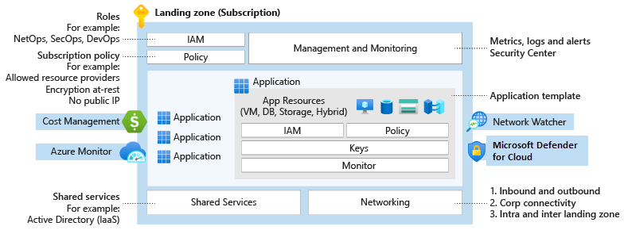

# Enterprise-scale architecture

The principal challenges facing enterprise customers adopting Azure are 1) how to allow applications (legacy or modern) to seamlessly move at their own pace, and 2) how to provide secure and streamlined operations, management, and governance across the entire platform and all encompassed applications. To address these challenges, customers require a forward looking and Azure-native design approach, which in the context of this playbook is represented by the "enterprise-scale" architecture.

## What is the enterprise-scale architecture

The "enterprise-scale" architecture represents the strategic design path and target technical state for the customer's Azure environment. It will continue to evolve in lockstep with the Azure platform and is ultimately defined by the various design decisions the customer organization must make to define their Azure journey.

It is important to highlight that not all enterprises adopt Azure in the same way, and as a result the "enterprise-scale" architecture may vary between customers. Ultimately, the technical considerations and design recommendations presented within this playbook may yield different trade-offs based on the customer scenario. Some variation is therefore expected, but provided core recommendations are followed, the resultant target architecture will position the customer on a path to sustainable scale.

## Landing zone definition

Within the context of the "enterprise-scale" architecture, a "landing zone" is a logical construct capturing everything that must be true to enable application migrations and greenfield development at an enterprise scale in Azure. It considers all platform resources that are required to support the customer's application portfolio and does not differentiate between IaaS or PaaS.

Every large enterprise software estate will encompass a myriad of application archetypes and each "landing zone" essentially represents the common elements, such as networking and IAM, that are shared across instances of these archetypes and must be in place to ensure that migrating applications have access to requisite components when deployed. Each "landing zones" must consequently be designed and deployed in accordance with the requirements of archetypes within the customer's application portfolio.

The principle purpose of the "landing zone" is therefore to ensure that when an application lands on Azure, the required "plumbing" is already in place, providing greater agility and compliance with enterprise security and governance requirements.

---
_Using an analogy, this is similar to how city utilities such as water, gas, and electricity are accessible before new houses are constructed. In this context, the network, IAM, policies, management, and monitoring are shared 'utility' services that must be readily available to help streamline the application migration process._
***

_Figure 1: "landing zone" design._

The following list expands on the "landing zone" illustration by iterating through the core technical constructs which must be designed and developed within the context of customer requirements to create compliant technical "landing zone" environments and the conditions for successful Azure adoption.

- ***Identity and access management*:** Azure AD design and integration must be built to ensure both server and user authentication. RBAC must be modelled and deployed to enforce separation of duties and the required entitlements for platform operation and management. Key management must be designed and deployed to ensure secure access to resources and support operations such as rotation and recovery. Ultimately, access roles are assigned to application owners at the control and data planes to create and manage resources autonomously.

- ***Policy management*** holistic and "landing zone" specific policies must be identified, described, built and deployed onto the target Azure platform to ensure corporate, regulatory and line of business controls are in place. Ultimately, policies should be used to guarantee the compliance of applications and underlying resources without any abstraction provisioning/administration capability.

- ***Management and monitoring*:** Platform level holistic (horizontal) resource monitoring and alerting must be designed, deployed, and integrated. Operational tasks such as patching and backup must also be defined and streamlined. Security operations, monitoring, and logging must be designed and integrated with both resources on Azure as well as existing on-premises systems. All subscription activity logs , which capture control plane operations across resources, should be streamed into Log Analytics to make them available for query and analysis, subject to RBAC permissions.

- ***Network topology and connectivity*:** The end-to-end network topology must be built and deployed across Azure regions and on-premises customer environments to ensure north-south and east-west connectivity between platform deployments. Network security must also be designed with the required services and resources identified, deployed and configured, such as firewalls and NVAs to ensure security requirements are fully met.

- ***Shared services infrastructure*:** Centrally controlled but de-centrally deployed services, such as domain controllers, must be designed, configured, and built to make requisite common services and resources available for application teams to consume and integrate with. It is important to note that not all "traditional" on premise shared services should be provided in the cloud. For example, file shares and HSMs should be considered as application level resources using native-Azure services.

- ***DevOps*:** An end-to-end DevOps experience with robust SDLC practices must be designed, built and deployed to ensure the safe, repeatable and consistent delivery of infrastructure as code artifacts. Such artifacts are to be developed, tested and deployed using dedicated integration, release and deployment pipelines with strong source control and traceability.

In addition to the key aspects denoted above, the design, configuration, deployment, and integration of each "landing zone" should meet critical customer requirements relating to:

- Business continuity and disaster recovery, both at the platform and application level.
- Service management, such as incident response and support.
- Service catalogue, such as CMDB.

## High level architecture

_Figure 2: "enterprise-scale" architecture._
