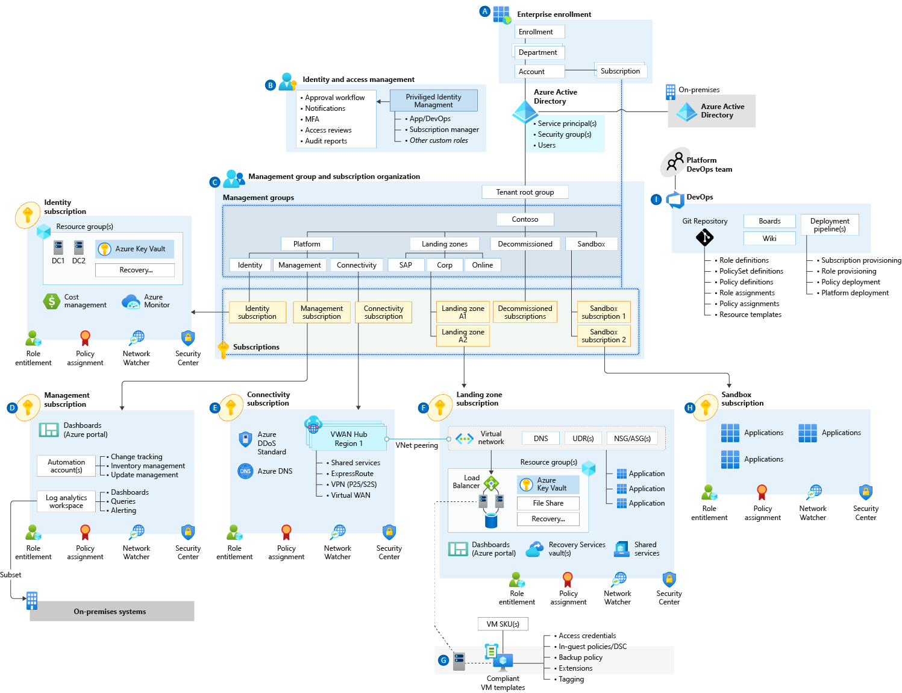

<!-- cSpell:ignore rkuehfus CAF HSMs -->

# Cloud Adoption Framework enterprise-scale landing zone architecture

Enterprise-scale is an architecture approach and reference implementation that enables effective construction and operationalization of landing zones on Azure, at scale and aligned with Azure Roadmap and Microsoft Cloud Adoption Framework for Azure.

## An overview of enterprise-scale landing zone architecture

The CAF enterprise-scale landing zone architecture represents the strategic design path and target technical state for the customer's Azure environment. It will continue to evolve in lockstep with the Azure platform and is ultimately defined by the various design decisions the customer organization must make to define their Azure journey.

It is important to highlight that not all enterprises adopt Azure the same way, which results in CAF enterprise-scale landing zone architecture varying between customers. Ultimately, the technical considerations and design recommendations presented within this guide may yield different trade-offs based on the customer scenario. Some variation is expected, but the resultant target architecture will set the customer on a path to sustainable scale if the core recommendations are followed.

## Landing zone: Expanded definition

[Landing zone considerations](../../ready/considerations/index.md) provides a detailed definition for the term _landing zone_. The audience of the CAF enterprise-scale landing zone needs an even more specific definition.

- **Scope:** Within the CAF enterprise-scale landing zone, the scope of a landing zone grows considerably to support application migrations and green field development at an enterprise scale in Azure. This expansion allows for design that can scale across the customer's full IT portfolio, which looks well beyond a short-term cloud adoption plan.

- **Refactoring:** The number of subscriptions required to support a full enterprise-scale IT portfolio can be large. At first, the Cloud Adoption Framework encourages a high-frequency of refactoring, but this should stabilize before the tenth production workload is deployed to the cloud. When working across an enterprise portfolio, ten applications can be deployed quickly and make refactoring impractical. Instead, it's recommended for Central IT or a cloud center of excellence to deliver a more complete landing zone during the first release.

- **Goal:** Provide consistent landing zones based on an application archetype subscription strategy to minimize subscription sprawl. Expand the definition of requisite components to better fit the governance and compliance needs of a cloud-mature enterprise. See the image below.

- **Principal purpose:** Limited refactoring opportunities and a defined subscription strategy create an opportunity to mature the customer's landing zones faster. The CAF enterprise-scale landing zone broadens the principle purpose of the landing zone to focus on aspects of governance, compliance, security, and operational management. Each of these is addressed in the first release of the landing zone(s) and supporting shared services.

This is similar to how city utilities such as water, gas, and electricity are accessible before new homes are constructed. In this context, the network, identity and access management, policies, management, and monitoring are shared 'utility' services that must be readily available to help streamline the application migration process before it begins.

_Figure 1: Landing zone design._

## Expanded list of requisite components

The following list expands on the landing zone illustration by outlining the core technical constructs that must be designed and developed within the context of customer requirements to create compliant technical landing zone environments and the conditions for successful Azure adoption.

- **Identity and access management:** Azure Active Directory design and integration must be built to ensure both server and user authentication. Resource-based access control (RBAC) must be modeled and deployed to enforce separation of duties and the required entitlements for platform operation and management. Key management must be designed and deployed to ensure secure access to resources and support operations such as rotation and recovery. Ultimately, access roles are assigned to application owners at the control and data planes to create and manage resources autonomously.

- **Policy management:** Holistic and landing-zone-specific policies must be identified, described, built, and deployed onto the target Azure platform to ensure corporate, regulatory, and line-of-business controls are in place. Ultimately, policies should be used to guarantee the compliance of applications and underlying resources without any abstraction provisioning/administration capability.

- **Management and monitoring:** Platform-level holistic (horizontal) resource monitoring and alerting must be designed, deployed, and integrated. Operational tasks such as patching and backup must also be defined and streamlined. Security operations, monitoring, and logging must be designed and integrated with both resources on Azure as well as existing on-premises systems. All subscription activity logs that capture control plane operations across resources should be streamed into Log Analytics to make them available for query and analysis, subject to role-based access control (RBAC) permissions.

- **Network topology and connectivity:** The end-to-end network topology must be built and deployed across Azure regions and on-premises customer environments to ensure north-south and east-west connectivity between platform deployments. Required services and resources such as firewalls and network virtual appliances must be identified, deployed, and configured throughout network security design to ensure that security requirements are fully met.

- **Shared services infrastructure:** Centrally controlled but decentrally deployed services such as domain controllers must be designed, configured, and built to help application teams consume and integrate with necessary and common services and resources. It is important to note that not all traditional and shared on-premises services should be provided in the cloud. For example, file shares and hardware security modules should be considered as application-level resources that use native Azure services.

- **DevOps:** An end-to-end DevOps experience with robust software development lifecycle practices must be designed, built, and deployed to ensure a safe, repeatable, and consistent delivery of infrastructure-as-code artifacts. Such artifacts are to be developed, tested, and deployed using dedicated integration, release, and deployment pipelines with strong source control and traceability.

In addition to the key aspects denoted above, the design, configuration, deployment, and integration of each landing zone should meet critical customer requirements relating to:

- Business continuity and disaster recovery at platform and application levels
- Service management, such as incident response and support
- A service catalog (for example, a configuration management database)

## High-level architecture

_Figure 2: CAF enterprise-scale landing zone architecture._

## Next steps

Customize implementation of this architecture using the CAF [design guidelines](./design-guidelines.md).

> [!div class="nextstepaction"]
> [Design guidelines](./design-guidelines.md)
