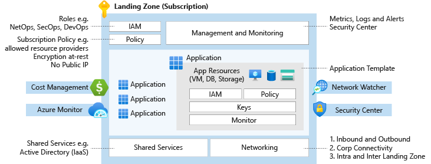
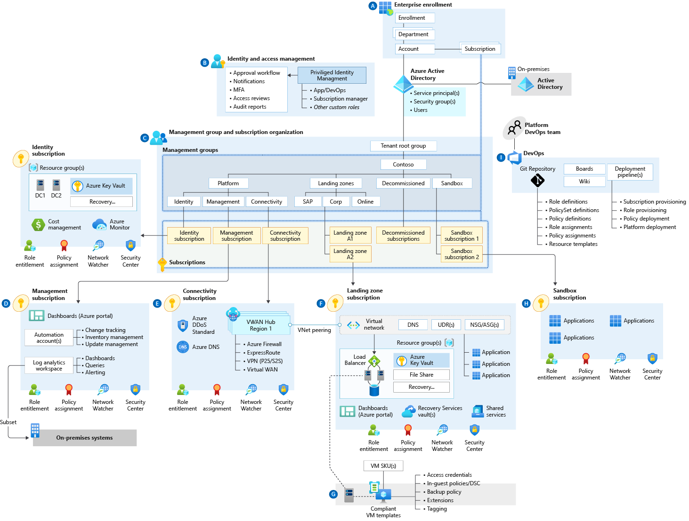

# Cloud Adoption Framework enterprise-scale landing zone architecture

Enterprise-scale is an architectural approach and a reference implementation that enables effective construction and operationalization of landing zones on Azure, at scale. This approach aligns with the Azure roadmap and the Cloud Adoption Framework for Azure.

## Architecture overview

The Cloud Adoption Framework enterprise-scale landing zone architecture represents the strategic design path and target technical state for an organization's Azure environment. It will continue to evolve alongside the Azure platform and is defined by the various design decisions that your organization must make to map your Azure journey.

Not all enterprises adopt Azure the same way, so the Cloud Adoption Framework enterprise-scale landing zone architecture varies between customers. The technical considerations and design recommendations in this guide might yield different trade-offs based on your organization's scenario. Some variation is expected, but if you follow the core recommendations, the resulting target architecture will set your organization on a path to sustainable scale.

## Landing zone in enterprise-scale

Azure landing zones are the output of a multisubscription Azure environment that accounts for scale, security, governance, networking, and identity. Azure landing zones enable application migrations and greenfield development at enterprise-scale in Azure. These zones consider all platform resources that are required to support the customer's application portfolio and don't differentiate between infrastructure as a service or platform as a service.

An example is how city utilities such as water, gas, and electricity are accessible before new homes are constructed. In this context, the network, identity and access management, policies, management, and monitoring are shared utility services that must be readily available to help streamline the application migration process before it begins.

*Figure 1: Landing zone design.*

## High-level architecture

An enterprise-scale architecture is defined by a set of design considerations and recommendations across eight [critical design areas](./design-guidelines.md), with two network topologies recommended: an enterprise-scale architecture based on an Azure Virtual WAN network topology (depicted in figure 2), or based on a traditional Azure network topology based on the hub and spoke architecture (depicted in figure 3).

*Figure 2: Cloud Adoption Framework enterprise-scale landing zone architecture based on an Azure Virtual WAN network topology. Note that the connectivity subscription uses a Virtual WAN hub.*

*Figure 3: Cloud Adoption Framework enterprise-scale landing zone architecture based on a traditional Azure networking topology. Note that the connectivity subscription uses a hub VNet.*

Download the PDF or Visio files that contain the enterprise-scale architecture diagrams based on the [Virtual WAN (PDF)](https://raw.githubusercontent.com/microsoft/CloudAdoptionFramework/master/ready/enterprise-scale-architecture.pdf) network topology or a traditional Azure network topology based on the [hub and spoke (PDF)](https://github.com/microsoft/CloudAdoptionFramework/raw/master/ready/enterprise-scale-architecture-cust.pdf) architecture. A Visio file containing both the Virtual WAN and the hub and spoke architecture diagram can be downloaded as a [Visio diagram (VSDX)](https://github.com/microsoft/CloudAdoptionFramework/raw/master/ready/enterprise-scale-architecture.vsdx).

> [!IMPORTANT]
> It's possible to implement an enterprise-scale landing zone architecture with a single subscription for **platform resources**, if segregation of duties aren't a concern for the team managing platform resources. With scalability and security in mind, it's strongly recommended to have dedicated subscriptions for platform resources as depicted on figure 2 and figure 3.

On figures 2 and figure 3, there are references to the enterprise-scale critical design areas, which are indicated with the letters A to I:

 [Enterprise Agreement (EA) enrollment and Azure Active Directory tenants](./enterprise-enrollment-and-azure-ad-tenants.md). An Enterprise Agreement (EA) enrollment represents the commercial relationship between Microsoft and how your organization uses Azure. It provides the basis for billing across all your subscriptions and affects administration of your digital estate. Your EA enrollment is managed via the Azure EA portal. An enrollment often represents an organization's hierarchy, which includes departments, accounts, and subscriptions. An Azure AD tenant provides identity and access management, which is an important part of your security posture. An Azure AD tenant ensures that authenticated and authorized users have access to only the resources for which they have access permissions.

 [Identity and access management](./identity-and-access-management.md). Azure Active Directory design and integration must be built to ensure both server and user authentication. Azure role-based access control (Azure RBAC) must be modeled and deployed to enforce separation of duties and the required entitlements for platform operation and management. Key management must be designed and deployed to ensure secure access to resources and support operations such as rotation and recovery. Ultimately, access roles are assigned to application owners at the control and data planes to create and manage resources autonomously.

 [Management group and subscription organization](./management-group-and-subscription-organization.md). Management group structures within an Azure Active Directory (Azure AD) tenant support organizational mapping and must be considered thoroughly when an organization plans Azure adoption at scale. Subscriptions are a unit of management, billing, and scale within Azure. They play a critical role when you're designing for large-scale Azure adoption. This critical design area helps you capture subscription requirements and design target subscriptions based on critical factors. These factors are environment type, ownership and governance model, organizational structure, and application portfolios.

 [Management and monitoring](./management-and-monitoring.md). Platform-level holistic (horizontal) resource monitoring and alerting must be designed, deployed, and integrated. Operational tasks such as patching and backup must also be defined and streamlined. Security operations, monitoring, and logging must be designed and integrated with both resources on Azure and existing on-premises systems. All subscription activity logs that capture control plane operations across resources should be streamed into Log Analytics to make them available for query and analysis, subject to Azure RBAC permissions.

 [Network topology and connectivity](./network-topology-and-connectivity.md). The end-to-end network topology must be built and deployed across Azure regions and on-premises environments to ensure north-south and east-west connectivity between platform deployments. Required services and resources such as firewalls and network virtual appliances must be identified, deployed, and configured throughout network security design to ensure that security requirements are fully met.

, ,  [Business continuity and disaster recovery](./business-continuity-and-disaster-recovery.md) and [Security governance and compliance](./security-governance-and-compliance.md). Holistic and landing-zone-specific policies must be identified, described, built, and deployed onto the target Azure platform to ensure corporate, regulatory, and line-of-business controls are in place. Ultimately, policies should be used to guarantee the compliance of applications and underlying resources without any abstraction provisioning or administration capability.

 [Platform automation and DevOps](./platform-automation-and-devops.md). An end-to-end DevOps experience with robust software development lifecycle practices must be designed, built, and deployed to ensure a safe, repeatable, and consistent delivery of infrastructure-as-code artifacts. Such artifacts are to be developed, tested, and deployed by using dedicated integration, release, and deployment pipelines with strong source control and traceability.

## Next steps

Customize implementation of this architecture by using the Cloud Adoption Framework enterprise-scale design guidelines.

> [!div class="nextstepaction"]
> [Design guidelines](./design-guidelines.md)
