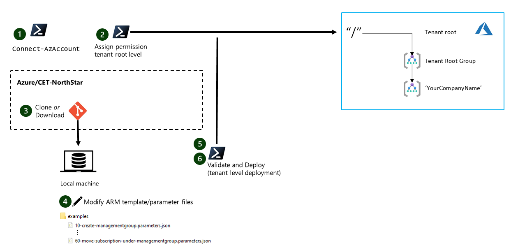

## Validate prerequisites

 This section provides guidance for you to experiment with Microsoft Azure Resource Manager template deployments at the tenant (`/`) root scope. This will help you to validate that you've properly configured the prerequisites. Note that this section is optional.

 
 _Figure 1: Tenant root scope deployment._

From a PowerShell terminal, connect to Azure using `Connect-AzAccount -TenantId <yourTenantId>` with an account that has at least `user access administrator` permissions at the tenant root level.

Assign required permissions at tenant root level for the account that you want to use. Either `owner` or `contributor` and `user access administrator` permissions are required to deploy the example templates. If you don't have permission to assign permissions at the root level, you may need to [elevate your access](https://docs.microsoft.com/azure/role-based-access-control/elevate-access-global-admin) as a global administrator in order to assign them.

    ```powershell
    New-AzRoleAssignment -SignInName 'john.doe@contoso.com' -RoleDefinitionName 'Owner' -Scope '/'  

    RoleAssignmentId   : /providers/Microsoft.Authorization/roleAssignments/3b012473-78b1-4511-8e7f-f6f786bfbb02
    Scope              : /
    DisplayName        : John Doe
    SignInName         : john.doe@contoso.com
    RoleDefinitionName : Owner
    RoleDefinitionId   : 8e3af657-a8ff-443c-a75c-2fe8c4bcb635
    ObjectId           : 24eefd82-dcc3-494f-acdd-f4e258e932e8
    ObjectType         : User
    CanDelegate        : False
    ```

>Note: If you want to use a service principal, follow the instructions to assign permissions under the [**full end-to-end deployment**](./Using-Reference-Implementation.md)

3. [Clone](https://help.github.com/en/github/creating-cloning-and-archiving-repositories/cloning-a-repository) your fork of the [north GitHub repo](https://github.com/Azure/CET-NorthStar), or download the necessary templates/template parameter files from the examples folder to your local computer. For a basic deployment test, you'll need access to the following template:

    - [10-Create-managementgroup.parameters](https://github.com/Azure/CET-NorthStar/blob/master/examples/10-create-managementgroup.parameters.json)
      Parameter file to deploy the company root management group (for example, Contoso) as a child of the tenant root group

     > Refer to [this](../contribution.md#writing-arm-templates-for-contoso-implementation) article to better understand how the enterprise-scale reference Resource Manager templates are constructed (with only one master template but multiple parameter files).

4. In the sample parameter files (for this case, 10-create-managementgroup.parameters.json), change the tenant ID and name of the management groups to reflect the tenant where they will be deployed. The tenant ID can be found by running `(get-azcontext).tenant`

    ```json
    {
      "$schema": "http://schema.management.azure.com/schemas/2015-01-01/deploymentParameters.json#",
      "contentVersion": "1.0.0.0",
      "parameters": {
        "input": {
          "value": {
            "Name": "<YourManagementGroupName>",
            "DisplayName": "<YourManagementGroupName>",
            "ParentId": "/providers/Microsoft.Management/managementGroups/<TenantID>"
          }
        }
      }
    }
    ```

5. From the same PowerShell terminal used in Step 1, deploy the sample template at the tenant scope with the following commands. Execute the commands from the folder containing the *.parameters.json files or reference the files correctly:

    ```powershell
    #Define base deployment settings
    $Name = "MGDeployment-{0}" -f (Get-Random) #Add random number to deployment name
    $TemplateUri = "https://raw.githubusercontent.com/uday31in/AzOps/master/src/tenant.json"
    $Location = "northeurope" #Can be changed to your preferred deployment location


    #Deploy management groups to tenant level
    New-AzTenantDeployment -Name $Name -TemplateUri $TemplateUri -Location $location `
                           -TemplateParameterFile 10-create-managementgroup.parameters.json

    ```

6. Verify that the management group was successfully provisioned with PowerShell.

    ```powershell
    #Get management groups  
    Get-AzManagementGroup -GroupName <YourManagementGroupName> -Recurse -Expand
    ```

    For example, if you named your management group Contoso, you should see an output similar to the one below:

    ```powershell
    Get-AzManagementGroup -GroupName Contoso -Recurse -Expand

    Id                : /providers/Microsoft.Management/managementGroups/Contoso
    Type              : /providers/Microsoft.Management/managementGroups
    Name              : Contoso
    TenantId          : 3fc1081d-6105-4e19-b60c-1ec1252cf560
    DisplayName       : Contoso
    UpdatedTime       : 0001-01-01 00:00:00
    UpdatedBy         :
    ParentId          : /providers/Microsoft.Management/managementGroups/3fc1081d-6105-4e19-b60c-1ec1252cf560
    ParentName        : 3fc1081d-6105-4e19-b60c-1ec1252cf560
    ParentDisplayName : 3fc1081d-6105-4e19-b60c-1ec1252cf560
    ```
