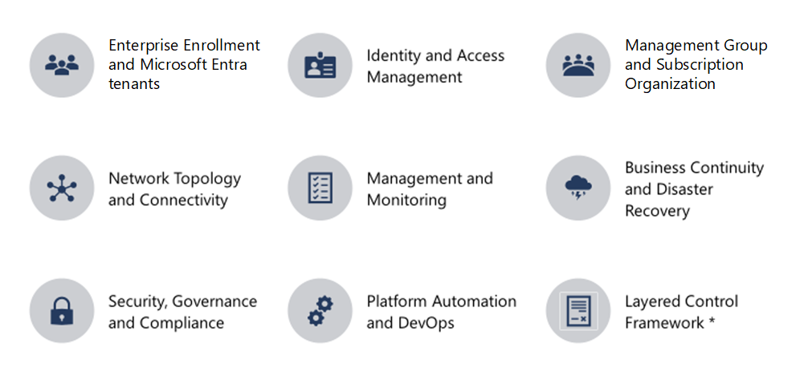

# Design guidelines

At the center of the CAF enterprise-scale landing zone architecture lies a critical design path comprised of fundamental design topics with heavily interrelated and dependent design decisions. This repository provides design guidance across these architecturally significant technical domains to support the critical design decisions which must occur to define the CAF enterprise-scale landing zone architecture. For each of the considered domains, readers should review provided considerations and recommendations and use them to structure and drive designs within each area.

For example, a customer is likely to question how many subscriptions they require for their estate. In this instance, the reader should review the *C - Management Group and Subscription Organization -&gt; 2. Subscription Organization and Governance* section, using the outlined recommendations to help drive subscription decisions.

## Design principles

CAF enterprise-scale landing zone is based on a series of design principles, which influence how the architecture is implemented. These design principles lead to decisions that may differ from standard design options found elsewhere in the cloud adoption framework. The article on [design principles](./design-principles.md) provides more information.

## Critical design areas

The following eight critical design areas are intended to support the translation of customer requirements to Azure constructs and capabilities, to address the mismatch between on-premises infrastructure and cloud-design which typically creates dissonance and friction with respect to the CAF enterprise-scale landing zone definition and Azure adoption.

The impact of decisions made within these critical areas will reverberate across the CAF enterprise-scale landing zone architecture and influence other decisions. Readers are strongly advised to familiarize themselves with these eight areas, to better understand the consequences of encompassed decisions, which may later produce trade-offs within related areas.

* [A - Enterprise enrollment and Azure AD tenants](./A-Enterprise-Enrolment-and-Azure-AD-Tenants.md)
* [B - Identity and access management](./B-Identity-and-Access-Management.md)
* [C - Management group and subscription organization](./C-Management-Group-and-Subscription-Organization.md)
* [D - Network topology and connectivity](./D-Network-Topology-and-Connectivity.md)
* [E - Management and monitoring](./E-Management-and-Monitoring.md)
* [F - Business continuity and disaster recovery](./F-Business-Continuity-and-Disaster-Recovery.md)
* [G - Security, governance, and compliance](./G-Security-Governance-and-Compliance.md)
* [H - Platform automation and DevOps](./H-Platform-Automation-and-DevOps.md)

## Next steps

Configuring [enterprise enrollment and Azure AD tenants](./A-Enterprise-Enrolment-and-Azure-AD-Tenants.md)

> [!div class="nextstepaction"]
> [Enterprise enrollment and Azure AD tenants](./A-Enterprise-Enrolment-and-Azure-AD-Tenants.md)
