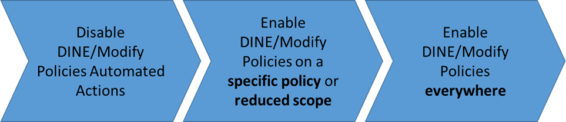
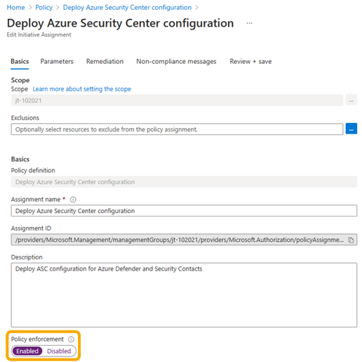

# Adopt policy-driven guardrails

Before you use policies, you need to understand where they're used within the Azure landing zone reference implementations and why. This article will help you understand whether you want to prevent DeployIfNotExists (DINE) or Modify policies from making changes within your Azure environment.

### Why use DINE and Modify policies?

DINE and Modify policies are part of the Azure landing zone reference implementations. They help you and your organization ensure your landing zones, which are also known as subscriptions, and the resources within them are compliant. These policies also remove the operational burden for platform and landing zone teams as your Azure environment scales.

For example, consider a scenario where a new landing zone subscription is provisioned and placed in the "corp" management group. DINE and Modify policies then take the following actions for the landing zone subscription:

- Enable Microsoft Defender for Cloud. Configure Defender for Cloud exports to the central Log Analytics workspace in the management subscription.
- Enable Defender for Cloud for the different supported offerings based on the policy parameters configured on the policy assignment.
- Configure the Azure Activity logs to be sent to the central Log Analytics workspace in the management subscription.
- Configure the diagnostic settings for all resources to be sent to the central Log Analytics workspace in the management subscription.
- Deploy the required Azure Monitor agents for virtual machines and Azure Virtual Machine Scale Sets, including Azure Arc connected servers. Connect them to the central Log Analytics workspace in the management subscription.

>[!NOTE]
> You can disable the preceding options at any time or during deployment of the Azure landing zone reference implementations.
>  
> The preceding list shows a subset of all the policies that are assigned as part of the Azure landing zone accelerator. For a full list of policies that can be assigned by the Azure landing zone reference implementation, see [Policies included in Azure landing zones reference implementations](https://aka.ms/alz/policies).
>
> The [Azure landing zones bicep repo](https://github.com/Azure/ALZ-Bicep) is modular. The above default policies can be deployed with the [ALZ Default Policy Assignments module](https://github.com/Azure/ALZ-Bicep/blob/main/infra-as-code/bicep/modules/policy/assignments/alzDefaults/README.md).  

All assigned policies help you and the landing zone owners remain compliant. No actual workload resources are deployed via DINE or Modify policies. We don't recommend this either. For more information, see [Should we use Azure Policy to deploy workloads?](./faq.md#should-we-use-azure-policy-to-deploy-workloads). Only auxiliary or supporting resources or settings are deployed or configured by these DINE policies.

The Azure landing zones reference implementations use [DINE](/azure/governance/policy/concepts/effects#deployifnotexists) Azure policies to help you achieve policy-driven governance within your Azure environment. But maybe you can't use DINE or Modify policies, or you aren't ready to enable this type of [Azure policy effect](/azure/governance/policy/concepts/effects) because of:

- Regulatory compliance policies, standards, or law restrictions.
- Strict change control processes that require human approval for every action within your Azure environment.
- Lack of expertise, experience, and understanding of how to manage and use DINE policies.
- Organizational requirements that all workload resource configuration, including auxiliary resources, supporting resources, and settings, are defined in infrastructure as code (IaC) by the workload application teams.

If you fit into the preceding examples or similar scenarios, this article helps you understand how to adopt the [Azure landing zone conceptual architecture](../landing-zone/index.md#azure-landing-zone-architecture) and adhere to its [design principles](../landing-zone/design-principles.md). Although you won't use certain policies initially, you can choose to gradually enable them in the future. The goal is to help you achieve [policy-driven governance](../landing-zone/design-principles.md#policy-driven-governance).

>[!IMPORTANT]
> Throughout this article, you'll see two possible values used for the enforcement mode terms:
>  
> - Disabled or DoNotEnforce
> - Enabled or Default
>  
> The Azure portal uses Disabled and Enabled for the enforcement mode. Azure Resource Manager (ARM) templates and other API interfaces use DoNotEnforce and Default for the same options.
>  
> For more information, see [Enforcement mode](/azure/governance/policy/concepts/assignment-structure#enforcement-mode).

If you're still certain that your organization can't use DINE or Modify policies, this article explains how to prevent (also known as disable) the policies from making automatic changes to your Azure environment.

>[!NOTE]
> This operation isn't permanent. The policies can be reenabled at any time by a member of your platform team if you later decide to use DINE or Modify policies.
>  
> For more information, see phase [2](#phase-2-enable-dine-and-modify-policies-on-a-specific-policy-or-reduced-scope) and phase [3](#phase-3-enable-dine-and-modify-policies-everywhere).

Support for [Resource Selectors](/azure/governance/policy/concepts/assignment-structure#resource-selectors) are also applicable for policy-driven governance to ensure Safe Deployment Practices (SDP) is being adhered to. Resource Selectors bring the functionality of gradual roll out of policy assignments based on factors like resource location, resource type, or whether the resource has a location. [More can be found in this document](/azure/governance/policy/concepts/assignment-structure#resource-selectors-preview).

### Approach overview

The following diagram summarizes the suggested phased approach:



1. Set the [enforcement mode](/azure/governance/policy/concepts/assignment-structure#enforcement-mode) to `DoNotEnforce` on policy assignments:
   - By using this feature, you can modify the assignments' behavior to effectively become an audit-only policy without modifying the underlying policy definition.
   - This approach also allows you to do manual remediation tasks on noncompliant resources by using [remediation tasks](/azure/governance/policy/how-to/remediate-resources) if you want to.
1. Set the [enforcement mode](/azure/governance/policy/concepts/assignment-structure#enforcement-mode) to `Default` on policy assignments to reenable DINE policy assignments' automatic remediation *on a reduced scope*:
   - You can choose to use an entire environment, for example, the Sandbox management group.
   - Or, you can use a noncritical workload subscription.
1. Set the [enforcement mode](/azure/governance/policy/concepts/assignment-structure#enforcement-mode) to `Default` on policy assignments on the remaining DINE policies across the entire Azure environment.

Because of regulatory compliance restrictions, some customers can never move past phase 1. This isn't an issue and is supported to remain in this state, if necessary. Other customers can progress to phases 2 and 3 to fully adopt DINE and Modify policies to assist with policy-driven governance for their Azure environment.

>[!NOTE]
> The scenario and approach outlined in this article isn't intended for or recommended for the majority of customers. Review the section [Why use DINE and Modify policies?](#why-use-dine-and-modify-policies) before you decide whether these policies are suitable and required for your environment.

### Phase 1: Disable DINE and Modify policies automated actions

When you assign a policy, by default the [effect](/azure/governance/policy/concepts/effects) defined in the policy definition will apply. We recommend that you leave the policy definition as is. For example, leave the policy assignment effect as `DeployIfNotExists`.

Instead of changing the policy definition or its effect, you can instead influence this behavior with minimal effort by using the feature on policy assignments.

#### Use the Azure portal to set the enforcement mode to Disabled

This screenshot shows how to use the Azure portal to set the enforcement mode to **Disabled** on a policy assignment. Disabled is also known as DoNotEnforce.


#### Use the ARM template to set the enforcement mode to DoNotEnforce

This code example shows how to use an ARM template to set `enforcementMode` to `DoNotEnforce` on a policy assignment. `DoNotEnforce` is also known as `Disabled`.

```json
{
  "type": "Microsoft.Authorization/policyAssignments",
  "apiVersion": "2019-09-01",
  "name": "PolicyAssignmentName",
  "location": "[deployment().location]",
  "properties": {
    "description": "PolicyAssignmentDescription",
    "policyDefinitionId": "[parameters('policyDefinitionId')]",
    "enforcementMode": "DoNotEnforce"
    … // other properties removed for display purposes
  }
}
```

By using the [enforcement mode](/azure/governance/policy/concepts/assignment-structure#enforcement-mode), you can see the effect of a policy on existing resources without initiating it or triggering entries in the Azure Activity log. This scenario is commonly referred to as "What If" and aligns to safe deployment practices.

Even when the [enforcement mode](/azure/governance/policy/concepts/assignment-structure#enforcement-mode) is set to `DoNotEnforce`, [remediation tasks](/azure/governance/policy/how-to/remediate-resources) can be triggered manually. You can remediate specific noncompliant resources. You can also see what the DINE or Modify policy would have done if the enforcement mode were set to `Default`.

>[!IMPORTANT]
> When the enforcement mode is set to `DoNotEnforce`, entries in the Azure Activity log aren't generated. Consider this factor if you want to be notified when a noncompliant resource is created.

#### Stay in the phase 1 state permanently

As mentioned in the [Approach overview](#approach-overview) section, some customers might need to remain in [phase 1](#phase-1-disable-dine-and-modify-policies-automated-actions) for a long period or even permanently because of their requirements. This state is valid, and customers can remain in it for any length of time.

Perhaps you need to stay in this state permanently or for a long period, like years. If so, it might be better for you to adopt the [`AuditIfNotExists`](/azure/governance/policy/concepts/effects#auditifnotexists) (AINE) policy effect and associated definitions and set the enforcement mode back to `Default`.

>[!NOTE]
> By changing to using an AINE policy and setting the enforcement mode to `Default`, you still achieve the same goal of disabling DINE.

When you change from DINE to AINE and set the enforcement mode back to `Default` as a long-term or permanent approach for phase 1, you'll gain back the Azure Activity log entries for policy compliance statuses. You can build automation workflows from these log entries in your overall platform management operations.

You'll lose the capability to do manual remediation tasks. Unlike DINE policies, AINE policies don't perform any deployments, either automated or manual.

Remember to update the policy definition to accept and allow the `AuditIfNotExists` policy assignment effect.

The following table summarizes the options and implications for the different types of policy effects and enforcement mode combinations:

| Policy effect | Enforcement mode      | Activity log entry | Remediation action |
| --            | --                    | --                 | --          |
| DINE          | Enabled or Default       | Yes                | Platform-triggered remediation at scale after creation or resource update. Manual creation of a remediation task required if dependent resource is modified or preexisting prior to the policy assignment. |
| DINE          | Disabled or DoNotEnforce | No                 | Manual creation of a remediation task required. |
| Modify        | Enabled or Default       | Yes                | Automatic remediation during creation or update. |
| Modify        | Disabled or DoNotEnforce | No                 | Manual creation of a remediation task required. |
| Deny          | Enabled or Default       | Yes                | Creation or update denied. |
| Deny          | Disabled or DoNotEnforce | No                 | Creation or update allowed. Manual remediation required. |
| Audit/AINE    | Enabled or Default       | Yes                | Manual remediation required. |
| Audit/AINE    | Disabled or DoNotEnforce | No                 | Manual remediation required. |

>[!NOTE]
> Review the guidance in [Reacting to Azure Policy state change events](/azure/governance/policy/concepts/event-overview) to understand if using the Azure Event Grid integration with Azure Policy provides a suitable approach if you plan to build your own automation based on policy state events.

### Phase 2: Enable DINE and Modify policies on a specific policy or reduced scope

In this phase, you'll learn how to set the enforcement mode to `Default` on policy assignments.

After you've completed [phase 1](#phase-1-disable-dine-and-modify-policies-automated-actions), you decide that you want to test and try out the full automation capabilities of DINE and Modify policies on a specific policy or on a reduced scope. You want to use the Sandbox management group or a nonproduction workload subscription.

To do this procedure, first you need to identify the policy or reduced scope that will be used to test and try the DINE and Modify policies' full automation capabilities.

>[!NOTE]
> You might want to review and implement a [testing approach for an enterprise-scale](./testing-approach.md) platform. In this way, you can test policies and other platform changes in a separated management group hierarchy within the same tenant.
>
> This approach is also known as a "canary" deployment.

Some suggested examples of scopes and policies are shown in the following table:

| When you want to... | Choose from these scopes | Example policies to use |
| ------------------- | --------------------------- | ----------------------- |
| - Test the DINE/Modify automated remediation capabilities. <br> - Verify how your complete deployment processes and CI/CD pipelines, including tests, might be affected. <br> - Verify how your workload might be affected. | - Sandbox subscription <br> - Sandbox management group <br> - Nonproduction workload landing zone subscription <br> - [Enterprise-scale "canary" environment](./testing-approach.md) | - Configure Azure Activity logs to stream to a specified Log Analytics workspace. <br> - Deploy Defender for Cloud configuration. <br> - Enable Azure Monitor for VMs or Virtual Machine Scale Sets. <br> - Deploy diagnostic settings to Azure services. <br>  - Potentially only enable for specific services within the initiative. |

You might also decide to use a manual remediation task on a limited scope or set of resources to test how these policies will affect your environment. For more information on how to create a remediation task, see the Azure Policy documentation [Create a remediation task](/azure/governance/policy/how-to/remediate-resources#create-a-remediation-task).

After you've identified a policy, or policies, and the reduced scope to assign them, the next step is to assign the policy and set the enforcement mode to `Default`. Leave the policy effect, for example, `DeployIfNotExists` or `Modify`, as is on the reduced scope you selected.

#### Use the Azure portal to set the enforcement mode to Enabled

This screenshot shows how to use the Azure portal to set the enforcement mode to **Enabled** on a policy assignment. Enabled is also known as Default.



#### Use an ARM template to set the enforcement mode to Default

This code example shows how to use an ARM template to set `enforcementMode` to `Default` on a policy assignment. `Default` is also known as `Enabled`.

```json
{
  "type": "Microsoft.Authorization/policyAssignments",
  "apiVersion": "2019-09-01",
  "name": "PolicyAssignmentName",
  "location": "[deployment().location]",
  "properties": {
    "description": "PolicyAssignmentDescription",
    "policyDefinitionId": "[parameters('policyDefinitionId')]",
    "enforcementMode": "Default"
    … // other properties removed for display purposes
  }
}
```

#### Testing

The last step in this phase is to do the required testing. You want to verify whether and how DINE or Modify policies might have affected and made changes to your workloads, code, tools, and processes.

Perform multiple tests to capture the entire lifecycle of your workload. You want to ensure you fully understand if and how DINE or Modify policies made changes.

Some examples of testing are:

- Initial deployment of workload.
- Code/Application deployment onto workload.
- Day 2 operations and management of workload.
- Decommissioning of workload.

### Phase 3: Enable DINE and Modify policies everywhere

In this phase, you'll learn how to set the enforcement mode to `Default` on policy assignments.

We assume that your [testing](#testing) at the end of [phase 2](#phase-2-enable-dine-and-modify-policies-on-a-specific-policy-or-reduced-scope) passed successfully. Or, maybe you're satisfied that you now understand how DINE or Modify policies interact with your workload. Now you can expand the use of DINE and Modify policies across the rest of your Azure environment.

To proceed, you follow steps that are similar to the steps in [phase 2](#phase-2-enable-dine-and-modify-policies-on-a-specific-policy-or-reduced-scope). This time, you set the enforcement mode to `Default` on all DINE and Modify policy assignments across your entire Azure environment.

Here's a high-level overview of the steps you do in this phase:

- Remove assignments used specifically for [testing during phase 2](#testing).
- Go through each DINE and Modify policy assignment in your Azure environment and set the enforcement mode to `Default`. This process is shown in the examples in phase 2.
- Create remediation tasks for existing resources that are noncompliant by following the guidance in [Create a remediation task](/azure/governance/policy/how-to/remediate-resources#create-a-remediation-task). New resources will automatically be remediated if they match the policy rules and existence conditions.

Even though in phase 3 we recommend that you set the enforcement mode to `Default` for all DINE and Modify policies in your Azure environment, this choice is still optional. You can make this choice on a per-policy basis to suit your needs and requirements.

### Advanced policy management

For advanced management of Azure Policy at scale, consider implementing [Enterprise Policy as Code (EPAC)](../policy-management/enterprise-policy-as-code.md) to manage policy. EPAC provides a stateful management experience that uses IaC. It generally suits large policy management scenarios with complex requirements.
