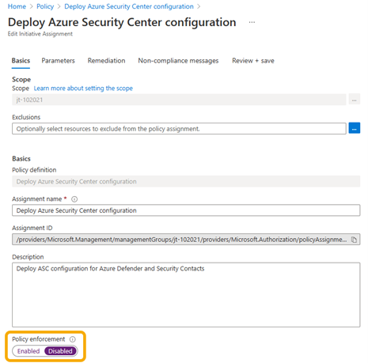

# Adopting policy driven guardrails

Before diving into the steps you can take to gradually adopt the usage of policies, it is important to first understand what and where they are used within the Azure landing zone reference implementations and why. This will then help you to understand whether you want to completely prevent `DeployIfNotExists` (DINE) or `Modify` policies from making changes within your Azure environment or not.

### Why?

DINE policies are part of the Azure landing zone reference implementations to assist you and your organization to ultimately ensure your landing zones (also known as subscriptions) and resources within them are compliant; whilst also removing the operation burden for platform and landing zone teams as your Azure environment scales.

For example, a new landing zone subscription is provisioned and placed into the "corp" management group.

DINE policies will then do the following to the landing zone subscription:

>[!NOTE]
> All the below can be optionally disabled at any time or during deployment of the Azure landing zone reference implementations.
>  
> The below only shows a subset of all the policies that are assigned as part of the Azure Landing Zone accelerator. For a full list of policies that can be assigned by the Azure Landing Zone reference implementation, see [Policies included in Enterprise-Scale Landing Zones reference implementations](https://github.com/Azure/Enterprise-Scale/blob/main/docs/ESLZ-Policies.md).

- Enable Azure Security Center
  - Including configuring Azure Security Center exports to the central Log Analytics workspace in the management subscription
- Enables Azure Defender for the different supported offerings based on the policy parameters configured on the policy assignment
- Configure the Azure Activity Logs to be sent to the central Log Analytics workspace in the management subscription
- Configure the Diagnostic Settings for all resources to be sent to the central Log Analytics workspace in the management subscription
- Deploy the required Azure Monitor Agents for Virtual Machines and Virtual Machine Scale Sets, including Arc connected servers, and connect them to the central Log Analytics workspace in the management subscription

All assigned policies are there to assist you and the landing zone owners to remain compliant, no actual workload resources are deployed via DINE policies (we do not recommend this either as per: [Should we use Azure Policy to deploy workloads?](/azure/cloud-adoption-framework/ready/enterprise-scale/faq#should-we-use-azure-policy-to-deploy-workloads)) only auxiliary or supporting resources or settings are deployed or configured by these DINE policies.

Whilst the Azure landing zones reference implementations utilize [`DeployIfNotExists` (DINE)](/azure/governance/policy/concepts/effects#deployifnotexists) Azure policies to help you achieve policy-driven governance within your Azure environment, we understand that you may not be able to use DINE policies or are not yet ready on your cloud adoption journey to enable this type of [Azure Policy effect](/azure/governance/policy/concepts/effects).

This may be due to number of reasons, such as:

- Regulatory compliance policies, standards, or law restrictions
- Strict change control processes that require human approval for every action within your Azure environment
- Lack of expertise, experience, and understanding of how to manage and use DINE policies

If you fit into the above example scenarios or similar, this document will help you to understand how to adopt the [Azure landing zone conceptual architecture](/azure/cloud-adoption-framework/ready/landing-zone/#azure-landing-zone-conceptual-architecture), alongside its [design principles](/azure/cloud-adoption-framework/ready/enterprise-scale/design-principles), whilst not utilizing certain policies initially (can optionally choose to gradually enable in the future), that help you achieve [policy-driven governance](/azure/cloud-adoption-framework/ready/enterprise-scale/design-principles#policy-driven-governance).

>[!IMPORTANT]
> Throughout the below guidance you will see reference to the "Enforcement Mode" feature being set with two possible values in either of the terms listed for them:
>  
> - `Disabled` or `DoNotEnforce`
> - `Enabled` or `Default`
>  
> This is due to the Azure portal using the `Disabled` and `Enabled` terms for the "Enforcement Mode" feature, whilst ARM templates and other API interfaces use `DoNotEnforce` and `Default` for the same options respectively.
>  
> This is outlined further here: [Enforcement Mode](/azure/governance/policy/concepts/assignment-structure#enforcement-mode)

If you have read the above and still are certain that DINE, policies are unable to be used by your organization for whatever reason, then below we will detail how to prevent (also known as disable) the policies from making automatic changes to your Azure environment.

>[!NOTE]
> This is not a permanent operation, and the policies can be re-enabled at any time by a member of your platform team if you later decide to utilize DINE or Modify policies.
>  
> More detail on this can be found below in phases [2](#phase-2-enable-dinemodify-policies-on-a-specific-policy-or-reduced-scope-setting-enforcement-mode-to-default-on-policy-assignments) & [3](#phase-3-enabling-dinemodify-policies-everywhere-setting-enforcementmode-to-default-on-policy-assignments).

### Approach Overview

The following diagram summarizes the suggested phased approach:


1. Start by setting the [Enforcement Mode](/azure/governance/policy/concepts/assignment-structure#enforcement-mode) to `DoNotEnforce` on Policy Assignments
   - By using this feature, you can modify the assignments behavior, to effectively become an audit only policy, without modifying the underlying policy definition.
   - This approach also still allows you to perform manual remediation tasks on non-compliant resources using [remediation tasks](/azure/governance/policy/how-to/remediate-resources), should you wish to.
2. Set the [Enforcement Mode](/azure/governance/policy/concepts/assignment-structure#enforcement-mode) to `Default` on Policy Assignments to re-enable DINE policy assignments automatic remediation **on a reduced scope**
   - You can choose to use an entire environment (for example the Sandbox management group) or a non-critical workload subscription.
3. Set the [Enforcement Mode](/azure/governance/policy/concepts/assignment-structure#enforcement-mode) to `Default` on Policy Assignments on remaining DINE policies across the entire Azure environment

Some customers, due to regulatory compliance restrictions, may not be able to ever move past phase 1. However, this is not an issue and is supported to remain in this state, if necessary to do so.

Although other customers may be able to progress, over time, to phases 2 and 3 to fully adopt DINE to assist with policy-driven governance for their Azure environment.

### Phase 1: Disable DINE/Modify Policies Automated Actions

When assigning a policy, by default the [effect](/azure/governance/policy/concepts/effects) defined in the policy definition will apply; and this is recommended to be left as is (for example, leave the policy assignment effect as `DeployIfNotExists`).

Instead of changing the policy definition and/or its effect, you can instead influence this behavior with minimal effort by using the  feature on policy assignments.

#### Example of Azure portal experience setting Enforcement Mode to `DoNotEnforce` (also known as `Disabled`) on a Policy Assignment



#### Example of ARM Template experience setting Enforcement Mode to `DoNotEnforce` (also known as `Disabled`) on a Policy Assignment

```json
{
  "type": "Microsoft.Authorization/policyAssignments",
  "apiVersion": "2019-09-01",
  "name": "PolicyAssignmentName",
  "location": "[deployment().location]",
  "properties": {
    "description": "PolicyAssignmentDescription",
    "policyDefinitionId": "[parameters('policyDefinitionId')]",
    "enforcementMode": "DoNotEnforce"
    … // other properties removed for display purposes
  }
}
```

The [Enforcement Mode](/azure/governance/policy/concepts/assignment-structure#enforcement-mode) feature provides you the ability to see the effect of a policy on existing resources without initiating it or triggering entries in the Azure Activity log. This scenario is commonly referred to as "What If" and aligns to safe deployment practices.

Even when [Enforcement Mode](/azure/governance/policy/concepts/assignment-structure#enforcement-mode) is set to `DoNotEnforce`, [remediation tasks](/azure/governance/policy/how-to/remediate-resources) can be triggered manually, allowing you to remediate specific non-compliant resources and also see what the DINE policy would do if its enforcement mode was set to `Default`.

>[!IMPORTANT]
> When the Enforcement Mode feature is set to `DoNotEnforce`, entries in the Azure Activity log won't be generated. Consider this if you plan to be notified when a non-compliant resource is created.

#### Staying in the Phase 1 state permanently

As mentioned at the end of the [Approach Overview](#approach-overview), some customers may need to remain in [phase 1](#phase-1-disable-dinemodify-policies-automated-actions) for a longer period or maybe even permanently due to their requirements; this is valid state to be in and remain in for any duration of time.

However, if staying in this state permanently or a longer period (years etc.) then it may be better for you to adopt the [AuditIfNotExists](/azure/governance/policy/concepts/effects#auditifnotexists) (AINE) policy effect and associated definitions and setting the Enforcement Mode back to `Default`.

>[!NOTE]
> By changing to using the AINE policy effect with the associated definitions that support this effect and setting the Enforcement Mode back to `Default` you still achieve the same goal of "disabling DINE".

The reasons for changing from DINE to AINE and setting the Enforcement Mode back to `Default` as longer term or permanent approach for phase 1 is that; by doing this you will gain the Azure Activity Log entries back for policy compliance statuses which are useful for building automation workflows from these log entries in your overall platform management operations.

However, it should also be noted that you will lose the capability to perform manual remediation tasks as unlike DINE policies, AINE policies do not perform any deployments (automated or manual).

Also, remember to update the policy definition to accept and allow the `AuditIfNotExists` policy assignment effect.

The following tables summarizes the different options and the implications for the different types of policy effects and enforcement mode combination:

| Policy effect | Enforcement Mode      | Activity log entry | Remediation action |
| --            | --                    | --                 | --          |
| DINE          | Enabled/Default       | Yes                | Platform triggered remediation at scan after creation/resource update. Manual trigger of remediation task required if dependent resource is modified/deleted. |
| DINE          | Disabled/DoNotEnforce | No                 | Manual trigger of remediation task required |
| Modify        | Enabled/Default       | Yes                | Automatic remediation during creation/update |
| Modify        | Disabled/DoNotEnforce | No                 | Manual trigger of remediation task required |
| Deny          | Enabled/Default       | Yes                | Creation/update blocked |
| Deny          | Disabled/DoNotEnforce | No                 | Creation/update allowed. Manual remediation required |
| Audit/AINE    | Enabled/Default       | Yes                | Manual remediation required |
| Audit/AINE    | Disabled/DoNotEnforce | No                 | Manual remediation required |

### Phase 2: Enable DINE/Modify Policies on a specific policy or reduced scope (Setting Enforcement Mode to `Default` on Policy Assignments)

Once you have completed [phase 1](#phase-1-disable-dinemodify-policies-automated-actions), you may decide that you wish to test and try out the full automation capabilities of DINE and Modify policies on a specific policy or upon a reduced scope, like the `Sandbox` management group or a non-production workload subscription.

To do this you will first need to identify the policy or reduced scope that will be used to test and try the DINE and Modify policies full automation capabilities.

>[!NOTE]
> You may wish to review and implement a [Testing approach for enterprise-scale](/azure/cloud-adoption-framework/ready/enterprise-scale/testing-approach) platform to enable you to test policies and other platform changes in a separated management group hierarchy within the same tenant.
>  
> This is also known as a "Canary" deployment of Enterprise-scale.

Some suggested examples of scopes and policies are shown in the below table:

| When you want to... | ...choose from these scopes | Example policies to use |
| ------------------- | --------------------------- | ----------------------- |
| - Test the DINE/Modify automated remediation capabilities <br> - Verify how your complete deployment processes and CI/CD pipelines (including tests) may be affected <br> - Verify how your workload may be affected | - Sandbox Subscription <br> - Sandbox Management Group <br> - Non-production workload landing zone Subscription <br> - [Enterprise-scale "Canary" environment](/azure/cloud-adoption-framework/ready/enterprise-scale/testing-approach) | - Configure Azure Activity logs to stream to specified Log Analytics workspace <br> - Deploy Azure Security Center configuration <br> - Enable Azure Monitor for VMs/Virtual Machine Scale Sets <br> - Deploy Diagnostic Settings to Azure Services <br>  -- Potentially only enable for specific services within the initiative |

You may also decide to use a manual remediation task on a limited scope or set of resources to test how DINE or Modify policies remediation task may or may not impact your environment. Detailed guidance on creating a remediation task can be found in the Azure Policy documentation here: [Create a remediation task](/azure/governance/policy/how-to/remediate-resources#create-a-remediation-task).

Once you have identified a policy, or policies, and the reduced scope to assign them at, the next step is to set or assign the policy but setting the policy assignment's Enforcement Mode to `Default`; whilst leaving the pre-defined policy effect (for example `DeployIfNotExists` or `Modify`) as is on chosen reduced scope.

#### Example of Azure portal experience setting Enforcement Mode to `Default` (also known as `Enabled`) on a Policy Assignment


#### Example of ARM Template experience setting Enforcement Mode to `Default` (also known as `Enabled`) on a Policy Assignment

```json
{
  "type": "Microsoft.Authorization/policyAssignments",
  "apiVersion": "2019-09-01",
  "name": "PolicyAssignmentName",
  "location": "[deployment().location]",
  "properties": {
    "description": "PolicyAssignmentDescription",
    "policyDefinitionId": "[parameters('policyDefinitionId')]",
    "enforcementMode": "Default"
    … // other properties removed for display purposes
  }
}
```

#### Testing

The final step in this phase is to perform the required testing to verify if and how DINE or Modify policies may have affected and made changes to your workloads, code, tools, and processes.

It is recommended that you perform multiple tests, capturing the entire lifecycle of your workload, to ensure you fully understand if and how DINE or Modify policies have made changes.

Some examples of test we would suggest are below:

- Initial deployment of workload
- Code/Application deployment onto workload
- Day 2 operations and management of workload
- Decommissioning of workload

### Phase 3: Enabling DINE/Modify Policies everywhere (Setting `enforcementMode` to `Default` on Policy Assignments)

Assuming that during your [testing](#testing) at the end of [phase 2](#phase-2-enable-dinemodify-policies-on-a-specific-policy-or-reduced-scope-setting-enforcement-mode-to-default-on-policy-assignments) has passed successfully, or you are satisfied that you now understand how DINE or Modify policies interact with your workload, you are now able to expand the usage of DINE and Modify policies across the rest of your Azure environment.

To do this you will, you will need to follow similar steps as you did in [phase 2](#phase-2-enable-dinemodify-policies-on-a-specific-policy-or-reduced-scope-setting-enforcement-mode-to-default-on-policy-assignments), apart from this time you will be setting the Enforcement Mode to `Default` on all DINE and Modify policy assignments across your entire Azure environment.

The high-level overview of the steps you need to perform in this phase are listed below:

- Remove assignments used specifically for [testing during phase 2](#testing)
- Go through each DINE and Modify policy assignment in your Azure environment and set the Enforcement Mode to `Default` (as shown in above examples in phase 2)
- Create remediation tasks for existing resources that are non-compliant following the guidance listed here in [Create a remediation task](/azure/governance/policy/how-to/remediate-resources#create-a-remediation-task)
  - New resources will automatically be remediated if they match the policy rules and existence conditions

Even though in phase 3 we recommend that you set the Enforcement Mode to `Default` for all DINE and Modify policies in your Azure environment, this is still optional and a choice that you can make on a per policy basis to suit your needs and requirements.
