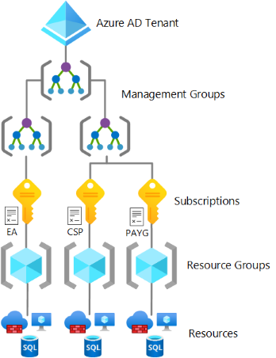
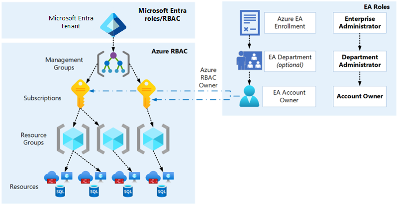

# Enterprise Agreement enrollment and Azure Active Directory tenants

The Azure service presents a range of [active subscription offers](https://azure.microsoft.com/support/legal/offer-details/), and customers can use these offers at the same time to gain flexible billing options. Example subscriptions include Enterprise Agreement Support, Microsoft Customer Agreement, Cloud Service Provider, and others.

Enterprise-scale architecture supports subscriptions from any Azure offer. Subscriptions should exist within one Azure Active Directory (Azure AD) tenant to then move into the management group hierarchy within that tenant. Then, you can manage them using the various controls with enterprise-scale platforms like Azure Policy and role-based access control (RBAC).

> [!NOTE]
> Enterprise-scale architecture is only scoped and deployed to one Azure AD tenant; however, billing options can span across multiple Azure AD tenants. For example, an Enterprise Agreement enrollment supports Azure subscriptions across different Azure AD tenants.

## Plan for Enterprise Agreement enrollment

Enterprise Agreement enrollment represents the commercial relationship between Microsoft and how your organization uses Azure. It provides billing foundation for your subscriptions and how your digital estate is administered. The [Azure enterprise portal](https://ea.azure.com) helps you to manage your Enterprise Agreement enrollment. An enrollment often represents an organization's hierarchy, including departments, accounts, and subscriptions. This hierarchy represents cost centers within an organization.

- Departments help to segment costs into logical groupings and set a budget or quota at the department level. The quota isn't firmly enforced. It's used for reporting purposes.

- Accounts are organizational units in the Azure enterprise portal. You  can use them to manage subscriptions and access reports.

- Subscriptions are the smallest units in the Azure enterprise portal. They're containers for Azure services that are managed by a service administrator. Your organization deploys Azure services within a subscription.

- [Enterprise Agreement enrollment roles](/azure/cost-management-billing/manage/understand-ea-roles#enterprise-user-roles) link users with their functional role. These roles are:

  - Enterprise administrator
  - Department administrator
  - Account owner
  - Service administrator
  - Notification contact

### How an Enterprise Agreement enrollment relates to Azure AD and Azure RBAC

When your organization uses an Enterprise Agreement enrollment for Azure subscriptions, it's important to understand the various authentication and authorization boundaries and the relationship between these boundaries.

There's an inherent trust relationship between Azure subscriptions and an Azure AD tenant, described further in [Associate or add an Azure subscription to your Azure AD tenant](/azure/active-directory/fundamentals/active-directory-how-subscriptions-associated-directory). An Enterprise Agreement enrollment can also use an Azure AD tenant as an identity provider, depending on the [authentication level](/azure/cost-management-billing/manage/ea-portal-troubleshoot#authentication-level-types) set on the enrollment and which option was selected when the enrollment account owner was created. However, apart from the account owner, Enterprise Agreement enrollment roles don't provide access to Azure AD or the Azure subscriptions within that enrollment.

For example, a finance user is granted an enterprise administrator role on the Enterprise Agreement enrollment. They're a standard user without elevated permissions or roles assigned to them in Azure AD or on any Azure management group, subscription, resource group, or resource. The finance user can only perform the roles listed at [Managing Azure Enterprise Agreement roles](/azure/cost-management-billing/manage/understand-ea-roles#enterprise-administrator) and can't access the Azure subscriptions on the enrollment. The only Enterprise Agreement role with access to Azure subscriptions is the account owner because this permission was granted when the subscription was created.

**Design considerations:**

- The enrollment provides a hierarchical organizational structure to govern how subscriptions are managed. See [Managing Azure Enterprise Agreement roles](/azure/cost-management-billing/manage/understand-ea-roles#azure-enterprise-portal-hierarchy).

- A range of administrators can be assigned to a single enrollment.

- Each subscription should have a chosen account owner.

- Each account owner is a subscription owner for any subscriptions provisioned under that account.

- A subscription can belong to only one account at a time.

- A specific set of criteria can be used to determine if a subscription should be suspended.

- Departments and accounts can filter enrollment billing and usage reports.

- Review [Programmatically create Azure Enterprise Agreement subscriptions with the latest APIs](/azure/cost-management-billing/manage/programmatically-create-subscription-enterprise-agreement?tabs=rest#limitations-of-azure-enterprise-subscription-creation-api) for more information about Enterprise Agreement subscription limitations.

**Design recommendations:**

- Only use the authentication type `Work or school account` for all account types. Avoid using the `Microsoft account (MSA)` account type.

- Set up a Notification Contact email address to ensure notifications are sent to an appropriate group mailbox.

- Use departments and accounts to map your organization's structure to your enrollment hierarchy, which can help with separating billing. (An organization can have various structures, including functional, divisional, geographic, matrix, or team structures).

- Use [Azure Cost Management](/azure/cost-management-billing/cost-management-billing-overview) reports and views, which can use Azure metadata like tags and location to explore and analyze your organization's costs.

- Restrict and minimize the number of account owners within the enrollment to limit administrator access to subscriptions and associated Azure resources.

- Assign a budget for each department and account, and establish an alert associated with the budget.

- Create a new department for IT if business domains have independent IT capabilities.

- If you use multiple Azure AD tenants, verify that the account owner is associated with the same tenant as where subscriptions for the account are provisioned.

- For development/testing (dev/test) workloads, use the [Enterprise Dev/Test](/azure/cost-management-billing/manage/ea-portal-administration#enterprise-devtest-offer) offer, where available. Ensure you follow the [terms of use](https://azure.microsoft.com/offers/ms-azr-0148p/).

- Don't ignore notification emails sent to the notification account email address. Microsoft sends important Enterprise Agreement prompts to this account.

- Don't move or rename an Enterprise Agreement account in Azure AD.

- Periodically audit the Azure enterprise portal to review who has access, and when possible, avoid using a Microsoft account.

- [Enable both **DA View Charges** and **AO View Charges** on every Enterprise Agreement enrollment](/azure/cost-management-billing/costs/assign-access-acm-data#enable-access-to-costs-in-the-azure-portal) to allow users with the correct permissions to view Azure cost management data.

## Plan for the Microsoft Customer Agreement service

The [Microsoft Customer Agreement](https://www.microsoft.com/licensing/how-to-buy/microsoft-customer-agreement) is a recent and modern Azure service and commerce platform. It represents the commercial relationship between Microsoft and how your organization uses Azure. The agreement enables a streamlined, electronic transaction in an 11-page agreement that doesn't expire. It provides a billing foundation for your subscriptions and affects how your digital estate is administered. You can manage your agreement in the [Azure portal](https://portal.azure.com).

The Microsoft Customer Agreement often represents an organization's hierarchy, which consists of billing profiles, invoice sections, and subscriptions. This hierarchy represents cost centers within an organization.

> [!IMPORTANT]
> If migrating from an Enterprise Agreement to a Microsoft Customer Agreement, please review the following articles:
>
> - [Complete Enterprise Agreement tasks in your billing account for a Microsoft Customer Agreement](/azure/cost-management-billing/manage/mca-enterprise-operations)
> - [Set up your billing account for a Microsoft Customer Agreement](/azure/cost-management-billing/manage/mca-setup-account)

**Design considerations:**

- The agreement provides a hierarchical organizational structure to govern how subscriptions are managed. See [Organize costs by customizing your billing account](/azure/cost-management-billing/manage/mca-section-invoice).

- An agreement billing account is managed by a single Azure AD tenant. However, subscriptions across different Azure AD tenants are supported by a single agreement. See [How tenants and subscriptions relate to billing account](/azure/cost-management-billing/microsoft-customer-agreement/manage-tenants#how-tenants-and-subscriptions-relate-to-billing-account) and [Manage subscriptions under multiple tenants in a single Microsoft Customer Agreement](/azure/cost-management-billing/microsoft-customer-agreement/manage-tenants#manage-subscriptions-under-multiple-tenants-in-a-single-microsoft-customer-agreement).

- New Azure subscriptions provisioned with an agreement are associated with the Azure AD tenant in which the agreement billing account is located.

- Agreements use the RBAC model. Multiple users can be assigned with the required roles at the same scopes (for example, billing account, billing profile, and invoice section). These billing roles and assignments are outside of standard Azure RBAC roles and assignments. They can't be assigned at a management group or resource group scope.

- A subscription can belong to only one invoice section at any time. Subscriptions can only be moved between invoice sections within the same billing profile.

- An optional purchase order number can be set up on a billing profile.

- A specific set of criteria can be used to determine if a subscription should be suspended.

- Before you provision more billing profiles, [review the potential impact to charges and reservations](/azure/cost-management-billing/manage/mca-section-invoice#things-to-consider-when-adding-new-billing-profiles).

**Design recommendations:**

- Set up a Notification Contact email address on the agreement billing account to ensure notifications are sent to an appropriate group mailbox.

- Assign a budget for each invoice section or billing profile, and establish an alert associated with the budget.

- Use organizational structures to map your organization to your agreement hierarchy. Invoice sections are suitable for most scenarios. (An organization can have various structures, such as functional, divisional, geographic, matrix, or team).

- Use [Azure Cost Management](/azure/cost-management-billing/cost-management-billing-overview) reports and views, which explore and analyze your organization's costs with Azure metadata.

- If your business domain has independent IT capabilities, create a new invoice section for IT.

- Don't ignore notifications sent to the Contact email address. Microsoft sends important prompts to this address.

- Periodically audit the agreement billing RBAC role assignments to review who has access.

- For development/testing (dev/test) workloads, use the [Enterprise Dev/Test](/azure/cost-management-billing/manage/ea-portal-administration#enterprise-devtest-offer) offer, where available. Ensure you follow the [terms of use](https://azure.microsoft.com/offers/ms-azr-0148p/).

## Plan for the Cloud Solution Provider service

The Cloud Solution Provider (CSP) service gives Microsoft partners access to Microsoft cloud services within one platform. It supports partners to:

- Own the customer lifecycle and end-to-end relationship
- Set pricing, terms, and directly bill customers
- Directly provision and manage subscriptions
- Attach services that add value
- Be the customer's first point of contact for support

[Azure in CSP](https://azure.microsoft.com/offers/ms-azr-0145p/) is an Azure plan with various subscriptions that are hosted by the partner's [Microsoft Partner Agreement (MPA)](/azure/cost-management-billing/understand/mpa-overview). The MPA is similar to the Microsoft Customer Agreement. Both are hosted on the modern commerce platform and use a [simplified purchase agreement](https://www.microsoft.com/licensing/docs/customeragreement).

> [!IMPORTANT]
> The partner CSP completely manages an MPA.

**Design considerations:**

- A [CSP reseller relationship](/partner-center/request-a-relationship-with-a-customer) must exist between the partner and each Azure AD tenant for which the customer wants to provision a new Azure plan and CSP subscriptions.

- Only the partner can provision an Azure plan and CSP subscriptions.

- A specific set of criteria can be used to determine if a subscription should be suspended. A partner can also suspend a subscription.

- The partner can allow customers to view their Azure usage fees on a per customer basis. For more information, see [Enable the policy to view Azure usage charges](/azure/cost-management-billing/costs/get-started-partners#enable-the-policy-to-view-azure-usage-charges). Partners can also use other tools to provide customers with access to their charges.

- By default, the partner Azure reservations can only be purchased by the partner for their customer. However, the [**Customer Permissions** feature](/partner-center/give-customers-permission) grants customers permission to purchase Azure reservations from their CSP.

**Design recommendations:**

- Work with your CSP partner to ensure that Azure Lighthouse is used for *administer on behalf of (AOBO)* access for most support scenarios. See [Azure Lighthouse and the Cloud Solution Provider program](/azure/lighthouse/concepts/cloud-solution-provider).

- Work with your CSP partner to understand how to create support cases and escalation processes.

- Discuss how to create self-service subscriptions with your CSP partner.

- Use [Azure Cost Management](/azure/cost-management-billing/cost-management-billing-overview) reports and views, which can use Azure metadata like tags and location to explore and analyze your organization's costs.

## Define Azure AD tenants

An Azure AD tenant provides identity and access management, which is an important part of your security posture. An Azure AD tenant ensures that authenticated and authorized users only access the resources to which they have permissions. Azure AD provides these services to applications and services deployed in and outside of Azure (such as on-premises or third-party cloud providers).

Azure AD is also used by software as a service (SaaS) applications such as Microsoft 365 and Azure Marketplace. Organizations already using on-premises AD can integrate it with their current infrastructure and extend cloud authentication. Each Azure AD directory has one or more domains. A directory can have many subscriptions associated with it but only one Azure AD tenant.

Ask basic security questions during the Azure AD design phase, such as how your organization manages credentials and how it controls human, application, and programmatic access.

**Design considerations:**

- Multiple Azure AD tenants can function in the same enrollment.
- Azure Lighthouse only supports delegation at the subscription and resource group scopes.

**Design recommendations:**

- Base using Azure single sign-on on the selected [planning topology](/azure/active-directory/hybrid/plan-connect-topologies).

- If your organization doesn't have an identity infrastructure, start by implementing an Azure-AD-only identity deployment. Deployment with [Azure AD Domain Services](/azure/active-directory-domain-services/) and [Microsoft Enterprise Mobility + Security](/mem/intune/fundamentals/what-is-intune) provides end-to-end protection for SaaS applications, enterprise applications, and devices.

- [Azure AD multifactor authentication](/azure/active-directory/authentication/concept-mfa-howitworks) provides another layer of security and authentication. For more security, also enforce [conditional access policies](/azure/active-directory/conditional-access/overview) for all privileged accounts.

- Plan for [emergency access](/azure/active-directory/roles/security-emergency-access) or break-glass accounts to prevent tenant-wide account lockout.

- Use [Azure AD Privileged Identity Management](/azure/active-directory/privileged-identity-management/pim-configure) to manage identities and access.

- Avoid creating multiple Azure AD tenants. For more information, see [Testing approach for enterprise scale](./testing-approach.md) and [Cloud Adoption Framework Azure best practices guidance to standardize on a single directory and identity](../../secure/security-top-10.md#9-architecture-standardize-on-a-single-directory-and-identity).

- Use [Azure Lighthouse](/azure/lighthouse/overview) to grant third parties and partners access to Azure resources in customer Azure AD tenants and centralized access to Azure resources in multitenant Azure AD architectures.

## Next steps

[Identity and access management](./identity-and-access-management.md)
