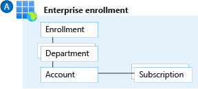

# Enterprise Agreement enrollment and Azure Active Directory tenants

## Plan for enterprise enrollment

An Enterprise Agreement (EA) enrollment represents the commercial relationship between Microsoft and how your organization uses Azure. It provides the basis for billing across all your subscriptions and affects administration of your digital estate. Your EA enrollment is managed via the Azure EA portal. An enrollment often represents an organization's hierarchy, which includes departments, accounts, and subscriptions. This hierarchy represents cost-enrollment groups within an organization.

*Figure 1: An Azure EA enrollment hierarchy.*

- Departments help to segment costs into logical groupings and to set a budget or quota at the department level. The quota isn't enforced firmly and is used for reporting purposes.
- Accounts are organizational units in the Azure EA portal. They can be used to manage subscriptions and access reports.
- Subscriptions are the smallest unit in the Azure EA portal. They're containers for Azure services managed by the Service Administrator. They're where your organization deploys Azure services.
- EA enrollment roles link users with their functional role. These roles are:
  - Enterprise Administrator
  - Department Administrator
  - Account Owner
  - Service Administrator
  - Notification Contact

**Design considerations:**

- The enrollment provides a hierarchical organizational structure to govern the management of subscriptions.
- Multiple environments can be separated at an EA-account level to support holistic isolation.
- There can be multiple administrators appointed to a single enrollment.
- Each subscription must have an associated Account Owner.
- Each Account Owner will be made a subscription owner for any subscriptions provisioned under that account.
- A subscription can belong to only one account at any given time.
- A subscription can be suspended based on a specified set of criteria.

**Design recommendations:**

- Only use the authentication type `Work or school account` for all account types. Avoid using the `Microsoft account (MSA)` account type.
- Set up the Notification Contact email address to ensure notifications are sent to an appropriate group mailbox.
- Assign a budget for each account, and establish an alert associated with the budget.
- An organization can have a variety of structures, such as functional, divisional, geographic, matrix, or team structure. Use organizational structure to map your organization structure to your enrollment hierarchy.
- Create a new department for IT if business domains have independent IT capabilities.
- Restrict and minimize the number of account owners within the enrollment to avoid the proliferation of admin access to subscriptions and associated Azure resources.
- If multiple Azure Active Directory (Azure AD) tenants are used, verify that the Account Owner is associated with the same tenant as where subscriptions for the account are provisioned.
- Set up Enterprise Dev/Test and production environments at an EA account level to support holistic isolation.
- Don't ignore notification emails sent to the notification account email address. Microsoft sends important EA-wide communications to this account.
- Don't move or rename an EA account in Azure AD.
- Periodically audit the EA portal to review who has access and avoid using a Microsoft account where possible.

## Define Azure AD tenants

An Azure AD tenant provides identity and access management, which is an important part of your security posture. An Azure AD tenant ensures that authenticated and authorized users have access to only the resources for which they have access permissions. Azure AD provides these services to applications and services deployed in Azure and also to services and applications deployed outside of Azure (such as on-premises or third-party cloud providers).

Azure AD is also used by software as a service applications such as Microsoft 365 and Azure Marketplace. Organizations already using on-premises Active Directory can use their existing infrastructure and extend authentication to the cloud by integrating with Azure AD. Each Azure AD directory has one or more domains. A directory can have many subscriptions associated with it but only one Azure AD tenant.

Ask basic security questions during the Azure AD design phase, such as how your organization manages credentials and how it controls human, application, and programmatic access.

**Design considerations:**

- Multiple Azure AD tenants can function in the same enrollment.

**Design recommendations:**

- Use Azure AD seamless single sign-on based on the selected [planning topology](/azure/active-directory/hybrid/plan-connect-topologies).
- If your organization doesn't have an identity infrastructure, start by implementing an Azure-AD-only identity deployment. Such deployment with [Azure AD Domain Services](/azure/active-directory-domain-services) and [Microsoft Enterprise Mobility + Security](/mem/intune/fundamentals/what-is-intune) provides end-to-end protection for SaaS applications, enterprise applications, and devices.
- Multi-factor authentication provides another layer of security and a second barrier of authentication. Enforce [multi-factor authentication](/azure/active-directory/authentication/concept-mfa-howitworks) and [conditional access policies](/azure/active-directory/conditional-access/overview) for all privileged accounts for greater security.
- Plan and implement for [emergency access](/azure/active-directory/users-groups-roles/directory-emergency-access) or break-glass accounts to prevent tenant-wide account lockout.
- Use [Azure AD Privileged Identity Management](/azure/active-directory/privileged-identity-management/pim-configure) for identity and access management.
- Avoid creating multiple Azure AD Tenants as per the guidance in [Testing approach for enterprise scale](./testing-approach.md) and [Cloud Adoption Framework Azure best practices guidance to standardize on a single directory and identity](../../secure/security-top-10.md#9-architecture-standardize-on-a-single-directory-and-identity).