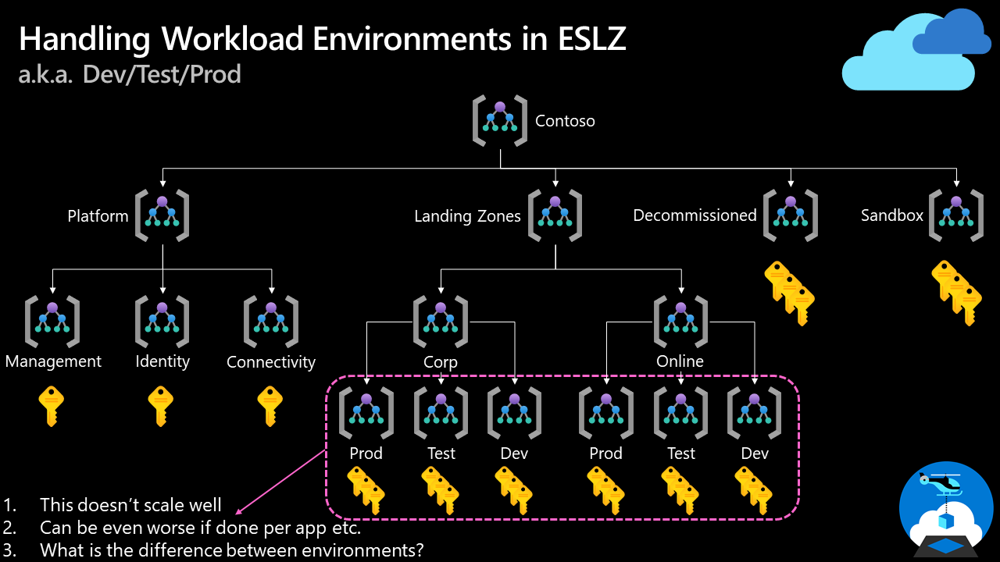
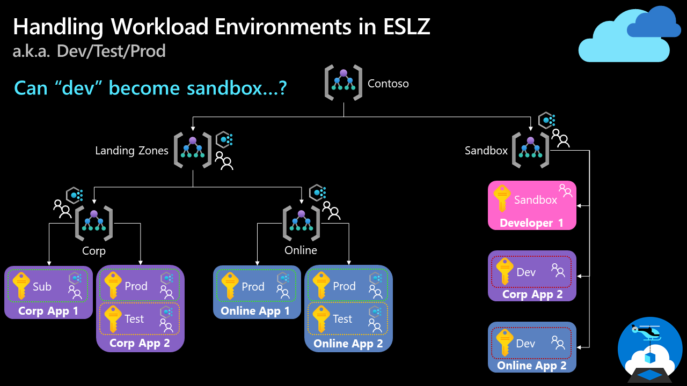

# Enterprise-scale FAQ

This article answers frequently asked questions relating to Enterprise-scale.

<!-- GENERAL -->

## Whats is the Azure Landing Zone Accelerator?

The Azure Landing Zone Accelerator is an Azure portal based deployment experience that will deploy the [Azure landing zone conceptual architecture](/azure/cloud-adoption-framework/ready/landing-zone/#azure-landing-zone-conceptual-architecture).

## What is the Azure Landing Zone Conceptual Architecture?

The Azure landing zone conceptual architecture is the new name for Enterprise-scale. The conceptual architecture represents scale and maturity decisions based on a wealth of lessons learned and feedback from customers who have adopted Azure as part of their digital estate, in which we provide prescriptive guidance and recommendations for your implementation.

## What does a "Landing Zone" map to in Azure in the context of Enterprise-scale?

From an Enterprise-Scale point of view, "Landing Zones" are individual Azure Subscriptions.

## How long does Enterprise-scale take to deploy?

This is dependant on the options you select during the implementation experience. However, it will vary from around 5 minutes to 40 minutes; depending on the options selected.

For example:

- Deploying the conceptual architecture **without** any networking/connectivity options will take around 5 minutes to deploy.
- Deploying the conceptual architecture **with** the hub and spoke networking options, including VPN and ExpressRoute gateways, will take around 40 minutes to deploy.

## Why are there custom policy definitions as part of Enterprise-scale?

We work with, and learn from our customers and partners, this ensures that we evolve and enhance the reference implementations to meet customers and partners requirements. As part of this interaction with our customers and partners we may notice a policy that is required that is not available from the built-in definitions yet, so we will create and test a definition to meet the requirement and include it in Enterprise-scale for everyone to use.

We then work with the Azure Policy and associated product/service engineering teams to convert the custom policy that has been created into a built-in definition over time.

## What does policy-driven governance mean, and how does it work?

Policy-driven governance is one of the key design principles of Enterprise-scale, as documented [here.](/azure/cloud-adoption-framework/ready/enterprise-scale/design-principles#policy-driven-governance)

Policy-driven governance, in short, means utilizing Azure Policy to reduce the time taken to perform common and repeated operational tasks across your Azure Tenant. This can be achieved using most of the [Azure Policy effects](/azure/governance/policy/concepts/effects) apart from: `Audit`, `Disabled` and `AuditIfNotExists` (this is because they do not prevent or take actions, only audit and report on non-compliance). Where as the effects: `Append`, `Deny`, `DeployIfNotExists` and `Modify` either prevent non-compliance by restricting those resources that are non-compliant, as defined by the policy, from being created or updated; or actually deploy resources or amend/modify settings of the resource creation or update request to make them compliant automatically.

Some examples of policy-driven governance are:

- Preventing Subnets from being created or updated to have no Network Security Groups associated to them - Using the `Deny` policy effect

- A new subscription (landing zone) is created and placed into a Management Group within your Enterprise-scale deployment. Azure Policy will then ensure that Azure Defender (previously known as Azure Security Center Standard) is enabled on the Subscription, the Diagnostic Settings for the Activity Log is configured to send its logs to the Log Analytics Workspace in the Management Subscription. - Using the `DeployIfNotExists` policy effect
  - Instead of repeating code or manual activities when a new Subscription is created the `DeployIfNotExists` policy automatically deploys and configures these for you consistently and effortlessly.

## Should we use Azure Policy for deploying workloads?

In short, **no**. Azure Policy should be used to control, govern and keep your workloads and landing zones compliant. It is not designed, nor suited, to deploying entire workloads and other tooling like the Azure Portal or infrastructure-as-code offerings (ARM Templates, Bicep, Terraform etc.) should be used by landing zones owners to deploy and manage their workload as they see fit; giving them the autonomy they need.

## What if we already have resources in our Landing Zones and later assign Azure Policies that will include them in its scope?

Please review the following documentation sections:

- [Transition existing Azure environments to enterprise-scale - "Policy" section](/azure/cloud-adoption-framework/ready/enterprise-scale/transition#policy)
- [Quickstart: Create a policy assignment to identify non-compliant resources - "Identify non-compliant resources"
 section](/azure/governance/policy/assign-policy-portal#identify-non-compliant-resources)

## Where can I see the policies used by Enterprise-Scale Landing Zones reference implementation?

We maintain a list of policies here: [Policies included in Enterprise-Scale Landing Zones reference implementations](https://github.com/Azure/Enterprise-Scale/blob/main/docs/ESLZ-Policies.md)

We will also add changes to our [What's New? wiki page](https://github.com/Azure/Enterprise-Scale/wiki/Whats-new).

<!-- IMPLEMENTATION -->

## Why does Enterprise-scale implementation require permission at Tenant root '/' scope?

Management Group creation, Subscription creation, and placing Subscriptions into Management Groups are APIs that operate at the tenant root "`/`" scope.

Therefore, to create the Management Group hierarchy, the Subscriptions, and place them into the Management Groups defined, the initial deployment must  be invoked at the tenant root "`/`" scope. Once you have deployed Enterprise-scale, you can remove the Owner permission from the tenant root "`/`" scope, as you will be made an Owner at the intermediate root Management Group (e.g. "Contoso"), by the Azure platform, that Enterprise-scale has created.

For further guidance on tenant level deployments in Azure, see: [Deploy resources to tenant](/azure/azure-resource-manager/templates/deploy-to-tenant)

## The Azure Landing Zone Accelerator portal based deployment does not display all Subscriptions in the drop-down lists?

When deploying Azure Landing Zone Accelerator portal based experience, the portal is creating the list of Subscriptions to be selected for deployment of the platform Subscriptions (management, connectivity, identity), as well as the landing zones (corp and online). When there are more than 50 Subscriptions, the API the portal calls upon to generate the list of Subscriptions cannot display all Subscriptions in the drop-down lists. To workaround this, perform the following steps:

1. Go through the Azure Landing Zone Accelerator portal based experience as you would normally and select/enable all the options that you desire. When you get to the Subscription drop-downs, select any visible Subscription as a placeholder to view and select/enable all options (some options have dependency on a Subscription being selected before they are displayed).
2. Once you have gone through all the pages/blades, go back to the ‘basics’ page/blade, and click on ‘edit parameters’.
3. Change the value for the specific `subscriptionId` parameter inputs with the actual Subscription IDs you wish to use.
4. Click 'Save'.
5. Click 'Review + create', and submit the deployment.

## Can we use and customize the ARM templates for Enterprise-scale and check them into our repository and deploy it from there instead of the Azure Landing Zone Accelerator portal based experience?

All of the ARM templates for the Enterprise-Scale are developed for, and optimized for the Azure Landing Zone Accelerator portal based experience. Therefore we do not recommend nor support customization of these templates, as they are complex. Based on all of the options we provide for the Azure Landing Zone Accelerator portal based experience, this requires a lot of logical operators and conditions used in the ARM template expressions to handle all of these options and variations. Also there is a specific order that the various ARM deployments (nested templates) must be deployed in to accomplish a successful deployment.

Finally, taking the same templates for day 2 and onwards operations, will require you to re-deploy to the entire tenant for any change, and also require permanent Owner RBAC assignment on the tenant root "`/`" scope.

However, if you wish to deploy and manage Enterprise-scale via infrastructure-as-code, please see the question: [What if we don't want to deploy using the Azure Landing Zone Accelerator portal based experience, but want to deploy via infrastructure-as-code?](#what-if-we-cannot-deploy-using-the-azure-landing-zone-accelerator-portal-based-experience-but-can-deploy-via-infrastructure-as-code)

## What if we cannot deploy using the Azure Landing Zone Accelerator portal based experience, but can deploy via infrastructure-as-code?

We have a number of implementation options available using infrastructure-as-code:

- The [Azure Landing Zone Accelerator](/azure/cloud-adoption-framework/ready/landing-zone/#azure-landing-zone-accelerator) portal based experience
  - This can, optionally, integrate and bootstrap a CI/CD pipeline using GitHub with [AzOps](https://github.com/Azure/AzOps) as documented [here.](https://github.com/Azure/Enterprise-Scale/wiki/Deploying-Enterprise-Scale)
- The [Enterprise-scale Do-It-Yourself (DIY) ARM templates](https://github.com/Azure/Enterprise-Scale/tree/main/eslzArm#enterprise-scale-landing-zones-arm-templates) method
- The [Terraform Module for Cloud Adoption Framework Enterprise-scale](https://github.com/Azure/terraform-azurerm-caf-enterprise-scale#terraform-module-for-cloud-adoption-framework-enterprise-scale)

>[!NOTE]
> The Bicep implementation option for Enterprise-scale is coming soon!

## What if we have already deployed Enterprise-scale without using infrastructure-as-code, do we have to delete everything and start again to use infrastructure-as-code?

Assuming you have used the Azure Landing Zone Accelerator portal based experience to deploy Enterprise-scale into your Azure Tenant. This will depend on the infrastructure-as-code tooling you wish to use going forward. See the below guidance depending on the infrastructure-as-code tooling you wish to use:

### ARM Templates

If you wish to use ARM templates to deploy, manage and operate your Enterprise-scale deployment then you do not have to delete everything and start again. You can simply configure and connect up our [AzOps](https://github.com/Azure/AzOps) tooling, using the [AzOps Accelerator](https://github.com/Azure/AzOps-Accelerator) and associated instructions, regardless of the stage/state your Azure Tenant is at.

Once configured AzOps, vis the pipelines deployed, will connect to your Azure Tenant, scan it and then pull down individual ARM templates into your repository into a structure that represents the [4 Azure scopes](/azure/azure-resource-manager/management/overview#understand-scope).

To see a demo of AzOps being used, checkout this YouTube video on the Microsoft DevRadio channel: [Enterprise Scale Landing Zones DevOps and Automation Step by Step](https://www.youtube.com/watch?v=wWLxxj-uMsY)

### Bicep

Today the [AzOps](https://github.com/Azure/AzOps) tooling supports deploying Bicep files at the [4 Azure scopes](/azure/azure-resource-manager/management/overview#understand-scope), however it's pull process will only store the scan of your Azure Tenants resources in ARM templates (that utilizes JSON).

Please leave us feedback, [via GitHub issues, on the AzOps repository](https://github.com/Azure/AzOps/issues) if this is something you would like to see add to AzOps.

### Terraform

As Terraform builds its own [state](https://www.terraform.io/docs/language/state/index.html) file to track the resources, and the configuration of these, to know what it manages as part of your Terraform code; if you have already deployed Enterprise-scale to your Azure Tenant then you must [import](https://www.terraform.io/docs/cli/import/index.html) each resource into the state file, before you can deploy, manage and operate your Enterprise-scale deployment via Terraform.

As of today Terraform import is done on a per resource basis and can be time consuming and complex to do at scale. Therefore it is generally easier to delete and redeploy via Terraform than to import everything that has been deployed by the Azure Landing Zone Accelerator portal based experience.

However, must customers are aware from the start that they would like to use Terraform to manage their Azure Tenant and therefore this is a fairly uncommon scenario.

To deploy Enterprise-scale using Terraform you may wish to utilise the Terraform module we have provided that deploys everything the Azure Landing Zone Accelerator portal based experience does. The module is called [Terraform Module for Cloud Adoption Framework Enterprise-scale](https://registry.terraform.io/modules/Azure/caf-enterprise-scale/azurerm/0.0.4-preview) and is available from the Terraform Registry.

To see a demo of AzOps being used, checkout this YouTube video on the Microsoft DevRadio channel: [Terraform Module for Cloud Adoption Framework Enterprise-scale Walkthrough](https://www.youtube.com/watch?v=5pJxM1O4bys)

## How should we handle "dev/test/production" workload Landing Zones in Enterprise-scale?

>[!NOTE]
> This is for workload Landing Zones only. For testing and environment segregation for the Enterprise-scale platform itself please review the [Testing approach for enterprise-scale.](/azure/cloud-adoption-framework/ready/enterprise-scale/testing-approach)

If an application or service workload requires segregation of "dev/test/production" then this should be done via separate Subscriptions for each of these per workload. However, it is important to work with the application or service workload owners to determine if this is the best way for them to build, manage, operate and deliver their workload and should not be mandatory for all workloads.

A good example of this is a workload that uses [Azure App Service](/azure/app-service/overview). When using Azure App Service a [best practice](/azure/app-service/deploy-best-practices#use-deployment-slots) is to use [Deployment Slots](/azure/app-service/deploy-staging-slots) to help you manage changes and/or updates to the web app. However, this feature can only be used on the same app on an App Service Plan, which can only live within a single Subscription. So by mandating or enforcing your application/service workloads owners to use separate Subscriptions for "dev/test/production" you may actually restrict and make their deployment lifecycle harder to manage. In this example a single Subscription for the application/service workload may be the best fit and using RBAC and optionally with [Privileged Identity Management](/azure/active-directory/privileged-identity-management/pim-configure) at the Resource Group scope within the single Subscription for increased security.

Instead we suggest working with each application/service workload team (landing zone owners) to understand the requirements and then provide the required amount of Subscriptions based on their requirements and plans. You may also decide to build "product lines" for different styles/types of workloads so that you can build Subscription vending/creation processes and tooling easily based on common requirements from application/service workload teams.

### What about our Management Group hierarchy?

Great question! What we want to avoid with Enterprise-scale are complicated and volatile Management Group hierarchies that require constant amendment and also don't scale efficiently whilst providing no added value to configuring them. This is why in Enterprise-scale, Management Groups are workload archetype aligned. Refer to the [Management group and subscription organization](/azure/cloud-adoption-framework/ready/enterprise-scale/management-group-and-subscription-organization) for further information.

By this we mean that Management Groups are only created for differing workload archetypes. For example, beneath the "Landing Zones" Management Group in the conceptual architecture we have a "Corp" and "Online" child Management Groups. These both align to two distinct archetype patterns for the workloads they will hold, mainly focussed around hybrid connectivity (VPN/ExpressRoute) requirements (internal only vs public facing applications/services). But all environments ("dev/test/production"), whether split across separate Subscriptions or in a single Subscription, will all be held within the same single Management Group ("Corp" or "Online") depending on its archetype and requirements.

Scaling, and also management of this scale, is something that the following equation helps to highlight why Management Groups per environment and/or per workload doesn't scale well:

- If you have 30 different workloads that each require a Management Group and a child Management Group for "dev/test/production" you are left with the following equation:
  - **30** (no. of workloads) X **4** (no. of Management Groups per workload) = **120** Management Groups
    - *N apps X (N+3) = Total Management Groups*

#### Example of a Sub-Optimal Management Group Hierarchy

To summarize there should be no difference in policies applied between "dev/test/production" environments as all should develop and be built to production standard from the start. There is little value of having to change the configuration of a workload as it is promoted through the different environments and this will only make for a poor development experience for Landing Zone users and owners. You should also consider utilizing "Sandbox" subscriptions for true development purposes where a less restricted environment is required; for example when a application/service workload team are trying out different Azure services to see what works best to deliver their requirements. Once the services are known a Landing Zone, in the correct workload archetype aligned Management Group beneath the "Landing Zones" Management Group hierarchy, can be provisioned for the team.

A common challenge to this approach is that you may require some policies to apply differently, depending on the environment. For this you have a few options:

1. Utilize tags in your policy definitions to help filter and apply to the correct environment.
    >[!IMPORTANT]
    > Tags can be changed by users with appropriate RBAC permissions, therefore for security focussed policies it is advised not to use tags in policies as user could change the tags on a resource and potentially bypass or have another policy apply to the resources.

2. Apply policies at a Subscription level as required, ideally during the Subscription creation/vending process (as talked about above).
3. For policies that are put implemented to help keep costs controlled (e.g. restrict certain VM SKUs from being used) consider applying these at a Subscription level where required, as per point 2. Or take the approach to make costs a responsibility of the Landing Zone owners as defined in the critical design area: [Platform automation and DevOps](/azure/cloud-adoption-framework/ready/enterprise-scale/platform-automation-and-devops#define-central-and-federated-responsibilities), enabling true autonomy.
4. Utilize sandbox Subscriptions for true development activities, as the sandboxes will have a less restrictive policy set applied.

#### Example of a Optimal Management Group Hierarchy Aligned to Enterprise-Scale

*Some Management Groups have been removed for illustration clarity purposes.*

>[!NOTE]
> We discussed this topic in our Enterprise-scale community call in August 2021. You can find the recording on [YouTube here.](https://youtu.be/Zx_gHevekm0?t=1954)

## How do we enable additional Azure Regions when using Enterprise-scale?

Coming soon! In progress and will be added to this PR.
