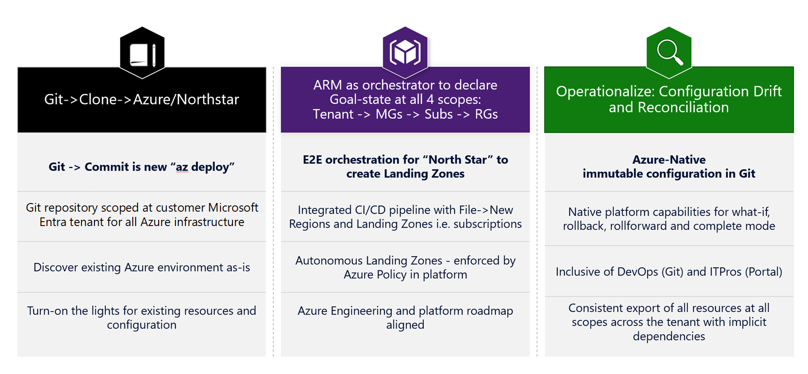

# Design objectives

Enterprise-scale reference implementation is rooted in the principle that everything in Azure is a resource. To operate at scale, it should be managed declaratively to determine the target goal state of the overall platform.

With this principle, this reference implementation has following three tenets:

_Figure 1: Enterprise agreement enrollment_

Git -> Clone -> Azure/enterprise-scale: provide the Git repository (repo) for Azure platform configuration. The Git -> Clone or Git -> Fork (preferred) metaphor references that this repo will provide everything that must be true for enterprise-scale—that customers can use as-is in their own environment.

### Discovery

Before starting enterprise-scale journey, it is important for customers to discover existing configuration in Azure that can serve as platform baseline. Consequence of not discovering existing environment will be no reference point to roll back or forward after deployment.
Discovery is also important for organizations, who are starting their DevOps and infrastructure-as-code (IAC) journey, as this can provide crucial on-ramp path to allow transitioning without starting all-over.

For the purpose of discovery, following resources are considered within the overall scope of the Azure platform. This will initialize an empty Git repo with the current configuration to baseline configuration, encompassing the following:

<!-- docsTest:disable TODO -->

- Management Group hierarchy and Subscription organization
  - ResourceTypes:
    - Microsoft.Management/managementGroups
    - Microsoft.Management/managementGroups/subscriptions
    - Microsoft.Subscription/subscriptions
- Policy Definition and Policy Assignment for Governance
  - ResourceTypes:
    - Microsoft.Authorization/policyDefinitions
    - Microsoft.Authorization/policyAssignments
- Role Definition and Role Assignment
  - ResourceTypes:
    - Microsoft.Authorization/roleDefinitions
    - Microsoft.Authorization/roleAssignments

<!-- docsTest:enable TODO -->

We will default to platform schema to represent these configurations in Git. This means calling Azure APIs using PowerShell.

### Deployment

An IAC repo will have hundreds if not thousands of configuration artifacts that are tracked and version-controlled. Platform developers will be modifying small subsets of these artifacts on an ongoing basis via pull requests (PRs). As Git represents source of the truth and change, we'll use Git to determine differential changes in each PR and trigger subsequent deployment action in Azure only for the artifacts that are changed instead of triggering full deployment for all.

### Definition of done

- Discover the current Azure environment as-is and have entire Azure platform baseline stored inside the Git repo.
- Deploy templates to Azure environment using pipeline by committing templates at appropriate scope without providing deployment scripts.
- Perform platform operations that are required for enterprise-scale but not yet supported inside Resource Manager (resource provider registration, Azure AD graph operations, and more). In the interim, these operations should be handled via pipeline.

## Azure Resource Manager as the orchestrator to declare the goal state

Provide tenant-level Resource Manager template to build landing zone using enterprise-scale guidelines.

We will enable security, logging, networking, and any other plumbing needed for landing zones (subscriptions) autonomously via policy enforcement. We will bootstrap Azure environment with Resource Manager templates to create necessary structure for management and networking and to declare desired goal state.

The File -> New -> Landing Zone (subscription) process is Resource Manager orchestrates the following:

- Subscription creation
- Subscriptions move
- Configuring the subscription to desired state by policy enforcement (autonomously)

To start quickly, a [**Resource Manager template**](https://github.com/azure/CET-NorthStar/blob/master/examples/e2e-landing-zone.parameters.json) that can be deployed at the tenant ("/") root scope will be provided to instantiate the enterprise-scale architecture. This template should provide everything that's necessary in [Implementation guide](./implementation-guide.md), and it'll have the following sequence:

- Create a management group hierarchy and subscription organization structure in a 2+n fashion where n represents number of landing zones.
- Create policies (DeployIfNotExists) assigned to management groups and a subscription scope to govern and deploy necessary resources, enabling platform autonomy as new landing zones (subscriptions) are being created by application teams
- Create policy and role assignment to govern and delegate access to resources

_Figure 2: End-to-end Resource Manager deployment_

It is important to note that one of the design principles of enterprise-scale is policy-driven governance, and all necessary resources leading to the creation of landing zones are deployed using policies. For example, deploying Azure Key Vault to store platform-level secret in management subscription. Instead of scripting the template deployment to deploy Key Vault, CAF enterprise-scale-based reference implementation will have a policy definition that deploys the key vault in prescribed manner and policy assignment at management subscription scope. The benefits of a policy-driven approach are many, but the most significant are:

- The platform can provide orchestration to bring target resources (in this case, a subscription) to a desired goal state.
- Continuous conformance ensures that all platform-level resources are compliant. As the platform is aware of the goal state, it can assist by monitoring and remediating resources throughout their lifecycles.
- The platform enables autonomy regardless of the customer's scale point.

## Definition of done

- Invoke a Resource Manager template using PowerShell/Azure CLI for tenant-level deployment to create a landing zone in the Azure environment.
- An end-to-end Resource Manager template must allow flexibility to create requisite management group and subscription hierarchy to organize landing zones.
- The template must allow declaring the goal state at tenant, management group, and subscriptions scopes using policies.
- Export Azure configuration in a manner that can be consumed and imported back into the platform.

## 3. Operationalize the Azure environment at scale for day-to-day activities

In a production environment, changes are bound to happen. Ideally, these changes are made in a structured way and by using the principles of IAC: a change would be made by adding or updating a resource definition in an Azure DevOps or GitHub repo and rely on an automated test and release process to effectuate the change. This gives the IT department a fully transparent change history and full roll-back and roll-forward capabilities.

Manual changes (made, for example, using the Azure portal) may be unavoidable due to urgent operational demands. This leads to configuration drift where the environment described in source control no longer reflects the actual state of the Azure resources. To deal with this situation, enterprise-scale envisions not only a control mechanism to push changes in the IAC source to the Azure environment but also to pull changes made outside IAC back into source control. By having that feedback loop in place, we can ensure that the environment described in source control always reflects the actual state of the Azure subscriptions and that changes made manually are not inadvertently rolled back by the next automated deployment of a resource.

## Definition of done 

Changes made oob (only for platform resources) listed in Section 1 are tracked in Git. Configuration drifts should surface like any other PR for repo owners to interactively (with human intervention) or automatically determine whether to roll changes back or forward based on the repo level policy.