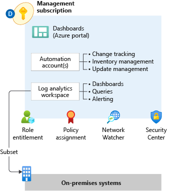

# Management and monitoring

## Plan platform management and monitoring

This section explores how to operationally maintain an Azure enterprise estate with centralized management and monitoring at a platform level. More specifically, it presents key recommendations for central teams to maintain operational visibility within a large-scale Azure platform.

*Figure 1: Platform management and monitoring.*

<!-- cSpell:ignore syslogs SIEM -->

**Design considerations:**

- Use an Azure Monitor Log Analytics workspace as an administrative boundary.
- Application-centric platform monitoring, encompassing both hot and cold telemetry paths for metrics and logs, respectively:
  - Operating system metrics; for example, performance counters and custom metrics
  - Operating system logs; for example, Internet Information Services, Event Tracing for Windows, and syslogs
  - Resource health events
- Security audit logging and achieving a horizontal security lens across your organization's entire Azure estate:
  - Potential integration with on-premises security information and event management (SIEM) systems such as ArcSight or the Onapsis security platform
  - Potential integration with software as a service (SaaS) offerings such as ServiceNow
  - Azure activity logs
  - Azure Active Directory (Azure AD) audit reports
  - Azure diagnostic services, logs, and metrics; Azure Key Vault audit events; network security group (NSG) flow logs; and event logs
  - Azure Monitor, Azure Network Watcher, Azure Security Center, and Azure Sentinel
- Azure data retention thresholds and archiving requirements:
  - The default retention period for Azure Monitor Logs is 30 days, with a maximum of two years.
  - The default retention period for Azure AD reports (premium) is 30 days.
  - The default retention period for the Azure diagnostic service is 90 days.

- Operational requirements:
  - Operational dashboards with native tools such as Azure Monitor Logs or third-party tooling
  - Controlling privileged activities with centralized roles
  - [Managed identities for Azure resources](/azure/active-directory/managed-identities-azure-resources/overview) for access to Azure services
  - Resource locks to protect editing and deleting resources

**Design recommendations:**

- Use a single [monitor logs workspace](/azure/azure-monitor/platform/design-logs-deployment) to manage platforms centrally except where Azure role-based access control (Azure RBAC), data sovereignty requirements and data retention policies mandate separate workspaces. Centralized logging is critical to the visibility required by operations management teams. Logging centralization drives reports about change management, service health, configuration, and most other aspects of IT operations. Converging on a centralized workspace model reduces administrative effort and the chances for gaps in observability.

    In the context of the enterprise-scale architecture, centralized logging is primarily concerned with platform operations. This emphasis doesn't prevent the use of the same workspace for VM-based application logging. With a workspace configured in resource-centric access control mode, granular Azure RBAC is enforced to ensure application teams will only have access to the logs from their resources. In this model, application teams benefit from the use of existing platform infrastructure by reducing their management overhead. For any non-compute resources such as web apps or Azure Cosmos DB databases, application teams can use their own Log Analytics workspaces and configure diagnostics and metrics to be routed here.

- Export logs to Azure Storage if log retention requirements exceed two years. Use immutable storage with a write-once, read-many policy to make data non-erasable and non-modifiable for a user-specified interval.
- Use Azure Policy for access control and compliance reporting. Azure Policy provides the ability to enforce organization-wide settings to ensure consistent policy adherence and fast violation detection. For more information, see [Understand Azure Policy effects](/azure/governance/policy/concepts/effects).
- Monitor in-guest virtual machine (VM) configuration drift using Azure Policy. Enabling [guest configuration](/azure/governance/policy/concepts/guest-configuration) audit capabilities through policy helps application team workloads to immediately consume feature capabilities with little effort.
- Use [Update Management in Azure Automation](/azure/automation/update-management/overview) as a long-term patching mechanism for both Windows and Linux VMs. Enforcing Update Management configurations via Azure Policy ensures that all VMs are included in the patch management regimen and provides application teams with the ability to manage patch deployment for their VMs. It also provides visibility and enforcement capabilities to the central IT team across all VMs.
- Use Network Watcher to proactively monitor traffic flows via [Network Watcher NSG flow logs v2](/azure/network-watcher/network-watcher-nsg-flow-logging-overview). [Traffic Analytics](/azure/network-watcher/traffic-analytics) analyzes NSG flow logs to gather deep insights about IP traffic within a virtual network and provides critical information for effective management and monitoring. Traffic Analytics provide information such as most communicating hosts and application protocols, most conversing host pairs, allowed or blocked traffic, inbound and outbound traffic, open internet ports, most blocking rules, traffic distribution per an Azure datacenter, virtual network, subnets, or rogue networks.
- Use resource locks to prevent accidental deletion of critical shared services.
- Use [deny policies](/azure/governance/policy/concepts/effects#deny) to supplement Azure role assignments. Deny policies are used to prevent deploying and configuring resources that don't match defined standards by preventing the request from being sent to the resource provider. The combination of deny policies and Azure role assignments ensures the appropriate guardrails are in place to enforce *who* can deploy and configure resources and *what* resources they can deploy and configure.
- Include [service](/azure/service-health/service-health-overview) and [resource](/azure/service-health/resource-health-overview) health events as part of the overall platform monitoring solution. Tracking service and resource health from the platform perspective is an important component of resource management in Azure.
- Don't send raw log entries back to on-premises monitoring systems. Instead, adopt a principle that *data born in Azure stays in Azure*. If on-premises SIEM integration is required, then [send critical alerts](/azure/security-center/continuous-export) instead of logs.

## Plan for application management and monitoring

To expand on the previous section, this section will consider a federated model and explain how application teams can operationally maintain these workloads.

**Design considerations:**

- Application monitoring can use dedicated Log Analytics workspaces.
- For applications that are deployed to virtual machines, logs should be stored centrally to the dedicated Log Analytics workspace from a platform perspective. Application teams can access the logs subject to the Azure RBAC they have on their applications or virtual machines.
- Application performance and health monitoring for both infrastructure as a service (IaaS) and platform as a service (PaaS) resources.
- Data aggregation across all application components.
- [Health modeling and operationalization](../../manage/monitor/cloud-models-monitor-overview.md):
  - How to measure the health of the workload and its subsystems
  - A traffic-light model to represent health
  - How to respond to failures across application components

**Design recommendations:**

- Use a centralized Azure Monitor Log Analytics workspace to collect logs and metrics from IaaS and PaaS application resources and [control log access with Azure RBAC](/azure/azure-monitor/platform/design-logs-deployment#access-control-overview).
- Use [Azure Monitor metrics](/azure/azure-monitor/platform/data-platform-metrics) for time-sensitive analysis. Metrics in Azure Monitor are stored in a time-series database optimized to analyze time-stamped data. These metrics are well suited for alerts and detecting issues quickly. They can also tell you how your system is performing. They typically need to be combined with logs to identify the root cause of issues.
- Use [Azure Monitor Logs](/azure/azure-monitor/platform/data-platform-logs) for insights and reporting. Logs contain different types of data that's organized into records with different sets of properties. They're useful for analyzing complex data from a range of sources, such as performance data, events, and traces.
- When necessary, use shared storage accounts within the landing zone for Azure diagnostic extension log storage.
- Use [Azure Monitor alerts](/azure/azure-monitor/platform/alerts-overview) for the generation of operational alerts. Azure Monitor alerts unify alerts for metrics and logs and use features such as action and smart groups for advanced management and remediation purposes.
