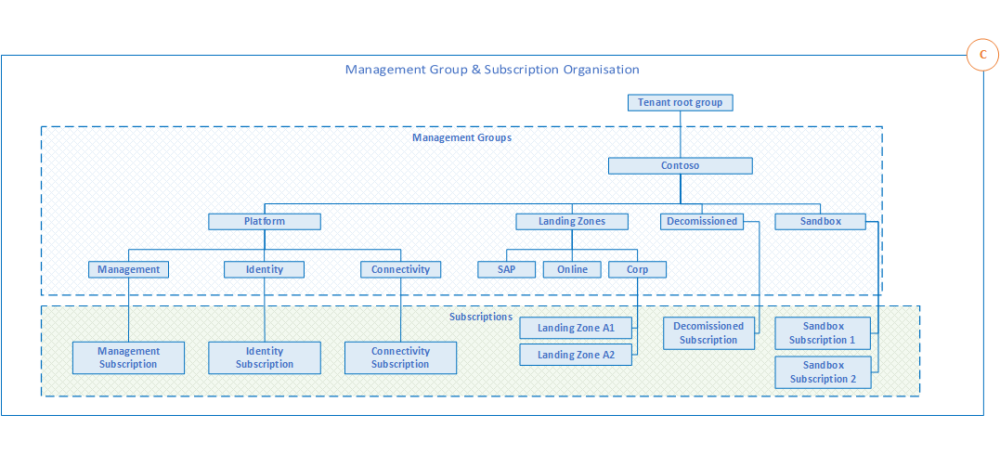

# Management group and subscription organization

*Figure 1: Management group hierarchy.*

## Define a management group hierarchy

Management group structures within an Azure Active Directory (Azure AD) tenant support organizational mapping. Consider your management group structure thoroughly as your organization plans Azure adoption at scale.

**Design considerations:**

- Management groups can be used to aggregate policy and initiative assignments via Azure Policy.

- A management group tree can support up to [six levels of depth](/azure/governance/management-groups/overview#hierarchy-of-management-groups-and-subscriptions). This limit doesn't include the tenant root level or the subscription level.

- Any principal (user or service principal) within an Azure AD tenant can create new management groups, since Azure role-based access control (RBAC) authorization for management group operations isn't enabled by default.

- All new subscriptions will be placed under the root management group by default.

**Design recommendations:**

- Keep the management group hierarchy reasonably flat, with no more than three to four levels ideally. This restriction reduces management overhead and complexity.

- Avoid duplicating your organizational structure into a deeply nested management group hierarchy. Management groups should be used for policy assignment versus billing purposes. This approach necessitates using management groups for their intended purpose in enterprise-scale architecture, which is providing Azure policies for workloads that require the same type of security and compliance under the same management group level.

- Create management groups under your root-level management group to represent the types of workloads (archetypes) that you'll host and ones based on their security, compliance, connectivity, and feature needs. This grouping structure allows you to have a set of Azure policies applied at the management group level for all workloads that require the same security, compliance, connectivity, and feature settings.

- Use resource tags, which can be enforced or appended through Azure Policy, to query and horizontally navigate across the management group hierarchy. Then you can group resources for search needs without having to use a complex management group hierarchy.

- Create a top-level sandbox management group to allow users to immediately experiment with Azure. Users can then experiment with resources that might not yet be allowed in production environments. The sandbox provides isolation from your development, test, and production environments.

- Use a dedicated service principal name (SPN) to execute management group management operations, subscription management operations, and role assignment. Using an SPN reduces the number of users who have elevated rights and follows least-privilege guidelines.

- Assign the User Access Administrator role at the root management group scope (`/`) to grant the SPN just mentioned access at the root level. After the SPN is granted permissions, the User Access Administrator role can be safely removed. In this way, only the SPN is part of the User Access Administrator role.

- Assign the Contributor role to the SPN previously mentioned at the root management group scope (`/`), which allows tenant-level operations. This permission level ensures that the SPN can be used to deploy and manage resources to any subscription within your organization.

- Create a `Platform` management group under the root management group to support common platform policy and Azure role assignment. This grouping structure ensures that different policies can be applied to the subscriptions used for your Azure foundation. It also ensures that the billing for common resources is centralized in one set of foundational subscriptions.

- Limit the number of Azure Policy assignments made at the root management group scope (`/`). This limitation minimizes debugging inherited policies in lower-level management groups.

- Use the policies available for enterprise-scale landing zones to enforce compliance requirements either at management group or subscription scope. Refer to guidance in the [Policy-driven governance](#policy-driven-governance) section to learn more about the governance requirements that can be addressed.

- Ensure that only privileged users can operate management groups in the tenant by enabling Azure RBAC authorization in the management group [hierarchy settings](/azure/governance/management-groups/how-to/protect-resource-hierarchy#setting---require-authorization) (by default, all users are authorized to create their own management groups under the root management group).

- [Configure](/azure/governance/management-groups/how-to/protect-resource-hierarchy#setting---default-management-group) a default, dedicated management group for new subscriptions to ensure that no subscriptions are placed under the root management group. This is especially important if there are users eligible for MSDN or Visual Studio benefits and subscriptions. A good candidate for this type of management group is a `Sandbox` management group.

> [!NOTE]
> For testing guidance for enterprise-scale deployments, see [Testing approach for enterprise-scale](./testing-approach.md).

## Subscription organization and governance

Subscriptions are a unit of management, billing, and scale within Azure. They play a critical role when you're designing for large-scale Azure adoption. This section helps you capture subscription requirements and design target subscriptions based on critical factors. These factors are environment type, ownership and governance model, organizational structure, and application portfolios.

**Design considerations:**

- Subscriptions serve as boundaries for assigning Azure policies. For example, secure workloads such as Payment Card Industry (PCI) workloads typically require additional policies to achieve compliance. Instead of using a management group to group workloads that require PCI compliance, you can achieve the same isolation with a subscription. This way, you don't have too many management groups with a small number of subscriptions.

- Subscriptions serve as a scale unit so that component workloads can scale within the platform [subscription limits](/azure/azure-resource-manager/management/azure-subscription-service-limits). Make sure to consider subscription resource limits during your workload design sessions.

- Subscriptions provide a management boundary for governance and isolation, which clearly separates concerns.

- There's a manual process, planned future automation, that can be conducted to limit an Azure AD tenant to use only Enterprise Agreement enrollment subscriptions. This process prevents creation of Microsoft Developer Network subscriptions at the root management group scope.

**Design recommendations:**

- Treat subscriptions as a democratized unit of management aligned with business needs and priorities.

- Make subscription owners aware of their roles and responsibilities:
  - Perform an access review in Azure AD Privileged Identity Management quarterly or twice a year to ensure that privileges don't proliferate as users move within the customer organization.
  - Take full ownership of budget spending and resource utilization.
  - Ensure policy compliance and remediate when necessary.

- Use the following principles when identifying requirements for new subscriptions:
  - **Scale limits:** Subscriptions serve as a scale unit for component workloads to scale within platform subscription limits. For example, large, specialized workloads such as high-performance computing, IoT, and SAP are all better suited to use separate subscriptions to avoid limits (such as a limit of 50 Azure Data Factory integrations).
  - **Management boundary:** Subscriptions provide a management boundary for governance and isolation, which allows for a clear separation of concerns. For example, different environments such as development, test, and production are often isolated from a management perspective.
  - **Policy boundary:** Subscriptions serve as a boundary for the assignment of Azure policies. For example, secure workloads such as PCI typically require additional policies to achieve compliance. This additional overhead doesn't need to be considered holistically if a separate subscription is used. Similarly, development environments might have more relaxed policy requirements relative to production environments.
  - **Target network topology:** Virtual networks can't be shared across subscriptions, but they can connect with different technologies such as virtual network peering or Azure ExpressRoute. Consider which workloads must communicate with each other when you decide whether a new subscription is required.

- Group subscriptions together under management groups aligned within the management group structure and policy requirements at scale. Grouping ensures that subscriptions with the same set of policies and Azure role assignments can inherit them from a management group, which avoids duplicate assignments.

- Establish a dedicated management subscription in the `Platform` management group to support global management capabilities such as Azure Monitor Log Analytics workspaces and Azure Automation runbooks.

- Establish a dedicated identity subscription in the `Platform` management group to host Windows Server Active Directory domain controllers, when necessary.

- Establish a dedicated connectivity subscription in the `Platform` management group to host an Azure Virtual WAN hub, private Domain Name System (DNS), ExpressRoute circuit, and other networking resources. A dedicated subscription ensures that all foundation network resources are billed together and isolated from other workloads.

- Avoid a rigid subscription model, and opt instead for a set of flexible criteria to group subscriptions across the organization. This flexibility ensures that as your organization's structure and workload composition changes, you can create new subscription groups instead of using a fixed set of existing subscriptions. One size doesn't fit all for subscriptions. What works for one business unit might not work for another. Some applications might coexist within the same landing zone subscription while others might require their own subscription.

## Configure subscription quota and capacity

Each Azure region contains a finite number of resources. When you consider an enterprise-scale Azure adoption that involves large resource quantities, ensure that sufficient capacity and SKUs are available and that the attained capacity can be understood and monitored.

**Design considerations:**

- Consider limits and quotas within the Azure platform for each service that your workloads require.

- Consider the availability of required SKUs within chosen Azure regions. For example, new features might be available only in certain regions. The availability of certain SKUs for given resources such as VMs might be different from one region to another.

- Consider that subscription quotas aren't capacity guarantees and are applied on a per-region basis.

**Design recommendations:**

- Use subscriptions as scale units, and scale out resources and subscriptions as required. Your workload can then use the required resources for scaling out, when needed, without hitting subscription limits in the Azure platform.

- Use reserved instances to prioritize reserved capacity in required regions. Then your workload will have the required capacity even when there's a high demand for that resource in a specific region.

- Establish a dashboard with custom views to monitor used capacity levels. Set up alerts if capacity utilization is reaching critical levels (for example, CPU utilization of 90 percent).

- Raise support requests for quota increase as a part of subscription provisioning (for example, total available VM cores within a subscription). This approach ensures your quota limits are set before your workloads require going over the default limits.

- Ensure required services and features are available within the chosen deployment regions.

## Configure subscription tenant transfer restrictions

Each Azure subscription is linked to a single Azure AD tenant, this acts as the identity provider (IdP) for the Azure subscription which it will trust to authenticate users, services and devices.

However, the Azure AD tenant that an Azure subscription is linked to can be changed by a user with the required permissions that also exists in more than one Azure AD tenant, again, with the required permissions. This process is detailed in the following articles:

- [Associate or add an Azure subscription to your Azure Active Directory tenant](/azure/active-directory/fundamentals/active-directory-how-subscriptions-associated-directory)
- [Transfer an Azure subscription to a different Azure AD directory](/azure/role-based-access-control/transfer-subscription)

> [!NOTE]
> For Azure cloud solution provider (CSP) subscriptions, transferring to another Azure AD tenant is not supported.

When this is considered in the context of enterprise-scale, you may decide to restrict and prevent users from being able to either transfer Azure subscriptions out of your organization's Azure AD tenant or transfer Azure subscriptions into your organization's Azure AD tenant. This can be done by following the process detailed in  [Manage Azure subscription policies](/azure/cost-management-billing/manage/manage-azure-subscription-policy).

As part of the subscription policy you can configure, you can also provide a list of [exempted users](/azure/cost-management-billing/manage/manage-azure-subscription-policy#exempted-users) who are permitted to bypass what's set in the policy.

> [!IMPORTANT]
> This is not an [Azure Policy](/azure/governance/policy/overview).

**Design considerations:**

- Consider whether users with [Visual Studio/MSDN Azure subscriptions](https://azure.microsoft.com/pricing/member-offers/credit-for-visual-studio-subscribers/) should be allowed to transfer their subscription to or from the Azure AD tenant.

- These settings are only configurable by users with the Azure AD [Global Administrator](/azure/active-directory/roles/permissions-reference#global-administrator) role assigned and they must have [elevated their access](/azure/role-based-access-control/elevate-access-global-admin) to be able to change the policy.

  - Only individual user accounts can be specified as [exempted users](/azure/cost-management-billing/manage/manage-azure-subscription-policy#exempted-users). Azure AD groups are not supported at this time.

- All users with access to Azure will be able to view the policy defined for the Azure AD tenant.

  - They will not be able to view the [exempted users](/azure/cost-management-billing/manage/manage-azure-subscription-policy#exempted-users).

  - They will be able to view the global administrators within the Azure AD tenant.

- Azure subscriptions transferred into an Azure AD tenant will be placed into the [default management group](/azure/governance/management-groups/how-to/protect-resource-hierarchy#setting---default-management-group) for that tenant.

- Define a process to allow Azure subscriptions to be transferred to or from an Azure AD tenant, if it's deemed necessary by the application team and approved by the organization.

**Design recommendations:**

- Prevent all users, by default, from being able to transfer Azure subscriptions to or from the Azure AD tenant by configuring the following settings:

  - **Subscription leaving Azure AD directory** set to `Permit no one`.

  - **Subscription entering Azure AD directory** set to `Permit no one`.

- Configure a limited set of [exempted users](/azure/cost-management-billing/manage/manage-azure-subscription-policy#exempted-users).

  - This would ideally be members of an Azure PlatformOps (platform operations) team.

  - Include break-glass accounts in the list of [exempted users](/azure/cost-management-billing/manage/manage-azure-subscription-policy#exempted-users).

## Establish cost management

Cost transparency across a technical estate is a critical management challenge faced by every large enterprise organization. This section explores key aspects associated with how cost transparency can be achieved across large Azure environments.

**Design considerations:**

- There could be a need for chargeback models where shared platform as a service (PaaS) resources are concerned, such as Azure App Service Environment and Azure Kubernetes Service, which might need to be shared to achieve higher density.

- Use a shutdown schedule for nonproduction workloads to optimize costs.

- Use Azure Advisor to check recommendations for optimizing costs.

**Design recommendations:**

- Use Azure Cost Management + Billing to aggregate costs. Make it available to application owners.

- Use Azure resource tags to categorize costs and group resources. Using tags allows you to have a chargeback mechanism for workloads that share a subscription or for a given workload that spans across multiple subscriptions.

## Policy-driven governance

Organizations can use enterprise-scale Azure policies to enforce the following governance requirements:

- **Prevent public IP-based services:**

    Most Azure platform as a service (PaaS) services are created with a public IP address assigned to each service. This option can help developers who need to start using these services quickly.

    Public endpoint accelerates the learning curve and supports developing pilots and small-scale proof of concept (POC) implementations, but developers sometimes overlook their public IP addresses when transitioning pilots/POCs to production-ready enterprise applications.

    Security risks can increase when production workloads use public IPs without proper security measures. One type of threat is an actor using a public IP as a gateway to launch an attack. To minimize security risks, many enterprise compliance policies don't allow public IPs.

    There's a custom policy that targets a scope and prevents a public IP address from being created there. Enterprises can also use this policy to create virtual machines (VMs) without public IPs. Similarly, there's a custom policy initiative/policy set that also helps enterprises to prevent Azure services from being created with public IP addresses.

- **Collect audit and log information:**

    A lack of auditing and diagnostics information at a granular level can affect operational practices. Incomplete audit information makes it difficult to correlate logs from multiple Azure services and create cohesive debugging.

    Once Azure services are provisioned, they should provide detailed information about how they interact with the Azure platform. This information can be broadly divided into logs and metrics, and each Azure service can be further grouped into its subcomponents. For example, an Azure public IP resource with `DDoSProtectionNotifications`, `DDoSMitigationReports`, and `DDoSMitigationFlowLogs` as its subcomponents. Collecting diagnostic information at these subcategories can also help organizations to enhance auditing and debugging.

     A custom Azure Policy initiative is available to help enterprises gather logs and metrics at a deeper level for each Azure service. This initiative includes a policy for every Azure service, and the policies collect key log categories and metrics automatically.

- **Provide comprehensive security for SQL databases:**

     SQL databases are a common Azure service in most Azure deployments. Unfortunately, they're also target for malicious activity both inside and outside an enterprise. A custom Azure Policy initiative for SQL databases helps organizations to apply the following key governance practices:

  - **Encrypt SQL data at rest:**

    SQL databases and their backups are vulnerable to malicious actors. Since it's simple to restore SQL databases from database files or backups, malicious actors can gain access to this data if a proper defense system isn't in place.

    One of the first steps in building a SQL database defense strategy is ensuring that a SQL database is encrypted at rest. Azure SQL Database transparent data encryption (TDE) encrypts database data at rest without changing an application's code and presents obstacles for malicious actors trying access the data, even if it's compromised. As SQL Database deployments increase within an enterprise, it's important to create them with TDE. There's a custom policy to ensure TDE for SQL databases.

  - **Optimize alerts for suspicious activity:**

    Bad actors aim to access and exploit business-critical SQL databases. When enterprises don't acknowledge these attempts, their risk of not detecting and resolving these incidents increases. In a worst-case scenario, an enterprise might not know whether its SQL database has been compromised.

    SQL Database lets enterprises set up security alerts that report suspicious Microsoft SQL Server activity. These alerts reach a preconfigured email address and optionally, Azure subscription admins and owners. They can expose malicious activities like SQL injection attacks, brute-force attacks, and more.

    A custom policy is available to enable security alerts on SQL databases. Security alerts provide detailed information about every incident, which is visible in the Azure portal or emails from when alerts are triggered.

  - **Examine an audit trail of operations:**

    A business-critical SQL database can operate daily with a range of data manipulation, control, and definition language commands. Without clear controls and insights into these operational activities, it can be challenging to distinguish between legitimate and suspicious operations.

    Enabling SQL auditing can help enterprises to gather important information about all database activities, and SQL auditing helps enterprises to create and analyze an audit trail of database events. This is also part of many industry/regional regulatory compliance requirements.

    Enterprises can use a custom policy to enforce SQL database auditing. This policy audits and reports on key database events like ownership, role membership, or schema changes, successful and failed logins, and more. Enterprises can use this policy's audit trail to gain insights about database operations and comply with industry or regional regulatory requirements.

- **Evaluate proven best practices:**

   A SQL database can experience a lot of schema, permission, and configuration changes throughout its lifecycle, and these changes can deviate from best practices. In turn, excessive permissions, orphaned roles, and other configurational drifts can be exploited by malicious actors.

   Microsoft best practices for SQL databases can help enterprises to assess their SQL databases, and SQL Database has a built-in vulnerability assessment service to assist. A vulnerability assessment scans and identifies database- and server-level security risks, and it offers remediation tasks that can fix vulnerabilities.

    A custom policy ensures that SQL databases are configured with vulnerability assessments. Assessment scans run periodically, reports are stored in an Azure Storage account, and a predefined email address shares the results for reporting.

- **Protect secrets from being deleted intentionally or accidentally:**

    Azure Key Vault stores confidential information like keys, certificates, passwords, and more. A malicious user can abuse the service by deleting the secrets that it stores, and a standard user could accidentally delete the sensitive stored within. Without proper provisions, malicious or accidental deletion in Azure Key Vault could harm the business.

    The **soft-delete** feature in Azure Key Vault can protect enterprises against intentional or accidental deletion. With **soft-delete** enabled, deleted keys are retained for a predefined time period. If the delete operation was intended, then key content can be deleted until another purge, typically by a user with more access privileges. If the delete operation was an accident, then the deleted keys can be restored within the time defined.

    Azure offers a custom policy to ensure that **soft-delete** is enabled by default with Azure Key Vault. This policy provides an extra security layer if Azure Key Vault content is deleted maliciously, and enterprises gain more control if content is deleted accidentally.

- **Enforce Azure Application Gateway Web Application Firewall:**

    Web applications running on Azure are potential targets for malicious attacks. The [top 10 web application security risks](https://owasp.org/www-project-top-ten/) like injection, cross-site scripting, and others exploit web application vulnerabilities, and a successful attack can cost an organization its resources and reputation.

    Azure Application Gateway Web Application Firewall (WAF) uses the Open Web Application Security Project, OWASP, Core Rule Set 3.1, 3.0, or 2.2 to protect web applications from common attacks. WAF policies in Application Gateway can be accessed **Prevention** or **Detection** mode.

    Azure offers a custom policy to help prevent potential misconfiguration in Application Gateway; it creates a WAF for Application Gateway by default. The WAF protects Azure web applications using Application Gateway.

- **Prevent IP forwarding on VMs:**

    IP forwarding supports an Azure VM to route its traffic to other destinations. Unless specifically required, this routing can expose a VM and other unintended networks with a public IP address as a router.

    Azure provides an option to configure IP forwarding on virtual machines (VMs) with tools like firewalls, load balancers, and others deployed via Azure Marketplace. Any application can use these services can use them in Azure Marketplace transactions.

    Outside of specific needs, IP forwarding on VMs can be a security liability. Azure offers a custom policy to prevent VMs acting as IP forwarding routers, and this policy is applied at the landing zone scope. Focusing on VMs in landing zones should be the final destination for user requests; any routing should be implemented in the connectivity subscription.

- **Enforce centralized DNS record management:**

    Private Azure DNS zones help to create and manage DNS records for Azure resources. Without controls for how these zones proliferate, management and network connectivity debugging issues can result. In hybrid environments where on-premises sites need to connect to Azure resources, fragmented DNS zones can create duplicate DNS records and maintenance challenges.

    Enterprises can deploy private Azure DNS zones centrally to manage DNS records clearly. Azure Virtual Network can link with private zones to help run domain controllers, which can streamline connectivity from on-premises sites. Azure services that support Azure Private Link and Private Endpoint can use centrally managed private DNS zones without creating them during each application deployment.

    Azure offers a custom policy that can prevent the creation of a private DNS zone in the scope during which it's applied. Enterprises can view this policy's compliance status even when the policy enforcement is disabled. This policy helps to streamline connectivity between on-premises sites and access to Azure PaaS services using Private Link or Private Endpoint.

- **Enforce network traffic control:**

    An Azure virtual network can be divided into multiple subnets. Since network access controls between these subnets don't exist by default, this can result in unsolicited network traffic in a subnet.

    Azure network security groups (NSGs) help to filter incoming and outgoing subnet traffic, and stateful packet inspections can allow or deny network traffic. Resources inside subnets can only receive traffic from allowed IP address ranges.

    Azure offers a custom policy that pairs every subnet with an NSG. A combination of subnet and an NSG ensures that a default set of rules controls traffic to and from a subnet. Depending on their needs, enterprises can also add or modify rules to control traffic further.

- **Use Azure Security Center to detect and protect against security threats:**

    An Azure subscription can hold a range of resources like VMs, container images, an more, and these resources are exposed to risks like malware/unwanted software installation, uncontrolled access to management ports on a VM, and others. With security attacks becoming more sophisticated and a limited-supply of experienced security professionals, detecting security vulnerabilities and protecting workloads is extremely challenging.

    Azure Security Center is the Azure native security management system that assesses Azure resources' security posture against security best practices. It helps to detect and prevent threats against data and application services, and with multiple integration points, it can be deployed quickly.

    Azure offers a custom policy that pairs Azure subscriptions with Security Center, helping subscriptions to quickly start receiving Security Center threat detection and protection. This policy automatically covers key Azure services like VMs, storage accounts, and seven others with Security Center. If deviation from security best practice occurs, enterprises benefit from continuous security assessments and actionable recommendations.

- **Protect against ransomware attacks and data loss:**

    The increasing frequency of ransomware and intrusion attacks present another concern for enterprises. A successful ransomware attack can disrupt business-critical processes and applications, and attackers have held enterprises hostage for large amounts of money.

    Azure Backup protects Azure virtual machine data from being destroyed maliciously or accidentally. Backups are easy to configure and scale, and Azure Recovery Services backs up the data for simple management and protection.

    Azure offers a custom policy that protects virtual machines by configuring them with Azure Backup. This policy automatically provisions an Azure Recovery Services vault and creates backup container for every Azure VM created.

- **Protect against distributed denial of service attacks:**

    Publicly reachable Azure resources are vulnerable to distributed denial-of-service (DDoS) attacks. These attacks can affect an application's availability to its intended users, and prolonged attacks can exhaust all available resources and create downtime for business-critical applications.

    Azure DDoS protection defends Azure resources against DDoS attacks by continuously monitoring incoming traffic to identify potential threats. During an active attack, enterprises can benefit from working with the Microsoft DDoS rapid response team.

    Azure offers a custom policy that automatically provisions an Azure DDoS Protection Standard plan on all Azure subscriptions in its scope. This policy allows enterprises to select the Azure regions that will be covered by the service.

- **Auto-provision Private Link or Private Endpoint with private DNS zones:**

    One enterprise maintenance challenge is how to create private DNS zones for every application that needs access to Azure PaaS services. Azure Private Link and Private Endpoint use private IP addresses to provide access to Azure platform as a service (PaaS) services, and private DNS zones resolve DNS records. Private DNS zone groups use categories from Azure services like blob, queue, table, and SQL to group Private Link connections and use one private DNS zone per service.

    Enterprises can also create central private DNS zones, and custom Azure policies can automatically connect Private Link or Private Endpoint with private DNS zones for Azure services.

- **Manage firewall rules centrally:**

    Fragmented firewall rules can lead to uncontrolled and ambiguous network traffic paths. Continuous changes to firewalls rules for every firewall instance make it difficult to assess network security posture, and multiple rules make it difficult to distinguish between a centrally managed basic set of rules and workload-specific network path rules.

    Azure Firewall policies help organizations define a minimum set of rules that apply throughout their organization. Application-specific policies can inherit basic rules to create hierarchical rules that meet enterprise- and application-specific firewall requirements. When rules are configured through policies, they can be managed and monitored centrally.

    Azure offers a custom policy that helps enterprises to define Azure Firewall policies centrally. Enterprises control defining the rules and priorities that to meet their network traffic routing requirements. Depending on their needs, enterprises can define firewall policies centrally and apply them to either Azure Virtual WAN or hub-and-spoke network topology.

- **Provision hub-and-spoke network topology:**

    As more workloads start to get deployed in Azure, they begin using a common set of services such as firewalls, VPN gateways, and others. If not carefully planned, common services can replicate per application deployment, creating unnecessary costs and operational overhead. In scenarios where on-premises connectivity is needed from Azure and connectivity is established per application deployment, network topology becomes more difficult to maintain.

    Azure hub-and-spoke network topology helps to streamline needs for network connectivity. A hub virtual network (VNet) can host shared services while spoke VNets host application-specific Azure resources. Hub-and-spoke VNets use VNet peering to connect with each other, and the network topology promotes clean network design, easier management, and optimized costs.

    Azure offers a custom policy that uses Azure Firewall and gateways from VPNs and ExpressRoute to provision hub VNets. Enterprises can configure all options for firewalls and gateways as part of the policy assignment. This policy simplifies the process to deploy Azure hub-and-spoke network topology.

    Another custom policy prevents two VNets from peering with each other to instead communicate with each other via a hub VNet. Configuring VNets to communicate with each other through with hubs makes it possible to control and monitor network connections. Network topology is simplified from a maintenance perspective as well.

- **Provision default configurations for Azure Monitor:**

    The inability to identify and visualize the relationship between the Azure platform, its services, and applications can lead to an outage or undetected and degraded performance. Operations or support teams could miss opportunity to correct specific conditions, and an Azure application might not scale itself to respond to a surge or slump in the demand.

    Azure Monitor Logs and Log Analytics workspaces use alerts to help enterprises understand and resolve critical conditions. They use dashboards, workbooks, and Microsoft Power BI to support enterprises to visualize and interact with a robust set of log information. Enterprises can use Azure Monitor Logs and Log Analytics workspaces together to configure VM autoscaling and automatically add or remove extra instances.

    Azure offers a custom policy to configure Azure Monitor Logs with Log Analytics workspaces. This policy deploys prepackaged dashboard reports from Azure Monitor solutions for specific Azure services like Azure SQL Database or Azure AD. It also configures data sources from Linux or Windows VM performance metrics with Azure Monitor.

- **Enable log storage and queries:**

    If not carefully planned, log information from multiple Azure sources can become unmanageable, as capturing, storing, and managing logs can consume resources, time, and costs. Identifying trends or patterns over a long period of time and a large number of logs can also become challenging. Log Analytics queries use alerts and interactive reports to help enterprises to efficiently store and manage logs from multiple sources.

    Azure offers a custom policy that creates a Log Analytics workspace to serve as a repository that stores data logs. An Azure Automation account is created, and it links to a Log Analytics workspace to automate tasks or deploy Azure Monitor solutions that could depend on those workspaces. The policy also helps to configure log retention periods, Azure regions, and other properties.

- **Provision logging for Azure Arc enabled servers:**

    With IT estates spanning across multiple clouds, on-premises sites, and edge locations, enterprises could struggle to manage and govern servers that are scattered across environments and geographic locations. The idea of using a range of products to monitor these servers could be overwhelming, and assigning servers to multiple environments under one unified access and identity management solution can be challenging to set up and manage.

    Azure Arc simplifies how resources like servers, Kubernetes clusters, and data services are governed and managed across heterogeneous. By projecting hybrid resources as native Azure resources, Azure Arc provides a single control pane for managing native and hybrid resources, bringing native and hybrid resources under a unified role-based-access-control solution.

    Azure offers two custom policies that can help enterprises to set up Log Analytics agents on Azure Arc enabled Linux and Windows servers. A Log Analytics workspace is also configured to store and manage logs. When assigned successfully, the policy identifies the name of servers within its scope and assigns it to a Log Analytics agent.

- **Enforce collecting network traffic logs:**

    Even though virtual network and subnets provide logical private network boundaries, it's still necessary to monitor network traffic in Azure. Without proper monitoring, enterprise networks are vulnerable to malicious or unknown traffic from compromised IP addresses. Without an understanding of the current traffic, it can be challenging to provision extra capacity for increasing in network traffic.

    Azure Network Watcher helps enterprises to monitor and repair network issue for infrastructure as a service (IaaS) services in Azure. With this service, NSG flow logs provide a way to capture information about network traffic. Enterprises can benefit from traffic analysis and patterns, forecast future capacity needs, and enforce compliance with corporate governance policies.

    Azure offers a custom policy for setting up NSG flow logs in Network Watcher. Here, a storage account is provisioned as a repository to store NSG flow logs. This policy also configuring the retention period to store the NSG flow logs.

- **Provision an at-scale network connectivity solution:**

    Enterprise network connectivity requirements can be complex. Constant requests for adding new sites, devices, and users to an ever-expanding network are challenging to provision and manage, and network bandwidth and throughput demands from multiple touchpoints in an enterprise can be demanding.

    Azure Virtual WAN is an enterprise-level network service that helps organizations to resolve connectivity challenges. The service provides higher aggregate throughput with network connectivity, optimal routing over the Azure backbone, and a unified Azure management experience.

    Azure offers a custom policy to set up Virtual WAN and provision a virtual hub within the service. Enterprises can deploy virtual hubs to act as a central point for connections from multiple sources and destinations. ExpressRoute, Azure VPN Gateway, and Azure Firewall are also provisioned to address network connectivity requirements.

- **Back up virtual machines:**

    As cloud adoption increases, enterprise face ensuring that Azure workloads are backed up. In conventional IT support models where application development and IT operations are managed by separate teams, the ownership of VM backups can become unclear. Missing backup process can also create costly consequences during intended or unintended scenarios that need VM backups for restoring workloads.

    Azure Backup provides a seamless, simple, and integrated option for backing up VMs running in Azure or on-premises sites. Azure Backup uses cloud-scale storage and frees enterprises from constantly procuring and managing storage for backups. Azure Backup provides a repository to store at-rest and transitional data securely.

    Azure offers a custom policy that automatically configures Azure Backup protection for Windows and Linux VMs. An Azure Recovery Services vault is configured for storing backups, securely storing data and using **soft-delete** to protect backups from being deleted maliciously. A default backup policy is created and assigned with preconfigured values for backup schedules, retention periods, and more.

- **Provision connectivity between VNets:**

    It's common for enterprises to scatter workloads across multiple subscriptions or VNets. In turn, critical business applications can struggle with exchanging data without dedicated and secure network connectivity. An internet-based network connection will can offer inconsistent network bandwidth and performance, and potentially high network latency can negatively impact the user experience.

    Virtual network peering provides connects two VNets over the Microsoft backbone network. Azure peering supports high-bandwidth, low-latency network connectivity where data between separate Azure subscriptions, tenants, or Azure regions can be exchanged securely.

    Azure offers a custom policy provides with a template for setting up virtual network peering. A network layout in an Azure Resource Manager template definition can be passed as a parameter. This policy will spin up VNets and configure VNet peering between them, plus dependencies like NSGs, user-define routing, and others.

- **Enforce Windows VMs to join Azure AD domains:**

    Enterprises have been using domain-joined VMs for a consistent management experience. When operations like corporate password policies, central authentication, and others are created as part of domain policies, a VM that doesn't join the domain is exposed to risks like weak passwords and an inability to connect with corporate devices, applications, and other limitations. When deployed on VMs that aren't joined to the domain, legacy applications relying on authentication protocols like NTLM or Kerberos could face authentication issues.

    Azure provides managed and unmanaged solutions for implementing domain services. With self-managed Azure AD DS services, enterprises gain the same complete control of setups, configurations, and operations as with on-premises environment. The service frees enterprises of management overhead while providing essential domain services.

    Azure offers a custom policy that helps new Windows VMs to automatically join domains. The `JsonADDomainExtension` extension deployed on the VM uses configuration settings like the username, domain, OU path, and other settings to ensure that the VM joins the specified domain. This policy uses Azure Key Vault to manage confidential domain username and password information.
