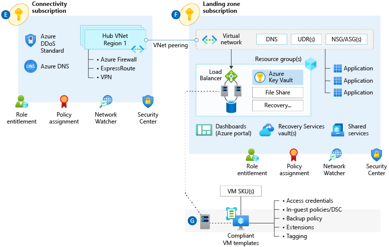
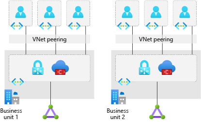
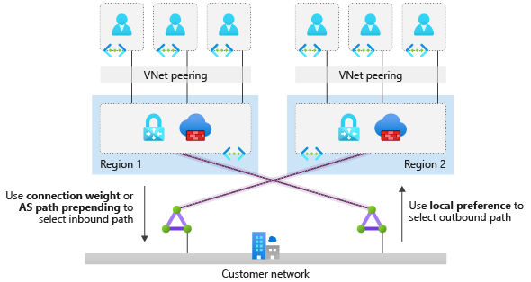

<!-- cSpell:ignore autoregistration BGPs MACsec MPLS MSEE onprem privatelink VPNs -->

# Network topology and connectivity

This article examines key design considerations and recommendations surrounding networking and connectivity to, from, and within Microsoft Azure.

## Planning for IP addressing

It's vital that your organization plans for IP addressing in Azure to ensure that IP address space doesn't overlap across considered on-premises locations and Azure regions.

**Design considerations:**

- Overlapping IP address spaces across on-premises and Azure regions will create major contention challenges.

- Address space for a virtual network address space can be added after creation. But this process requires an outage if the virtual network is already connected to another virtual network via virtual network peering, because the peering must be deleted and re-created.

- Azure reserves five IP addresses within each subnet. Factor in those addresses when you're sizing virtual networks and encompassed subnets.

- Some Azure services require [dedicated subnets](https://docs.microsoft.com/azure/virtual-network/virtual-network-for-azure-services#services-that-can-be-deployed-into-a-virtual-network). These services include Azure Firewall and Azure VPN Gateway.

- You can delegate subnets to certain services to create instances of a service within the subnet.

**Design recommendations:**

- Plan for non-overlapping IP address spaces across Azure regions and on-premises locations well in advance.

- Use IP addresses from the address allocation for private internets (RFC 1918).

- For environments with limited private IP addresses (RFC 1918) availability, consider using IPv6.

- Don't create unnecessarily large virtual networks (for example: `/16`) to ensure that IP address space isn't wasted.

- Don't create virtual networks without planning the required address space in advance. Adding address space will cause an outage after a virtual network is connected via virtual network peering.

- Don't use public IP addresses for virtual networks, especially if the public IP addresses don't belong to your organization.

## Configure DNS and name resolution for on-premises and Azure resources

Domain Name System (DNS) is a critical design topic in the overall enterprise-scale architecture. Some organizations might want to use their existing investments in DNS. Others might see cloud adoption as an opportunity to modernize their internal DNS infrastructure and use native Azure capabilities.

**Design considerations:**

- You can use a DNS resolver in conjunction with Azure Private DNS for cross-premises name resolution.

- You might require the use of existing DNS solutions across on-premises and Azure.

- The maximum number of private DNS zones to which a virtual network can link with autoregistration is one.

- The maximum number of private DNS zones to which a virtual network can link is 1,000 without auto-registration enabled.

**Design recommendations:**

- For environments where name resolution in Azure is all that's required, use Azure Private DNS for resolution. Create a delegated zone for name resolution (such as `azure.contoso.com`).

- For environments where name resolution across Azure and on-premises is required, use existing DNS infrastructure (for example, Active Directory integrated DNS) deployed onto at least two Azure virtual machines (VMs). Configure DNS settings in virtual networks to use those DNS servers.

- You can still link an Azure Private DNS zone to the virtual networks and use DNS servers as hybrid resolvers with conditional forwarding to on-premises DNS names (such as `onprem.contoso.com`) by using on-premises DNS servers. You can configure on-premises servers with conditional forwarders to resolver VMs in Azure for the Azure Private DNS zone (for example, `azure.contoso.com`).

- Special workloads that require and deploy their own DNS (such as Red Hat OpenShift) should use their preferred DNS solution.

- Enable auto-registration for Azure DNS to automatically manage the lifecycle of the DNS records for the virtual machines deployed within a virtual network.

- Use a virtual machine as a resolver for cross-premises DNS resolution with Azure Private DNS.

- Create the Azure Private DNS zone within a global connectivity subscription. You might create other Azure Private DNS zones (for example, `privatelink.database.windows.net` or `privatelink.blob.core.windows.net` for Azure Private Link).

## Define an Azure network topology

Network topology is a critical foundational element of the enterprise-scale architecture, because it ultimately defines how applications can communicate with each other. This section explores relevant technologies and topology approaches for enterprise Azure deployments. It focuses on two core approaches: topologies based on Azure Virtual WAN, and traditional topologies.

A network topology based on Azure Virtual WAN is the preferred enterprise-scale approach for large-scale multiregion deployments where your organization needs to connect your global locations to both Azure and on-premises. You should also use a Virtual WAN network topology whenever your organization intends to use software-defined WAN (SD-WAN) deployments fully integrated with Azure. Virtual WAN is used to meet large-scale interconnectivity requirements. Because it's a Microsoft-managed service, it also reduces overall network complexity and helps to modernize your organization's network.

Use a traditional Azure network topology if any of the following are true:

- Your organization intends to deploy resources in only a few Azure regions.
- You don't need a global interconnected network.
- You have a low number of remote or branch locations per region (fewer than 30 IPsec tunnels required).
- You require full control and granularity for manually configuring your Azure network.

This traditional topology helps you build a secure network foundation in Azure.

## Virtual WAN network topology (Microsoft-managed)

_Figure 1: Virtual WAN network topology._

**Design considerations:**

- [Azure Virtual WAN](https://docs.microsoft.com/azure/virtual-wan/virtual-wan-about) is a Microsoft-managed solution that provides end-to-end global transit connectivity by default. Virtual WAN hubs eliminate the need to manually configure network connectivity. For example, you don't need to set up user-defined routing (UDR) or network virtual appliances (NVAs) to enable global transit connectivity.

- Virtual WAN greatly simplifies end-to-end network connectivity in Azure and cross-premises by creating a [hub-and-spoke network architecture](https://docs.microsoft.com/azure/virtual-wan/virtual-wan-global-transit-network-architecture). The architecture spans multiple Azure regions and on-premises locations (any-to-any connectivity) out of the box, as depicted in this figure:

  
  
  _Figure 2: Global transit network with Virtual WAN._

- Virtual WAN any-to-any transitive connectivity supports the following paths (within the same region and across regions):

  - Virtual network to virtual network
  - Virtual network to branch
  - Branch to virtual network
  - Branch to branch

- Virtual WAN hubs are locked down. The only resources that you can deploy within them are virtual network gateways (point-to-site VPN, site-to-site VPN, and Azure ExpressRoute), Azure Firewall via Firewall Manager, and route tables.

- Virtual WAN increases the limit of up to 200 prefixes advertised from Azure to on-premises via ExpressRoute private peering to 10,000 prefixes per Virtual WAN hub. The limit of 10,000 prefixes also includes site-to-site VPN and point-to-site VPN.

- Network-to-network transitive connectivity (within a region and across regions) is now in general availability (GA).

- Virtual WAN hub-to-hub connectivity is now in GA.

- Transit connectivity between the virtual networks in Standard Virtual WAN is enabled due to the presence of a router in every virtual hub. Every virtual hub router supports an aggregate throughput up to 50 Gbps.

- Virtual WAN integrates with a variety of [SD-WAN providers](https://docs.microsoft.com/azure/virtual-wan/virtual-wan-locations-partners).

- Many managed service providers offer [managed services](https://docs.microsoft.com/azure/networking/networking-partners-msp) for Virtual WAN.

- VPN gateways in Virtual WAN can scale up to 20 Gbps and 20,000 connections per virtual hub.

- ExpressRoute circuits with the premium add-on are required. They should be from an ExpressRoute Global Reach location.

- Azure Firewall Manager, now in GA, allows the deployment of Azure Firewall in the Virtual WAN hub.

- Virtual WAN hub-to-hub traffic via Azure Firewall is currently not supported. As alternative, use the native hub-to-hub transit routing capabilities in Virtual WAN. Use NSGs to allow/block virtual network traffic across hubs.

**Design recommendations:**

- We highly recommend Virtual WAN for new large/global network deployments in Azure where you need global transit connectivity across Azure regions and on-premises locations. That way, you don't have to manually set up Azure networking transitive routing.

  The following figure depicts a sample global enterprise deployment with datacenters spread across Europe and the United States. The deployment also has a large number of branch offices within both regions. The environment is globally connected via Virtual WAN and ExpressRoute Global Reach.

  
  
  _Figure 3: Sample network topology._

- Use Virtual WAN as a global connectivity resource. Use a Virtual WAN hub per Azure region to connect multiple landing zones together across Azure regions via the local Virtual WAN hub.

- Connect Virtual WAN hubs to on-premises datacenters by using ExpressRoute.

- Connect branches and remote locations to the nearest Virtual WAN hub via site-to-site VPN, or enable branch connectivity to Virtual WAN via an SD-WAN partner solution.

- Connect users to the Virtual WAN hub via a point-to-site VPN.

- Follow the principle "traffic in Azure stays in Azure" so that communication across resources in Azure occurs via the Microsoft backbone network, even when the resources are in different regions.

- Deploy Azure Firewall in Virtual WAN hubs for east/west and south/north traffic protection and filtering within an Azure region.

- If partner NVAs are required for east/west or south/north traffic protection and filtering, deploy the NVAs to a separate virtual network (such as an NVA virtual network). Connect it to the regional Virtual WAN hub and to the landing zones that need access to NVAs. For more information, see [Create a Virtual WAN hub route table for NVAs](https://docs.microsoft.com/azure/virtual-wan/virtual-wan-route-table-portal).

- When you're deploying partner networking technologies and NVAs, follow the partner vendor's guidance to ensure there aren't conflicting configurations with Azure networking.

- Don't build a transit network on top of Azure Virtual WAN. Virtual WAN satisfies all transitive network topology requirements, including the ability to use partner NVAs.

- Don't use existing on-premises networks like multiprotocol label switching (MPLS) to connect Azure resources across Azure regions. Azure networking technologies support the interconnection of Azure resources across regions through the Microsoft backbone.

- For brownfield scenarios where you're migrating from a hub-and-spoke network topology not based on Virtual WAN, see [Migrate to Azure Virtual WAN](https://docs.microsoft.com/azure/virtual-wan/migrate-from-hub-spoke-topology).

- Create Azure Virtual WAN and Azure Firewall resources within the connectivity subscription.

- Don't create more than 500 virtual network connections per Virtual WAN virtual hub.

## Traditional Azure networking topology

Although Virtual WAN offers a wide range of powerful capabilities, a traditional Azure networking approach might be optimal in some cases:

- If a global transitive network across multiple Azure regions or cross-premises isn't required. An example is a branch in the United States that requires connectivity to a virtual network in Europe.

- If there isn't a need to connect to a large number of remote locations via VPN or integration with an SD-WAN solution.

- If your organization's preference is to have granular control and configuration when setting up a network topology in Azure.

_Figure 4: A traditional Azure network topology._

**Design considerations:**

- Various network topologies can connect multiple landing zone virtual networks. Example are one large flat virtual network, multiple virtual networks connected with multiple ExpressRoute circuits or connections, hub and spoke, full mesh, and hybrid.

- Virtual networks don't traverse subscription boundaries. But you can achieve connectivity between virtual networks in different subscriptions by using virtual network peering, an ExpressRoute circuit, or VPN gateways.

- You can use virtual network peering to connect virtual networks in the same region, across different Azure regions, and across different Azure Active Directory (Azure AD) tenants.

- Virtual network peering and global virtual network peering aren't transitive. UDRs and NVAs are required to enable a transit network. For more information, see [Hub-spoke network topology in Azure](https://docs.microsoft.com/azure/architecture/reference-architectures/hybrid-networking/hub-spoke).

- You can use ExpressRoute circuits to establish connectivity across virtual networks within the same geo-political region or by using the premium add-on for connectivity across geo-political regions. Keep these points in mind:

  - Network-to-network traffic might experience more latency because traffic must hairpin at the Microsoft enterprise edge (MSEE) routers.

  - Bandwidth will be constrained to the ExpressRoute gateway SKU.

  - You must still deploy and manage UDRs, if they require inspection or logging for traffic across virtual networks.

- VPN gateways with Border Gateway Protocol (BGP) are transitive within Azure and on-premises. But they don't transit across ExpressRoute gateways.

- When multiple ExpressRoute circuits are connected to the same virtual network, use connection weights and BGP techniques to ensure an optimal path for traffic between on-premises and Azure. For more information, see [Optimize ExpressRoute routing](https://docs.microsoft.com/azure/expressroute/expressroute-optimize-routing).

- Using BGP techniques to influence ExpressRoute routing is a configuration outside the Azure platform. Your organization or your connectivity provider must configure the on-premises routers accordingly.

- ExpressRoute circuits with premium add-ons provide global connectivity. However, the maximum number of ExpressRoute connections per ExpressRoute gateway is four.

- Although the maximum number of virtual network peering connections per virtual network is 500, the maximum number of routes that can be advertised from Azure to on-premises via ExpressRoute private peering is 200.

- A VPN gateway's maximum aggregated throughput is 10 Gbps. It supports up to 30 site-to-site or network-to-network tunnels.

**Design recommendations:**

- Consider a network design based in the hub-and-spoke network topology with non-virtual-WAN technologies for the following scenarios:

  - The traffic boundary in an Azure deployment is within an Azure region.

  - A network architecture has up to two Azure regions, and there's a requirement for transit connectivity between virtual networks for landing zones across regions.

  - A network architecture spans multiple Azure regions, and there's no need for transitive connectivity between virtual networks for landing zones across regions.

  - There's no need for transitive connectivity between VPN and ExpressRoute connections.

  - The main cross-premises connectivity channel is ExpressRoute, and the number of VPN connections is less than 30 per VPN gateway.

  - There's a heavy dependency on centralized NVAs and complex/granular routing.

- For regional deployments, primarily use the hub-and-spoke topology. Use landing-zone virtual networks that connect with virtual network peering to a central-hub virtual network for cross-premises connectivity via ExpressRoute, VPN for branch connectivity, spoke-to-spoke connectivity via NVAs and UDRs, and internet-outbound protection via NVA. The following figure depicts this topology.

  

  _Figure 5: Hub-and-spoke network topology._

- Use the topology of multiple virtual networks connected with multiple ExpressRoute circuits when one of these conditions is true:
 
  - You need a high level of isolation.
  - You need dedicated ExpressRoute bandwidth for specific business units.- You've reached the maximum number of connections per ExpressRoute gateway (up to four).
  
  The following figure depicts this topology.

  
  
  _Figure 6: Multiple virtual networks connected with multiple ExpressRoute circuits._

- Deploy a set of minimal shared services, including ExpressRoute gateways, VPN gateways (as required), and Azure Firewall or partner NVAs (as required) in the central-hub virtual network. If necessary, also deploy Active Directory domain controllers and DNS servers.

- Deploy Azure Firewall or partner NVAs for east/west or south/north traffic protection and filtering, in the central-hub virtual network.

- When you're deploying partner networking technologies/NVAs, follow the partner vendor's guidance to ensure that:

  - The vendor supports deployment.
  - The guidance is designed for high availability and maximal performance.
  - There are no conflicting configurations with Azure networking.

- Don't deplpy L7 inbound NVAs (such as Azure Application Gateway) as a shared service in the central-hub virtual network. Instead, deploy them together with the app in their respective landing zones.

- Use your existing network (MPLS and SD-WAN) for connecting branch locations with corporate headquarters. Transit in Azure between ExpressRoute and VPN gateways isn't supported.

- For network architectures with multiple hub-and-spoke topologies across Azure regions, use global virtual network peering to connect landing-zone virtual networks when a small number of landing zones need to communicate across regions. This approach offers benefits like high network bandwidth with global virtual network peering (as allowed by the VM SKU). But it will bypass the central NVA, in case traffic inspection or filtering is required. This would also be subject to [global virtual network peering limitations](https://docs.microsoft.com/azure/virtual-network/virtual-network-peering-overview#constraints-for-peered-virtual-networks).

- When you deploy a hub-and-spoke network architecture in two Azure regions and transit connectivity between all landing zones across regions is required, use ExpressRoute with dual circuits to provide transit connectivity for landing-zone virtual networks across Azure regions. In this scenario, landing zones can transit within a region via NVA in local-hub virtual network and across regions via ExpressRoute circuit. Traffic must hairpin at the Microsoft enterprise edge (MSEE) routers. The following figure depicts this design.

  
  
  _Figure 7: Landing zone connectivity design._

- When your organization requires hub-and-spoke network architectures across more than two Azure regions and global transit connectivity between landing zones, virtual networks across Azure regions are required. You can implement this architecture by interconnecting central-hub virtual networks with global virtual network peering and using UDRs and NVAs to enable global transit routing. The complexity and management overhead are high, though. Instead, we recommend deploying global transit network architecture with Virtual WAN.

- Use [Azure Monitor network insights](https://docs.microsoft.com/azure/azure-monitor/insights/network-insights-overview) (currently in preview) to monitor the end-to-end state of your networks on Azure.

- Do not create more than 200 peering connections per central-hub virtual network. Although virtual networks support up to 500 peering connections, ExpressRoute with private peering only supports advertising up to 200 prefixes from Azure to on-premises.

## Connectivity to Azure

This section expands on the network topology to consider recommended models for connecting on-premises locations to Azure.

**Design considerations:**

- Azure ExpressRoute provides dedicated private connectivity to Microsoft Azure infrastructure as a service (IaaS) and platform as a service (PaaS) functionality from on-premises locations.

- You can use Private Link to establish connectivity to PaaS services over ExpressRoute with private peering.

- When multiple virtual networks are connected to the same ExpressRoute circuit, they'll become part of the same routing domain, and all virtual networks will share the bandwidth.

- You can use ExpressRoute Global Reach (where available) to connect on-premises locations together through ExpressRoute circuits to transit traffic over the Microsoft backbone network.

- ExpressRoute Global Reach is available in many [ExpressRoute peering locations](https://docs.microsoft.com/azure/expressroute/expressroute-global-reach#availability).

- ExpressRoute Direct allows creation of multiple ExpressRoute circuits at no additional cost, up to the ExpressRoute Direct port capacity (10 Gbps or 100 Gbps). It also allows you to connect directly to Microsoft's ExpressRoute routers. For the 100-Gbps SKU, the minimum circuit bandwidth is 5 Gbps. For the 10-Gbps SKU, the minimum circuit bandwidth is 1 Gbps.

<!-- cSpell:ignore prepending -->
<!-- docsTest:ignore "AS PATH prepending -->

**Design recommendations:**

- Use ExpressRoute as the primary connectivity channel for connecting an on-premises network to Microsoft Azure. You can use VPNs as a source of backup connectivity to enhance connectivity resiliency.

- Use dual ExpressRoute circuits from different peering locations when you're connecting an on-premises location to virtual networks in Azure. This setup will ensure redundant paths to Azure by removing single points of failure between on-premises and Azure.

- When you use multiple ExpressRoute circuits, [optimize ExpressRoute routing via BGP local preference and AS PATH prepending](https://docs.microsoft.com/azure/expressroute/expressroute-optimize-routing#solution-use-as-path-prepending).

- Ensure that you're using the right SKU for the ExpressRoute/VPN gateways based on bandwidth and performance requirements.

- Deploy a zone redundant ExpressRoute gateway in the supported Azure regions.

- For scenarios that require bandwidth higher than 10 Gbps or dedicated 10/100-Gbps ports, use ExpressRoute Direct.

- When low latency is required, or throughput from on-premises to Azure must be greater than 10 Gbps, enable FastPath to bypass the ExpressRoute gateway from the data path.

- Use VPN gateways to connect branches or remote locations to Azure. For higher resilience, deploy zone-redundant gateways (where available).

- Use ExpressRoute Global Reach to connect large offices, regional headquarters, or datacenters connected to Azure via ExpressRoute.

- When traffic isolation or dedicated bandwidth is required (such as for separating productaion nd nonproduction environments), use different ExpressRoute circuits to ensure isolated routing domains and to alleviate noisy-neighbor risks.

- Proactively monitor ExpressRoute circuits by using Network Performance Monitor.

- Don't explicitly use ExpressRoute circuits from a single peering location. This creates a single point of failure and makes your organization susceptible to peering location outages.

- Don't use the same ExpressRoute circuit to connect multiple environments that require isolation or dedicated bandwidth, to avoid noisy-neighbor risks.

## Connectivity to Azure PaaS services

Building on the previous connectivity sections, this section explores recommended connectivity approaches for using Azure PaaS services.

**Design considerations:**

- Azure PaaS services are typically accessed over public endpoints, however, the Azure platform provides capabilities to secure such endpoints or even make them entirely private.

  - Virtual network injection provides dedicated private deployments for supported services. But management plane traffic flows through public IP addresses.

  - [Private Link](https://docs.microsoft.com/azure/private-link/private-endpoint-overview#private-link-resource) provides dedicated access using private IP addresses to Azure PaaS instances, or custom services behind an Azure Load Balancer standard.

  - Virtual network service endpoints provide service level access from selected subnets to selected PaaS services.

- Enterprises often have concerns regarding public endpoints for PaaS services that must be appropriately mitigated.

- For [supported services](https://docs.microsoft.com/azure/private-link/private-link-overview#availability), Private Link addresses data exfiltration concerns associated with service endpoints. Alternately, outbound filtering via NVAs can be used to provide steps to mitigate data exfiltration.

**Design recommendations:**

- Use virtual network injection for supported Azure services to make them available from within your virtual network.

- Azure PaaS services that have been injected into a virtual network still perform management plane operations using public IP addresses. Ensure that this communication is locked down within the virtual network using UDRs and NSGs.

- Use Private Link, where available, for shared Azure PaaS services. Private Link is generally available for several services and is in public preview for numerous ones. Private Link availability is detailed [here](https://docs.microsoft.com/azure/private-link/private-link-overview#availability).

- Access Azure PaaS services from on-premises via ExpressRoute private peering, using either virtual network injection for dedicated Azure services or Azure Private Link for available shared Azure services. To access Azure PaaS services from on-premises when virtual network injection or Private Link aren't available, use ExpressRoute with Microsoft peering. This would avoid transiting over the public internet.

- Use virtual network service endpoints to secure access to Azure PaaS services from within your virtual network, but only when Private Link isn't available and there aren't data exfiltration concerns. To address data exfiltration concerns with service endpoints, use NVA filtering or use virtual network service endpoint policies for Azure Storage.

- Do not enable virtual network service endpoints by default on all subnets.

- Do not use virtual network service endpoints when there are data exfiltration concerns, unless NVA filtering is used.

- It isn't recommended to implement forced tunneling to enable communication from Azure to Azure resources.

## Planning for inbound and outbound internet connectivity

This section describes recommended connectivity models for inbound and outbound connectivity to and from the public internet.

**Design considerations:**

- Azure-native network security services such as Azure Firewall, Azure Web Application Firewall (WAF) on Azure Application Gateway, and Azure Front Door are fully managed services, so you don't incur the operational and management costs associated with infrastructure deployments, which can become complex at scale.

- The enterprise-scale architecture is fully compatible with partner NVAs, should your organization prefer to use NVAs or for situations where native services don't satisfy your organization's specific requirements.

**Design recommendations:**

- Use Azure Firewall to govern:

  - Azure outbound traffic to the internet

  - Non-HTTP/S inbound connections

  - East-west traffic filtering (if required by your organization)

- Use Firewall Manager with Virtual WAN to deploy and manage Azure firewalls across Virtual WAN hubs or in hub virtual networks. Firewall Manager is now in general availability (GA) for both Virtual WAN and regular virtual networks.

- Create a global Azure Firewall policy to govern security posture across the global network environment and assign it to all Azure Firewall instances. Allow for granular policies to meet requirements of specific regions by delegating incremental firewall policies to local security teams via RBAC.

- Configure supported partner SaaS security providers within Firewall Manager if your organization wants to use such solutions to protect outbound connections.

- Use WAF within a landing-zone virtual network for protecting inbound HTTP/S traffic from the internet.

- Use Azure Front Door and WAF policies to provide global protection across Azure regions for inbound HTTP/S connections to a landing zone.

- When using Azure Front Door and Azure Application Gateway to protect HTTP/S apps, use WAF policies in Azure Front Door and lock down Azure Application Gateway to receive traffic only from Azure Front Door.

- If partner NVAs are required for east-west and/or south-north traffic protection/filtering:

   - For Virtual WAN network topologies, deploy the NVAs to a separate virtual network (for example, NVA virtual network), and connect it to the regional Virtual WAN hub and to the landing zones that require access to NVAs, as described in this [article](https://docs.microsoft.com/azure/virtual-wan/virtual-wan-route-table-portal).
   - For non-Virtual WAN network topologies, deploy the partner NVAs in the central-hub virtual network.

- If partner NVAs are required for inbound HTTP/S connections, they should be deployed within a landing-zone virtual network and together with the apps that they're protecting and exposing to the internet.

- Use [Azure DDoS Protection Standard protection plans](https://docs.microsoft.com/azure/virtual-network/ddos-protection-overview) to protect all public endpoints hosted within your virtual networks.

- Do not replicate on-premises perimeter network concepts and architectures into Azure. Similar security capabilities are available in Azure, but the implementation and architecture must be adapted to the cloud.

## Planning for app delivery

This section explores key recommendations to deliver internal and external facing apps in a secure, highly scalable, and highly available manner.

**Design considerations:**

- Azure Load Balancer (internal and public) provides high availability for app delivery at a regional level.

- Azure Application Gateway allows the secure delivery of HTTP/S apps at a regional level.

- Azure Front Door allows the secure delivery of highly available HTTP/S apps across Azure regions.

- Azure Traffic Manager allows the delivery of global apps.

**Design recommendations:**

- App delivery for both internal- and external-facing apps should be performed within landing zones.

- For secure delivery of HTTP/S apps, use app gateway v2 and ensure that WAF protection/policies are enabled.

- Use a partner NVA if Application Gateway v2 can't be used for the security of HTTP/S apps.

- Azure Application Gateway v2 or partner NVAs used for inbound HTTP/S connections should be deployed within the landing-zone virtual network and with the apps that they're securing.

- All public IP addresses in a landing zone should be protected with a DDoS standard protection plan.

- Global HTTP/S apps that span Azure regions should be delivered and protected using Azure Front Door with WAF policies.

- When using Front Door and Application Gateway to protect HTTP/S apps, use WAF policies in Azure Front Door and lock down Application Gateway to receive traffic only from Front Door.

- Global apps that span protocols other than HTTP/S should be delivered using Traffic Manager.

## Planning for landing zone network segmentation

This section explores key recommendations to deliver highly secure internal network segmentation within a landing zone to drive a network zero-trust implementation.

**Design considerations:**

- The zero-trust model assumes a breached state and verifies each request as though it originates from an uncontrolled network.

- An advanced zero-trust network implementation employs fully distributed ingress/egress cloud micro-perimeters and deeper micro-segmentation.

- Network security groups can use Azure service tags to facilitate connectivity to Azure PaaS services.

- App security groups don't span or provide protection across virtual networks.

- NSG flow logs are now supported using Azure Resource Manager templates.

**Design recommendations:**

- Delegate subnet creation to the landing zone owner. This will enable them to define how to segment workloads across subnets (for example, a single large subnet, multitier app, or network-injected app). The platform team can use Azure Policy to ensure an NSG with specific rules (such as deny inbound SSH or RDP from internet, or allow/block traffic across landing zones) is always associated to subnets with deny-only policies.

- NSGs must be used to protect traffic across subnets, as well as east-west traffic across the platform (inter-landing-zone traffic).

- The app team should use app security groups at the subnet level NSGs to protect multitier VMs within the landing zone.

- Use NSGs and app security groups to micro-segment traffic within the landing zone and avoid using a central NVA to filter traffic flows.

- Enable NSG flow logs and feed them into Traffic Analytics to gain insights into internal and external traffic flows.

- Use NSGs to selectively allow inter-landing-zone connectivity.

- For Virtual WAN topologies, route traffic across landing zones via Azure Firewall if your organization requires filtering and logging capabilities for traffic flowing across landing zones.

## Define network encryption requirements

This section explores key recommendations to achieve network encryption between on-premises and Azure as well as across Azure regions.

**Design considerations:**

- Cost and available bandwidth are inversely proportional to length of encryption tunnel between endpoints.

- When using VPN to connect to Azure, traffic is encrypted over the internet via IP security (IPsec) tunnels.

- When using ExpressRoute with private peering, traffic isn't currently encrypted.

- MACsec encryption can be applied to ExpressRoute Direct to achieve network encryption.

- Azure doesn't currently offer native encryption over global virtual network peering. If encryption between Azure regions is required today, it's possible to connect virtual networks using VPN gateways rather than global virtual network peering.

**Design recommendations:**

_Figure 8: Encryption flows._

- When establishing VPN connections from on-premises to Azure using VPN gateways, traffic is encrypted at a protocol level using IPsec tunnels, as depicted in `Flow A` in the diagram above.

- When using ExpressRoute Direct, configure [media access control security (MACsec)](https://docs.microsoft.com/azure/expressroute/expressroute-howto-MACsec) in order to encrypt traffic at the layer-two level between your organization's routers and MSEE, as depicted in `Flow B` in the diagram above.

- For Virtual WAN scenarios where MACsec isn't an option (for example, not using ExpressRoute Direct), use Virtual WAN VPN gateway to establish IPsec tunnels over ExpressRoute private peering. This is depicted by `Flow C` in the diagram above.

- For non-virtual-WAN scenarios, and where MACsec isn't an option (for example, not using ExpressRoute Direct), today the only options is to use partner NVAs to establish IPsec tunnels over ExpressRoute private peering or establish a VPN tunnel over ExpressRoute with Microsoft peering.

- If traffic between Azure regions must be encrypted, use VPN gateways to connect virtual networks across regions.

- Use partner NVAs in Azure to encrypt traffic over ExpressRoute private peering in case native solutions offered in Azure (as depicted in flows B and C above) do not meet your requirements.

## Planning for traffic inspection

In many industries, organizations require that traffic in Azure, particularly inbound and outbound internet traffic, is mirrored to a network packet collector for deep inspection and analysis. This section explores key considerations and recommended approaches for mirroring or tapping traffic within Azure Virtual Network.

**Design considerations:**

<!-- docsTest:ignore TAP -->

- [Azure Virtual Network TAP](https://docs.microsoft.com/azure/virtual-network/virtual-network-tap-overview) is in preview, but your must contact `azurevnettap@microsoft.com` for availability details.

- Packet capture in Network Watcher is generally available, but captures are limited to a maximum period of 5 hours.

**Design recommendations:**

As an alternative to the Azure Virtual Network TAP, evaluate the following options:

- Use Network Watcher packet to capture despite the limited capture window.

- Evaluate if NSG flow logs v2 provide the level of detail required.

- Use partner solutions for scenarios where sustained deep-packet inspection is required.

- Do not develop a custom solution to mirror traffic. Although this approach might be acceptable for small-scale scenarios, it isn't encouraged at scale because of complexity and the supportability issues that may arise.
