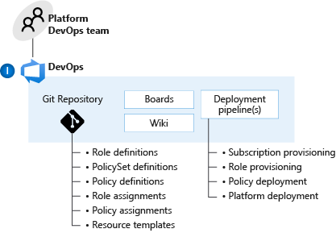

# Platform automation and DevOps

*Figure 1: Platform automation and DevOps.*

## Planning for a DevOps approach

Many traditional IT operating models aren't compatible with the cloud, and organizations must undergo operational and organizational transformation to deliver against enterprise migration targets. You should use a DevOps approach for both application and central teams.

**Design considerations:**

- Where central teams are concerned, you should use pipelines for continuous integration and continuous deployment. Use the pipelines to manage policy definitions, role definitions, policy assignments, management group hierarchies, and subscriptions. These pipelines help ensure that you can operationally manage multiple subscriptions while still conforming to a desired state.

- The blanket application of a DevOps model won't instantly establish capable DevOps teams.

- Investing in engineering capabilities and resources is critical.

- You can arrange internal and external DevOps roles and functions from a variety of sources that align with your organization's strategy.

- For some legacy applications, the associated application team might not have engineering resources required to align with a DevOps strategy.

<!-- cSpell:ignore PlatformOps SecOps NetOps AppDevOps AppDataOps AppSecOps -->

**Design recommendations:**

Establish a cross-functional DevOps platform team to build, manage, and maintain your enterprise-scale architecture. This team should include members from your central IT team, security, compliance, and business units to ensure that a wide spectrum of your enterprise is represented. The following list presents a recommended set of DevOps roles for a central platform team:

- **PlatformOps** (platform operations) for:

  - Subscription provisioning and delegation of required network, identity and access management, and policies.

  - Platform management and monitoring (holistic).

  - Cost management (holistic).

  - Platform-as-code (managing templates, scripts, and other assets).

  - Responsible for overall operations on Microsoft Azure within the Azure Active Directory tenant (managing service principals, registering the Microsoft Graph API, and defining roles).

- **SecOps** (security operations)

  - Azure role-based access control (Azure RBAC) (holistic).

  - Key management (for central services, simple mail-transfer protocol, and domain controller).

  - Policy management and enforcement (holistic).

  - Security monitoring and audit (holistic).

- **NetOps** (network operations)

  - Network management (holistic).

- **AppDevOps.** Allow application owners to create and manage application resources through a DevOps model. The following list presents a recommended DevOps role for application teams:

  - Application migration or transformation.

  - Application management and monitoring.

  - Azure RBAC (application resources).

  - Security monitoring and audit (application resources).

  - Cost management (application resources).

  - Network management (application resources).

  - In some instances, you might want to break AppDevOps into more granular roles such as AppDataOps for database management or AppSecOps for more security-sensitive applications.

  - Provide a central application DevOps function to support applications that don't have existing DevOps capabilities or a business case to establish one (for example, legacy applications with minimal development capabilities).

  - Use a policy-driven approach with clear Azure RBAC boundaries to centrally enforce consistency and security across application teams. This ensures a least privilege approach is taken by using a combination of Azure RBAC and Azure Policy, and that workloads are compliant with Azure Policy assignments at all times.

  - To accelerate Azure adoption, the central platform team should establish a common set of templates and libraries for application teams to draw upon. For example, horizontal (cross-function) guidance can help to support migrations through subject matter expertise and to ensure alignment with the overall target enterprise-scale architecture.

  - Don't restrict application teams to use central artifacts or approaches because it hinders their agility. You can enforce consistent baseline configurations through a policy-driven infrastructure approach and Azure RBAC. This ensures that application (business unit) teams are flexible enough to innovate while still able to draw from a predefined set of templates.

  - Don't force application teams to use a central process or provisioning pipeline for the instantiation or management of application resources. Existing teams that already rely on a DevOps pipeline for application delivery should still be able to use the same tools they have been using. Remember that you can still use Azure Policy to maintain guardrails, independent of how resources are deployed in Azure.

## Define central and federated responsibilities

The distribution of roles, responsibilities, and trust between central IT teams and applications teams is paramount to the operational transformation your organization must undergo when adopting the cloud at scale.

**Design considerations:**

Central teams strive to maintain full control while application owners seek to maximize agility. The balance between these goals can greatly influence the success of the migration.

**Design recommendations:**

The following list presents a recommended distribution of responsibilities between the central IT team and application teams. You're striving to empower migration and transformation activities with minimal central dependencies. At the same time, you want to support the centralized governance of security and operability across the entire estate.

- **Application functions**

  - Application migration and transformation.

  - Application management and monitoring (application resources).

  - Key management (application keys).

  - Azure RBAC (application resources).

  - Security monitoring and audit (application resources).

  - Cost management (application resources).

  - Network management (application resources).

- **Central functions**

  - Architecture governance.

  - Subscription management.

  - Platform as code (management of templates, scripts, and other assets).

  - Policy management and enforcement (holistic).

  - Platform management and monitoring (holistic).

  - Azure RBAC (holistic).

  - Key management (central services).

  - Network management (including networks and network virtual appliances).

  - Security monitoring and audit (holistic).

  - Cost management (holistic).

An Azure DevOps model that's based on these recommendations provides the desired control for central teams and the migration agility required by application teams.
