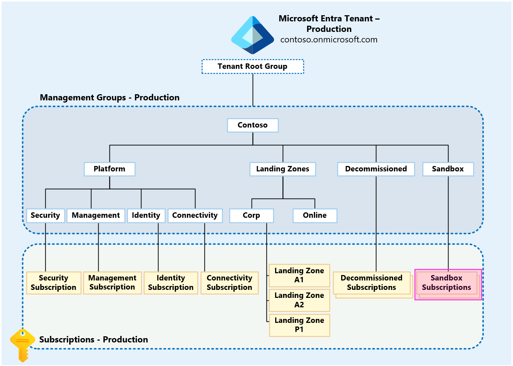

# Testing approach for Enterprise Scale

>[!NOTE]
 > This article only applies to Azure and not any other Microsoft Cloud offerings (Microsoft 365, Dynamics, etc.)

We recognize that some organizations may wish to test their Enterprise Scale platform deployment (Azure Policy definitions and assignments, RBAC custom roles and assignments, etc.) whether this is via automation (ARM Templates, [AzOps](https://github.com/Azure/AzOps), [Terraform](https://registry.terraform.io/modules/Azure/caf-enterprise-scale/azurerm/latest) etc.) or manually via the portal. This page will provide an approach that can be used to achieve the testing of changes and their impact in Enterprise Scale platform deployment.

This page can also be used in conjunction with the [Platform automation and DevOps critical design area](./platform-automation-and-devops.md) guidance as it relates to the “PlatformOps” and “Central functions” teams and tasks.

This is most suited to organizations with robust change management processes governing changes to the “production” Management Group hierarchy. The “canary” hierarchy can be independently used to author and test deployments before deploying them into the “production” environment.

>[!NOTE]
 > The term "canary" is used to avoid confusion with development (“dev”) or test environments. This is purely only a name for illustration purposes, you may define any name you deem as appropriate for your “canary” Enterprise Scale environment.
 > 
 > Similarly, the term “production” is only used throughout this page to refer to the Management Group hierarchy your organization may already have in place, today, that contain the Azure Subscriptions and resources of your workloads.

## Platform Definition

>[!IMPORTANT]
 > This is not for development or test environments that would be used by application/service owners (known as “Landing Zones”) for workloads/applications/services; these are placed and handled within the "production" Management Group hierarchy and associated governance (RBAC & Azure Policy). 
 >
 > This is only for platform level testing and changes in the context of Enterprise Scale.

Enterprise Scale helps you design and deploy the required Azure platform components to enables you  to construct and operationalize landing zones at scale.

The platform resources in scope for this page and testing approach are:

| Product/Service | Resource Provider & Type |
| :--------------- | :------------------------ |
| Management Groups | Microsoft.Management/managementGroups |
| Management Groups Subscription Association | Microsoft.Management/managementGroups/subscriptions |
| Policy Definitions | Microsoft.Authorization/policyDefinitions |
| Policy Initiative Definitions (a.k.a. Policy Set Definitions) | Microsoft.Authorization/policySetDefinitions |
| Policy Assignments | Microsoft.Authorization/policyAssignments |
| RBAC Role Definitions | Microsoft.Authorization/roleDefinitions |
| RBAC Role Assignments | Microsoft.Authorization/roleAssignments |
| Subscriptions | Microsoft.Subscription/aliases |

## Example Scenarios & Outcomes

An example of this scenario is an organization that wishes to test the impacts and results of a new Azure Policy to govern resources/settings in all Landing Zones; as per the [“Policy-driven governance” design principle](./design-principles.md#policy-driven-governance). However, they do not wish to make this change directly to the “production” environment as they are concerned about the impact it may have.

Therefore, using the “canary” environment to test this platform change will allow the organisation to implement and review the impact and result of the Azure Policy change to ensure it satisfies their requirements before implementing the Azure Policy to their “production” environment.

A similar scenario which may require a form of testing, before being made in the “production” environment, could be changing Azure RBAC role assignments and/or Azure AD group memberships.

>[!IMPORTANT]
 > This is not a common deployment approach/pattern for most customers and is therefore not mandatory for Enterprise Scale deployments.

## Diagram

_Figure 1: Canary Management Group hierarchy._

## Explanation

As the above diagram shows, the entire Enterprise Scale "production" Management Group hierarchy is duplicated beneath the `Tenant Root Group`. The "canary" name is appended to the Management Group display names and IDs, as the IDs must be unique within a single Azure AD Tenant.

>[!NOTE]
 > The “canary” Management Group display names could be left the same as the “production” Management Groups. However, this may cause confusion for users and is therefore recommended to append “canary” to their display names as well as their IDs.

The "canary" Management Group hierarchy is then used to simplify testing of the following resource types:

- Management Groups
  - Subscription placement
- RBAC
  - Roles (Built-in & Custom)
  - Assignments
- Azure Policy
  - Definitions (Built-in & Custom)
  - Initiatives (a.k.a. Set Definitions)
  - Assignments

## What if I do not wish to deploy the entire "canary" environment hierarchy?

If you do not wish to deploy the entire “canary” environment hierarchy, then testing of platform resoruces can still be achieved within the “production” hierarchy, using sandbox subscriptions as depicted below.

_Figure 1: Enterprise Scale Management Group hierarchy highlighting sandboxes._

To test Azure Policy and RBAC in this scenario you just need a single Azure Subscription with the Owner RBAC role assigned to the identity you wish to complete the testing as (User Account, Service Principal or Managed Service Identity). This will then enable you to author, assign and remediate Azure Policies definitions and assignments within the scope of the sandbox subscription only.

This sandbox approach can also be used for RBAC testing within the subscription, for example if you are developing a new custom RBAC role to grant permissions for a particular use case; this can all be done in the sandbox subscription and tested before being created and assigned higher up in the hierarchy, if desired.

A benefit of this approach is that the sandbox subscriptions can be ephemeral and therefore only created and used for the time that they are required, before being deleted from the environment.

However, this approach does not allow you to test with the inheritance of RBAC and Azure Policies from the Management Group hierarchy.

## Using a single Azure AD Tenant

- Follows [Enterprise Scale Design Recommendations](./enterprise-enrollment-and-azure-ad-tenants.md#define-azure-ad-tenants) for Azure AD Tenants
- As per the [Cloud Adoption Framework Azure Best Practices - "Standardize on a single directory and identity"](azure/cloud-adoption-framework/security/security-top-10#9-architecture-standardize-on-a-single-directory-and-identity) guidance; single Azure AD Tenants are best practice for most.
  - In a single Azure AD Tenant you can use the different Azure AD Groups for both “production” and “canary” Enterprise Scale environments, with the same users, that are assigned to their relevant Management Group hierarchy within the same Azure AD Tenant.
- Increased/Duplicated Azure AD licensing costs due to multiple identities across different Azure AD Tenants.
  - This is especially relevant to customers who use Azure AD Premium features.
- RBAC changes will be more complex in both “canary” & “production” as it is highly likely that the users and groups are not identical across both Azure AD Tenants.
  - Furthermore, the users and groups IDs will not be the same across Azure AD Tenants due to them being globally unique.
- Reduces complexity and management overhead caused by managing multiple Azure AD Tenants.
  - Privileged users having to maintain access and logging in to separate tenants to perform testing is likely to lead to changes being made to “production” instead of “canary” and vice versa accidently.
- Reduces likelihood of configuration drift and deployment failures.
- Doesn’t require additional security and break-glass/emergency access processes to be created.
- Reduces friction and time taken to implement changes to the Enterprise Scale deployment

## Implementation Guidance

Below is guidance on how to implement and utilise the "canary" Management Group hierarchy for Enterprise Scale alongside a “production” hierarchy:

1. Use separate Azure AD Service Principals (SPNs) or Managed Service Identities (MSIs) that are granted permissions over the relevant "production" or "canary" Management Group hierarchy
   - This follows the principle of least privilege (PoLP)
2. Use separate folders within a git repository, branches or repositories to hold the Infrastructure-as-Code for the "production" and "canary" Enterprise Scale deployments.
   - Using the relevant Azure AD Service Principals (SPNs) or Managed Service Identities (MSIs) as part of the CI/CD pipelines depending on which hierarchy is being deployed too.
3. Implement git branch policies/security for “canary” as you have in place for “production”.
   - You may decide to reduce the number of approvers and checks for “canary” in an effort to “fail-fast”.
4. Use the same Azure DevOps Pipelines or GitHub Actions utilising environment variables to change which hierarchy is being deployed too OR clone the pipelines and amend the hard-coded settings to define which hierarchy is being deployed too.
   - Utilising [Azure DevOps Pipeline Templates](https://docs.microsoft.com/azure/devops/pipelines/process/templates) or [GitHub Actions Workflow Templates](https://docs.github.com/en/actions/learn-github-actions/sharing-workflows-with-your-organization) will help prevent the ‘Don’t Repeat Yourself’ (DRY) principle.
5. Have a set of “canary” subscriptions under a separate EA Department & Account that can be moved around the “canary” hierarchy as needed.
   - It may also be beneficial to have a set of resources always deployed into these.
   - Or some Infrastructure-as-Code templates (ARM, Bicep, Terraform etc.) to be able to spin up a set of resources to enable validation of changes in the “canary” environment.
6. It is recommended to send all Azure Activity Logs for all Azure Subscriptions, including any “canary” Subscriptions, to the “production” Management Log Analytics Workspace as per the [Enterprise Scale design recommendations](./management-and-monitoring.md).