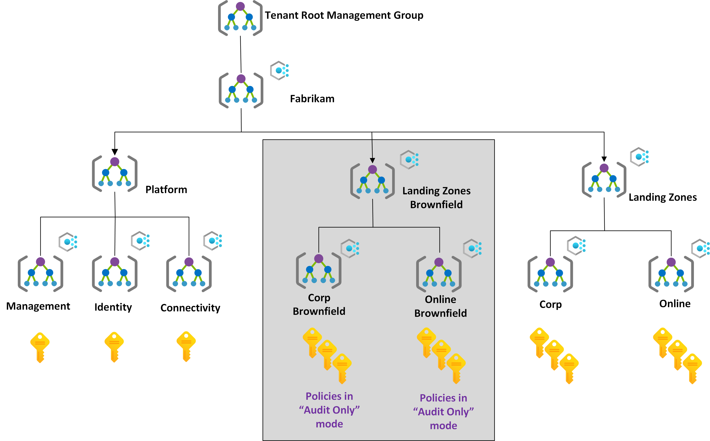

<!-- docutune:casing resourceType resourceTypes resourceId resourceIds -->

# Scenario: Migration approach using duplicate Landing Zones Management Group with policies in “Audit Only” mode

This page describes an example approach to transition to the Azure landing zone conceptual architecture by duplicating the landing zones management group with policies in “Audit Only” mode. This approach allows customers to get into the new desired target architecture very quickly and then start being able to assess the application/workload subscriptions for compliance from the start without the risk for impacting any of the application teams as the policies are in “audit only” mode.

## Transition to the Azure landing zone conceptual architecture

To transition to an Azure landing zone conceptual architecture leveraging this approach, we suggest the following:

1. Review the [Azure landing zone conceptual architecture](./index.md), [Azure landing zone design principles](./design-principles.md) and [Azure landing zone design areas](./design-areas.md).

2. Deploy the [Azure landing zone accelerator](/azure/architecture/landing-zones/landing-zone-deploy#platform) into the same Azure AD tenant in parallel with the current environment.

   Doing so creates a new management group structure. This structure is aligned with Azure landing zones design principles and recommendations. It also ensures that the existing environment is not affected by these changes.

3. Review the [Adopt policy-driven guardrails guidance](../enterprise-scale/dine-guidance.md) to understand how to minimize disruption to applications and services during the migration.

4. Duplicate the _Landing Zones_ Management Group as well as it’s children (Corp & Online), including all the policy assignments with configuring them to _audit only_ mode, by setting the [_Enforcement Mode_ on the policy assignments to DoNotEnforce/Disabled](/azure/governance/policy/concepts/assignment-structure#enforcement-mode). This approach allows getting into the new desired target architecture very quickly and then the applications teams can start to assess the policies applied without the risk of impacting any of the running applications.

    

5. (optional) Work with application or service teams to migrate the workloads deployed in the original subscriptions into new Azure subscriptions, per the guidance in [Transition existing Azure environments to the Azure landing zone conceptual architecture](./../enterprise-scale/transition.md#moving-resources-in-azure). They can be placed into the newly duplicated management group hierarchy under the correct management group – _corp brownfield_ or _online brownfield_.

   Review the policy section in [Transition existing Azure environments to the Azure landing zone conceptual architecture](./../enterprise-scale/transition.md#policy) for details about the effect on resources when migrating. Eventually, the existing Azure subscription can be canceled and placed in the decommissioned management group.

   > [!NOTE]
   > The existing applications or services do not necessarily have to be migrated into new landing zones (Azure subscriptions)

6. Once the application teams have worked with the platform teams to get their policy compliance into the required state, their subscriptions can simply be moved to the proper management group (corporate or online), safe in the knowledge of what are the assigned policies and their effect to be able to operate their workloads efficiently and in a compliant manner.

The following diagram shows the state during the migration approach of this sample scenario:

:::image type="content" source="./media/alz-duplicate-brownfield-auditonly-transition.png" alt-text="Single subscription environment - transition state" lightbox="./media/alz-duplicate-brownfield-auditonly-transition.png":::

## Summary

Using this approach, the customer has safely migrated their workloads in Azure by deploying the [Azure landing zone conceptual architecture](./index.md#azure-landing-zone-architecture) in parallel to their existing environment with minimal disruption.
