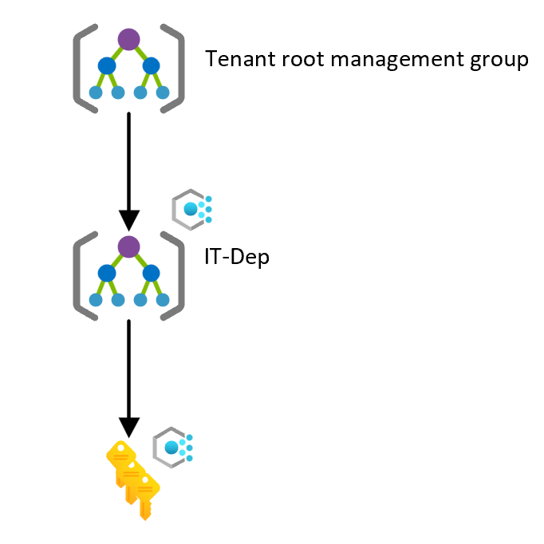

<!-- docutune:casing resourceType resourceTypes resourceId resourceIds -->

# Scenario: Transition management groups to the Azure landing zone conceptual architecture

The following guide provides steps and considerations about migrating and transitioning your existing environment into the conceptual architecture of Azure landing zones. The scenario covers single or multiple management groups.

In this scenario, it's assumed that the customer already uses Azure. They have a management group hierarchy with multiple subscriptions that host a few applications or services within the platform. But their current implementation limits their scalability and growth related to their *cloud first* strategy.

As part of this expansion, they plan to migrate away from their on-premises datacenters and into Azure. During the migration, they lead with modernizing and transforming their applications or services to use cloud-native technologies where possible. For example, they might use Azure SQL Database and Azure Kubernetes Service (AKS). They know that it takes considerable time and effort, so they plan to *lift and shift* to start. Initially, this plan requires hybrid connectivity via services such as Azure VPN Gateway or Azure ExpressRoute.

The customer wants to move their existing environment to the Azure landing zones conceptual architecture. This architecture supports their *cloud first* strategy and has a robust platform that scales as the customer retires their on-premises datacenters.

## Current state

In this scenario, the current state of the customer's Azure environment consists of:

- One or more management groups.
- A management group hierarchy that's based on organizational structure or geography.
- An Azure subscription for each application environment, like development, testing, or production.
- Nonuniform resource distribution. Platform and workload resources for a single environment are deployed in the same Azure subscriptions.
- Policy assignments with audit and deny effects that are assigned at the management group and subscription level.
- Role-based access control (RBAC) role assignments for each subscription and resource group.
- A hub virtual network, such as VPN Gateway or ExpressRoute, for hybrid connectivity.
- A virtual network for each application environment.
- Applications that are deployed into the respective subscription based on their environment classification, such as development, testing, or production.
- Central control and operation by a central IT team.

The following diagram shows the current state of this sample scenario:

## Transition to the Azure landing zone conceptual architecture

To transition from this scenario's current state to an Azure landing zone conceptual architecture, use the following approach:

1. Review [Azure landing zone conceptual architecture](./index.md), [Azure landing zone design principles](./design-principles.md), and [Azure landing zone design areas](./design-areas.md).

1. Deploy the [Azure landing zone accelerator](/azure/architecture/landing-zones/landing-zone-deploy#platform) into the same Microsoft Entra ID tenant in parallel with the current environment. This method provides a smooth and phased transition to the new landing zone architecture with minimal disruption to active workloads.

   This deployment creates a new management group structure. This structure aligns with Azure landing zones design principles and recommendations. It also ensures that these changes don't affect the existing environment.

1. Review the ["dev/test/production" workload landing zones guidance](./../enterprise-scale/faq.md#how-do-we-handle-devtestproduction-workload-landing-zones-in-azure-landing-zone-architecture) to understand how to handle "dev/test/production" workload landing zones.

1. (Optional) Work with application or service teams to migrate the workloads that are deployed in the original subscriptions into new Azure subscriptions. For more information, see [Transition existing Azure environments to the Azure landing zone conceptual architecture](./../enterprise-scale/transition.md#moving-resources-in-azure). You can place workloads into the newly deployed Azure landing zone conceptual architecture management group hierarchy under the correct management group, such as *corporate* or *online*.

   For details about the effect on resources when migrating, see [Transition existing Azure environments to the Azure landing zone conceptual architecture](./../enterprise-scale/transition.md#policy). Eventually, you can cancel the existing Azure subscription and place it in the decommissioned management group.

   > [!NOTE]
   > You don't necessarily have to migrate the existing applications or services into new landing zones, or Azure subscriptions.

1. Create new Azure subscriptions to provide landing zones that support migration projects from on-premises. Place them under the proper management group, such as corporate or online.

1. Review [Readying your landing zone for migration](../.././migrate/azure-migration-guide/ready-alz.md).

The following diagram shows the state during the migration approach of this sample scenario:

:::image type="content" source="./media/align-multiple-management.svg" alt-text="Diagram that shows a single subscription environment in a transition state." border="false" lightbox="./media/align-multiple-management.svg":::

## Summary

In this scenario, the customer helped themselves achieve their expansion and scaling plans within Azure by deploying the [Azure landing zone conceptual architecture](./index.md#azure-landing-zone-architecture) parallel to their existing environment.
