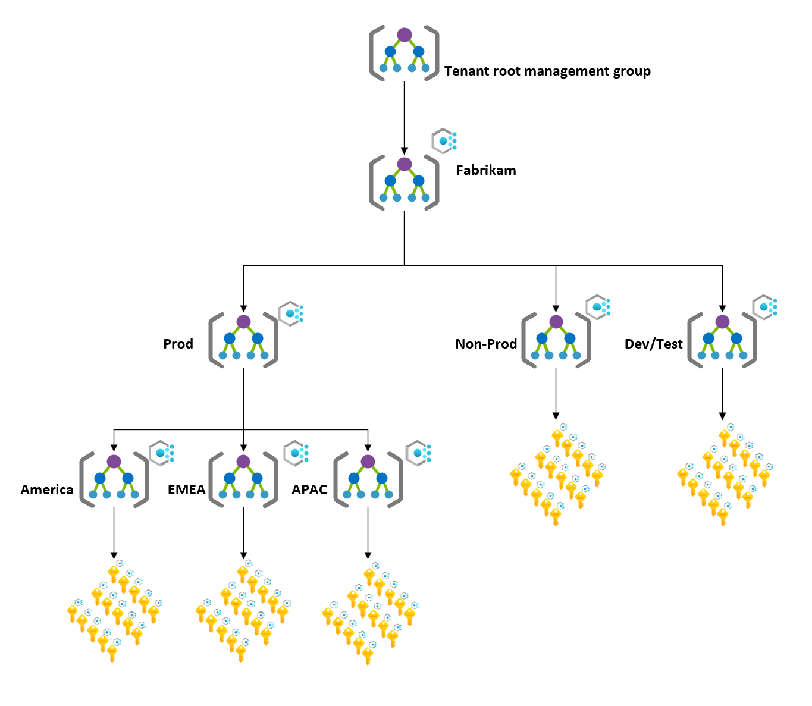

<!-- docutune:casing resourceType resourceTypes resourceId resourceIds -->

# Scenario: Transition a regional organization environment to the Azure landing zone conceptual architecture

This article describes considerations and instructions to migrate and transition your Azure environment into the Azure landing zone conceptual architecture. This scenario covers a regional organization with management groups that are separated into development, testing, and production (dev/test/prod) environments.

In this scenario, the customer has a large footprint on Azure. They have a management group hierarchy that's organized by dev/test/prod environments and then by region. Their current implementation limits their scalability and growth. They have applications deployed across the globe. A central IT team manages each region. In this scenario the regions are America; Europe, the Middle East, and Africa (EMEA); and Asia-Pacific (APAC).

The customer wants to move from their existing environment to the Azure landing zones conceptual architecture. This approach supports their *cloud first* strategy and has a robust platform that scales as the customer retires their on-premises datacenters.

## Current state

In this scenario, the current state of the customer's Azure environment consists of:

- Multiple management groups.
- A management group hierarchy based on dev/test/prod environments at the first level and then based on geography at the second level.
- An Azure subscription for each geography and application environment, such as dev/test/prod. This subscription is required to provide developers with a relaxed environment for testing and innovation.
- Some critical workloads that need the same governance model across dev/test/prod, which can create governance challenges for the customer.
- Nonuniform resource distribution. Platform and workload resources for a single environment are deployed in the same Azure subscriptions.
- Applications that are deployed into the respective subscriptions based on their region and environment classification, like dev/test/prod.
- Policy assignments, such as audit effects and deny effects, that are assigned at the management group and subscription level.
- The same set of Azure policies applied to all applications in the same region and in the same environment type.
- Role-based access control role assignments for each subscription and resource group.
- A hub virtual network, such as Azure VPN Gateway or Azure ExpressRoute, for hybrid connectivity.
- A virtual network for each application environment.
- A central IT team that controls and operates the respective management group for each region. The team faces some consistency, configuration, and compliance challenges when it comes to policies, access control, platform resources configuration, and security compliance because some applications are deployed into multiple regions.

The following diagram shows the current state of this sample scenario.

## Transition to the Azure landing zone conceptual architecture

Prior to implementing this approach, review [Azure landing zone conceptual architecture](./index.md), [Azure landing zone design principles](./design-principles.md), and [Azure landing zone design areas](./design-areas.md).

To transition from this scenario's current state to an Azure landing zone conceptual architecture, use this approach:

1. Deploy the [Azure landing zone accelerator](/azure/architecture/landing-zones/landing-zone-deploy#platform) into the same Microsoft Entra ID tenant in parallel with the current environment. This method provides a smooth and phased transition to the new landing zone architecture with minimal disruption to active workloads.

   This deployment creates a new management group structure. This structure aligns with Azure landing zones design principles and recommendations. It also ensures that these changes don't affect the existing environment.

   For more information, see [How to handle a dev/test/prod workload landing zone](./../enterprise-scale/faq.md#how-do-we-handle-devtestproduction-workload-landing-zones-in-azure-landing-zone-architecture).

   For information about using sandbox management group hierarchy to empower developers to test and experiment without affecting other environments, see [Azure Landing zone sandbox environments guidance](/azure/cloud-adoption-framework/ready/considerations/sandbox-environments).

   For information about minimizing disruption to applications and services during the migration, see [Adopt policy-driven guardrails guidance](../enterprise-scale/dine-guidance.md).

1. (Optional) Work with application or service teams to migrate the workloads that are deployed in the original subscriptions into new Azure subscriptions. For more information, see [Transition existing Azure environments to the Azure landing zone conceptual architecture](./../enterprise-scale/transition.md#move-resources-in-azure). You can place workloads into the newly deployed Azure landing zone conceptual architecture management group hierarchy under the correct management group, such as *corporate* or *online* in the following diagram.

   For details about the effect on resources when migrating, see [Policies](./../enterprise-scale/transition.md#policies).

   Eventually, you can cancel the existing Azure subscription, and place it in the decommissioned management group.

   > [!NOTE]
   > You don't necessarily have to migrate the existing applications or services into new landing zones, or Azure subscriptions.

1. Create new Azure subscriptions to provide landing zones that can support new applications and workloads. Place them under the proper management group, such as *corporate* or *online* in the following diagram.

   For more information, see [Readying your landing zone for migration guidance](../.././migrate/azure-migration-guide/ready-alz.md).

The following diagram shows the state of this scenario during the migration.

:::image type="content" source="./media/align-regional.svg" alt-text="Diagram that shows a single subscription environment in a transition state." border="false" lightbox="./media/align-regional.svg":::

## Summary

In this scenario, the customer established the necessary foundation to support their growth and scale plans for their workloads in Azure by deploying the [Azure landing zone conceptual architecture](./index.md#azure-landing-zone-architecture) in parallel to their existing environment.
