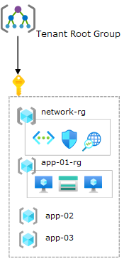

<!-- docutune:casing resourceType resourceTypes resourceId resourceIds -->

# Scenario: Transition a single subscription with no management groups to the Azure landing zone conceptual architecture

This article describes considerations and instructions to migrate and transition your Azure environment into the Azure landing zone conceptual architecture. This scenario covers a single subscription with no management groups.

In this scenario, the customer already uses Azure and already hosts a few applications or services within the platform. But their current implementation limits their scalability and growth related to their *cloud first* strategy.

As part of this expansion, they plan to migrate away from their on-premises datacenters and into Azure. During the migration, they lead with modernizing and transforming their applications or services to use cloud-native technologies where possible. For example, they might use Azure SQL Database and Azure Kubernetes Service (AKS). They know that it takes considerable time and effort, so they plan to *lift and shift* to start. Initially, this plan requires hybrid connectivity via services such as Azure VPN Gateway or Azure ExpressRoute.

The customer wants to move from their existing approach to an enterprise-scale architecture. This architecture supports their *cloud first* strategy and has a robust platform that scales as the customer eliminates their on-premises datacenters.

## Current state

In this scenario, the current state of the customer's Azure environment consists of:

- A single Azure subscription.
- No custom management groups.
- Nonuniform resource distribution. Platform and workload resources are deployed in the same Azure subscription.
- Minimal usage of Azure Policy. Policy assignments, such as audit effects and deny effects, are performed for each resource group, with exceptions.
- Resource groups that are treated as units of management and scale.
- Role-based access control role assignments for each resource group.
- A single virtual network.
  - No hybrid connectivity via services such as Azure VPN Gateway or Azure ExpressRoute.
  - A new subnet is created for each application.
- Multiple self-contained applications in each of the *app-xx-rg* resource groups. Applications are controlled and operated by different application or service teams.

The following diagram shows the current state of this scenario.

## Transition to the Azure landing zone conceptual architecture

Prior to implementing this approach, review [Azure landing zone conceptual architecture](./index.md) and [Azure landing zone design areas](./design-areas.md).

To transition from this scenario's current state to an Azure landing zone conceptual architecture, use this approach:

1. Deploy the [Azure landing zone accelerator](./index.md#platform-landing-zone-accelerator) into the same Microsoft Entra ID tenant in parallel with the current environment. This method provides a smooth and phased transition to the new landing zone architecture with minimal disruption to active workloads.

   This deployment creates a new management group structure. This structure aligns with Azure landing zones design principles and recommendations. It also ensures that these changes don't affect the existing environment.

1. (Optional) Work with application or service teams to migrate the workloads that are deployed in the original subscription into new Azure subscriptions. For more information, see [Transition existing Azure environments to the Azure landing zone conceptual architecture](./../enterprise-scale/transition.md#move-resources-in-azure). You can place workloads into the newly deployed Azure landing zone conceptual architecture management group hierarchy under the correct management group, such as *corporate* or *online* in the following diagram.

   For details about the effect on resources when migrating, see [Policies](./../enterprise-scale/transition.md#policies).

   Eventually, you can cancel the existing Azure subscription, and place it in the decommissioned management group.

   > [!NOTE]
   > You don't necessarily have to migrate the existing applications or services into new landing zones, or Azure subscriptions.

1. Create new Azure subscriptions to provide landing zones that can support migration projects from on-premises. Place them under the proper management group, such as *corporate* or *online* in the following diagram.

   For more information, see [Readying your landing zone for migration guidance](../.././migrate/azure-migration-guide/ready-alz.md).

The following diagram shows the state of this scenario during the migration.

:::image type="content" source="./media/align-single.svg" alt-text="Diagram that shows a single subscription environment in a transition state." border="false" lightbox="./media/align-single.svg":::

## Summary

In this scenario, the customer accomplished their expansion and scaling plans within Azure by deploying the [Azure landing zone conceptual architecture](./index.md#azure-landing-zone-architecture) in parallel to their existing environment.
