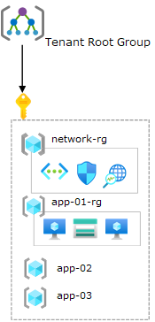

<!-- docutune:casing resourceType resourceTypes resourceId resourceIds -->

# Scenario: Transition existing Azure environments to the Azure landing zone conceptual architecture

This page describes an example scenario that might match your current Azure environment. We detail steps and considerations about how to migrate and transition your Azure environment into the Azure landing zone conceptual architecture. The scenario covers a single subscription with no management groups.

<!-- ## Scenario 1: Single subscription with no management groups (Add this heading and change sub-headings to H3s when another example is added) -->

In this scenario, the customer has already started to use Azure and already hosts a few applications or services within the platform. But, they've realized their current implementation is limiting their scalability and growth per their "cloud first" strategy.

As part of this expansion, they're also planning to migrate away from their on-premises datacenters into Azure. And they'll modernize and transform their applications or services using cloud-native technologies where possible. For example, they might use Azure SQL Database and Azure Kubernetes Service (AKS). But, they appreciate that it will take considerable time and effort, so they plan to "lift-and-shift". Initially, this plan will require hybrid connectivity (VPN/ExpressRoute).

The customer has evaluated the Azure landing zones conceptual architecture. And they've decided to move from their existing approach to an enterprise-scale architecture. Doing so supports their "cloud first" strategy while having a robust platform that scales with them as they eliminate their on-premises datacenters.

## Current state

In this scenario, the current state of the customer's Azure environment is as follows:

- Single Azure subscription.
- No custom management groups.
- Non-uniform resource distribution. Platform and workload resources are deployed in the same Azure subscription.
- Minimal usage of Azure Policy. Policy assignments (audit and deny effects) are done per resource group with exceptions.
- Resource groups are treated as units of management and scale.
- RBAC role assignments per resource group.
- Azure Blueprints are being used.
- Single VNet
  - No hybrid connectivity (VPN/ExpressRoute).
  - A new subnet is created per application.
- Multiple self-contained applications in each of the `app-xx-rg` resource groups.
  - Controlled and operated by different application or service teams.

The following diagram shows the current state of this sample scenario:

## Transition to the Azure landing zone conceptual architecture

To transition from this scenario's current state to an Azure landing zone conceptual architecture, we suggest this approach:

1. Review the [Azure landing zone conceptual architecture](./index.md) and [Azure landing zone design areas](./design-areas.md).
2. Deploy the [Azure landing zone accelerator](./index.md#azure-landing-zone-accelerator) into the same Azure AD tenant in parallel with the current environment.

   Doing so creates a new management group structure. This structure is aligned with Azure landing zones design principles and recommendations. It also ensures that the existing environment is not affected by these changes.
1. (optional) Work with application or service teams to migrate the workloads deployed in the original subscription into new Azure subscriptions, per the guidance in [Transition existing Azure environments to the Azure landing zone conceptual architecture](./../enterprise-scale/transition.md#moving-resources-in-azure). They can be placed into the newly deployed Azure landing zone conceptual architecture management group hierarchy under the correct management group – corporate or online.
  
   Review the policy section in [Transition existing Azure environments to the Azure landing zone conceptual architecture](./../enterprise-scale/transition.md#policy) for details about the effect on resources when migrating. Eventually, the existing Azure subscription can be canceled and placed in the decommissioned management group.

   > [!NOTE]
   > The existing applications or services do not necessarily have to be migrated into new landing zones (Azure subscriptions)

4. Create new Azure subscriptions to provide landing zones that can support migration projects from on-premises. Place them under the proper management group (corporate or online).

The following diagram shows the state during the migration approach of this sample scenario:

:::image type="content" source="./media/alz-align-single-sub-transition-state.png" alt-text="Single subscription environment - transition state" lightbox="./media/alz-align-single-sub-transition-state.png":::

## Summary

In this scenario, the customer has helped themselves achieve their expansion and scaling plans within Azure by deploying the [Azure landing zone conceptual architecture](./index.md#azure-landing-zone-conceptual-architecture) in parallel to their existing environment.
