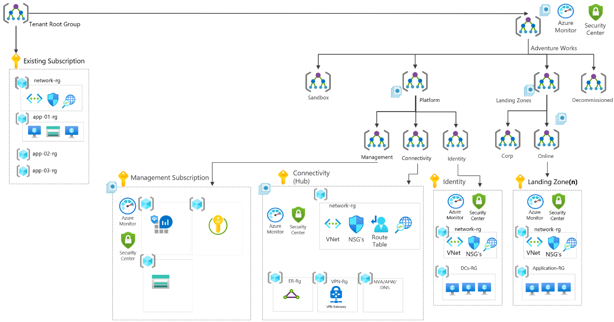

<!-- docutune:casing resourceType resourceTypes resourceId resourceIds -->

# Scenarios: Transitioning existing Azure environments to the Azure landing zone conceptual architecture

This page will detail example scenarios, that may match your current Azure environment, and will detail steps and considerations in relation to how to migrate and transition your Azure environment into the Azure landing zone conceptual architecture.

## Scenario 1: Single subscription with no management groups

In this scenario the customer already has started to use Azure and already hosts a few applications/services within the platform, however, they have realized that their current implementation is limiting their scalability and growth as per their "cloud first" strategy.

As part of this expansion, they are also planning to migrate away from their on-premises datacenters into Azure, whilst modernizing and transforming their applications/services using cloud native technologies where possible, like Azure SQL Database and Azure Kubernetes Service (AKS). However, they appreciate that this will take considerable time and effort so plan to "lift-and-shift" initially; this will require hybrid connectivity (VPN/ExpressRoute).

The customer has evaluated the Azure landing zones conceptual architecture and decided to move from their existing approach to an enterprise-scale architecture to support their "cloud first" strategy; whilst having a robust platform that can scale with them as they evacuate their on-premises datacenters.

### Current state

In this scenario the customers current state of their Azure environment is as follows:

- Single Azure subscription
- No custom management groups.
- Non-uniform resource distribution. Platform and workload resources are deployed in the same Azure subscription.
- Minimal usage of Azure Policy, and policy assignments (audit and deny effects) are done per resource group with exceptions.
- Resource groups are treated as unit of management and scale.
- RBAC role assignments per resource group.
- Azure Blueprints are being used.
- Single VNet
  - No hybrid connectivity (VPN/ExpressRoute)
  - A new subnet is created per application.
- Multiple self-contained applications in each of the `app-xx-rg` resource groups
  - These are controlled and operated by different application/service teams.

The following diagram depicts the current state of this sample scenario:

### Transition to the Azure landing zone conceptual architecture

To transition from this scenario's current state to an Azure landing zone conceptual architecture the following approach is suggested:

1. Review the [Azure landing zone conceptual architecture](./index.md) & [Azure landing zone design areas](./design-areas.md)
2. Deploy the [Azure landing zone accelerator](./index.md#azure-landing-zone-accelerator) into the same Azure AD tenant in parallel with the current environment.
   1. This will create a new management group structure which is aligned with Azure landing zones design principles and recommendations, whilst it ensures that existing environment is not affected by these changes.
3. (optional) work with application/service teams to migrate the workloads deployed in the original subscription into new Azure subscriptions, as per guidance in [Transition existing Azure environments to the Azure landing zone conceptual architecture](./../enterprise-scale/transition.md#moving-resources-in-azure), placed into the newly deployed Azure landing zone conceptual architecture management group hierarchy at the correct scope, corporate or online management groups. -  Review the policy section in [Transition existing Azure environments to the Azure landing zone conceptual architecture](./../enterprise-scale/transition.md#policy) details on impact to resources when migrating.\
   Eventually the existing Azure subscription can be canceled and placed in the decommissioned management group

   > [!NOTE]
   > The existing applications/services do not necessarily have to be migrated into new landing zones (a.k.a. Azure subscriptions)

4. Create new Azure subscriptions to provide landing zones to support migration projects from on-premises, and place under the suited management group (corporate or online).

The following diagram depicts the state during the migration approach of this sample scenario:

### Summary

In this scenario the customer has enabled themselves to achieve their expansion and scaling plans within Azure by deploying the [Azure landing zone conceptual architecture](./index.md#azure-landing-zone-conceptual-architecture) in parallel to their existing environment.
