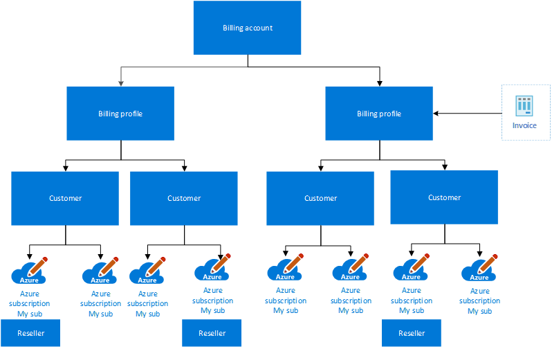

# Plan for the Cloud Solution Provider service

The Cloud Solution Provider (CSP) service gives Microsoft partners access to Microsoft cloud services within one platform. It supports partners to:

- Own the customer lifecycle and end-to-end relationship.
- Set pricing, terms, and directly bill customers.
- Directly provision and manage subscriptions.
- Attach services that add value.
- Be the customer's first point of contact for support.

[Azure in CSP](https://azure.microsoft.com/offers/ms-azr-0145p/) is an Azure plan with various subscriptions that are hosted by the partner's [Microsoft Partner Agreement (MPA)](/azure/cost-management-billing/understand/mpa-overview). The MPA is similar to the Microsoft customer agreement. Both are hosted on the modern commerce platform and use a [simplified purchase agreement](https://www.microsoft.com/licensing/docs/customeragreement).

> [!IMPORTANT]
> The partner CSP completely manages an MPA.

## Design considerations

- A [CSP reseller relationship](/partner-center/request-a-relationship-with-a-customer) must exist between the partner and each Microsoft Entra tenant in which the customer wants to provision a new Azure plan and CSP subscriptions.

- Only the partner can provision an Azure plan and CSP subscriptions.

- A specific set of criteria can be used to determine whether a subscription should be suspended; a partner can also suspend a subscription.

- The partner can allow customers to view their Azure usage fees on a per customer basis. For more information, see [Enable the policy to view Azure usage charges](/azure/cost-management-billing/costs/get-started-partners#enable-cost-management-for-customer-tenant-subscriptions). Partners can also use other tools to provide customers with access to their charges.

- By default, only the partner Azure Reservations can be purchased by the partner for their customer. However, the [**Customer Permissions** feature](/partner-center/give-customers-permission) grants customers permission to purchase Azure Reservations from their CSP.

## Design recommendations

- Work with your CSP partner to ensure that Azure Lighthouse is used for administer on behalf of (AOBO) access for most support scenarios. For more information, see [Azure Lighthouse and the Cloud Solution Provider program](/azure/lighthouse/concepts/cloud-solution-provider).

- Partners, should use, or migrate, to [granular delegated admin privileges (GDAP)](/partner-center/gdap-introduction) instead of utilizing delegated admin privileges (DAP).

- Follow and implement the [Customer security best practices](/partner-center/customer-security-best-practices)

- Partners should follow and implement the [CSP security best practices](/partner-center/csp-security-best-practices)

- Work with your CSP partner to understand how to create support cases and escalation processes.

- Discuss how to create self-service subscriptions with your CSP partner.

- Use [Microsoft Cost Management](/azure/cost-management-billing/cost-management-billing-overview) reports and views. These reports can use Azure metadata, like tags and location, to explore and analyze your organization's costs.

- Any user that has permissions upon an invoice section, billing profile or billing account to create subscriptions, as detailed [here](/azure/cost-management-billing/manage/understand-mca-roles#subscription-billing-roles-and-tasks), must be protected with multifactor authentication (MFA) as any other privileged account should be as documented in [here](/entra/identity/role-based-access-control/security-planning?bc=%2Fazure%2Fcloud-adoption-framework%2F_bread%2Ftoc.json&toc=%2Fazure%2Fcloud-adoption-framework%2Ftoc.json)

## Next steps

Learn how to improve your security posture by defining your Microsoft Entra tenants.

> [!div class="nextstepaction"]
> [Define Microsoft Entra tenants](azure-ad-define.md)
