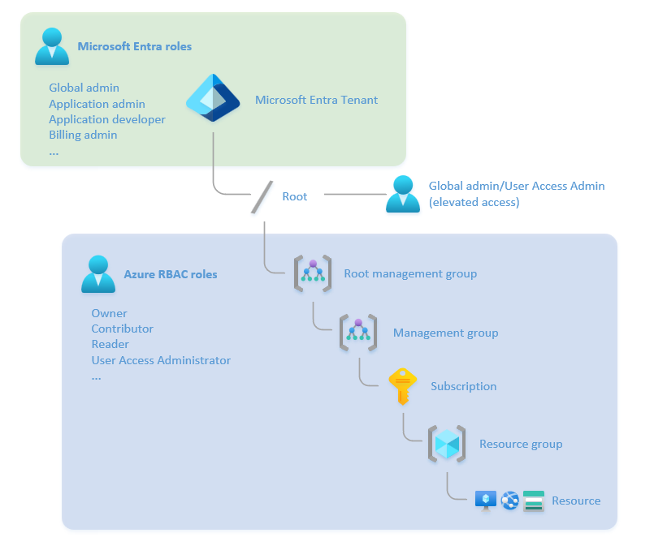

# Landing zone identity and access management

Once you have identified your Identity architecture, the next step is about authorization. Consider which resources each authenticated principal has or needs access to, and how to mitigate risks of unauthorized access to your resources. This design area helps you implement [Enterprise access strategy in Azure](/security/privileged-access-workstations/privileged-access-access-model#evolution-from-the-legacy-ad-tier-model), and the different control planes that need to be secured.

Use Azure role-based access control (RBAC) to manage administrative access to Azure resources. The design principle of subscription democratization allows application administrators to manage their own workloads within the policy guardrails set by the platform owner.

Consider whether users require permissions on a narrow scope, such as an administrator for a single application, or broad scope, such as a network administrator across multiple application workloads. In either case, follow the principle of just-enough-access, and ensure that the user has only the roles required for their normal activities, using custom roles and privileged identity management (PIM) where necessary.

## Design considerations

### Role-Based Access Control (RBAC)

> [!IMPORTANT]
>
> Classic resources and classic administrators will be [retired on August 31, 2024](https://azure.microsoft.com/updates/cloud-services-retirement-announcement/). Remove unnecessary Co-Administrators and use Azure RBAC for fine-grained access control.

- Understand the difference between Microsoft Entra ID roles and Azure RBAC roles.

  - Entra ID roles control the administrative privileges to tenant-wide services such as Microsoft Entra ID, and other Microsoft services including Teams, Exchange Online, and Intune.

  - Azure RBAC roles control the administrative privileges to Azure resources such as virtual machines, subscriptions, and resource groups. For more information, see [What is Azure role-based access control (Azure RBAC)?](/azure/role-based-access-control/overview).

  - The Azure RBAC Owner and User Access Administrator roles can modify the role assignments on Azure resources. By default, the Microsoft Entra Global Administrator role does not have permission to manage access to Azure resources, as this must be explicitly enabled. See [Elevate access to manage all Azure subscriptions and management groups](/azure/role-based-access-control/elevate-access-global-admin) for more information.

The relationship between Microsoft Entra ID roles and Azure RBAC roles is shown in the diagram.

- Microsoft Entra roles can be assigned to groups with the `isAssignableToRole` property set to `true` (‘Role-assignable groups’). Groups with this property set are protected and their membership can only be modified by Global Administrators or Privileged Role Administrators, or the group’s owner. See [Use Microsoft Entra groups to manage role assignments](/azure/active-directory/roles/groups-concept).

- Only some roles can reset the password or MFA settings for another administrator. This behavior prevents an administrator from gaining extra permissions by resetting the credentials of a higher-privileged account. See [Microsoft Entra built-in roles - who can reset passwords](/azure/active-directory/roles/permissions-reference#who-can-reset-passwords) to understand administrator password reset rights.

- If the Azure built-in roles don't meet the specific needs of your organization, you can create your own custom roles. Just like built-in roles, you can assign custom roles to users, groups, and service principals at management group, subscription, and resource group scopes. For more information, see [Azure custom roles - Azure RBAC](/azure/role-based-access-control/custom-roles).

- For built-in Microsoft Entra role-based access control (RBAC) roles, you can use the free version of Microsoft Entra ID, but for custom Microsoft Entra roles, you need Microsoft Entra ID Premium. For more information, see [Create and assign a custom role in Microsoft Entra ID](/azure/active-directory/roles/custom-create#prerequisites).

- When you lay down a framework for identity and access management (IAM) and governance, consider the following maximum service limits for roles, role assignments, and custom roles. For more information, see  [Troubleshoot Azure RBAC limits](/azure/role-based-access-control/troubleshoot-limits).

  - 4,000 role assignments per subscription.

  - 500 role assignments per management group.

  - 30 Microsoft Entra custom roles in a Microsoft Entra organization.

- Some Azure RBAC roles support Attribute-Based Access Control (ABAC), or role assignment conditions. Conditions allow administrators to dynamically assign roles based on attributes of the resource. For example, you can assign the Storage Blob Data Contributor role, but only for blobs that have a specific index tag applied rather than all the blobs in a container. See [What is Azure attribute-based access control (Azure ABAC)?](/azure/role-based-access-control/conditions-overview) for more information.

## Design recommendations

### General recommendations

- Enforce [multifactor authentication (MFA)](/azure/active-directory/authentication/concept-mfa-howitworks) for users with rights to the Azure environments. Many compliance frameworks require multi-factor authentication enforcement. Multi-factor authentication greatly lowers the risk of credential theft and unauthorized access.

- Use Microsoft Entra [Conditional Access](/azure/active-directory/conditional-access/overview) policies for users with rights to Azure environments. Conditional Access provides another mechanism to help protect a controlled Azure environment from unauthorized access.

- Enable [Defender for Identity](/defender-for-identity/what-is) to protect user identities and make it harder to  compromise user credentials. Defender for Identity identifies suspicious user activities and provides incident timelines, and can be used with Conditional Access to deny high-risk authentication attempts.

- Use Azure Sentinel to provide additional threat intelligence and investigative capability. Sentinel uses logs from Log Analytics, Microsoft Entra ID, Microsoft 365 and other services for proactive threat detection, investigation, and response. For more information, see [Identify advanced threats with User and Entity Behavior Analytics (UEBA) in Microsoft Sentinel](/azure/sentinel/identify-threats-with-entity-behavior-analytics).

- Use separate, cloud-only accounts for administrative activity. Do not use the same account for web browsing and e-mail access as you do for Azure administration. For more information on securing administrative access, see [Secure access practices for administrators in Microsoft Entra](/azure/active-directory/roles/security-planning).

- Create [emergency access or “break glass” accounts](/azure/active-directory/roles/security-emergency-access) to avoid accidentally being locked out of your Microsoft Entra ID organization. Emergency access accounts are highly privileged and are not assigned to specific individuals. Store the credentials for the accounts securely, monitor their use, and test them regularly to ensure they can be used in the event of a disaster.

### Microsoft Entra ID recommendations

- Use Entra Identity Governance and create Access Packages to control group membership, with an approval process and regular access reviews for privileged group members. See [What is entitlement management? - Microsoft Entra](/azure/active-directory/governance/entitlement-management-overview) for more information.

- To make role assignments more manageable, avoid assigning roles directly to users. Instead, assign roles to groups. Assigning roles to groups instead of users also helps minimize the number of role assignments, which has a [limit of role assignments per subscription](/azure/azure-resource-manager/management/azure-subscription-service-limits#azure-rbac-limits).

- Use [Microsoft Entra built-in roles](/azure/active-directory/roles/permissions-reference) to manage the following identity settings from a tenant level:

   | Role | Usage | Note
   |---|---|---|
   | Global Admin | Can manage all aspects of Microsoft Entra ID and Microsoft services that use Microsoft Entra identities. | Don't assign more than five people to this role.|
   | Hybrid Identity Administrator | Can manage Active Directory to Microsoft Entra cloud provisioning, Microsoft Entra Connect, Pass-through Authentication (PTA), Password hash synchronization (PHS), Seamless Single sign-on (Seamless SSO), and federation settings. | |
   | Security Administrator | Can read security information and reports, and manage configuration in Microsoft Entra ID and Office 365. | |
   | Application Administrator | Can create and manage all aspects of app registrations and enterprise apps. | Cannot grant tenant-wide admin consent|

- When delegating administrative responsibility to others, consider whether they require the full set of privileges, or only a subset. For example, the User Access Administrator role may be delegated to a user who needs to manage access to Azure resources, but not manage the resources themselves. To restrict their objects and security principals that they can apply permissions to, use [delegated role assignments with conditions](/azure/role-based-access-control/delegate-role-assignments-overview).

- Do not use a higher-privileged role to carry out an activity that could be done with a lower-privileged role. For example, use the User Administrator role to manage users, not the Global Administrator role. For details of roles and their permissions, refer to the [Microsoft Entra build-in roles permissions](/azure/active-directory/roles/permissions-reference). Additionally, the Azure Portal will indicate which roles and role permissions are privileged. See [Privileged roles and permissions in Microsoft Entra ID](/azure/active-directory/roles/privileged-roles-permissions) for more information.

- Use [Administrative Units](/azure/active-directory/roles/administrative-units) to provide restricted management of specific objects in your tenant from modification to a specific set of administrators. Administrative units allow for delegated administration of a subset of the directory, such as a service desk that serves only a single business unit within a wider organization. Use the [Restricted management administrative units](/azure/active-directory/roles/admin-units-restricted-management) feature to further protect specific objects from modification.

### Azure RBAC recommendations

- Use [Azure built-in roles](/azure/role-based-access-control/built-in-roles) to provide predefined role assignments to Azure resources. General platform roles, as well as specific Resource roles exist.

- If the Azure built-in roles don't meet your organization's specific needs, you can create your own [custom roles](/azure/role-based-access-control/custom-roles). Consider the following key role definitions when you create custom roles within the Microsoft Entra Tenant. The wildcard \* under `Actions` means the principal assigned to this role can do all actions. The actions under `NotActions` are subtracted from `Actions`.

   | Role | Usage | Actions | NotActions |
   |---|---|---|---|
   | Azure platform owner (such as the built-in Owner role) | Management group and subscription lifecycle management | `*` | |
   | Network management (NetOps) | Platform-wide global connectivity management: Virtual networks, UDRs, NSGs, NVAs, VPN, Azure ExpressRoute, and others  | `*/read`,  `Microsoft.Network/*`,  `Microsoft.Resources/deployments/*`,  `Microsoft.Support/*` | |
   | Security operations (SecOps) | Security Administrator role with a horizontal view across the entire Azure estate and the Azure Key Vault purge policy | `*/read`,  `*/register/action`,  `Microsoft.KeyVault/locations/deletedVaults/purge/action`,  `Microsoft.PolicyInsights/*`,  `Microsoft.Authorization/policyAssignments/*`, `Microsoft.Authorization/policyDefinitions/*`, `Microsoft.Authorization/policyExemptions/*`, `Microsoft.Authorization/policySetDefinitions/*`, `Microsoft.Insights/alertRules/*`,   `Microsoft.Resources/deployments/*`,  `Microsoft.Security/*`,  `Microsoft.Support/*` | |
   | Subscription owner  | Delegated role for subscription owner generated from subscription Owner role  | `*` | `Microsoft.Authorization/*/write`, `Microsoft.Network/vpnGateways/*`,  `Microsoft.Network/expressRouteCircuits/*`,  `Microsoft.Network/routeTables/write`,  `Microsoft.Network/vpnSites/*` |
   | Application owners (DevOps, AppOps) | Contributor role granted for application/operations team at Subscription scope  | `*` | `Microsoft.Authorization/*/write`, `Microsoft.Network/publicIPAddresses/write`,  `Microsoft.Network/virtualNetworks/write`,  `Microsoft.KeyVault/locations/deletedVaults/purge/action`  |

### Privileged Identity Management (PIM) recommendations

- Use Microsoft Entra [Privileged Identity Management (PIM)](/azure/active-directory/privileged-identity-management/pim-configure) to establish zero-trust and least privilege access. Map your organization's roles to the minimum access levels needed. Microsoft Entra PIM can use Azure native tools, extend current tools and processes, or use both current and native tools as needed.

- Use [PIM access reviews](/azure/active-directory/privileged-identity-management/pim-create-roles-and-resource-roles-review) to regularly validate resource entitlements. Access reviews are part of many compliance frameworks, so many organizations already have an access review process in place.

- Use privileged identities for automation runbooks that require elevated access permissions, or for privileged deployment pipelines. Use the same tools and policies to govern automated workflows that access critical security boundaries as you use to govern users of equivalent privilege.

- Control highly privileged Azure RBAC roles, such as Owner or User Access Administrator on a subscription or management group, using [Privileged Identity Management (PIM) for Groups](/azure/active-directory/privileged-identity-management/concept-pim-for-groups). With PIM for groups, Azure RBAC roles can be configured to require the same elevation process as Microsoft Entra ID roles.

- Use Protected actions with PIM (Privileged Identity Management) to add additional layer of protection. Protected actions in Microsoft Entra ID are permissions that have been assigned [Conditional Access policies](/azure/active-directory/conditional-access/overview). When a user attempts to perform a protected action, they must first satisfy the Conditional Access policies assigned to the required permissions. For example, to allow administrators to update cross-tenant access settings, you can require that they first satisfy the [Phishing-resistant MFA policy](/azure/active-directory/authentication/concept-authentication-strengths#built-in-authentication-strengths). See [What are protected actions in Microsoft Entra](/azure/active-directory/roles/protected-actions-overview) for more information.

For more information on PIM, see [Privileged Identity Management (PIM) - Microsoft Entra](/azure/active-directory/privileged-identity-management/pim-configure).

## Identity and access management in the Azure landing zone accelerator

Identity and access management are core features of the Azure landing zone accelerator implementation. The deployment includes a subscription dedicated to identity, where organizations can deploy Active Directory domain controllers required for their environments.

The implementation also includes options to:

- Assign recommended policies to govern identity and domain controllers.
- Create a virtual network, and connect to the hub via virtual network peering.
