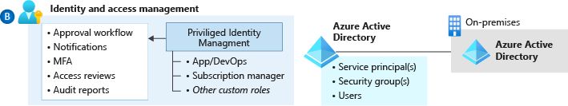

# Azure identity and access management design area

This critical design area establishes a foundation for the management of identity and access.

## Design area review

**Involved roles or functions:** This design area likely requires support from one or more of the following functions or roles. These roles can help make decisions and implement those decisions: 

- [Cloud platform](../../../organize/cloud-platform.md)
- [Cloud center of excellence](../../../organize/cloud-center-of-excellence.md)

**Scope:** The goal of this exercise is to evaluate options for your identity and access foundation. At minimum, you should make decisions about your approach for synchronizing identities with Azure Active Directory:

- Authenticating users
- Assigning access to resources
- Any core requirements for separation of duties

**Out of scope:** This design area forms a foundation for proper access control. But, it doesn't fully address more advanced issues like:

- Zero trust
- Operational management of elevated privileges
- Automated guardrails to prevent common identity and access mistakes

That guidance is reviewed in the compliance design areas related to [security](./security.md) and [governance](./governance.md). Those areas usually require a broader audience to make and act on decisions.

## Design area overview

Identity provides the basis for a large percentage of security assurance. It grants access based on identity authentication and authorization controls in cloud services. Access control protects data and resources and helps decide which requests should be permitted.

Identity and access management (IAM) is boundary security in the public cloud. It must be treated as the foundation of any secure and fully compliant public cloud architecture. Azure offers a comprehensive set of services, tools, and reference architectures to help organizations make highly secure, operationally efficient environments as outlined here.

This section examines design considerations and recommendations related to IAM in a cloud environment.

The technological landscape in the enterprise is becoming complex and heterogenous. To manage compliance and security for this environment, IAM lets the right individuals access the right resources at the right time for the right reasons.

### Azure Active Directory design considerations

A critical design decision that an enterprise organization must make when adopting Azure is whether to extend a current on-premises identity domain into Azure or to create a brand new one.

Requirements for authentication inside the landing zone should be thoroughly assessed and incorporated into plans to deploy Active Directory Domain Services (AD DS) in Windows Server, Azure AD Domain Services (Azure AD DS), or both.

Most Azure environments will use at least Azure AD for Azure fabric authentication and AD DS local host authentication and group policy management.

- Consider centralized and delegated responsibilities to manage resources deployed inside the landing zone.
- Explore the [authentication methods offered by Azure Active Directory](/azure/active-directory/hybrid/choose-ad-authn) as part of your identity planning
- Applications that rely on domain services and use older protocols can use [Azure AD DS](/azure/active-directory-domain-services).
- There's a difference between Azure AD, Azure AD DS, and AD DS running on Windows Server. Evaluate your application needs, and understand and document the authentication provider that each one will be using. Plan then for all applications.

### Prerequisites for a landing zone - design considerations

#### Role-based access control (RBAC) - design considerations

- Limits exist for the number of custom roles and role assignments that you must consider when you lay down a framework around IAM and governance. For more information, see [Azure RBAC service limits](/azure/azure-resource-manager/management/azure-subscription-service-limits#azure-role-based-access-control-limits).
- There's a limit of 2,000 role assignments per subscription.
- There's a limit of 500 role assignments per management group.

#### Managed identities - design considerations

- Which tasks and functions should the organization control with managed identities?
- Which services or applications within your landing zone support Azure Active Directory authentication?
- Explore [which Azure services can use managed identities](/azure/active-directory/managed-identities-azure-resources/services-support-managed-identities)
- Explore [managed identities for Azure resources](/azure/active-directory/managed-identities-azure-resources/overview) capabilities in further detail

### Identity for Azure platform resources - design considerations

### Platform access - design considerations

- Centralized versus federated resource ownership:
  - Shared resources or any aspect of the environment that implements or enforces a security boundary, such as the network, must be managed centrally. This requirement is part of many regulatory frameworks. It's standard practice for any organization that grants or denies access to confidential or critical business resources.
  - Managing application resources that don't violate security boundaries can be delegated to application teams. Consider delegating other aspects that are required to maintain security and compliance as well. Letting users provision resources within a securely managed environment lets organizations:
       - Take advantage of the agile nature of the cloud
       - Prevent the violation of any critical security or governance boundary
  - Depending on the definition of the centralized or federated resource ownership, custom roles might differ. The custom roles for the centralized resource ownership are limited and might need extra rights depending on the responsibility model. For example, in some organizations a NetOps role might only need to manage and configure global connectivity. But, in other organizations that need a more centralized approach, enrich the NetOps role with more allowed actions, like creating peering between the hub and the spokes.

### Workload access - design considerations

- Based on your cloud operating model, which teams will require access to workloads within the landing zone?
- What roles or functions will those teams with access carry out?
- What is the minimum level of privilege they would require to carry out their responsibilities?

### Hosting infrastructure as a service (IaaS) identity solutions - design considerations

- Does the organization need to extend a current on-premises Active Directory domain into Azure?
- Are there applications that are partly hosted on-premises and partly hosted in Azure?

## Identity and access management design recommendations

### Azure Active Directory - design recommendations

- Use centralized and delegated responsibilities to manage resources deployed inside the landing zone based on role and security requirements.
- These types of privileged operations require special permissions:
  - Creating service principal objects
  - Registering applications in Azure AD
  - Procuring and handling certificates or wildcard certificates

  Consider which users will be handling such requests and how to secure and monitor their accounts with the necessary diligence.
- If an organization has a scenario where an application that uses integrated Windows authentication must be accessed remotely through Azure AD, consider using [Azure AD Application Proxy](/azure/active-directory/manage-apps/application-proxy).
- Evaluate the compatibility of workloads for AD DS on Windows Server and for Azure AD DS.
- Ensure your network design allows resources that require AD DS on Windows Server for local authentication and management to access the appropriate domain controllers.
  - For AD DS on Windows Server, consider shared services environments that offer local authentication and host management in a larger enterprise-wide network context.
- Deploy Azure AD DS within the primary region because this service can only be projected into one subscription. The Azure AD DS-managed domain can be expanded to further regions with [replica sets](/azure/active-directory-domain-services/concepts-replica-sets).
- Use managed identities instead of service principals for authentication to Azure services. This approach reduces exposure to credential theft.

### Prerequisites for a landing zone - design recommendations

- Use [Azure RBAC](/azure/role-based-access-control/overview) to manage data-plane access to resources, where possible. Examples are Azure Key Vault, a storage account, or an SQL database.
- Deploy Azure AD conditional-access policies for any user with rights to Azure environments. Doing so provides another mechanism to help protect a controlled Azure environment from unauthorized access.
- Enforce multifactor authentication for any user with rights to the Azure environments. Multifactor authentication enforcement is a requirement of many compliance frameworks. It greatly lowers the risk of credential theft and unauthorized access.

- Don't add users directly to Azure resource scopes. Instead add users to defined roles, which are then assigned to resource scopes. Direct user assignments circumvent centralized management, greatly increasing the management required to prevent unauthorized access to restricted data.

- Use custom role definitions within the Azure AD tenant while you consider the following key roles:

   | Role | Usage | Actions | No actions |
   |---|---|---|---|
   | Azure platform owner (such as the built-in Owner role)               | Management group and subscription lifecycle management                                                           | `*`                                                                                                                                                                                                                  |                                                                                                                                                                                         |
   | Network management (NetOps)        | Platform-wide global connectivity management: virtual networks, UDRs, NSGs, NVAs, VPN, Azure ExpressRoute, and others            | `*/read`, `Microsoft.Network/*`, `Microsoft.Resources/deployments/*`, `Microsoft.Support/*`                            |                                                                                                                                                                               |
   | Security operations (SecOps)       | Security Administrator role with a horizontal view across the entire Azure estate and the Azure Key Vault purge policy | `*/read`, `*/register/action`, `Microsoft.KeyVault/locations/deletedVaults/purge/action`, `Microsoft.PolicyInsights/*`, `Microsoft.Authorization/policyAssignments/*`, `Microsoft.Authorization/policyDefinitions/*`, `Microsoft.Authorization/policyExemptions/*`, `Microsoft.Authorization/policySetDefinitions/*`, `Microsoft.Insights/alertRules/*`, `Microsoft.Resources/deployments/*`, `Microsoft.Security/*`, `Microsoft.Support/*` |                                                                            |
   | Subscription owner                 | Delegated role for subscription owner generated from subscription Owner role                                       | `*`                                                                                                                                                                                                                  | `Microsoft.Authorization/*/write`, `Microsoft.Network/vpnGateways/*`, `Microsoft.Network/expressRouteCircuits/*`, `Microsoft.Network/routeTables/write`, `Microsoft.Network/vpnSites/*` |
   | Application owners (DevOps/AppOps) | Contributor role granted for application/operations team at resource group level                                 | `*`                                                                                                                                                                                                                   | `Microsoft.Authorization/*/write`, `Microsoft.Network/publicIPAddresses/write`, `Microsoft.Network/virtualNetworks/write`, `Microsoft.KeyVault/locations/deletedVaults/purge/action`                                         |

- Use Azure AD-managed identities for Azure resources to avoid authentication based on user names and passwords. Many security breaches of public cloud resources originate with credential theft embedded in code or other text sources. For this reason, enforcing managed identities for programmatic access greatly reduces the risk of credential theft.

- Use Microsoft Defender for Cloud just-in-time access for all infrastructure as a service (IaaS) resources. Doing so lets you enable network-level protection for ephemeral user access to IaaS virtual machines.

- Use [Azure AD Privileged Identity Management (PIM)](/azure/active-directory/privileged-identity-management/pim-configure) to establish zero-standing access and least privilege. Map your organization's roles to the minimum level of access needed. Azure AD PIM can:
  - Be an extension of current tools and processes
  - Use Azure native tools as outlined
  - Use both as needed

- Use Azure AD PIM access reviews to periodically validate resource entitlements. Access reviews are part of many compliance frameworks. As a result, many organizations will already have a process in place to address this requirement.

- Use privileged identities for automation runbooks that require elevated access permissions. Automated workflows that violate critical security boundaries should be governed by the same tools and policies users of equivalent privilege are.

### Identity for Azure platform resources - design recommendations

### Platform access - design recommendations

- Use Azure AD-only groups for Azure control-plane resources in Azure AD PIM when you grant access to resources.
  - Add on-premises groups to the Azure AD-only group if a group management system is already in place.
    - By using Azure AD-only groups, you can add both users and groups that are synchronized from on-premises, via Azure AD Connect. You can also add Azure AD-only (also known as cloud only) users and groups to a single Azure AD-only group, including guest users.
    - Also, groups that are synchronized from on-premises can only be managed and updated from the identity source of truth (on-premises Active Directory). These groups can only contain members from the same identity source, which doesn't provide flexibility like Azure AD-only groups do.

- Integrate Azure AD logs with the platform-central [Log Analytics workspace](/azure/azure-monitor/logs/data-platform-logs). It allows for a single source of truth around log and monitoring data in Azure, which gives organizations cloud-native options to meet requirements around log collection and retention.
- If any data sovereignty requirements exist, custom user policies can be deployed to enforce them.

### Hosting infrastructure as a service (IaaS) identity solutions - design recommendations

- See the following guidance for [deploying Active Directory Domain Services](/azure/architecture/reference-architectures/identity/adds-extend-domain) in Azure

## Identity and access management in the Azure landing zone accelerator

Identity and access management are core features of the Azure landing zone accelerator implementation.
The deployment includes a subscription dedicated to identity, where customers can deploy the Active Directory domain controllers required for their environment.

The implementation also includes options to assign recommended policies to govern identity and domain controllers.
