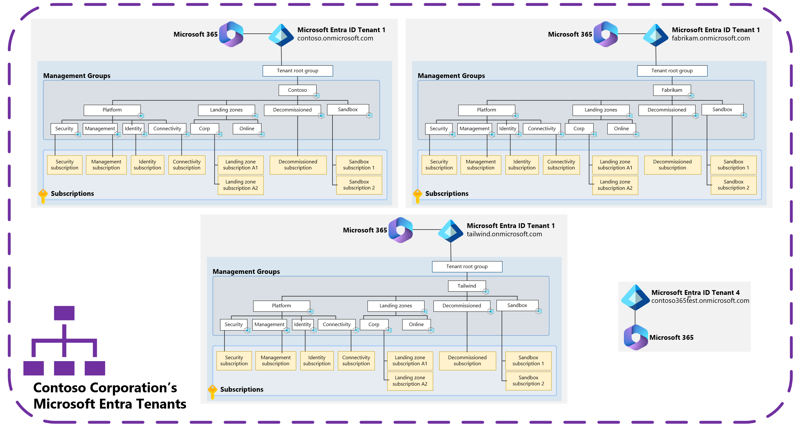

# Considerations and recommendations for multitenant Azure landing zone scenarios

The article, [Azure landing zones and multiple Microsoft Entra tenants](overview.md), describes how management groups and Azure Policy and subscriptions interact and operate with Microsoft Entra tenants. The article describes the limitation of these resources when they operate within a single Microsoft Entra tenant. Under these conditions, if multiple Microsoft Entra tenants exist, or are required for an organization, the Azure landing zones must be deployed into each of the Microsoft Entra tenants separately.

## Azure landing zones with multiple Microsoft Entra tenants

The previous diagram shows an example of the Contoso Corporation, which has four Microsoft Entra tenants due to mergers and acquisitions as the corporation has grown over time.

| Microsoft Entra tenant `*.onmicrosoft.com` domain | Usage notes                                                                                                                                                                                        |
| ------------------------------------------ | -------------------------------------------------------------------------------------------------------------------------------------------------------------------------------------------------- |
| `contoso.onmicrosoft.com`                  | Primary corporate Microsoft Entra tenant that's used by the Contoso Corporation. Azure and Microsoft 365 services are used in this tenant.                                                                                |
| `fabrikam.onmicrosoft.com`                 | Primary Microsoft Entra tenant that's used by Fabrikam. Azure and Microsoft 365 services are used in this tenant. This tenant has remained separated since the acquisition by the Contoso Corporation.                                 |
| `tailwind.onmicrosoft.com`                 | Primary Microsoft Entra tenant that's used by Tailwind. Azure and Microsoft 365 services are used in this tenant. This tenant has remained separated since the acquisition by the Contoso Corporation.                                 |
| `contoso365test.onmicrosoft.com`           | Microsoft Entra tenant that's used by the Contoso Corporation for testing Microsoft Entra ID and Microsoft 365 services and configuration **only**. All Azure environments live within the `contoso.onmicrosoft.com` Microsoft Entra tenant. |

The Contoso Corporation started out with one Microsoft Entra tenant of `contoso.onmicrosoft.com`. Over time, they made multiple acquisitions of other companies and brought these companies into the Contoso Corporation.

The acquisitions of Fabrikam (`fabrikam.onmicrosoft.com`) and Tailwind (`tailwind.onmicrosoft.com`) brought with them existing Microsoft Entra tenants in which Microsoft 365 (Exchange Online, SharePoint, OneDrive) and Azure services are used within. These companies, and associated Microsoft Entra tenants, are kept separated because parts of the Contoso Corporation and its companies might be sold in the future.

The Contoso Corporation has a separate Microsoft Entra tenant for the sole purpose of testing Microsoft Entra ID and Microsoft 365 services and features. But no Azure services are tested in this separate Microsoft Entra tenant. They're tested in the `contoso.onmicrosoft.com` Microsoft Entra tenant.

>[!TIP]
> For more information about testing Azure landing zones and Azure workloads and resources within Azure landing zones environments, see:
>    - [How to handle "dev/test/production" workload landing zones in Azure landing zone architecture](../../../enterprise-scale/faq.md#how-do-we-handle-devtestproduction-workload-landing-zones-in-azure-landing-zone-architecture) 
>    - [Testing approach for Azure landing zones](../../../enterprise-scale/testing-approach.md)

>[!NOTE]
> Azure landing zones are deployed within a single Microsoft Entra tenant. If you have multiple Microsoft Entra tenants that you want to deploy Azure resources within, and you want to control, govern, and monitor them by using Azure landing zones, you must deploy Azure landing zones within each of those tenants individually.

## Considerations and recommendations for Azure landing zones in multitenant scenarios

This section explains key considerations and recommendations about Azure landing zones and Microsoft Entra multitenant scenarios and usage.

### Considerations

- Start with a [single tenant approach](overview.md#why-a-single-azure-active-directory-tenant-is-sufficient) to your Microsoft Entra tenant design.
  - The single tenant is typically the organization's corporate Microsoft Entra tenant where the user's identities exist and a service, like Microsoft 365, is running.
  - Only create more Microsoft Entra tenants when there are requirements that can't be met by using the corporate Microsoft Entra tenant.
- Consider using Microsoft Entra ID [administrative units](/entra/identity/role-based-access-control/administrative-units) to manage the segregation and isolation of users, groups, and devices (for example, different teams) within a single Microsoft Entra tenant. Use this resource instead of creating multiple Microsoft Entra tenants.
- Consider using sandbox subscriptions for the initial application workload development and investigation. For more information, see [How to handle "dev/test/production" workload landing zones in Azure landing zone architecture](https://aka.ms/alz/dtp).
- Migrating Azure subscriptions between Microsoft Entra tenants is complex and requires pre and post migration activities to be completed to enable a migration. For more information, see [Transfer an Azure subscription to a different Microsoft Entra directory](/azure/role-based-access-control/transfer-subscription). It's easier to rebuild the application workload in a new Azure subscription in the destination tenant. It gives you more control over the migration.
- Consider the [complexities](overview.md#complexities-with-multiple-azure-active-directory-tenants) of managing, governing, configuring, monitoring, and securing multiple Microsoft Entra tenants. A single Microsoft Entra tenant is easier to manage, govern, and secure.
- Consider your JML (joiners, movers, and leavers) process, workflows, and tooling. Ensure that these resources can support and handle multiple Microsoft Entra tenants.
- Consider the effect on end users when they manage, govern, and secure multiple identities for themselves.
- When choosing multiple Microsoft Entra tenants, consider the effect on cross-tenant collaboration, especially from an end user's perspective. The Microsoft 365 collaboration experience and support between users within a single Microsoft Entra tenant is optimal.
- Consider the effect on auditing and regulatory compliance checks across multiple Microsoft Entra tenants before choosing an approach.
- Consider the increase in licensing costs when multiple Microsoft Entra tenants are used. Licenses for products like Microsoft Entra ID P1 or P2 or Microsoft 365 services don't span across Microsoft Entra tenants.
- A single Enterprise Agreement enrollment can support and provide subscriptions to multiple Microsoft Entra tenants by setting the authentication level on the enrollment to work and school account cross-tenant. For more information, see [Azure EA portal administration](/azure/cost-management-billing/manage/ea-portal-administration#add-an-account-from-another-azure-ad-tenant).
- A single Microsoft Customer Agreement can support and provide subscriptions to multiple Microsoft Entra tenants. For more information, see [Manage tenants in your Microsoft Customer Agreement billing account](/azure/cost-management-billing/microsoft-customer-agreement/manage-tenants).
- When opting for a Microsoft Entra multitenant architecture, consider the limitations that might occur for application teams and developers. Be aware of limitations in Microsoft Entra integration for Azure products and services, such as Azure Virtual Desktop, Azure Files, and Azure SQL. For more information, see the [Azure products and services Microsoft Entra integration](#azure-products-and-services-azure-active-directory-integration) section in this article.
- Consider using [Microsoft Entra B2B](/entra/external-id/what-is-b2b) to simplify and enhance user experience and administration when your organization has multiple Microsoft Entra tenants.
- Consider using the Microsoft identity platform, with Microsoft Entra ID with B2B and B2C capabilities, so developers can create applications in a single Azure subscription and within a single tenant. This method supports users from many identity sources. For more information, see [Architect multitenant solutions on Azure](/azure/architecture/guide/multitenant/overview).
- Consider using the features available for multitenant organizations. For more information, see [What is a multitenant organization in Microsoft Entra ID](/entra/identity/multi-tenant-organizations/overview).
- Consider [keeping your Azure landing zone up to date](../../../../govern/resource-consistency/keep-azure-landing-zone-up-to-date.md).

#### Azure products and services Microsoft Entra integration

Many Azure products and services don't support Microsoft Entra B2B as part of their native Microsoft Entra integration. There are only a few services that support Microsoft Entra B2B authentication as part of their Microsoft Entra integrations. It's safer for the service default to not support Microsoft Entra B2B as part of their Microsoft Entra integration.

Services that provide a native integration with Microsoft Entra ID, such as Azure Storage, Azure SQL, Azure Files, and Azure Virtual Desktop, use a "one-click" or "no-click" style approach to integrate. They require [authentication and authorization](/entra/identity-platform/authentication-vs-authorization) scenarios as part of their service. This approach is typically supported against the “home tenant”, and some services might enable support for Microsoft Entra B2B/B2C scenarios. For more information about the Azure subscription's relationship to Microsoft Entra ID, see [Associate or add an Azure subscription to your Microsoft Entra tenant](/entra/fundamentals/how-subscriptions-associated-directory).

It's important to carefully consider which Microsoft Entra tenant your Azure subscriptions are associated with. This relationship dictates which products and services, and their features, the application or workload teams use that need to support the identities and from which tenant the identities are from. Typically, identities are in the corporate Microsoft Entra tenant.

If multiple Microsoft Entra tenants are used to host all Azure subscriptions, application workload teams can't take advantage of some Azure products and services Microsoft Entra integrations. If the application workload teams have to develop their applications around these imposed limitations, the authentication and authorization process becomes more complex and less secure.

Avoid this problem by using a single Microsoft Entra tenant as the home for all your Azure subscriptions. A single tenant is the best approach for authentication and authorization for your application or service. This simple architecture gives the application workload team less to manage, govern, and control, and it removes potential constraints.

For more information, see [Resource isolation in a single tenant](/entra/architecture/secure-single-tenant).

### Recommendations

- Use a single Microsoft Entra tenant, which is usually the corporate Microsoft Entra tenant. Only create more Microsoft Entra tenants when there are requirements that can't be met by using the corporate Microsoft Entra tenant.
- Use sandbox subscriptions to provide application teams safe, controlled, and isolated development environments within the same single Microsoft Entra tenant. For more information, see [How to handle "dev/test/production" workload landing zones in Azure landing zone architecture](https://aka.ms/alz/dtp).
- Use Microsoft Entra multitenant applications when you create integrations from operational tooling, such as ServiceNow, and connect them to multiple Microsoft Entra tenants. For more information, see [Best practices for all isolation architectures](/entra/identity-platform/application-model#multitenant-apps).
- If you're an ISV, see [Independent software vendor (ISV) considerations for Azure landing zones](../../isv-landing-zone.md).
- Use Azure Lighthouse to simplify cross-tenant management experiences. For more information, see [Azure Lighthouse usage in Azure landing zones multitenant scenarios](lighthouse.md).
- On your Enterprise Agreement enrollments or Microsoft Customer Agreements that are homed in the destination Microsoft Entra tenant, create account owners, invoice section owners, and subscription creators. Assign the owners and creators to the subscriptions they create to avoid having to [change directories on Azure subscriptions](/azure/role-based-access-control/transfer-subscription) once created. For more information, see [Add an account from another Microsoft Entra tenant](/azure/cost-management-billing/manage/ea-portal-administration#add-an-account-from-another-azure-ad-tenant) and [Manage tenants in your Microsoft Customer Agreement billing account](/azure/cost-management-billing/microsoft-customer-agreement/manage-tenants).
- See the [Microsoft Entra security operations guide](/entra/architecture/security-operations-introduction).
- Keep the number of Global Administrator accounts to a minimum, less than 5 is preferred.
- Enable [Privileged Identity Management (PIM)](/entra/id-governance/privileged-identity-management/pim-configure) for all admin accounts to ensure no standing privilege and to provide JIT access.
- Require approval in PIM to activate critical roles, such as the Global Administrator role. Consider creating approvers from multiple teams to approve Global Administrator usage.
- Enable monitoring and notifications to all required stakeholders about the Global Administrator role activation.
- Ensure that the "Access management for Azure resources" setting on Global Administrators is set to **No** where it's not required.
[!INCLUDE [global administrator warning](../../../../includes/global-admin-warning.md)]
- Enable and configure the following Microsoft Entra services and features to simplify the multitenant experience for administration and users within your organization:
  - [B2B collaboration](/entra/external-id/what-is-b2b)
  - [B2B direct connect](/entra/external-id/b2b-direct-connect-overview)
  - [Cross-tenant access settings](/entra/external-id/cross-tenant-access-overview)
  - [Cross-tenant synchronization](/entra/identity/multi-tenant-organizations/cross-tenant-synchronization-overview)
  - [Multitenant Organization](/entra/identity/multi-tenant-organizations/multi-tenant-organization-overview)
- For organizations with a Microsoft Entra tenant in multiple Microsoft clouds, like Microsoft Azure Commercial cloud, Microsoft Azure China 21Vianet, Microsoft Azure Government, configure [Microsoft cloud settings for B2B collaboration](/entra/external-id/cross-cloud-settings) to simplify user's experiences when collaborating across tenants.
- Application teams and developers should review the following resources when constructing applications and services for multi-tenancy:
  - [Architect multitenant solutions on Azure](/azure/architecture/guide/multitenant/overview)

## Next steps

> [!div class="nextstepaction"]
> [Automate Azure landing zones across multiple tenants](automation.md)
