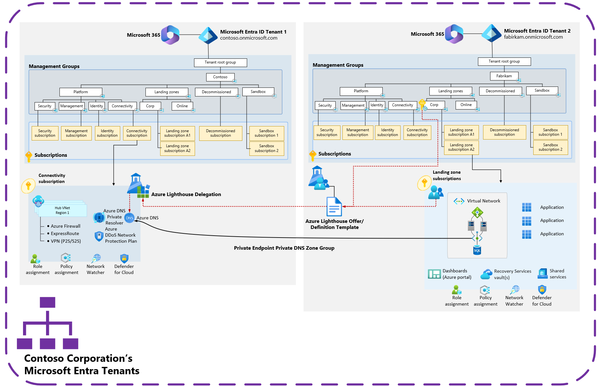

# Azure Lighthouse usage in Azure landing zones multi-tenant scenarios

[Azure Lighthouse](/azure/lighthouse/overview) enables multi-tenant management with scalability, higher automation, and enhanced governance across resources. Azure Lighthouse can be adopted in Azure landing zone scenarios in single or multi-tenant architectures.

The following considerations and recommendations describe common scenarios for Azure Lighthouse in Azure landing zone deployments.

## Considerations

- Azure Lighthouse isn't supported across Azure clouds, such as Azure public cloud to Azure US Government cloud. For more information, see [Cross-region and cloud considerations](/azure/lighthouse/overview#cross-region-and-cloud-considerations).
- Azure Lighthouse supports delegations of subscriptions or resource groups, not management groups or tenants. For a solution to onboarding multiple subscriptions within a management group, see [Onboard all subscriptions in a management group](/azure/lighthouse/how-to/onboard-management-group). This policy follows the Azure landing zones design principle of [policy-driven governance](/azure/cloud-adoption-framework/ready/landing-zone/design-principles#policy-driven-governance).
- For information about the limitations on RBAC roles support with Azure Lighthouse, see [Role support for Azure Lighthouse](/azure/lighthouse/concepts/tenants-users-roles#role-support-for-azure-lighthouse).

## Recommendations

- See [Azure Lighthouse in enterprise scenarios](/azure/lighthouse/concepts/enterprise).
- If you're an ISV, see [Azure Lighthouse in ISV scenarios](/azure/lighthouse/concepts/isv-scenarios).
- Use Azure Lighthouse in both directions between Azure Active Directory tenants to simplify management activities and reduce complex authentication and authorization scenarios. This action removes the reliance on Azure Active Directory B2B (Guest) accounts for user and workload identities, and it removes the need to have separate accounts for some activities.
- Use Azure Active Directory Privileged Identity Management (PIM) as part of your Azure Lighthouse delegations. For more information, see [Create eligible authorizations](/azure/lighthouse/how-to/create-eligible-authorizations).
  - This feature requires Azure Active Directory Premium P2 licensing but only from the source or managing Azure Active Directory tenant.

## Azure landing zones scenario - Azure Lighthouse and Private DNS at scale

The following diagram is an Azure landing zone scenario where Azure Lighthouse is used across multiple Azure Active Directory tenants to assist with Private Link and DNS integration.

By using Azure Lighthouse, Azure Policy for Private Endpoints Private DNS Zone is automatically linked in **spoke** Azure Active Directory tenants to the centralized Private DNS Zones in the **hub** Azure Active Directory tenant. For more information, see [Private Link and DNS integration at scale](/azure/cloud-adoption-framework/ready/azure-best-practices/private-link-and-dns-integration-at-scale).

By using this architecture, application landing zone owners have access to make changes to Private DNS Zone via Azure Lighthouse delegation authorizations. This access is useful if a different approach is used to manage the Private Endpoints DNS configuration, rather than Azure Policy. For more information, see [Private Link and DNS integration at scale](/azure/cloud-adoption-framework/ready/azure-best-practices/private-link-and-dns-integration-at-scale).

## Next steps

> [!div class="nextstepaction"]
> [Considerations and recommendations for multi-tenant Azure landing zone scenarios](considerations-recommendations.md)
