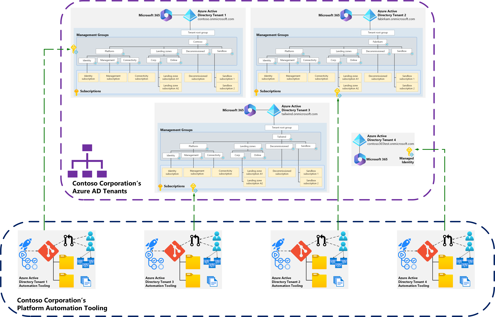

# Handling ALZ across Multiple Azure Active Directory tenants - Automation Considerations & Recommendations

When your organization has multiple Azure Active Directory tenants with Azure Landing Zones (ALZ) in each of them, one or multiple times, automation is key to successfully operating and maintaining the ALZ deployment at scale across all of the tenants. There are however multiple approaches to automating ALZ deployments across multiple tenants and the decision on which approach to take will depend on the reasons your organization has multiple Azure Active Directory tenants.

For example, if you have multiple Azure Active Directory Tenants because you are an ISV, then it's likely that you want to keep your corporate and SaaS solutions Azure Active Directory tenants separate in all aspects to reduce the risk of of any operation or deployment to either tenant could ever impact the other, whether intended or by mistake.

For this reason we document multiple approaches below with guidance and diagrams on how these look and work to help you chose the correct approach based on your requirements as well as considerations and recommendations regarding automating your Azure landing zones deployments when handling multiple Azure Active Directory tenants.

>[!NOTE]
> If you haven't read the following pages already then it is highly recommended to do so before carrying on with this page:
>
> - [Multiple Azure Active Directory tenants in ALZ - Overview](multiple-aad-tenants-in-alz.md)
> - [Multiple Azure Active Directory tenants in ALZ - Scenarios](multiple-aad-tenants-in-alz-scenarios.md)
> - [Handling ALZ across Multiple Azure Active Directory tenants - Considerations & Recommendations](multiple-aad-tenants-in-alz-handling-c-r.md)

## Approaches

There are two approaches that can be taken when automating the deployment of Azure landing zones across multiple Azure Active Directory tenants.

### Approach 1 – Complete Isolation

In this approach, the primary objective is to keep each Azure Active Directory tenant completely isolated from each other across all automation components:

- Git Repository
- GitHub Actions/Azure Pipelines
  - Including self-hosted runners, if being utilized
- Identities used for performing tasks from automation. This could be:
  - Managed Identities assigned to self-hosted runners
  - Service Principals (SPNs)

This approach does mean there are more components to manage that are duplicated per Azure Active Directory tenant, however, this might be a requirement for some organizations that have regulatory compliance controls enforced upon them that mandates this type of segregation and isolation.

>[!NOTE]
> If your organization only allows the use of Managed Identities for platform automation, then you must use this approach; or one that logs into each tenant individually. This is due to the limitation that Managed Identities do not support cross-tenant scenarios today, as documented [here](/azure/active-directory/managed-identities-azure-resources/managed-identities-faq#can-i-use-a-managed-identity-to-access-a-resource-in-a-different-directorytenant).

### Approach 2 – Shared Application Registration (multi-tenant) with Multiple Service Principals

In this approach, an Application Registration is created in the managing Azure Active Directory tenant then in every Azure Active Directory tenant that you wish to manage a Service Principal (SPN) is created in that tenant based on the Application Registration. This then allows the workers running the pipeline tasks and steps to log in to any of the Azure Active Directory tenants with a single set of credentials, simplifying operations.

The handling of multiple environments (for example Development, Test, Production) can also be controlled in the same way using the same, or separate Application Registrations and Enterprise Applications alongside pipelines.

You might decide to have separate pipelines for each Azure Active Directory tenant and pipelines or use a single pipeline, the choice is yours based upon your requirements.

>[!NOTE]
> When using a centralized pipeline, you might need to build a small mapping table that contains data correlating the Azure Active Directory tenants and other metadata, like the environment, associated subscriptions, organization name, identity object ID to use to authentication and authorization etc.
>
> This data can then be called upon during the run of the pipeline in a step that uses some logic and conditions to control which Azure Active Directory tenant is deployed to and with which identities.
>
> This could be stored in services like Azure Cosmos DB or Azure Table Storage.

In the example we show a single App Registration in the `contoso.onmicrosoft.com` Azure Active Directory tenant and then an Enterprise Application in each of the Azure Active Directory tenants that is linked to the App Registration. This allows a pipeline to authenticate and authorize to all the Azure Active Directory tenants using the single App Registration. This scenario is documented further here in [Making your application multi-tenant](/azure/active-directory/develop/howto-convert-app-to-be-multi-tenant)

>[!NOTE]
> Azure Lighthouse works in a similar way to as described in this approach. However, Azure Lighthouse does not allow the assignment of the RBAC Owner, User Access Administrator and roles with DataActions permissions, as documented in [Role support for Azure Lighthouse.](/azure/lighthouse/concepts/tenants-users-roles#role-support-for-azure-lighthouse)
> 
> The role of Owner and User Access Role are typically required in all Azure landing zone deployment scenarios which therefore rules Azure Lighthouse out as an option for the entire platform automation deployment aspect of Azure landing zones.
> 
> However, it can still be useful in some scenarios as documented in [Azure Lighthouse usage in ALZ multi-tenant](multiple-aad-tenants-in-alz-handling-lighthouse.md)

## Next steps

> [!div class="nextstepaction"]
> [Handling ALZ across Multiple Azure Active Directory Tenants - Canary Considerations & Recommendations](multiple-aad-tenants-in-alz-handling-canary.md)
