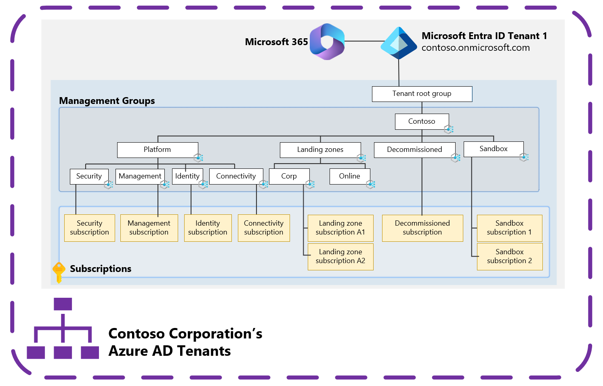

# Azure landing zones and multiple Microsoft Entra tenants

Azure landing zones are built on [management groups](/azure/governance/management-groups/overview). [Azure policies](/azure/governance/policy/overview) are assigned and subscriptions are placed into management groups to provide the required governance controls that an organization needs to meet its security and compliance needs.

>[!TIP]
> See [Security control mapping with Azure landing zones](../../../control-mapping/security-control-mapping.md) to learn how to use Azure landing zone and Azure Policy to help achieve your organization's security, compliance, and regulatory needs.

These resources are deployed within a single Microsoft Entra tenant. Management groups and most other Azure resources, like Azure Policy, only support operating within a single Microsoft Entra tenant. An Azure subscription relies on a Microsoft Entra tenant to authenticate users, services, and devices against Azure Resource Manager (ARM) to control plane operations and some Azure services, like Azure Storage, for data plane operations.

Multiple subscriptions can rely on the same Microsoft Entra tenant. Each subscription can only rely on a single Microsoft Entra tenant. For more information, see [Add an existing Azure subscription to your tenant](/entra/fundamentals/how-subscriptions-associated-directory).

In the previous diagram, management groups, Azure Policies, and Azure subscriptions are deployed following the [Azure landing zones conceptual architecture](../../index.md#azure-landing-zone-architecture) within a single Microsoft Entra tenant.

This approach is recommended for most organizations based on their requirements. This approach gives organizations the best collaboration experience possible and allows them to control, govern, and isolate users and resources within a single Microsoft Entra tenant.

Your organization might be required to use multiple Microsoft Entra tenants for many [scenarios](scenarios.md). See [how to deploy and manage](automation.md) the Azure landing zone deployment into each of these tenants and [considerations and recommendations](considerations-recommendations.md) for handling multiple Microsoft Entra tenants.

>[!NOTE]
> This article focuses on Azure, not Microsoft 365 or other Microsoft Cloud offerings, such as Dynamics 365 or Power Platform.
>
> It focuses on [the platform rather than applications](../../index.md#platform-landing-zones-vs-application-landing-zones) that are built on top of the platform in tenants. For information about multiple Microsoft Entra tenants and application architecture, see:
>
> - [Architect multitenant solutions on Azure](/azure/architecture/guide/multitenant/overview)

## Why a single Microsoft Entra tenant is sufficient

There are reasons you might require multiple Microsoft Entra tenants, but it's important to understand why a single Microsoft Entra tenant is typically sufficient. It should be the default starting point for all organizations.

Use your existing corporate Microsoft Entra tenant for Azure subscriptions for the best productivity and collaboration experience across the platform.

Within a single tenant, development teams and application owners can have the least privileged roles to create non-production instances of Azure resources and trusted apps, test apps, test users and groups, and test policies for those objects. For more information about how to delegate administration with a single tenant, see [Resource isolation in a single tenant](/entra/architecture/secure-single-tenant).

Only create more Microsoft Entra tenants when there are requirements that can't be met by using the corporate Microsoft Entra tenant.

With Microsoft 365, the corporate Microsoft Entra tenant is generally the first tenant provisioned in the organization. This tenant is used for corporate application access and Microsoft 365 services. It supports the collaboration within an organization. The reason to start with this existing tenant is because it’s already been provisioned, managed, and secured. The defined lifecycle of the identities is likely already established. This course makes the task of onboarding new apps, resources, and subscriptions easier. It’s a mature, understood environment with established process, procedures, and controls.

### Complexities with multiple Microsoft Entra tenants

When you create a new Microsoft Entra tenant, it requires extra work to provision, manage, secure, and govern the identities. You must also establish the required policies and procedures. Collaboration is best in a single Microsoft Entra tenant. Moving to a multitenant model creates a boundary, which can result in user friction, management overhead, and increase the attack surface area, which can cause a security risk and complicates product scenarios and limitations. Some examples include:

- **Multiple identities for users and administrators for each tenant** – If [Microsoft Entra B2B](/entra/external-id/what-is-b2b) isn’t used, the user has multiple sets of credentials to manage. For more information, see [Considerations and recommendations for multitenant Azure landing zone scenarios](considerations-recommendations.md).
- **Azure services limitations in supporting multiple Microsoft Entra tenants** – Azure workloads that only support identities homed in the tenant to which it's bound to. For more information, see [Azure products and services Microsoft Entra integration](considerations-recommendations.md#azure-products-and-services-azure-active-directory-integration).
- **No centralized configuration or management for Microsoft Entra tenants** – Multiple security policies, management policies, configuration, portals, APIs, and JML (joiners, movers, and leavers) processes.
- **Billing and licensing complexities and potential requirement for license duplication for Microsoft Entra ID P1 or P2 licenses** - For more information, see [Considerations and recommendations for multitenant Azure landing zone scenarios](considerations-recommendations.md).

Organizations need to be clear about why they're deviating from the corporate Microsoft Entra tenant model to ensure the extra overhead and complexity is justified in meeting the requirements. There are examples of these instances in the [scenarios article](scenarios.md).

>[!IMPORTANT]
> Use [Microsoft Entra Privileged Identity Management](/entra/id-governance/privileged-identity-management/pim-configure) to protect privileged roles within Microsoft Entra ID and Azure.

The ownership of privileged roles across internal teams and departments can provide a challenge as the Identity team and the Azure team are often in different teams, departments, and organization structures.

The teams that operate Azure are responsible for Azure services and want to ensure the security of the services that they manage. When individuals outside of that team have roles with the power to potentially access their environments, the security is weaker. For more information, see [Understand required cloud functions](../../../../organize/index.md#understand-required-cloud-functions).

Microsoft Entra ID provides controls that help mitigate this problem on a technical level, but this issue is also a people and process discussion. For more information, see [Recommendations](considerations-recommendations.md#recommendations).

>[!IMPORTANT]
> Multiple Microsoft Entra tenants **are not the recommended** approach for most customers. A single Microsoft Entra tenant, typically the corporate Microsoft Entra tenant, is recommended for most customers because it provides the necessary separation requirements.
>
> For more information, see:
>
> - [Define Microsoft Entra tenants](../azure-ad-define.md)
> - [Testing approach for Azure landing zones](../../../enterprise-scale/testing-approach.md)
> - [Introduction to delegated administration and isolated environments](/entra/architecture/secure-introduction)
> - [Resource isolation in a single tenant](/entra/architecture/secure-single-tenant)
> - [Your Microsoft 365 for enterprise tenants](/microsoft-365/solutions/tenant-management-tenants)

## Next steps

> [!div class="nextstepaction"]
> [Scenarios for multiple Microsoft Entra tenants](scenarios.md)
