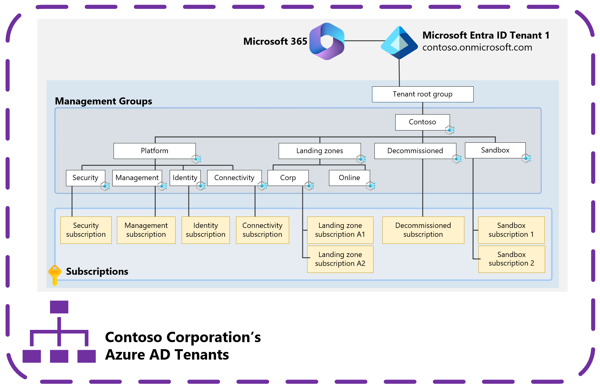

# Azure landing zones and multiple Azure Active Directory tenants

Azure landing zones are built on [management groups](/azure/governance/management-groups/overview). [Azure policies](/azure/governance/policy/overview) are assigned and subscriptions are placed into management groups to provide the required governance controls that an organization needs to meet its security and compliance needs.

>[!TIP]
> See [Security control mapping with Azure landing zones](../../../control-mapping/security-control-mapping.md) to learn how to use Azure landing zone and Azure Policy to help achieve your organization's security, compliance, and regulatory needs.

These resources are deployed within a single Azure Active Directory (Azure AD) tenant. Management groups and most other Azure resources, like Azure Policy, only support operating within a single Azure Active Directory tenant. An Azure subscription relies on an Azure Active Directory tenant to authenticate users, services, and devices against Azure Resource Manager (ARM) to control plane operations and some Azure services, like Azure Storage, for data plane operations.

Multiple subscriptions can rely on the same Azure Active Directory tenant. Each subscription can only rely on a single Azure Active Directory tenant. For more information, see [Add an existing Azure subscription to your tenant](/azure/active-directory/fundamentals/active-directory-how-subscriptions-associated-directory).

In the previous diagram, management groups, Azure Policies, and Azure subscriptions are deployed following the [Azure landing zones conceptual architecture](../../index.md#azure-landing-zone-architecture) within a single Azure Active Directory tenant.

This approach is recommended for most organizations based on their requirements. This approach gives organizations the best collaboration experience possible and allows them to control, govern, and isolate users and resources within a single Azure Active Directory tenant.

Your organization might be required to use multiple Azure Active Directory tenants for many [scenarios](scenarios.md). See [how to deploy and manage](automation.md) the Azure landing zone deployment into each of these tenants and [considerations and recommendations](considerations-recommendations.md) for handling multiple Azure Active Directory tenants.

>[!NOTE]
> This article focuses on Azure, not Microsoft 365 or other Microsoft Cloud offerings, such as Dynamics 365 or Power Platform.
>
> It focuses on [the platform rather than applications](../../index.md#platform-landing-zones-vs-application-landing-zones) that are built on top of the platform in tenants. For information about multiple Azure Active Directory tenants and application architecture, see:
>
> - [Multi-tenant apps in Azure Active Directory](/azure/active-directory/develop/application-model#multi-tenant-apps)
> - [Architect multi-tenant solutions on Azure](/azure/architecture/guide/multitenant/overview)

## Why a single Azure Active Directory tenant is sufficient

There are reasons you might require multiple Azure Active Directory tenants, but it's important to understand why a single Azure Active Directory tenant is typically sufficient. It should be the default starting point for all organizations.

Use your existing corporate Azure Active Directory tenant for Azure subscriptions for the best productivity and collaboration experience across the platform.

Within a single tenant, development teams and application owners can have the least privileged roles to create non-production instances of Azure resources and trusted apps, test apps, test users and groups, and test policies for those objects. For more information about how to delegate administration with a single tenant, see [Resource isolation in a single tenant](/azure/active-directory/fundamentals/secure-with-azure-ad-single-tenant).

Only create more Azure Active Directory tenants when there are requirements that can't be met by using the corporate Azure Active Directory tenant.

With Microsoft 365, the corporate Azure Active Directory tenant is generally the first tenant provisioned in the organization. This tenant is used for corporate application access and Microsoft 365 services. It supports the collaboration within an organization. The reason to start with this existing tenant is because it’s already been provisioned, managed, and secured. The defined lifecycle of the identities is likely already established. This course makes the task of onboarding new apps, resources, and subscriptions easier. It’s a mature, understood environment with established process, procedures, and controls.

### Complexities with multiple Azure Active Directory tenants

When you create a new Azure Active Directory tenant, it requires extra work to provision, manage, secure, and govern the identities. You must also establish the required policies and procedures. Collaboration is best in a single Azure Active Directory tenant. Moving to a multi-tenant model creates a boundary, which can result in user friction, management overhead, and increase the attack surface area, which can cause a security risk and complicates product scenarios and limitations. Some examples include:

- **Multiple identities for users and administrators for each tenant** – If [Azure Active Directory B2B](/azure/active-directory/external-identities/what-is-b2b) isn’t used, the user has multiple sets of credentials to manage. For more information, see [Considerations and recommendations for multi-tenant Azure landing zone scenarios](considerations-recommendations.md).
- **Azure services limitations in supporting multiple Azure Active Directory tenants** – Azure workloads that only support identities homed in the tenant to which it's bound to. For more information, see [Azure products and services Azure Active Directory integration](considerations-recommendations.md#azure-products-and-services-azure-active-directory-integration).
- **No centralized configuration or management for Azure Active Directory tenants** – Multiple security policies, management policies, configuration, portals, APIs, and JML (joiners, movers, and leavers) processes.
- **Billing and licensing complexities and potential requirement for license duplication for Azure Active Directory Premium licenses** - For more information, see [Considerations and recommendations for multi-tenant Azure landing zone scenarios](considerations-recommendations.md).

Organizations need to be clear about why they're deviating from the corporate Azure Active Directory tenant model to ensure the extra overhead and complexity is justified in meeting the requirements. There are examples of these instances in the [scenarios article](scenarios.md).

The Global Administrator (Global Admin) role is another concern. The Global Admin role provides the highest level of permissions available in an Azure Active Directory tenant. In Azure, any Global Admin can assume control of any Azure subscription linked to the Azure Active Directory tenant. For more information, see [Elevate access to manage all Azure subscriptions and management groups](/azure/role-based-access-control/elevate-access-global-admin).

>[!IMPORTANT]
> [Azure Active Directory Privileged Identity Management](/azure/active-directory/privileged-identity-management/pim-configure) should be used to help protect this role, and other privileged roles, within Azure Active Directory and Azure.

The ownership of this role across internal teams and departments can provide a challenge as the Identity team and the Azure team are often in different teams, departments, and organization structures.

The teams that operate Azure are responsible for Azure services and want to ensure the security of the services that they manage. When individuals outside of that team have roles with the power to potentially access their environments, the security is weaker. For more information, see [Understand required cloud functions](../../../../organize/index.md#understand-required-cloud-functions).

Azure Active Directory provides controls that help mitigate this problem on a technical level, but this issue is also a people and process discussion. For more information, see [Recommendations](considerations-recommendations.md#recommendations).

>[!IMPORTANT]
> Multiple Azure Active Directory tenants **are not the recommended** approach for most customers. A single Azure Active Directory tenant, typically the corporate Azure Active Directory tenant, is recommended for most customers because it provides the necessary separation requirements.
> 
> For more information, see:
> 
> - [Define Azure Active Directory tenants](../azure-ad-define.md)
> - [Architecture: Standardize on a single directory and identity](../../../../secure/security-top-10.md#9-architecture-standardize-on-a-single-directory-and-identity)
> - [Testing approach for Azure landing zones](../../../enterprise-scale/testing-approach.md)
> - [Introduction to delegated administration and isolated environments](/azure/active-directory/fundamentals/secure-with-azure-ad-introduction)
> - [Resource isolation in a single tenant](/azure/active-directory/fundamentals/secure-with-azure-ad-single-tenant)
> - [Your Microsoft 365 for enterprise tenants](/microsoft-365/solutions/tenant-management-tenants)

## Next steps

> [!div class="nextstepaction"]
> [Scenarios for multiple Azure Active Directory tenants](scenarios.md)