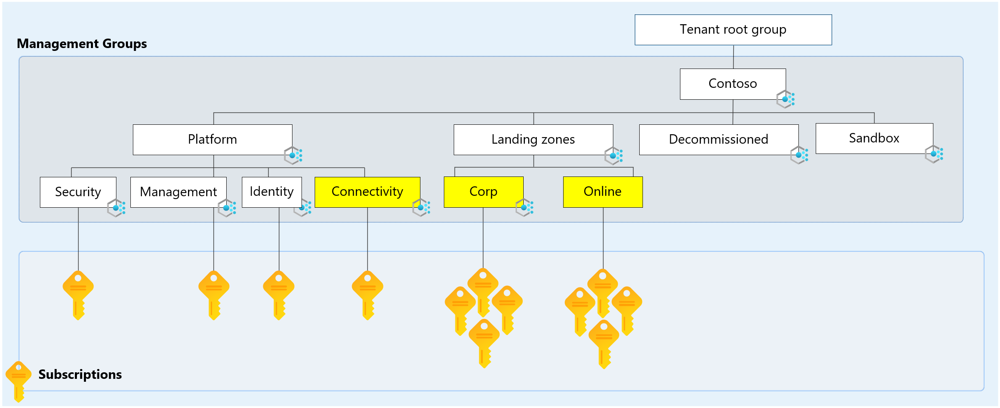

# Network topology and connectivity

The network topology and connectivity design area are critical for establishing a foundation for your cloud network design.

## Design area review

**Involved roles or functions:** This design area probably requires support from one or more [cloud platform](../../../organize/cloud-platform.md) and [cloud center of excellence](../../../organize/cloud-center-of-excellence.md) functions to make and implement decisions.

**Scope:** The goal of network design is to align your cloud network design with overall cloud adoption plans. If your cloud adoption plans include hybrid or multicloud dependencies, or if you need connectivity for other reasons, your network design should also incorporate those connectivity options and expected traffic patterns.

**Out of scope:** This design area establishes the foundation for networking. It doesn't address compliance-related issues like advanced network security or automated enforcement guardrails. That guidance comes when you review the [security](./security.md) and [governance](./governance.md) compliance design areas. Postponing security and governance discussions lets the cloud platform team address initial networking requirements before they expand their audience for more complex topics.

## Design area overview

Network topology and connectivity are fundamental for organizations that are planning their landing zone design. Networking is central to almost everything inside a landing zone. It enables connectivity to other Azure services, external users, and on-premises infrastructure. Network topology and connectivity are in the [environmental group](../design-areas.md#environment-design-areas) of Azure landing zone design areas. This grouping is based on their importance in core design and implementation decisions.

In the [conceptual Azure landing zone architecture](../../enterprise-scale/media/azure-landing-zone-architecture-diagram-hub-spoke.svg), there are two main management groups hosting workloads: Corp and Online. These management groups serve distinct purposes in organizing and governing Azure subscriptions. The networking relationship between the various Azure landing zones management groups depends on the organization's specific requirements and network architecture. The next few sections discuss the networking relationship between **Corp**, **Online**, and the **Connectivity** management groups in relation to what the Azure landing zone accelerator provides.

### What is the purpose of Connectivity, Corp, and Online Management Groups?

- **Connectivity management group**: This management group contains dedicated subscriptions for connectivity, commonly a single subscription for most organizations. These subscriptions host the Azure networking resources required for the platform, like Azure Virtual WAN, Virtual Network Gateways, Azure Firewall, and Azure DNS private zones. It's also where hybrid connectivity is established between the cloud and on-premises environments, using services like ExpressRoute etc.
- **Corp management group**: The dedicated management group for corporate landing zones. This group is intended to contain subscriptions that host workloads that require traditional IP routing connectivity or hybrid connectivity with the corporate network via the hub in the connectivity subscription and therefore form part of the same routing domain. Workloads such as internal systems aren't exposed directly to the internet, but may be exposed via reverse proxies etc., such as Application Gateways.
- **Online management group**: The dedicated management group for online landing zones. This group is intended to contain subscriptions used for public-facing resources, such as websites, e-commerce applications, and customer-facing services. For example, organizations can use the Online management group to isolate public-facing resources from the rest of the Azure environment, reducing the attack surface and ensuring that public-facing resources are secure and available to customers.

### Why did we create Corp and Online management groups to separate workloads?

The difference in networking considerations between the Corp and Online management groups in the conceptual Azure landing zone architecture lies in their intended use and primary purpose.  

The Corp management group is used to manage and secure internal resources and services, such as line-of-business applications, databases, and user management. The networking considerations for the Corp management group are focused on providing secure and efficient connectivity between internal resources, while enforcing strict security policies to protect against unauthorized access.

The Online management group in the conceptual Azure landing zone architecture can be considered as an isolated environment used to manage public-facing resources and services that are accessible from the Internet. By using the Online management group to manage public-facing resources, the Azure landing zone architecture provides a way to isolate those resources from internal resources, thereby reducing the risk of unauthorized access and minimizing the attack surface.

In the conceptual Azure landing zone architecture, the virtual network in the Online management group can be, optionally, peered with virtual networks in the Corp management group, either directly or indirectly via the hub and associated routing requirements via an Azure Firewall or NVA, allowing public-facing resources to communicate with internal resources in a secure and controlled manner. This topology ensures that the network traffic between public-facing resources and internal resources is secure and restricted, while still allowing the resources to communicate as needed. 

> [!TIP]
> It is also important to understand and review the Azure Policies that are assigned, and inherited, on each of the Management Groups as part of the Azure landing zone. As these help shape, protect and govern the workloads that are deployed within the subscriptions that are in these Management Groups. The policy assignments for Azure landing zones can be found [here](https://aka.ms/alz/policies).
