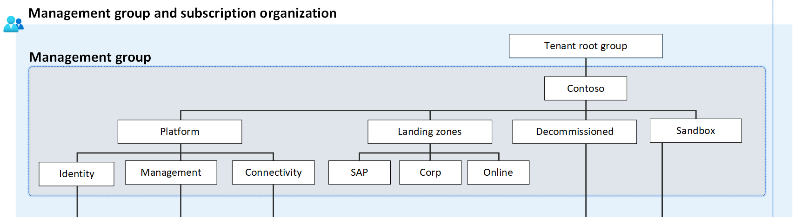

# Management groups

## Management groups overview

Management groups are a key tool to help organizations structure their cloud environments for organization and governance at scale. 
Considering how to use management groups as part of the environment design is an important foundational step. Use the following guidance to help inform cloud architecture decisions. 

## Management group  design considerations

Management group structures within an Azure Active Directory (Azure AD) tenant support organizational mapping. Consider your management group structure thoroughly as your organization plans Azure adoption at scale.

- How will your organization separate out services owned or operated by specific teams? 
- Are there specific functions that need to be kept separate for business or operational compliance reasons? 
- Reflect these considerations in your management group structure in order to design in, from the beginning, a structure that reflects how your organization intends to operate

- Management groups can be used to aggregate policy and initiative assignments via Azure Policy.

- A management group tree can support up to [six levels of depth](/azure/governance/management-groups/overview#hierarchy-of-management-groups-and-subscriptions). This limit doesn't include the tenant root level or the subscription level.

- Any principal (user or service principal) within an Azure AD tenant can create new management groups, since Azure role-based access control (RBAC) authorization for management group operations isn't enabled by default.

- All new subscriptions will be placed under the root management group by default.

- Explore the capabilities of [management groups](/azure/governance/management-groups/overview) in more detail

## Management group recommendations

Keep the management group hierarchy reasonably flat, with no more than three to four levels, ideally. This restriction reduces management overhead and complexity.

Avoid duplicating your organizational structure into a deeply nested management group hierarchy. Management groups should be used for policy assignment versus billing purposes. This approach necessitates using management groups for their intended purpose in Azure landing zone conceptual architecture, which is providing Azure policies for workloads that require the same type of security and compliance under the same management group level.

- Create management groups under your root-level management group to represent the types of workloads (archetypes) that you'll host and ones based on their security, compliance, connectivity, and feature needs. This grouping structure allows you to have a set of Azure policies applied at the management group level for all workloads that require the same security, compliance, connectivity, and feature settings.

- Use resource tags, which can be enforced or appended through Azure Policy, to query and horizontally navigate across the management group hierarchy. Then you can group resources for search needs without having to use a complex management group hierarchy.

- Create a top-level sandbox management group to allow users to immediately experiment with Azure. Users can then experiment with resources that might not yet be allowed in production environments. The sandbox provides isolation from your development, test, and production environments.

- Create a Platform management group under the root management group to support common platform policy and Azure role assignment. This grouping structure ensures that different policies can be applied to the subscriptions used for your Azure foundation. It also ensures that the billing for common resources is centralized in one set of foundational subscriptions.

- Limit the number of Azure Policy assignments made at the root management group scope (/). This limitation minimizes debugging inherited policies in lower-level management groups.

- Use policies to enforce compliance requirements either at management group or subscription scope. 

- Ensure that only privileged users can operate management groups in the tenant by enabling Azure RBAC authorization in the management group hierarchy settings (by default, all users are authorized to create their own management groups under the root management group).

- Configure a default, dedicated management group for new subscriptions to ensure that no subscriptions are placed under the root management group. This is especially important if there are users eligible for MSDN or Visual Studio benefits and subscriptions. A good candidate for this type of management group is a Sandbox management group.

## Management groups in the Azure landing zone accelerator

As part of the Azure landing zone accelerator the following decisions have been made and included in the implementation for management group structure

| Management Group| Description |
|---|---|
|**Top-level Management Group**| (directly under the tenant root group) is created with a prefix provided by the organization, which purposely will avoid the usage of the root group to allow organizations to move existing Azure subscriptions into the hierarchy, and also enables future scenarios. This Management Group is parent to all the other Management Groups created by the Azure Landing Zone accelerator.|
|**Platform**| This Management Group contains all the platform child Management Groups, such as Management, Connectivity, and Identity. Common Azure Policies for the entire platform is assigned at this level|
|**Management**| This Management Group contains the dedicated subscription for management, monitoring, and security, which will host Azure Log Analytics, Azure Automation, and Azure Sentinel. Specific Azure policies are assigned to harden and manage the resources in the management subscription.|
|**Connectivity**| This Management Group contains the dedicated subscription for connectivity, which will host the Azure networking resources required for the platform, such as Azure Virtual WAN/Virtual Network for the hub, Azure Firewall, DNS Private Zones, Express Route circuits, ExpressRoute/VPN Gateways etc among others. Specific Azure policies are assigned to harden and manage the resources in the connectivity subscription.|
|**Identity**| This Management Group contains the dedicated subscription for identity, which is a placeholder for Windows Server Active Directory Domain Services (AD DS) VMs, or Azure Active Directory Domain Services to enable AuthN/AuthZ for workloads within the landing zones. Specific Azure policies are assigned to harden and manage the resources in the identity subscription.|
|**Landing Zones**| This is the parent Management Group for all the landing zone subscriptions and will have workload agnostic Azure Policies assigned to ensure workloads are secure and compliant.|
|**Online**| This is the dedicated Management Group for Online landing zones, meaning workloads that may require direct internet inbound/outbound connectivity or also for workloads that may not require a VNet..|
|**Corp**| This is the dedicated Management Group for Corp landing zones, meaning workloads that requires connectivity/hybrid connectivity with the corporate network thru the hub in the connectivity subscription.|
|**Sandboxes**| This is the dedicated Management Group for subscriptions that will solely be used for testing and exploration by an organization’s application teams. These subscriptions will be securely disconnected from the Corp and Online landing zones.|
|**Decommissioned**| This is the dedicated Management Group for landing zones that are being cancelled, which then will be moved to this Management Group before deleted by Azure after 30-60 days.|

## Permissions for the Azure landing zone accelerator

- Requires a dedicated service principal name (SPN) to execute management group management operations, subscription management operations, and role assignment. Using an SPN reduces the number of users who have elevated rights and follows least-privilege guidelines.

- Requires the User Access Administrator role at the root management group scope (/) to grant the SPN just mentioned access at the root level. After the SPN is granted permissions, the User Access Administrator role can be safely removed. In this way, only the SPN is part of the User Access Administrator role.

- Requires the Contributor role to the SPN previously mentioned at the root management group scope (/), which allows tenant-level operations. This permission level ensures that the SPN can be used to deploy and manage resources to any subscription within your organization.