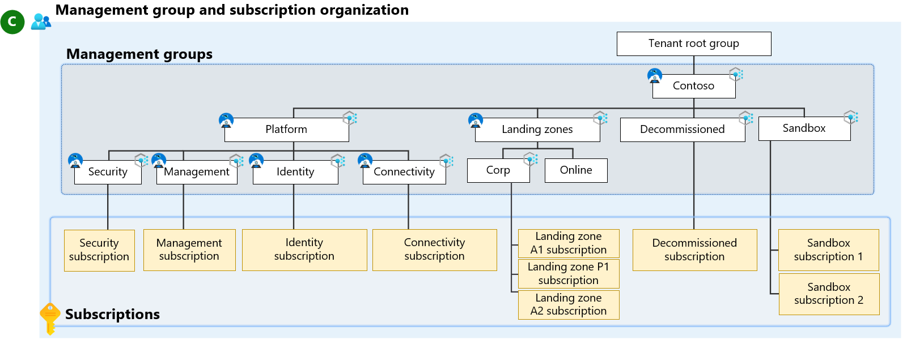

# Management groups

Use [management groups](/azure/governance/management-groups/overview) to organize and govern your Azure subscriptions. As the number of your subscriptions increases, management groups provide critical structure to your Azure environment and make it easier to manage your subscriptions. Use the following guidance to establish an effective management group hierarchy and organize your subscriptions according to best practices.

## Management group design considerations

Management group structures within a Microsoft Entra tenant support organizational mapping. Consider your management group structure thoroughly when your organization plans its Azure adoption at scale.

- Determine how your organization separates out services that specific teams own or operate.

- Determine whether you have specific functions that you need to keep separate for reasons like business requirements, operational requirements, regulatory requirements, data residency, data security, or data sovereignty compliance.

- Use management groups to aggregate policy and initiative assignments via Azure Policy.

- Enable Azure role-based access control (RBAC) authorization for management group operations to override the default authorization. By default, any principal, like a user principal or service principal, within a Microsoft Entra tenant can create new management groups. For more information, see [How to protect your resource hierarchy](/azure/governance/management-groups/how-to/protect-resource-hierarchy).

Also consider the following factors:

- A management group tree can support up to [six levels of depth](/azure/governance/management-groups/overview#hierarchy-of-management-groups-and-subscriptions). This limit doesn't include the tenant root level or the subscription level.

- All new subscriptions are placed under the tenant root management group by default.

For more information, see [Management groups](/azure/governance/management-groups/overview).

## Management group recommendations

- Keep the management group hierarchy reasonably flat, ideally with no more than three to four levels. This restriction reduces management overhead and complexity.

- Don't duplicate your organizational structure into a deeply nested management group hierarchy. Use management groups for policy assignment versus billing purposes. For this approach, use management groups for their intended purpose in the Azure landing zone conceptual architecture. This architecture provides Azure policies for workloads that require the same type of security and compliance under the same management group level.

- Create management groups under your root-level management group to represent the types of workloads that you host. These groups are based on the security, compliance, connectivity, and feature needs of the workloads. With this grouping structure, you can have a set of Azure policies applied at the management group level. Use this grouping structure for all workloads that require the same security, compliance, connectivity, and feature settings.

- Use resource tags to query and horizontally navigate across the management group hierarchy. You can use Azure Policy to enforce or append resource tags. Then you can group resources for search needs without having to use a complex management group hierarchy.

- Create a top-level sandbox management group so that you can immediately experiment with resources before you move them to production environments. The sandbox provides isolation from your development, test, and production environments.

- Create a platform management group under the root management group to support common platform policies and Azure role assignments. This grouping structure ensures that you can apply various policies to the subscriptions in your Azure foundation. This approach also centralizes the billing for common resources in one set of foundational subscriptions.

- Limit the number of Azure Policy assignments at the root management group scope. This limitation minimizes debugging inherited policies in lower-level management groups.

- Use policies to enforce compliance requirements either at the management group or subscription scope to achieve policy-driven governance.

- Ensure that only privileged users can operate management groups in the tenant. Enable Azure RBAC authorization in the management group [hierarchy settings](/azure/governance/management-groups/how-to/protect-resource-hierarchy#setting-require-authorization) to refine user privileges. By default, all users can create their own management groups under the root management group.

- Configure a default, dedicated management group for new subscriptions. This group ensures that no subscriptions go under the root management group. This group is especially important if users have Microsoft Developer Network (MSDN) or Visual Studio benefits and subscriptions. A good candidate for this type of management group is a sandbox management group. For more information, see [Set a default management group](/azure/governance/management-groups/how-to/protect-resource-hierarchy#setting---default-management-group).

- Don't create management groups for production, testing, and development environments. If necessary, separate these groups into different subscriptions in the same management group. For more information, see:

  - [Manage application development environments in Azure landing zones](./management-application-environments.md)
  - [Testing approach for enterprise-scale management groups](../../enterprise-scale/testing-approach.md)

- We recommended that you use the standard Azure landing zone management group structure for multiregion deployments. Don't create management groups solely to model different Azure regions. Don't alter or expand your management group structure based on region or multiregion usage.

  If you have location-based regulatory requirements, such as data residency, data security, or data sovereignty, then you should create a management group structure based on location. You can implement this structure at various levels. For more information, see [Modify an Azure landing zone architecture](../../landing-zone/landing-zone-multinational.md).

## Management groups in the Azure landing zone accelerator and ALZ-Bicep repository

The following example shows a management group structure. The management groups in this example are in the Azure landing zone accelerator and the [management groups module of the ALZ-Bicep repo](https://github.com/Azure/ALZ-Bicep/tree/main/infra-as-code/bicep/modules/managementGroups).

> [!NOTE]
> You can modify the management group hierarchy in the Azure landing zone bicep module by editing [managementGroups.bicep](https://github.com/Azure/ALZ-Bicep/blob/main/infra-as-code/bicep/modules/managementGroups/managementGroups.bicep).

| Management group| Description |
|---|---|
|**Intermediate root management group**| This management group is directly under the tenant root group. The organization provides this management group with a prefix so that they don't have to use the root group. The organization can move existing Azure subscriptions into the hierarchy. This approach also sets up future scenarios. This management group is a parent to all the other management groups created by the Azure landing zone accelerator.|
|**Platform**| This management group contains all the platform child management groups, like management, connectivity, and identity. |
|**Management**| This management group contains a dedicated subscription for management, monitoring, and security. This subscription hosts an Azure Monitor Logs workspace, including associated solutions. |
|**Connectivity**| This management group contains a dedicated subscription for connectivity. This subscription hosts the Azure networking resources, like Azure Virtual WAN, Azure Firewall, and Azure DNS private zones, that the platform requires.  You can use various resource groups to contain resources, such as virtual networks, firewall instances, and virtual network gateways, that are deployed in different regions. Some large deployments might have subscription quota restrictions for connectivity resources. You can create dedicated subscriptions in each region for their connectivity resources. |
|**Identity**| This management group contains a dedicated subscription for identity. This subscription is a placeholder for Active Directory Domain Services (AD DS) virtual machines (VMs) or Microsoft Entra Domain Services. You can use various resource groups to contain resources, such as virtual networks and VMs, that are deployed in different regions.    The subscription also enables AuthN or AuthZ for workloads within the landing zones. Assign specific Azure policies to harden and manage the resources in the identity subscription. Some large deployments might have subscription quota restrictions for connectivity resources. You can create dedicated subscriptions in each region for their connectivity resources. |
|**Landing zones**| The parent management group that contains all the landing zone child management groups. It has workload-agnostic Azure policies assigned to ensure that workloads are secure and compliant. |
|**Online**| The dedicated management group for online landing zones. This group is for workloads that might require direct internet inbound or outbound connectivity or for workloads that might not require a virtual network. |
|**Corp**| The dedicated management group for corporate landing zones. This group is for workloads that require connectivity or hybrid connectivity with the corporate network via the hub in the connectivity subscription. |
|**Sandboxes**| The dedicated management group for subscriptions. An organization uses sandboxes for testing and exploration. These subscriptions are securely isolated from the corporate and online landing zones. Sandboxes also have a less restrictive set of policies assigned to enable testing, exploration, and configuration of Azure services. |
|**Decommissioned**| The dedicated management group for canceled landing zones. You move canceled landing zones to this management group, and then Azure deletes them after 30-60 days. |

> [!NOTE]
> For many organizations, the default `Corp` and `Online` management groups provide an ideal starting point.
> Some organizations need to add more management groups.
>
> If you want to change the management group hierarchy, see [Tailor the Azure landing zone architecture to meet requirements](../tailoring-alz.md).

## Permissions for the Azure landing zone accelerator

The Azure landing zone accelerator:

- Requires a dedicated service principal name (SPN) to run management group operations, subscription management operations, and role assignments. Use an SPN to reduce the number of users that have elevated rights and follow least-privilege guidelines.

- Requires the User Access Administrator role at the root management group scope to grant the SPN access at the root level. After the SPN has permissions, you can safely remove the User Access Administrator role. This approach ensures that only the SPN is connected to the User Access Administrator role.

- Requires the Contributor role for the SPN previously mentioned at the root management group scope, which allows tenant-level operations. This permission level ensures that you can use the SPN to deploy and manage resources to any subscription within your organization.

## Next step

Learn how to use subscriptions when you plan a large-scale Azure adoption.

> [!div class="nextstepaction"]
> [Subscriptions](resource-org-subscriptions.md)
