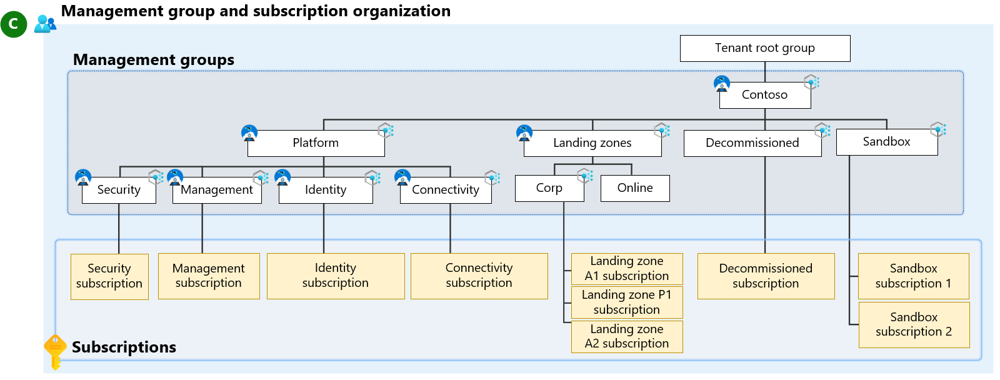

# Application development environments in Azure landing zones

Development teams want limited interference with the ability to iterate quickly, while cloud governance and platform teams need to solve for organizational risk, compliance, and security at scale. Azure landing zone's [design principles](/azure/cloud-adoption-framework/ready/landing-zone/design-principles) guide customers to adopt policy-driven governance and Subscription democratization as two key principles. These provide foundational guard rails, while also delegating many controls to application teams. These applications teams design their workload using guidance from the [Azure Well-Architected Framework](/azure/well-architected/), then deploy and manage their own landing zone resources; whilst being controlled by Azure policies assigned by the platform team.

A key part of this approach is to provide sandbox resources for "semi-governed" resources that allow for application teams to explore technologies and capabilities.

This article provides guidance for how cloud platform teams can provide guardrails to manage application environments in Azure.  The article gives guidance on how an organization can fit different application development environments into this framework.  A key aspect is placing environment subscriptions in appropriate management groups.

When application owners use [Subscription Vending](subscription-vending.md) or other subscription creation processes, it is important for there to be clarity about how to request subscriptions for multiple development environments.

In this guide, we talk both about the Azure landing zone - the management groups, policies, and shared platform architecture - and the workload or application landing zone.

> [!NOTE]
> This is for workload landing zones only. For testing and environment segregation for the Azure landing zone platform itself, review the [testing approach for enterprise-scale](../../enterprise-scale/testing-approach.md) (Canary approach).

  

For discussion, this guide makes reference to the following phased environments:

Environment | Description | Management Group
---|---|---|
**Sandbox** |  Environment used for rapid innovation of prototypes, but not production-bound configurations. | _Sandbox_ Management Group
**Development** |  Environment used to build potential release candidates. | Archetype management group, like _Corp_ or _Online_
**Test** | Environment used to perform testing.  Can include unit testing, user acceptance testing, and quality assurance testing. | Archetype management group, like _Corp_ or _Online_
**Production** | Environment used to deliver value to workload customers. | Archetype management group, like _Corp_ or _Online_

However, any number and classification of environments can be used in practice.

> [!TIP]
> Check out the following YouTube videos where we discuss this topic: [Azure Landing Zones - Handling Dev/Test/Prod for Application Workloads](https://youtu.be/8ECcvTxkrJA) & [Azure Landing Zones - How many subscriptions should I use in Azure?](https://youtu.be/R-5oeguxFpo)

## Environments, Subscriptions, and Management Groups

It is not necessary to create a high degree of Azure management isolation for different phased environments.  It is possible for a single subscription to contain all of the environments without customization, assuming two things are true:

- The environments have the same teams assigned to functional roles, such as network operators.
- The environments can use the same policies.

It is recommended that workload owners should work with the cloud platform teams to determine if a division is needed.

If an application or service workload requires segregation between environments beyond what can be done in a single subscription, and you need to make changes to the policies that apply to each environment, it is then recommended to use one of the following options:

- Consider if a new _archetype-aligned_ management group needs to be created beneath the landing zones management group - [see below section](#management-group-hierarchy)
- Use tags in the policy definitions to help filter and apply them to the correct environment.

> [!IMPORTANT]
> Tags can be changed by users with appropriate Azure RBAC permissions, so for security focused policies, we don't advise using tags in policies. Users might change the tags on a resource and potentially bypass or apply another policy definition to the resources.

- Apply policies at a subscription level as required, ideally during the subscription creation process as part of [Subscription Vending](subscription-vending.md).
- For policies that are implemented to help control costs, apply the policy definition at a subscription level where required or make costs the responsibility of the landing zone owners, enabling true autonomy. (See [Platform automation and DevOps](platform-automation-devops.md).)
- Use sandbox subscriptions for development activities. Sandboxes have a less restrictive policy set.

### Management Group Hierarchy

Avoid complicated and volatile management group hierarchies as they require constant amendment, don't scale efficiently, and don't add value. These issues are why Azure landing zone management groups are workload archetype-aligned. For more information, see [Management group and subscription organization](resource-org.md).

_Archetype-aligned_ means that management groups are only created for differing workload archetypes. For example, in the conceptual architecture, the "landing zones" management group has "corp" and "online" child management groups. These child management groups align with distinct archetype patterns for the workloads they hold, focused around hybrid connectivity (VPN/ExpressRoute) requirements (internal only vs. public-facing applications/services).

Different application environments, except for sandbox environments, should use the same archetype for deployment. Even if the environments are split across separate subscriptions, they are held within the same single management group ("Corp" or "Online") depending on management group archetype and requirements.

[Sandbox subscriptions](../../considerations/sandbox-environments.md) can be used for unstructured development, such as personal labs or for when an archetype for the workload is not decided.  The Sandbox management group is often used when an application or service workload team is trying out different Azure services to see what works best for their requirements. Once the services are known, a landing zone (in the correct workload archetype aligned management group in the "landing zones" management group hierarchy) can be provisioned for the team.

These sandbox environments can be tied to specific applications, or a workload team can use them for experimentation.

Read more about designing [management groups](resource-org-management-groups.md) in the [Resource organization design area](resource-org.md) for Azure landing zones and also review [Tailor the Azure landing zone architecture to meet requirements](/azure/cloud-adoption-framework/ready/landing-zone/tailoring-alz).

#### Challenges with having environment based management groups

Building management groups for for environments within the archetypes creates more management overhead, while providing little value.

  

The _Landing Zone_ management group should have universal polices that enforce guardrails for both Corp and Online. Corp and Online have unique polices to enforce company guidelines around public and private facing workloads.

For application owners, there's little value in changing the configuration of a workload as it's promoted through the different environments. Constant change results in a poor development experience for.  If an application is built with one set of guardrail policies, but has a different one later in its promotion cycle, this can create issues.

Deployment configuration and requirements should remain consistent throughout promotion of code through environments.  Platform teams should not build consistent policy guardrails, but instead provide a consistent set for all non-Sandbox development environments.

> [!NOTE]
> The following equation demonstrates why management groups per environment and/or per workload don't scale well: _N workloads x Z management groups  = total management groups_.
>
>If an organization have 30 different workloads that each require a management group and a child management group for "dev/test/production", the organization is left with:
>
> N = number of workloads/apps = 30
>
> Z = number of management groups for workload and environments (1 per workload + 3 for envs) = 4
>
> N (30) x Z (4) = 120 total management groups

Sometimes, individual application owners might need some policies to apply differently to different environments.  For example, application owners might require backup configurations for production, but do not require it for other environments.

Platform operators must work with each application or service workload team (landing zone owners) to understand their requirements. Then the platform operators can provide subscriptions based on the application requirements and plans. The platform operators might also decide to designate "product lines" for different types of workloads so that they can build subscription creation processes and tooling based on common requirements from application or service workload teams.

### Scenario: Application Services

A good example is a workload that uses [Azure App Service](/azure/app-service/overview). When application developers use Azure App Service, a [best practice](/azure/app-service/deploy-best-practices#use-deployment-slots) is to use [deployment slots](/azure/app-service/deploy-staging-slots) to help them manage changes and updates to the web app.

However, this feature can only be used on the same app on an App Service Plan, which can only live within a single subscription. If the platform operators mandate that the application owners use separate subscriptions for "dev/test/production", the platform operators might make the application  deployment lifecycle harder to manage.

In this example, a single subscription for the application or service workload might be the best fit by using Azure role-based access control (RBAC) with [Privileged Identity Management](/azure/active-directory/privileged-identity-management/pim-configure) at the Resource Group scope for increased security.

## Next steps

Continue to learn about development and testing in Azure Landing Zones, and how management groups play a part.

- Review the [testing approach for enterprise-scale](../../enterprise-scale/testing-approach.md)
- Review [Tailor the Azure landing zone architecture to meet requirements](/azure/cloud-adoption-framework/ready/landing-zone/tailoring-alz)
- Review the [Resource organization design area](resource-org.md) to make decisions for management group and subscription creation
- Review how to use [Sandbox subscriptions](../../considerations/sandbox-environments.md) isolated development
