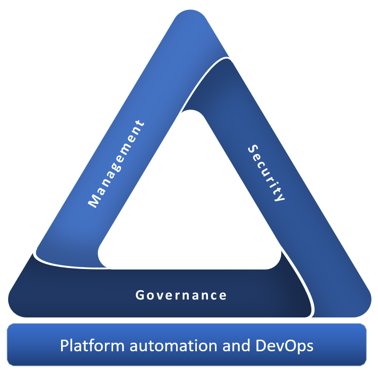

<!-- TODO: Refactor terms: "design area", "well-architected" -->

# Azure landing zone design areas

Each Azure landing zone implementation option provides a deployment approach and defined design principles. Before choosing an implementation option, use this article to gain an understanding of the design areas listed in the following table.

## Environment design areas

Regardless of the deployment option, you should carefully consider each design area. Your decisions affect the platform foundation on which each landing zone depends.

| Design areas | Objective | Relevant methodologies |
|--|--|--|
| [Azure billing and Active Directory tenant](./design-area/azure-billing-ad-tenant.md) | Proper tenant creation, enrollment, and billing setup are important early steps. | Ready |
| [Identity and access management](./design-area/identity-access.md) | Identity and access management is a primary security boundary in the public cloud. It's the foundation for any secure and fully compliant architecture. | Ready |
| [Network topology and connectivity](./design-area/network-topology-and-connectivity.md) | Networking and connectivity decisions are an equally important foundational aspect of any cloud architecture. | Ready |
| [Resource organization](./design-area/resource-org.md) | As cloud adoption scales, considerations for subscription design and management group hierarchy have an impact on governance, operations management, and adoption patterns. | Govern |

## Compliance design areas

Security, governance, and compliance are key topics when designing and building an Azure environment, not only to start from strong foundations, but also to ensure solid ongoing processes and controls are in place.

Alongside the controls that help maintain and demonstrate compliance, the tools and processes implemented for managing environments play an important role in detecting and responding to issues that require action.

As the organization's cloud environment develops, these compliance design areas will be the focus for iterative refinement. This may be as a result of new applications that introduce specific new requirements, or the business requirements changing (for example in response to a new compliance standard).

| Design areas | Objective | Relevant methodologies |
|--|--|--|
| [Security](./design-area/security.md) | Implement controls and process to protect your cloud environments | Secure |
| [Management](./design-area/management.md) | For stable, ongoing operations in the cloud, a management baseline is required to provide visibility, operations compliance, and protect and recover capabilities. | Manage |
| [Governance](./design-area/governance.md) | Automate auditing and enforcement of governance policies. | Govern |
| [Platform automation and DevOps](./design-area/platform-automation-devops.md) | Align the best tools and templates to deploy your landing zones and supporting resources. | Ready |

## Design area process

These design areas describe what you should consider prior to deploying a landing zone. Together, they establish a process to aid in exploring otherwise complex topics, typically involved in making critical decisions about your environment. Evaluation of each design area will help understand any changes you may need to make to the Azure Landing Zone implementation options.

Evaluating each of the design areas sequentially provides a process which simplifies design of even the most complex environments. However, if you've already addressed one or more of the design areas to your satisfaction, check it off the list and move on to the next area.

In this process, you'll be provided a list of roles or functions typically require to make & act on design are decisions. You'll also see a series of considerations, recommendations, and scope boundaries to help shape the discussion and decision making process.

## Next steps

You can implement these design areas over time so that you can grow into your cloud operating model. Review the methodologies related to each of the design areas to understand in more detail the considerations and decisions required to implement a landing zone.

Within each design area you'll find considerations to help shape your internal discussions and recommendations that provide specific guidance to help align your journey to the Azure landing zone conceptual architecture.

Alternately, there are rich, opinionated implementation options that start with a defined position on each design area.

With an understanding of the modular design areas, the next step is to choose the landing zone implementation option that best aligns with your cloud adoption plan and requirements.

> [!div class="nextstepaction"]
> [Choose an implementation option](./implementation-options.md)
