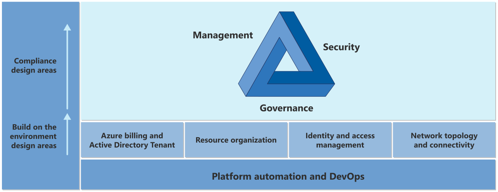

# Azure landing zone design areas and conceptual architecture

The Azure landing zone conceptual architecture below is an example of scaled-out target architecture intended to help organizations operate successful cloud environments that drive their business while maintaining best practices for security and governance. Each Azure landing zone implementation option provides a deployment approach and defined design principles. Learn about these design areas before choosing an implementation option. Use this architecture as a starting point. Download the [Visio file](https://raw.githubusercontent.com/microsoft/CloudAdoptionFramework/master/ready/enterprise-scale-architecture.vsdx) and modify it to fit your specific business and technical requirements when planning your landing zone implementation.

:::image type="content" source="../enterprise-scale/media/azure-landing-zone-architecture-diagram-hub-spoke.svg" alt-text="A conceptual architecture diagram of an Azure landing zone." lightbox="../enterprise-scale/media/azure-landing-zone-architecture-diagram-hub-spoke.svg":::

## Environment design areas

Whatever the deployment option, you should carefully consider each design area. Your decisions affect the platform foundation on which each landing zone depends. You can follow design area concepts indicated with the letters "A" through "I" in the design area diagram to illustrate the hierarchy of resource organization in the conceptual architecture.

| Legend | Design area | Objective |
|--|--|--|
|  | [Azure billing and Active Directory tenant](./design-area/azure-billing-ad-tenant.md) | Proper tenant creation, enrollment, and billing setup are important early steps. |
|  | [Identity and access management](./design-area/identity-access.md) | Identity and access management is a primary security boundary in the public cloud. It's the foundation for any secure and fully compliant architecture. |
|  | [Resource organization](./design-area/resource-org.md) | As cloud adoption scales, considerations for subscription design and management group hierarchy have an impact on governance, operations management, and adoption patterns. |
|  | [Network topology and connectivity](./design-area/network-topology-and-connectivity.md) | Networking and connectivity decisions are an equally important foundational aspect of any cloud architecture. |

## Compliance design areas

Security, governance, and compliance are key topics when designing and building an Azure environment. These topics help you start from strong foundations and ensure that solid ongoing processes and controls are in place.

The tools and processes you implement for managing environments play an important role in detecting and responding to issues. These tools work alongside the controls that help maintain and demonstrate compliance.

As the organization's cloud environment develops, these compliance design areas are the focus for iterative refinement. This refinement might be because of new applications that introduce specific new requirements, or the business requirements changing. For example, in response to a new compliance standard.

| Legend | Design area | Objective |
|--|--|--|
|  | [Security](./design-area/security.md) | Implement controls and processes to protect your cloud environments. |
|    | [Management](./design-area/management.md) | For stable, ongoing operations in the cloud, a management baseline is required to provide visibility, operations compliance, and protect and recover capabilities. |
|   | [Governance](./design-area/governance.md) | Automate auditing and enforcement of governance policies. |
|  | [Platform automation and DevOps](./design-area/platform-automation-devops.md) | Align the best tools and templates to deploy your landing zones and supporting resources. |

## Design area process

These design areas describe what to consider before deploying a landing zone. Together, they establish a process to aid in exploring otherwise complex topics. These topics are typically involved in making critical decisions about your environment. Evaluate each design area to help you understand any changes you might need to make to the Azure landing zone implementation options.

Evaluating each of the design areas sequentially provides a process that simplifies the design of any complex environments. If you've already addressed one or more of the design areas to your satisfaction, move on to the next area.

In this process, you're provided with a list of roles or functions that are typically required to make design decisions. You also see a series of considerations, recommendations, and scope boundaries to help shape the discussion and decision-making process.

## Next steps

You can implement these design areas over time so that you can grow into your cloud operating model. Review the methodologies related to each of the design areas to understand in more detail the considerations and decisions required to implement a landing zone.

Within each design area, you find considerations to help shape your internal discussions and recommendations. These considerations provide specific guidance to help align your journey to the Azure landing zone conceptual architecture.

Alternately, there are rich, opinionated implementation options that start with a defined position on each design area.

With an understanding of the modular design areas, your next step is to choose the landing zone implementation option that best aligns with your cloud adoption plan and requirements.

> [!div class="nextstepaction"]
> [Choose an implementation option](./implementation-options.md)
