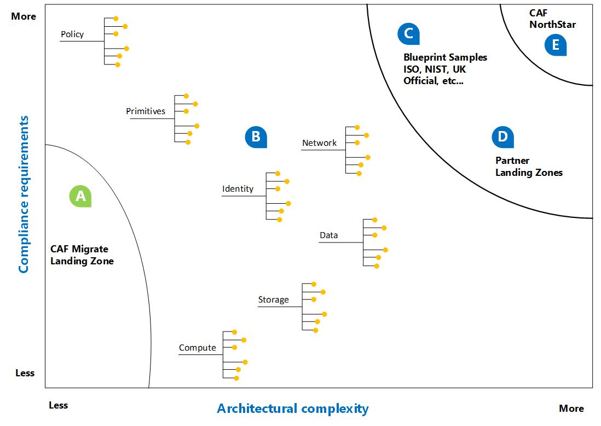

# First landing zone

Infrastructure as code is a natural transition during most cloud adoption efforts. Deployment of your first landing zones in the cloud is a common starting point in moving to a code-driven environment. This article will help you understand the term _landing zone_ and decide which landing zone is most appropriate for your current adoption needs.

## Code-first approach to landing zones

The following image shows a variety of options for landing zones. The following options aid in selecting the right landing zone today. It also helps establish a vision for your future landing zone needs.

A. Start with code to produce consistent, repeatable landing zones. If you're comfortable with refactoring (refining the code and infrastructure) as you learn, start with a lightweight code base, like the Cloud Adoption Framework's Migrate landing zone blueprint. This approach accelerates adoption success and creates hands-on learning opportunities. But this type of initial landing zone is not designed for sensitive data or mission-critical workloads, without additional refactoring.

B. As adoption grows and requirements become more clearly identified, the adoption and platform teams will refactor landing zones based on what they learn. The process of expanding your landing zones prepares environments for more complex compliance or architecture requirements. [Expand the landing zone](../considerations/index.md) provides decision guides and links to best practices to guide refactoring efforts. Expanding the landing zone can aid in meeting security, operations, and governance requirements.

C. Some cloud adoption plans are governed by external compliance requirements. To reduce the burden of meeting these requirements, Azure provides a few sample Azure Blueprints. Some of the samples can be added to your first initial blueprint. Other samples also include a specific implementation that can serve as a first landing zone.

D. When a partner provides ongoing managed services or is contracted to deliver on the adoption plan, they will typically provide their own landing zone. Using a partner landing zone could accelerate adoption efforts and ensure consistent operational management requirements. But give additional consideration to internal governance and security requirements to ensure alignment.

> [!NOTE]
> Before proceeding with a code-first and refactoring-focused approach, readers should be familiar with the [competing priorities behind this decision](../../strategy/balance-competing-priorities.md#balance-during-the-ready-phase). When choosing a landing zone approach, it is important to understand the necessary balance between _time to adoption_ and _long-term operations_.

## Choosing a first landing zone

Selection of the first landing zone depends on multiple variables. The following grid captures some of the options for first landing zones, along with variables that may drive the decision.

| Landing Zone                                 | Cloud experience  | Scale             | Discovery time | Production ready | Hybrid             | Sensitive data     | Mission critical   | Compliance         |
|----------------------------------------------|-------------------|-------------------|----------------|------------------|--------------------|--------------------|--------------------|--------------------|
| [CAF Migrate landing zone](./migrate-landing-zone.md)     | New to cloud      | < 1,000 assets    | 1 to 5 days    | Limited scope -> | Expansion required | Expansion required | Expansion required | Expansion required |
| [CAF Terraform landing zone](./terraform-landing-zone.md) | Various templates | Various templates | 10 to 20 weeks | Limited scope -> | Modules available  | Modules available  | Modules available  | Modules available  |

The following table shows the same landing zones from a slightly different perspective, to guide more technical decision processes.

| Landing Zone                                 | Hub                          | Spoke    | Cloud model | Technology      |
|----------------------------------------------|------------------------------|----------|-------------|-----------------|--|--|--|
| [CAF Migrate landing zone](./migrate-landing-zone.md)     | Refactor required            | Included | Azure only  | Azure Blueprint |
| [CAF Terraform landing zone](./terraform-landing-zone.md) | Included in VDC module       | Included | Multicloud  | Terraform       |

## Next steps

If you're still unsure of which first landing zone to choose, we recommend starting with the [CAF Migrate landing zone blueprint](./migrate-landing-zone.md).

> [!div class="nextstepaction"]
> [CAF Migrate landing zone blueprint](./migrate-landing-zone.md)
