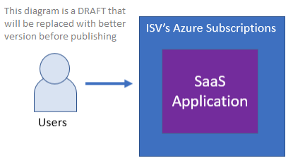
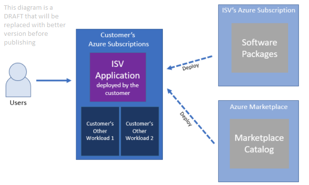
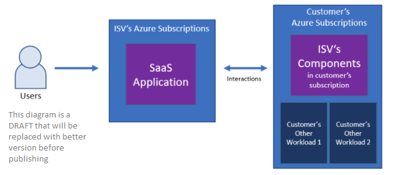
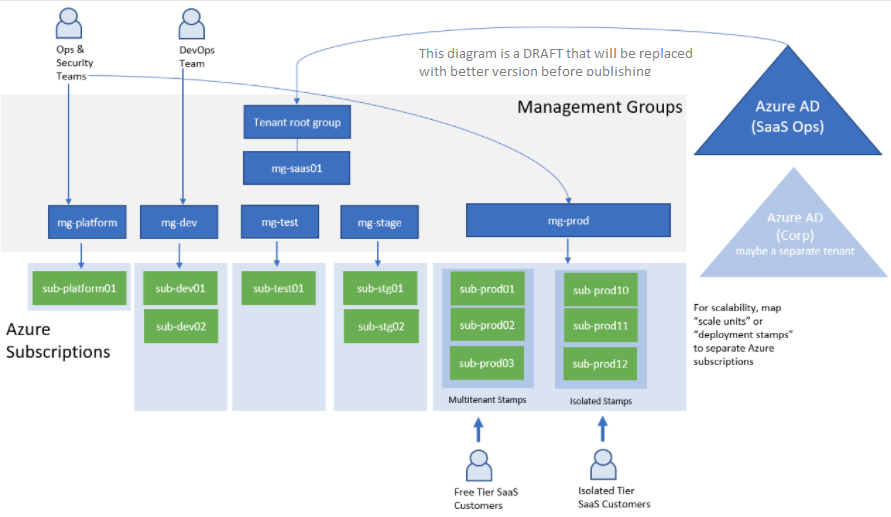

# Independent Software Vendor (ISV) considerations for Azure landing zones

For many organizations, the [Azure landing zones](./index.md) conceptual architecture represents the destination in their cloud adoption journey. Landing zones describe how you can build an Azure environment with multiple subscriptions. A landing zone accounts for scale, security, governance, networking, and identity. It's based on feedback and lessons learned from enterprise customers.

> [!TIP]
> It's helpful to think about Azure landing zones as being analagous to a city plan. The architectures of the specific workloads deployed into a landing zone are like the building plans.

As an Independent Software Vendor (ISV) building and operating your solution on Azure, you should refer to the following resources:

* [Azure landing zones](index.md): This article provides guidance for your overall Azure environment.
* [Azure Well-Architected Framework](/azure/architecture/framework/): The Well-Architected Framework provides architectural guidance applicable to all workloads.
* [Architecting multitenant solutions on Azure](/azure/architecture/guide/multitenant/overview): If you build a **multitenant** solution on Azure, this series provides specific guidance to help you architect your solution for multitenancy.

The Azure landing zones conceptual architecture will help you set a direction for your overall deployment approach. But as an ISV, SaaS provider, or startup, your specific implementation might vary from standard landing zones like those used in enterprise scenarios.

ISV solutions often fit one of three deployment models: pure SaaS, customer-deployed, or dual deployment. Each of these models requires different key considerations for Azure landing zones.

## Pure SaaS deployment model

In the pure SaaS model, the ISV's software is deployed fully in the ISV's own Azure subscriptions. End customers consume the software without deploying it in their own Azure subscriptions. In the following diagram, a user is using a pure SaaS application provided by an ISV:

Examples of pure SaaS software inlude SendGrid, Confluent Cloud, Snowflake, and many other [SaaS listings in Azure Marketplace](https://azuremarketplace.microsoft.com/marketplace/apps?filters=saas).

As a SaaS ISV, you should review Azure landing zone guidance for how to properly architect your overall Azure environment for scale. You should also review the guidance on [architecting multitenant solutions on Azure](/azure/architecture/guide/multitenant/overview), which provides guidance on how to design, build, and operate your own multitenant solutions on Azure.

If you're a small SaaS ISV, then at first you might not need to use multiple Azure subscriptions to deploy your resources. As you scale, Azure's subscription limits can affect your ability to scale within a single subscription. Review the [enterprise-scale landing zone design principles](../enterprise-scale/design-principles.md), such as subscription democratization, and familiarize yourself with the [architectural approaches for multitenancy](/azure/architecture/guide/multitenant/approaches/overview), to plan for future growth as required.

ISVs building pure SaaS solutions should consider the following questions:

* Will all of the Azure resources that make up the SaaS solution be in one Azure subscription, or will they be partitioned across multiple Azure subscriptions?
* Should each customer of an ISV's SaaS solution be hosted in a dedicated Azure subscription, or can resources be created in one or a few shared subscriptions?
* How should you apply the [Deployment Stamp (scale unit) pattern](/azure/architecture/guide/multitenant/approaches/overview) for all of the tiers of your solution?
* How should you think about [Azure resource organization in multitenant solutions](/azure/architecture/guide/multitenant/approaches/resource-organization) to avoid facing scale challenges and Azure subscription limits?

## Customer-deployed deployment model

In the customer-deployed model, end customers purchase software from the ISV and then deploy it into their own Azure subscriptions. The deployment might be initiated from the Azure Marketplace, or it might be manually deployed by the customer following instructions and using scripts provided by the ISV. In the following diagram, an ISV provides software packages or an Azure Marketplace catalog product, and customers deploy the resources into their own Azure subscription alongside their other workloads:

Customers frequently deploy multiple products from different ISVs into their Azure subscriptions. They compose these individual products into a solution. For example, they might deploy a database product from one ISV, a network virtual appliance from another ISV, and a web application from a third ISV. Because of this, the *Customer's other workload* element the diagram above might represent either customer's own workload or another ISV product deployed within the customer's Azure subscription.

Examples of customer-deployed ISV products include Barracuda firewall appliances, SoftNAS appliances, and many other [virtual machine images](https://azuremarketplace.microsoft.com/marketplace/apps?filters=virtual-machine-images) and [Azure applications](https://azuremarketplace.microsoft.com/marketplace/apps?filters=solution-templates) in the Azure Marketplace.

For some customer-deployed solutions, ISVs, Solution Integrators (SIs), or Managed Service Providers (MSPs) provide management and updates of the solution deployed within the end-customer Azure subscriptions by using [Azure Lighthouse](/azure/lighthouse/overview) or [Azure Managed Applications](/azure/azure-resource-manager/managed-applications/overview).

Customer-deployed ISV solutions would be considered a standard application workload from the perspective of Azure landing zones. As an ISV building customer-deployed software, it's important to consider the Azure landing zones guidance to ensure you design your software so that it is compatible with the Azure landing zones design principles adopted by your Azure customers.

When an ISV is migrating their existing customers' workloads to Azure, it's especially important for the ISV to have a good understanding of the Azure landing zone concepts.

ISVs building solutions that customers will deploy into their own subscriptions should consider the following questions:

* When should the customer deploy the ISV solution into its own dedicated subscription, and when should it be deployed into an existing subscription that contains related workloads?
* How should customers establish network connectivity between their existing workloads (inside or out of Azure) and the ISV solution being deployed?
* Does the ISV solution support authentication mechanisms provided by Azure Active Directory (Azure AD)? Or, does it require protocols like LDAP or Kerberos?
* How can the ISV reduce or eliminate Azure Policy violations? These might be caused by a conflict between the ISV's solution templates and customer's Azure policies.

## Dual deployment SaaS deployment model

Some SaaS solutions interact with or use resources that are deployed in the customers' Azure subscriptions. This deployment model is sometimes called *SaaS hybrid*. In the following diagram, an ISV provides a hosted SaaS solution that interacts with resources deployed into an end customer's Azure subscription:

For example, NetApp Virtual Desktop provides a console interface to control Azure Virtual Desktop resources in the customer's Azure subscriptions. NetApp Cloud Sync provides backup services, and requires a virtual machine to be deployed into the customer's Azure subscription. Upsolver provides a SaaS console for data analytics, and dynamically creates and deletes compute node virtual machines in the customer's Azure subscription.

As a dual deployment ISV, you should refer to the Azure landing zone for guidance on both how to structure your own Azure environment, which hosts your SaaS service, and how to make the components that deploy into your customers' Azure subscriptions interact correctly with the customers' Azure landing zones.

ISVs building dual deployment SaaS solutions should consider the following issues:

* Review all of the considerations applicable to ISVs building pure SaaS and customer-deployed solutions.
* Which components of the solution will be hosted in the ISV's own Azure subscriptions and which components will be customer-deployed?
* How will you ensure secure provisioning and interactions with the resources deployed in the customer Azure subscriptions?

## Azure landing zone design principles and implementations

[Azure's landing zone design principles](../enterprise-scale/design-principles.md) recommend aligning to Azure-native platform capabilities. They also provide specific [Azure landing zone implementation options](./implementation-options.md).

As an ISV, you might have reasons to implement your own landing zone environment and might decide to continue using your existing preferred tools for logging, monitoring, and other similar platform-layer services. Even in this situation, we recommend you use Azure landing zone guidance and sample implementations as a reference, and as a way to align your approach to proven landing zone designs for Azure's enterprise customers.

## Azure AD tenant considerations

Azure landing zone's [Azure AD tenant guidance](./design-area/azure-ad-define.md) strongly recommends using a single Azure AD tenant, which is the correct approach for most enterprise customers. However, as a SaaS ISV, you might have reasons to separate the Azure AD tenant used by your SaaS operations team from the Azure AD tenant used by your own internal or corporate IT team.

For some SaaS ISVs, the corporate IT team that owns the corporate resources is different from the group that develops software and that operates this software as SaaS for the end customers. In many situations, the corporate IT team might not even be allowed to manage the SaaS-related components. In these situations, consider having two separate Azure AD tenants: one Azure AD tenant for corporate IT resources like Office 365, and a separate Azure AD tenant for Azure resources that comprise the SaaS solution.

For more information on the decision to use multiple Azure AD tenants, see the [securing Azure environments with Azure Active Directory whitepaper](https://azure.microsoft.com/resources/securing-azure-environments-with-azure-active-directory/).

## Management group hierarchy considerations

As a SaaS ISV, you might find that the recommended Azure landing zone's [management group hierarchy](./design-area/resource-org-management-groups.md), with corporate and online archetypes, isn't applicable to how you develop and operate your SaaS solution. Also, the Azure landing zone [Enterprise-scale FAQ](../enterprise-scale/faq.md#how-do-we-handle-devtestproduction-workload-landing-zones-in-enterprise-scale-architecture) explains how to handle the landing zones for development, test, and production workloads for enterprise customers, but it might still not be applicable to SaaS providers whose single workload is partitioned across multiple Azure subscriptions.

SaaS ISVs often organize their cloud environments by modeling their software development lifecycle environments through a sequence. Commonly, this requires deployment first to a *Development* environment, then a *Test* environment, a *Staging* environment, and then to the *Production* environment. The primary difference between the development, test, staging, and production groups of Azure subscriptions is frequently the Azure role-based access control (Azure RBAC) rules, such as who can access these groups of subscriptions. For example, the DevOps, SaaSOps, development, and test teams might have different levels of access to different environments.

Azure Policy configuration is often similar between environments, because these groups of subscriptions often have similar guardrails. For example, you might specify policies like the allowable Azure regions and VM sizes that can be used in each environment. Also, SaaS ISVs with multiple tiers of service might have extra separation between free-tier shared instances of the solution and premium-tier dedicated instances of the application.

ISVs who use multiple environments for their SaaS solutions can consider using management groups to grouping their Azure subscriptions that correspond to each environment, and then apply Azure RBAC rules and Azure Policy policies to each environment's management group.

In the following diagram, a management group and subscription hierarchy is shown for an ISV that uses three environments (*Development*, *Test*, *Staging*, and *Production*) and with two different service tiers (*Free* and *Isolated*):

The distinction between multitenant and isolated production subscriptions might not apply to all ISVs. Also, different ISVs might use different sets of environments. For example, smaller ISVs can decide to only start with three subscriptions, such as *Platform*, *Development/Test*, and *Production*. They then might need to deploy additional subscriptions as separate deployment stamps as they grow.

## Next steps

* If you're building a multitenant solution, learn more about [architecting multitenant solutions on Azure](/azure/architecture/guide/multitenant/overview).
* Learn [what is an Azure landing zone](index.md).
* Learn about [Azure landing zone design areas](design-areas.md)
