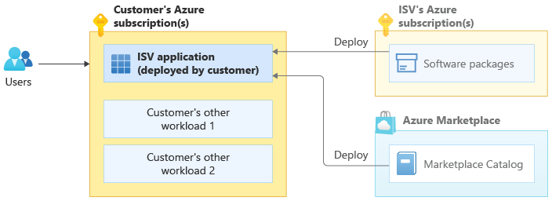
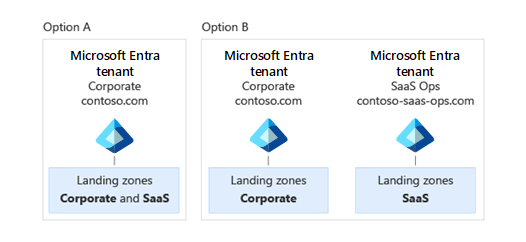
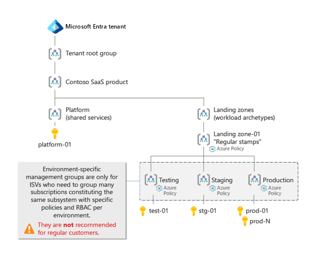

# Independent software vendor (ISV) considerations for Azure landing zones

For many organizations, the [Azure landing zones](./index.md) conceptual architecture represents the destination of their cloud adoption journey. The landing zones describe how to build an Azure environment with multiple subscriptions. Each landing zone accounts for scale, security, governance, networking, and identity, and is based on feedback and lessons learned from many customers.

> [!TIP]
> It can be helpful to think of Azure landing zones as being like city plans. The architectures of workloads deployed into a landing zone are like plans for buildings in a city.
>
> A city's water, gas, electricity, and transport systems all must be in place before buildings can be constructed. Similarly, an Azure landing zone's components, including management groups, policies, subscriptions, and role-based access control (RBAC), all must be in place before any production workloads can be deployed.

As an independent software vendor (ISV) building and operating your solution on Azure, you should refer to the following resources as you build your Azure environment:

* [Azure landing zones](index.md): Provides guidance for your overall Azure environment.
* [Azure Well-Architected Framework](/azure/architecture/framework/): Provides architectural guidance applicable to all workloads.
* [Architecting multitenant solutions on Azure](/azure/architecture/guide/multitenant/overview): Provides specific architectural guidance for **multitenant** solutions on Azure.

The Azure landing zones help you choose a direction for your overall Azure environment. But as an ISV, SaaS provider, or startup, your specific implementation needs might differ from more standard customer scenarios. The following are just a few different implementation scenario examples:

* You build software that customers deploy into their own subscriptions.
* You have your own *control plane* and use automation scripts or software to deploy and configure Azure resources for your SaaS solutions.
* You're a small ISV or startup and want to start with the lowest possible cost, and might not want to initially use services like Azure Firewall and Azure DDoS Protection.
* You're a large SaaS ISV and plan to split your SaaS application across multiple subscriptions for scale. You also want to group the subscriptions so they correspond to your development, test, staging, and production environments.
* Your organization's operating model separates the roles of your corporate IT team and your SaaS product teams. Your organization's corporate IT team might manage resources like Microsoft Office 365 and Microsoft Teams, and your SaaS product team might be responsible for building and operating your SaaS product (including its central platform and identity components).

> [!NOTE]
> Sometimes, ISVs want to start with just a single Azure subscription that includes both platform "shared services" aspects and actual workload resources. Although this is technically possible, you'll face challenges later on when you need to move resources between subscriptions and find that not all [resource types can be moved](/azure/cloud-adoption-framework/ready/enterprise-scale/transition#moving-resources-in-azure). Review the [impact of design deviations](/azure/cloud-adoption-framework/ready/enterprise-scale/design-principles#impact-of-design-deviations) to understand what deviations are possible and their various levels of risk.

## ISV deployment models

ISV solutions often fit into one of three deployment models: pure SaaS, customer-deployed, or dual-deployment SaaS. This section describes each model's different considerations for Azure landing zones.

### Pure SaaS

In the pure SaaS model, your software is deployed fully only in your Azure subscriptions. End customers consume your software without deploying it in their own Azure subscriptions. In the following diagram, users are using a pure SaaS application provided by an ISV:

Examples of pure SaaS software include email-as-a-service, Kafka-as-a-service, cloud-data-warehouse-as-a-service, and many [SaaS listings in Azure Marketplace](https://azuremarketplace.microsoft.com/marketplace/apps?filters=saas).

If you're a small SaaS ISV, you might not need to use multiple Azure subscriptions to deploy your resources right away. But as you scale, Azure's subscription limits can affect your ability to scale within a single subscription. Review the [enterprise-scale landing zone design principles](../enterprise-scale/design-principles.md), particularly subscription democratization, and familiarize yourself with the [architectural approaches for multitenancy](/azure/architecture/guide/multitenant/approaches/overview) to plan for your future growth.

ISVs building pure SaaS solutions should consider the following questions:

* Should all the Azure resources that make up our SaaS solution be in one Azure subscription, or partitioned across multiple Azure subscriptions?
* Should we host each customer in their own dedicated Azure subscription, or can we create resources within one or a few shared subscriptions?
* How can we apply the [Deployment Stamp (scale unit) pattern](/azure/architecture/guide/multitenant/approaches/overview) to all of our solution's tiers?
* How can we use [Azure resource organization in multitenant solutions](/azure/architecture/guide/multitenant/approaches/resource-organization) to keep us from facing scale challenges and Azure subscription limits?

### Customer-deployed

In the customer-deployed model, your end customers purchase software from you and then deploy it into their own Azure subscriptions. They might initiate the deployment from the Azure Marketplace, or do it manually by following instructions and using scripts you provide.

In the following diagram, an ISV provides a software package or Azure Marketplace catalog product, and users deploy that resource into their own Azure subscriptions alongside their other workloads:

The *Customer's other workload* element in the diagram can represent either a customer's own workload or another ISV product the customer has deployed within their Azure subscription. Customers frequently deploy multiple products from different ISVs into their Azure subscriptions. They combine these individual products to create solutions. For example, a customer might deploy a database product from one ISV, a network virtual appliance from another ISV, and a web application from a third ISV.

Examples of customer-deployed ISV products include the many [virtual machine images](https://azuremarketplace.microsoft.com/marketplace/apps?filters=virtual-machine-images) (such as network and storage virtual appliances) and [Azure applications](https://azuremarketplace.microsoft.com/marketplace/apps?filters=solution-templates) in the Azure Marketplace.

For some customer-deployed solutions, an organization might provide management of and updates for the solution deployed within their end-customer Azure subscriptions by using [Azure Lighthouse](/azure/lighthouse/overview) or [Azure Managed Applications](/azure/azure-resource-manager/managed-applications/overview). ISVs, Solution Integrators (SIs), and Managed Service Providers (MSPs) all can use this strategy when it meets their particular needs.

Customer-deployed ISV solutions are considered a standard application workload from the perspective of Azure landing zones. Consider the [Azure landing zones guidance](index.md) as you design your product to work with the [Azure landing zones design principles](../enterprise-scale/design-principles.md) your Azure customers adopt.

It's especially important for you to have a good understanding of the Azure landing zone concepts as you migrate your existing customers' workloads to Azure.

ISVs building customer-deployed solutions should consider the following questions:

* Should a customer deploy our solution into its own dedicated subscription or into an existing subscription that contains related workloads?
* How should customers establish network connectivity between existing workloads (inside and outside of Azure) and our solution?
* Does our solution support authentication mechanisms from Azure Active Directory (Azure AD) or require other protocols like LDAP or Kerberos?
* How do we reduce or eliminate Azure Policy violations, like those caused by conflicts between our solution templates and a customer's Azure policies?

Customer Azure policies that can cause Azure Policy violations include examples like "All subnets must have a network security group" and "No public IP addresses can be attached to network interfaces in the Corp landing zone". Keep the potential for these conflict-causing policies in mind as you plan your deployment.

### Dual deployment SaaS

Some SaaS solutions interact with or use resources that are deployed in customers' Azure subscriptions. This deployment model is sometimes called *dual deployment SaaS* or *SaaS hybrid*. In the following diagram, an ISV provides a hosted SaaS solution that interacts with resources deployed into an end customer's Azure subscription:

A real-world example of *dual deployment SaaS* is Microsoft Power BI, a SaaS service that can optionally use a Power BI On-Premises Data Gateway deployed on a virtual machine in a customer's Azure subscription.

Other examples of *dual deployment SaaS* scenarios include:

* Your organization builds Virtual Desktop Manager, a product that provides a SaaS console interface to control Azure Virtual Desktop resources in each customer's Azure subscription.
* Your organization provides a SaaS console for data analytics, and dynamically creates and deletes compute node virtual machines in each customer's Azure subscription.

As a dual deployment ISV, you should refer to the Azure landing zone for guidance in two areas: structuring your own Azure environment to host your SaaS service, and ensuring proper interaction between your deployments in customers' Azure subscriptions and your customers' landing zones.

ISVs building dual deployment SaaS solutions should consider the following questions:

* Have we reviewed all considerations for building both pure SaaS and customer-deployed solutions?
* Which components of our solution should be hosted in our Azure subscriptions, and which components should be customer-deployed?
* How can we ensure secure provisioning and interactions with resources deployed in our customers' Azure subscriptions?

## Azure landing zone design principles and implementations

[Azure's landing zone design principles](../enterprise-scale/design-principles.md) recommend aligning with Azure-native platform capabilities such as Log Analytics, Azure Monitor, and Azure Firewall. The landing zone guidance also provides specific [Azure landing zone implementation options](./implementation-options.md).

As an ISV, you might decide to implement your own landing zone environments. You might need to use your own automation to deploy Azure resources across subscriptions. Or you might want to continue using tools you already employ for logging, monitoring, and other platform-layer services.

If you do implement your own landing zone environments, we recommend that you use Azure landing zone guidance and sample implementations for reference, and align your approach with proven Azure landing zone designs.

## Azure AD tenants

Each Azure landing zone and its management group hierarchy is rooted in a single Azure Active Directory (Azure AD) tenant. This means that the first decision you need to make is which Azure AD tenant to use as the source of identities for managing your Azure resources. Identities in the Azure AD include users, groups, and service principals.

> [!TIP]
> The Azure AD tenant you select for your landing zone doesn't affect your application-level authentication. You can still use other identity providers like Azure AD B2C regardless of which tenant you choose.

The [guidance for Azure landing zones and Azure AD tenants](./design-area/azure-ad-define.md) strongly recommends using a single Azure AD tenant, and this is the correct approach for most situations. However, as a SaaS ISV, you might have reason to use two tenants.

For some SaaS ISVs, one team manages corporate resources and a separate team operates the SaaS solution. This separation can be for operational reasons or to comply with regulatory requirements. Perhaps your corporate IT team isn't allowed to manage any SaaS-related subscriptions and resources, so they can't be administrators of the Azure AD tenant. If this scenario applies to you, consider using two separate Azure AD tenants: one tenant for corporate IT resources like Office 365, and one tenant for Azure resources that comprise your SaaS solution.

Each Azure AD tenant must have its own domain name. If your organization uses two tenants, you might choose a name like `contoso.com` for your corporate Azure AD tenant and `contoso-saas-ops.com` for your SaaS Azure AD tenant, as shown in the following diagram.

> [!WARNING]
> When you use multiple Azure AD tenants, your management overhead increases. If you use Azure AD Premium features like Privileged Identity Management, you have to purchase individual licenses for each Azure AD tenant. It's best to only use multiple Azure AD tenants if your situation truly requires it.

Avoid using separate Azure AD tenants for pre-production and production environments. Rather than creating two tenants like `contoso-saas-ops-preprod.com` and `contoso-saas-ops-prod.com` with separate Azure subscriptions under each, you should create one Azure AD tenant. You can use management groups and Azure RBAC to govern the access to subscriptions and resources under this single tenant.

For more information on the using multiple Azure AD tenants, see the [securing Azure environments with Azure Active Directory whitepaper](https://azure.microsoft.com/resources/securing-azure-environments-with-azure-active-directory/).

## Management groups

[The Azure landing zone conceptual architecture](index.md#azure-landing-zone-conceptual-architecture) recommends using a specific management group hierarchy. However, ISVs can have different requirements than other organizations. This section describes some ways your ISV organization might choose to adopt different practices than what the landing zone conceptual architecture recommends.

### Top-level management group

Your management group hierarchy is nested under the Azure-created **Tenant root group** management group. You don't use the **Tenant root group** directly.

A standard organization that has a centralized corporate IT team managing their platform and shared services (like logging, networking, identity, and security) usually creates one top-level management group under the Azure-created **Tenant root group** and deploys the rest of their management groups below it. This top-level management group is usually named after the organization itself (such as *Contoso*).

As a SaaS ISV, you might have one SaaS product or you might have a few separate SaaS products or lines of business. While you should generally use the same Azure AD tenant to manage Azure resources across all of your products (as discussed in the [Azure AD tenants](#azure-ad-tenants) section), in some scenarios you might choose to deploy multiple management group hierarchies.

Consider how independent your products are from each other, and ask yourself:

* Do our products all use the same platforms for DevOps, identity, security, connectivity, and logging?
* Are those shared services operated by a single central team?

If you answered *yes* to both questions, create a single top-level **SaaS Product** management group under the **Tenant root group**.

If you instead answered *no*, and each of your SaaS products is managed and operated by separate platform teams, consider creating a separate top-level management group for each product, like the two top-level management groups **SaaS Product-01** and **SaaS Product-02**.

> [!TIP]
> It's uncommon for one ISV to have more than just a few top-level management groups. Often, several products can be combined together due to similarities in how they're managed and operated.

This management approach is similar to the [testing approach for enterprise-scale landing zones](../enterprise-scale/testing-approach.md#example-scenarios-and-outcomes). However, rather than creating *Contoso* and *Contoso-Canary* under the **Tenant root group**, in this approach the example company would create the product-specific *Contoso-SaaS-Product-01*, *Contoso-SaaS-Product-02*, and *Contoso-SaaS-Product-03* top-level management groups under it instead. This scenario is illustrated in the following diagram:

### Platform management group

In the [Azure landing zone resource organization hierarchy](./design-area/resource-org-management-groups.md#management-groups-in-the-azure-landing-zone-accelerator), the **Platform** management group contains all Azure subscriptions that host components and shared services used by workloads in the landing zone subscriptions. Examples of components deployed into the platform and shared services subscriptions include centralized logging infrastructure (such as Log Analytics workspaces), DevOps, security, automation tooling, central networking resources (such as hub-VNet and DDos Protection plans), and an ISV's control plane services.

The **Platform** management group is frequently partitioned into **Identity**, **Management**, and **Connectivity** child groups to provide convenient separation of roles and policies for enterprise customers.

In your organization, you might have a single team that manages all shared platform components like identity, networking, and management. If so, and if you have no plans to separate that management across multiple teams, then consider using a single **Platform** management group.

If you instead will have separate teams that manage different parts of your centralized platform, you should deploy further levels in the management group hierarchy under the **Platform** management group. This allows you to assign separate policies for each part of your centralized platform.

The following diagram illustrates two potential implementations of the **Platform** management group. Option A shows a more comprehensive scenario, where the **Platform** management group contains three child management groups: **Management and DevOps**, **Identity and Security**, and **Connectivity**. Each child management group contains a subscription with the relevant resources. Option B shows a more simple scenario, where the **Platform** management group contains a single platform subscription.

### Landing Zones management group

The **Landing Zones** management group contains the Azure subscriptions that host your SaaS solution's actual subsystems and workloads.

This management group contains one or more child management groups. Each of the child management groups under **Landing Zones** represents a workload or subsystem *archetype*, with consistent policy and access requirements that should apply to all subscriptions. Reasons for using multiple archetypes include:

* **Compliance:** If a subsystem of your SaaS product needs to be PCI-DSS compliant, consider creating a **PCI DSS** archetype child management group under **Landing Zones**. All Azure subscriptions that contain resources within the scope of PCI-DSS compliance should be placed within that management group.
* **Tiers:** Consider creating separate landing zone archetypes for your SaaS solution's *dedicated* tier customers and *free* tier customers. Each of the child management groups contains different Azure Policy settings. For example, the policies in the free tier might restrict deployments to only enable specific virtual machine SKUs, and the policies in the dedicated tier might require resources to be deployed into specific regions.

### Environment-specific management groups

SaaS ISVs often organize their cloud environments by modeling their software development lifecycle environments in a sequence. This commonly requires deployment first to a *Development* environment, then to a *Test* environment, then to a *Staging* environment, and finally to a *Production* environment.

One common difference between the environments is their Azure RBAC rules, like who can access each group of subscriptions. For example, the DevOps, SaaSOps, development, and test teams might all have different levels of access to different environments.

> [!IMPORTANT]
> Most Azure customers have hundreds of applications and use separate Azure subscriptions for each application team. If each application had its own development, test, staging, and production management groups, there would be a large number of management groups with near-identical policies. For most customers, the [Enterprise-Scale Landing Zone FAQ](../enterprise-scale/faq.md#how-do-we-handle-devtestproduction-workload-landing-zones-in-enterprise-scale-architecture) advises against using separate management groups for each environment. It recommends using separate subscriptions within a single management group instead.
>
> However, SaaS ISVs can have different requirements than most other Azure customers, and might have good reason to use environment-specific management groups in some situations.

SaaS ISVs sometimes need to group multiple subscriptions that represent *shards* or *partitions* of the same subsystem, application, or workload. You might need to apply policies or role assignments to groups of subscriptions in a noticeably different way than in the archetype management group. In this case, consider creating child management groups that correspond to each environment under the archetype management group.

The following diagrams illustrate two potential options. Option A shows a scenario with separate subscriptions for each environment but no environment-specific management groups. Option B shows a SaaS ISV scenario with environment-specific management groups under the **Regular stamps** management group. Each environment-specific management group contains multiple subscriptions. Over time, the ISV scales their Azure resources in each environment across an increasing number of subscriptions with a common set of policies and role assignments.

Select each tab to see the two diagrams.

#### [Option A](#tab/mg-env-no)

#### [Option B](#tab/mg-env-yes)

---

### Decommissioned and Sandboxes management groups

The Azure landing zone [resource organization guidance](./design-area/resource-org-management-groups.md#management-groups-in-the-azure-landing-zone-accelerator) recommends including **Decommissioned** and **Sandboxes** management groups directly below your top-level management group.

The **Decommissioned** management group is a holding place for Azure subscriptions that are being disabled and will eventually be deleted. You can move a subscription that's no longer in use into this management group to track it until all the resources in the subscription are permanently deleted.

The **Sandboxes** management group usually contains Azure subscriptions that are used for exploration purposes and have loose or no policies applied to them. For example, you might provide individual developers with their own subscriptions for development and testing. You can avoid applying the normal policies and governance to these subscriptions by placing them in the **Sandboxes** management group. This increases the developers' agility and enables them to easily experiment with Azure.

> [!IMPORTANT]
> Subscriptions in the **Sandboxes** management group should not have direct connectivity to the landing zone subscriptions. Avoid connecting sandbox subscriptions to production workloads or to any non-production environments that mirror production environments.

The following diagram illustrates two potential options. Option A doesn't include the **Decommissioned** and **Sandbox** management groups, while option B does.

### Example ISV landing zones

This section includes two example Azure landing zone structures for a SaaS ISV. Select each tab to compare the two example landing zones.

#### [Minimal](#tab/minimal)

The following diagram shows an example SaaS ISV Azure landing zones hierarchy with the following characteristics:

- The ISV keeps all their platform components in a single Azure subscription, instead of [splitting them into multiple platform management groups](#platform-management-group).
- There is only one [landing zone management group](#landing-zones-management-group).
- The landing zone includes [environment-specific management groups](#landing-zones-management-group) for organizing subscriptions and assigning different policies and roles.
- The ISV didn't include the management groups for [decommissioned and sandbox subscriptions](#decommissioned-and-sandboxes-management-groups).

#### [Comprehensive](#tab/comprehensive)

The following diagram shows an example SaaS ISV Azure landing zones hierarchy with the following characteristics:

- The landing zone has complete platform-level separation between a few different SaaS products (**Contoso SaaS Product 01** and **Contoso SaaS Product 02**), each with their own platform.
- The ISV keeps all of their platform components in a single Azure subscription, instead of [splitting them into multiple platform management groups](#platform-management-group).
- There are two [landing zone management groups](#landing-zones-management-group) (**Regular stamps** and **PCI-DSS**).
- The landing zone includes [environment-specific management groups](#landing-zones-management-group) for organizing the subscriptions and assigning different policies and roles.
- The ISV included the management groups for [decommissioned and sandbox subscriptions](#decommissioned-and-sandboxes-management-groups).

---

## Next steps

* If you're building a multitenant solution, learn more about [architecting multitenant solutions on Azure](/azure/architecture/guide/multitenant/overview).
* Learn [what is an Azure landing zone](index.md).
* Learn about [Azure landing zone design areas](design-areas.md).
