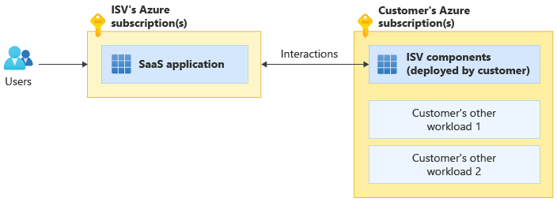

# Independent Software Vendor (ISV) considerations for Azure landing zones

For many organizations, the [Azure landing zones](./index.md) conceptual architecture represents the destination in their cloud adoption journey. Landing zones describe how you can build an Azure environment with multiple subscriptions. A landing zone accounts for scale, security, governance, networking, and identity. It's based on feedback and lessons learned from many customers.

> [!TIP]
> It can be helpful to think about Azure landing zones as being related to a city plan. The architectures of the specific workloads deployed into a landing zone are like the plans for buildings in the city. For example water, gas, electricity, and transport links are all required before any buildings are constructed. The same applies for Azure, where Azure Landing Zones (Management Groups, Azure Policies, Subscriptions, RBAC, and so forth) are required before any workloads can be deployed in a production manner.

As an Independent Software Vendor (ISV) building and operating your solution on Azure, you should refer to the following resources:

* [Azure landing zones](index.md): This article provides guidance for your overall Azure environment.
* [Azure Well-Architected Framework](/azure/architecture/framework/): The Well-Architected Framework provides architectural guidance applicable to all workloads.
* [Architecting multitenant solutions on Azure](/azure/architecture/guide/multitenant/overview): If you build a **multitenant** solution on Azure, this series provides specific guidance to help you architect your solution for multitenancy.

The Azure landing zones conceptual architecture helps you to set a direction for your overall Azure environment. But as an ISV, SaaS provider, or startup, your specific implementation might vary from regular customer scenarios. Some example differences include:

* Your company's operating model might separate the role of the corporate IT team from the SaaS product teams. Your corporate IT team manages your organization's resources such as your Azure Active Directory (Azure AD) tenant, Microsoft Office 365, and Microsoft Teams. The SaaS product teams build and operate your SaaS product, including its central platform and identity components.
* You are a small ISV or startup and want to start with lowest possible cost and don't want to initially utilize some services like Azure Firewall.
* You are a large SaaS ISV planning to split your SaaS application across multiple subscriptions for scale. You want to group subscriptions to correspond to your development, test, staging, and production environments.
* You have your own *control plane*: automation scripts or software that deploys and configures the Azure resources for your SaaS solutions.
* You are building software that customers deploy into their own subscriptions.

> [!NOTE]
> Sometimes ISVs want to start with just one Azure subscription including both platform "shared services" aspects like the logging infrastructure and the actual workload resources. Although it is technically possible, challenges will surface later when you want central platform team to managed the shared components or want to partition the workload across subscriptions for growth, since you will need to move resources between subscriptions and not all [resource types can be moved](/azure/cloud-adoption-framework/ready/enterprise-scale/transition#moving-resources-in-azure). Review the [impact of design deviations](/azure/cloud-adoption-framework/ready/enterprise-scale/design-principles#impact-of-design-deviations).

ISV solutions often fit one of three deployment models: pure SaaS, customer-deployed, or dual deployment SaaS. In this article, we outline how each of these models requires different key considerations for Azure landing zones.

## ISV deployment models

### Pure SaaS

In the pure SaaS model, the ISV's software is deployed fully in the ISV's own Azure subscriptions. End customers consume the software without deploying it in their own Azure subscriptions. In the following diagram, a user is using a pure SaaS application provided by an ISV:

Examples of pure SaaS software include email-as-a-service, Kafka-as-a-service, cloud-data-warehouse-as-a-service, and many [SaaS listings in Azure Marketplace](https://azuremarketplace.microsoft.com/marketplace/apps?filters=saas).

If you're a small SaaS ISV, then at first you might not need to use multiple Azure subscriptions to deploy your resources. As you scale, Azure's subscription limits can affect your ability to scale within a single subscription. Review the [enterprise-scale landing zone design principles](../enterprise-scale/design-principles.md), such as subscription democratization, and familiarize yourself with the [architectural approaches for multitenancy](/azure/architecture/guide/multitenant/approaches/overview), to plan for future growth as required.

ISVs building pure SaaS solutions should consider the following questions:

* Will all of the Azure resources that make up the SaaS solution be in one Azure subscription, or will they be partitioned across multiple Azure subscriptions?
* Should each customer of an ISV's SaaS solution be hosted in a dedicated Azure subscription, or can resources be created in one or a few shared subscriptions?
* How should you apply the [Deployment Stamp (scale unit) pattern](/azure/architecture/guide/multitenant/approaches/overview) for all of the tiers of your solution?
* How should you think about [Azure resource organization in multitenant solutions](/azure/architecture/guide/multitenant/approaches/resource-organization) to avoid facing scale challenges and Azure subscription limits?

### Customer-deployed

In the customer-deployed model, end customers purchase software from the ISV and then deploy it into their own Azure subscriptions. The deployment might be initiated from the Azure Marketplace, or it might be manually deployed by the customer following instructions and using scripts provided by the ISV. In the following diagram, an ISV provides software packages or an Azure Marketplace catalog product, and customers deploy the resources into their own Azure subscriptions alongside their other workloads:

Customers frequently deploy multiple products from different ISVs into their Azure subscriptions. They compose these individual products into a solution. For example, they might deploy a database product from one ISV, a network virtual appliance from another ISV, and a web application from a third ISV. Because of this, the *Customer's other workload* element the diagram above might represent either customer's own workload or another ISV product deployed within the customer's Azure subscription.

Examples of customer-deployed ISV products include network-virtual-appliances, storage-virtual-appliances, and many [virtual machine images](https://azuremarketplace.microsoft.com/marketplace/apps?filters=virtual-machine-images) and [Azure applications](https://azuremarketplace.microsoft.com/marketplace/apps?filters=solution-templates) in the Azure Marketplace.

For some customer-deployed solutions, ISVs, Solution Integrators (SIs), or Managed Service Providers (MSPs) provide management and updates of the solution deployed within the end-customer Azure subscriptions by using [Azure Lighthouse](/azure/lighthouse/overview) or [Azure Managed Applications](/azure/azure-resource-manager/managed-applications/overview).

Customer-deployed ISV solutions would be considered a standard application workload from the perspective of Azure landing zones. As an ISV building customer-deployed software, it's important to consider the [Azure landing zones guidance](index.md) to ensure you design your software so that it is compatible with the [Azure landing zones design principles](../enterprise-scale/design-principles.md) adopted by your Azure customers.

When an ISV is migrating their existing customers' workloads to Azure, it's especially important for the ISV to have a good understanding of the Azure landing zone concepts.

ISVs building solutions that customers will deploy into their own subscriptions should consider the following questions:

* When should the customer deploy the ISV solution into its own dedicated subscription, and when should it be deployed into an existing subscription that contains related workloads?
* How should customers establish network connectivity between their existing workloads (inside or out of Azure) and the ISV solution being deployed?
* Does the ISV solution support authentication mechanisms provided by Azure AD? Or, does it require protocols like LDAP or Kerberos?
* How can the ISV reduce or eliminate Azure Policy violations? These might be caused by a conflict between the ISV's solution templates and customer's Azure policies. For example, customers can have policies like "All subnets must have a Network Security Group" or "No Public IPs can be attached to NICs in the Corp landing zone".

### Dual deployment SaaS

Some SaaS solutions interact with or use resources that are deployed in the customers' Azure subscriptions. This deployment model is sometimes called *dual deployment SaaS* or *SaaS hybrid*. In the following diagram, an ISV provides a hosted SaaS solution that interacts with resources deployed into an end customer's Azure subscription:

For example, Power BI is a SaaS service that, optionally, uses a Power BI On-Premises Data Gateway deployed on a VM in the customer's Azure subscription. Contoso Virtual Desktop Manager provides a SaaS console interface to control Azure Virtual Desktop resources in the customer's Azure subscriptions. Fabrikam provides a SaaS console for data analytics, and dynamically creates and deletes compute node virtual machines in the customer's Azure subscription.

As a dual deployment ISV, you should refer to the Azure landing zone for guidance on both how to structure your own Azure environment, which hosts your SaaS service, and how to make the components that deploy into your customers' Azure subscriptions interact correctly with the customers' Azure landing zones.

ISVs building dual deployment SaaS solutions should consider the following points:

* Review all of the considerations applicable to ISVs building pure SaaS and customer-deployed solutions.
* Which components of the solution will be hosted in the ISV's own Azure subscriptions and which components will be customer-deployed?
* How will you ensure secure provisioning and interactions with the resources deployed in the customer Azure subscriptions?

## Azure landing zone design principles and implementations

[Azure's landing zone design principles](../enterprise-scale/design-principles.md) recommend aligning to Azure-native platform capabilities such as Log Analytics, Azure Monitor, and Azure Firewall. They also provide specific [Azure landing zone implementation options](./implementation-options.md).

As an ISV, you might have reasons to implement your own landing zone environments. For example, you might need to use your own automation to deploy Azure resources across subscriptions. This is sometimes called the *control plane* of your solution. You might also decide to continue using your existing preferred tools for logging, monitoring, and other similar platform-layer services.

Even in these situations, we recommend you use Azure landing zone guidance and sample implementations as a reference, and as a way to align your approach to proven landing zone designs for Azure's enterprise customers.

## Azure AD tenant

Each Azure landing zone and its Management Group hierarchy is rooted in *one* Azure Active Directory tenant. Therefore, the first decision that needs to be made is which Azure Active Directory tenant will be used as the source of identities - users, groups, and service principals - for "managing Azure resources". This decision does not limit the flexibility of the ISV's "application authentication" which can use other identity providers such as Azure AD B2C.

Azure landing zone's [Azure AD tenant guidance](./design-area/azure-ad-define.md) strongly recommends using a single Azure AD tenant, which is the correct approach for most customers. However, as a SaaS ISV, you might have reasons to separate the Azure AD tenant used by your SaaS operations team from the Azure AD tenant used by your own internal or corporate IT team.

For some SaaS ISVs, the corporate IT team that owns the corporate resources is different from the group that develops software and that operates this software as SaaS for the end customers. In some compliance-related situations, the corporate IT team might not be allowed to manage the SaaS-related subscriptions and resources and cannot be the Global Administrators of the Azure Active Directory tenant. In this case, consider having two separate Azure AD tenants: one Azure AD tenant for corporate IT resources like Office 365 (e.g., contoso.com), and a separate Azure AD tenant for Azure resources that comprise the SaaS solution (e.g., ContosoSaaSOps.com).

Using separate Azure Active Directory tenants for pre-production and production environments is not recommended. Do not create tenants like ContosoSaaSOpsPreProd.com and ContosoSaaSOpsProd.com with separate Azure subscriptions under each one. Instead, use a single Azure Active Directory tenant (corporate IT one or SaaS Ops, if required) with Management Groups and Azure RBAC to govern the access to subscriptions and resources under that single tenant.

For more in depth discussion on the decision for multiple Azure AD tenants, see the [securing Azure environments with Azure Active Directory whitepaper](https://azure.microsoft.com/resources/securing-azure-environments-with-azure-active-directory/).

> [!NOTE]
> Using separate Azure Active Directory tenants involves higher management overhead and should be used sparingly only when required. In addition, if you are using Azure AD Premium features like Privileged Identity Management, you would need to purchase the license for each of the tenants.

## Top-level Management Group

[Azure landing zone conceptual architecture](index.md#azure-landing-zone-conceptual-architecture) recommends using a specific Management Group hierarchy nested under the "Tenant root group" and not using the root group directly. For a regular customer with a centralized corporate IT team managing the platform and shared services like logging, networking, identity, and security, there is usually one top-level management group (e.g., Contoso) under the root group with everything else below that management group.

As a SaaS ISV you might have one SaaS product or a few (usually under 10) completely separate SaaS products or lines of business. As discussed in [Azure AD tenant](#azure-ad-tenant-decision) section, the Azure AD tenant used for managing Azure resources should be the same across all products, but what about the rest of the management group hierarchy?

If all of the product share the *same* "platform" for DevOps, identity, security, connectivity, logging, and that shared platform is operated by a central team - such as corporate IT or the cross-product SaaS operations team - you should have one top-level "SaaS Product" management group under the tenant root group.

On the other hand, if each of the SaaS products is managed and operated by completely separate platform teams - such as *SaaS Product-01 Ops* and *SaaS Product-02 Ops* - you can create separate top-level management groups for each of the SaaS products each with its own landing zone management group hierarchy including platform, landing zones, and optionally decommissioned, and sandbox. This is similar to the [testing approach for enterprise-scale landing zones](../enterprise-scale/testing-approach#example-scenarios-and-outcomes.md), but instead of Contoso and Contoso-Canary, as a SaaS ISV with completely separate products with their own individual platforms, you would have Contoso-SaaS-Product-01, Contoso-SaaS-Product-02, and Contos-SaaS-Product-03.

## "Platform" Management Group

In the [Azure landing zone resource organization hierarchy](./design-area/resource-org-management-groups.md#management-groups-in-the-azure-landing-zone-accelerator), the "Platform" management group contains all of the Azure subscriptions with resources hosting the *shared services and components* used by the workloads in the landing zone subscriptions. For example, the following components are usually part of the platform or shared services subscriptions: centralized logging infrastructure such as Log Analytics workspaces, DevOps, security, and automation tooling, central networking resources such as hub-VNet and DDos Protection plans, and ISV's own control plane services.

For convenient separation of roles and policies for enterprise customers, the Platform management group is frequently partitioned into three child management groups: Identity, Management, and Connectivity. If in your organization there is a single team that is managing all shared platform components (i.e., networking, identity, and management), and you expect it to continuing being a single team, you can use a single "platform" management group and start with one "platform" Azure subscription within that management group.

If on the other hand, you expect to need separate Azure Policies for different parts of the central platform, you should start with additional level in the management group hierarchy under the platform to separate parts that will be managed by different teams.

## "Landing Zones" Management Group

"Landing Zones" management group is the holding place for Azure subscriptions that host the actual subsystems and workloads of the SaaS solution. This management group contains one or more child management groups. Each of the child management groups under the "Landing Zones" represents a workload or subsystem "archetype" with consistent policy and access requirements that should apply to all subscriptions.

For example, if a subsystem of your SaaS product needs to be PCI-DSS compliant, there should be a "PCI DSS" archetype child management group under "Landing Zones" and all of the Azure subscriptions that contain resources in scope of the PCI-DSS should be within that management group.

Another example could be separate landing zone archetypes for your SaaS solution's "dedicated tier" and "free tier" customers with different Azure Policies applied to each group such as only specific VM sizes in the free tier or specific regions for the dedicated tier.

### Environment specific Management Groups

SaaS ISVs often organize their cloud environments by modeling their software development lifecycle environments through a sequence. Commonly, this requires deployment first to a *Development* environment, then a *Test* environment, a *Staging* environment, and then to the *Production* environment. The primary difference between the development, test, staging, and production groups of Azure subscriptions is frequently the Azure role-based access control (Azure RBAC) rules, such as who can access these groups of subscriptions. For example, the DevOps, SaaSOps, development, and test teams might have different levels of access to different environments.

Regular customers use separate Azure subscriptions for each application team and have hundreds of applications. If each application had its own development, test, staging, and production management group there would be a very large overall number of management groups with almost identical policies. [Enterprise-scale FAQ](../enterprise-scale/faq.md#how-do-we-handle-devtestproduction-workload-landing-zones-in-enterprise-scale-architecture) explains that using separate dev, test, staging, and prod management groups is Azure landing zone **antipattern** for regular customers. Regular customers are advised to keep the environment separate at subscription level such as dev-sub and prod-sub.

On the other hand, SaaS ISVs might need to group multiple subscriptions that represent shards or partitions of the *same* subsystem, application, or workload. If, as an ISV, you have specific requirements to have Azure Policies or Azure RBAC applied to these groups of subscriptions in way that's noticeably different from the archetype management group, you can consider creating child management groups that correspond to each environment under the archetype management group.

## Decommissioned and Sandboxes Management Groups

Azure landing zone [resource organization guidance](./design-area/resource-org-management-groups.md#management-groups-in-the-azure-landing-zone-accelerator) recommends including **optional** Decommissioned and Sandboxes management groups right under the top-level management group.

Decommissioned management group is the holding place for Azure subscriptions that are being disabled and eventually deleted. So a subscription that's no longer in use could be moved to this management group for tracking it until all of the resources in the subscription are permanently deleted.

Sandboxes management group usually houses Azure subscriptions that are used for exploration purposes and have loose or no Azure Policies applied to them. For example, individual developer subscriptions could be placed in the Sandboxes management group to not have the regular SaaS product Azure Policies and governance applied to these subscriptions to increase experimentation agility. The subscriptions in Sandboxes management group should not have direct connectivity to the landing zone subscriptions running pre-production or production workloads.

TODO: Diagram showing the optional decommissioned and sandboxes management groups.

TODO: Two diagrams showing ISV landing zones: the simplest possible and more full featured

## Next steps

* If you're building a multitenant solution, learn more about [architecting multitenant solutions on Azure](/azure/architecture/guide/multitenant/overview).
* Learn [what is an Azure landing zone](index.md).
* Learn about [Azure landing zone design areas](design-areas.md)
