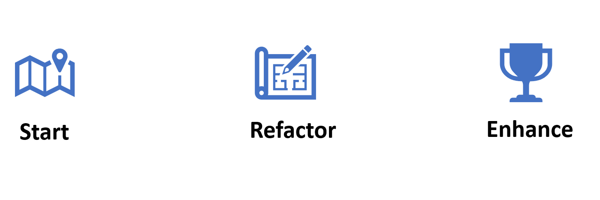

# Journey toward the target architecture

Adopting cloud technologies is a journey. Business priorities and the need to bring new technologies online in order to unlock capabilities or features will influence the speed at which an organization deploys and scales out a cloud environment.

Over time, the organization iterates and matures the deployed technologies, processes, and skilling needed to progress toward that destination. However, this doesn't mean you arrive at the destination immediately. The journey takes time, which varies depending on the size of the organization, the current technical footprint, and the skilling maturity within technical teams.

## On-ramps

Consider an analogy of a trip along a freeway. There might be multiple *on-ramps* you can use to join the freeway, but the *destination* is the same.

These on-ramps represent where organizations are today in their cloud adoption plans and the specific guidance needed to continue to develop the cloud environment.

| On-ramp | Description | Further guidance |
|--|--|--|
| **Start** | For organizations who are at the beginning of their cloud adoption journey (also referred to as *greenfield*) who are looking to implement a new cloud environment, based on best practices and proven architectural patterns.   Start with the Azure landing zone conceptual architecture to understand the recommended end state.   Next, explore each of the design areas to understand the key themes that comprise the considerations and decisions needed in order to design and implement the landing zone that best fits your requirements | [What is an Azure landing zone](./index.md)   [Azure landing zone design areas](./design-areas.md) |
| **Align** | For organizations who have an existing environment that needs modification to align to the Azure landing zone target architecture and best practices (also referred to as *brownfield*).   Use the transition from brownfield guidance in order to understand the decision points and technical approach to refactoring environments to align with the guidance in the Ready methodology | [Refactor a landing zone](./refactor.md) |
| **Enhance** | For environments that are already in line with best practices but the organization is looking to add additional controls or features.   Explore the articles that explain the considerations as part of enhancing the key ongoing processes for cloud environments, such as management, governance and security. | [Enhance guidance for management](../considerations/landing-zone-operations.md)   [Enhance guidance for governance](../considerations/landing-zone-governance.md)   [Enhance guidance for security](../considerations/landing-zone-security.md) |

## Next steps

To understand the decisions you need to make when implementing an Azure landing zone, explore the Azure landing zone design areas for specific technical topics to consider.

> [!div class="nextstepaction"]
> [Azure landing zone design areas](./design-areas.md)
